# 2024最新【网络安全／黑客】入门到精通课程教程，包括Kali Linux安装与CTF比赛教程（附安装包） - P10：08.给Kali新系统的第二件事情-编辑器的配置 - AI-大模型基础 - BV1SK421Y7kA

好，接之后的话我们就给你说一下，在看点里面。就是我们会使用这个编辑器。好，那么在windows里面的话会有自带的，是不是就是比较好用，可能会比较好。但是这里面的话，我们还是需要装一个，因为它这个。

带那个鼻其实是有很多问题的，就是不不好用，就是非常简陋。所以的话我们就需要去怎么去下载呢？你可以访问一个百度一下VS code。要直接点击这个就行了。是进来。

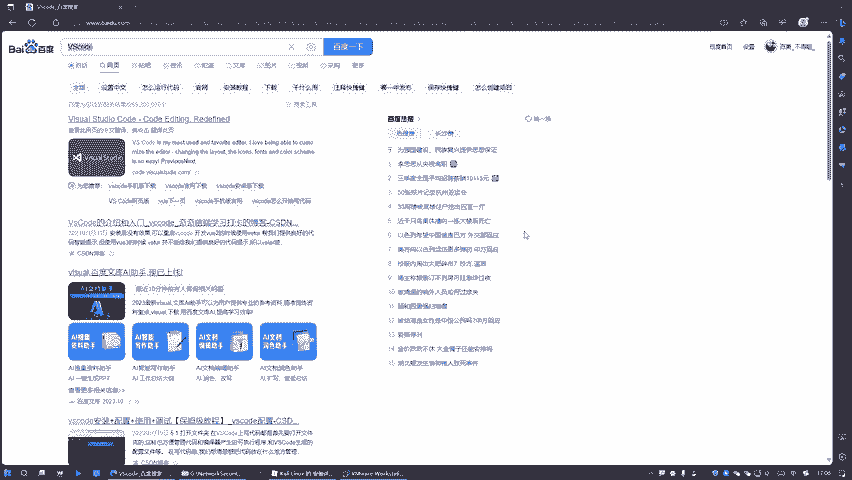

接着后来，他说要翻译成中文，不管他，你直接看这个 downloadload的就是下载。

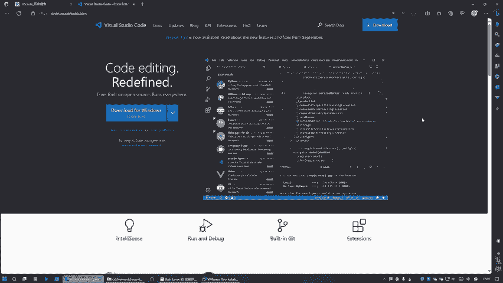

等它，然后我们这里面的话是属于这个点。这个。DEB的后置的。好吧好，如果是麦克的话，是这个是吧？wind的是这个。😊，那我们是这个调塔。点了就会把我们下载。这吧下载下载的话，你不用下载也没事。

我们可以直接。暂停之后呢，拷贝它拷贝下载链接。

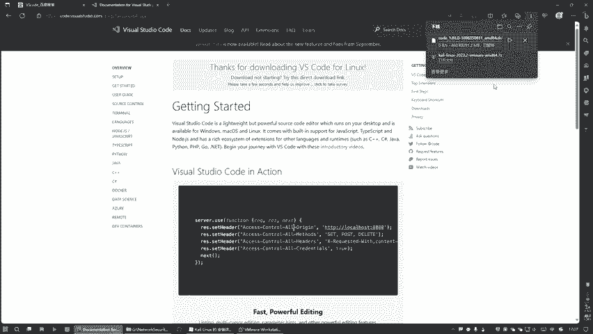

那么在这里面的话怎么做呢？就是拷贝完之后回点来，我们需要开启我们这个。

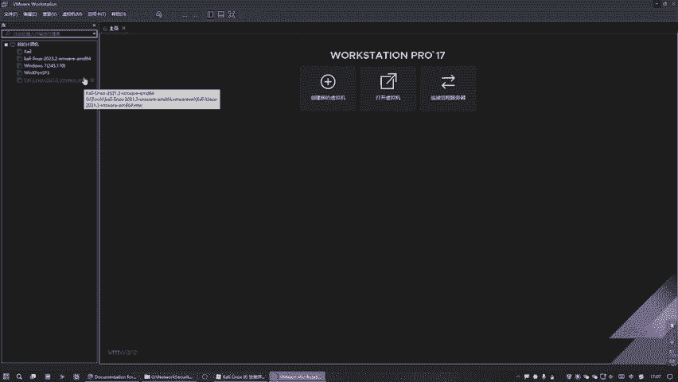

卡里的绿色版本。有人骂石东。

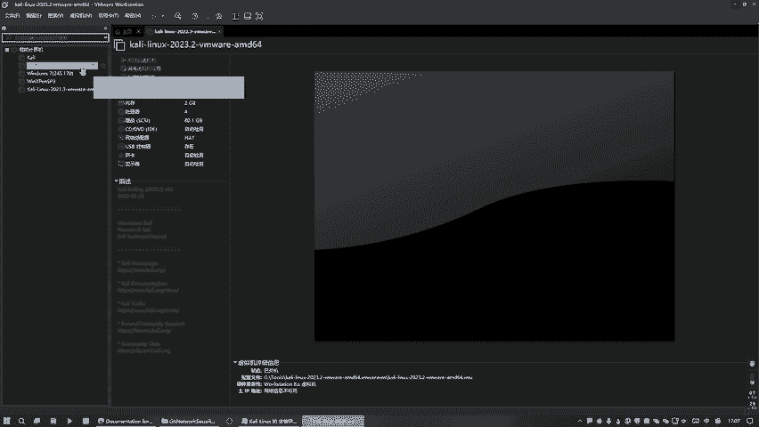

给他吃恰回去。哎，他这个有点慢。

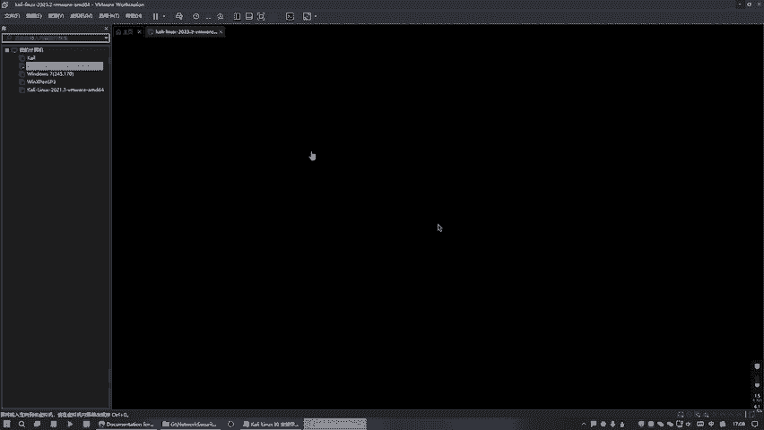

我们在输入这个看你。好，这之后的话，我们在这个终端里面。要放大点。哎，看不清楚，就麻烦。就放大点好吧。然后的话我就直接去。下载，那么一般是W gate，看有没有这个命令，你看出了没有，它默认是有的。

看没有没有的话呢，你需要安装一下，好吧，安装的这个方式也是一样的。就是如果说假设没有的话，我刚才是一个W。ge玩了个table酱。推保件就可以帮我转。如果说他无法补全的话，这边它是没有的，没有的话。

你需要怎么办呢？需要是AT1多。大家给安装一下知道吗？安装一下，然我再来用，我现在有的话就不用安装了。然后的话我们就使用W get table键，然后整体那个链接。诶，这个我是不是没装进来呀？

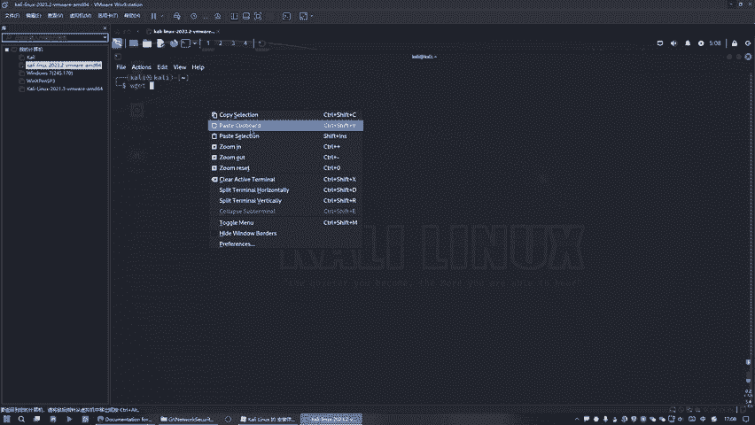

是这个工具没装好那个。

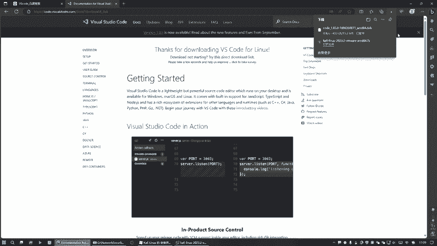

好，可以。那么这边如果说你装不进来的话，是因为什么呢？是因为你这个没有安装好。😊，你看我现在是报灰的，是代表它安装好了。😊，这不这个的话就是5A的这个工具。安装好之后的话。

你才能去在windows端和这个。看ing端这个可以相互拷贝。那么这时候的话我们就敲回车去下载。好，那么就。在下载中这里这个进度条，我们全不广大，我们就给把这个视频给暂停下下，好吧。

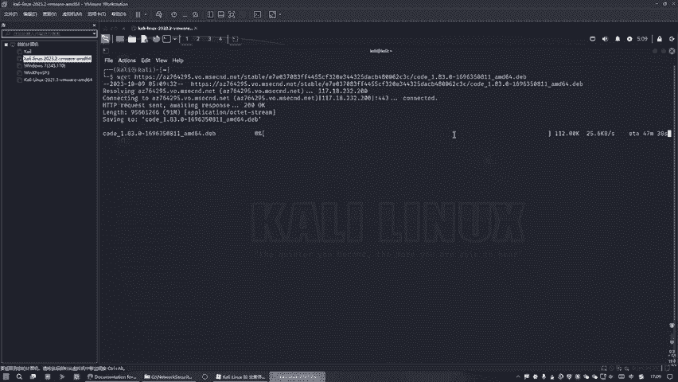

啊，我们这个的话还要不还是放弃吧，因为它这个太慢了，这个下载了大半天。从下午上到晚下到晚上都没下载上了，你看。这没戏的，估计啊太慢了，看到没有？所以我们那个视频呢也占停了大半天时间，结果它只下了10%。

甚至说视频上没什么动静啊，这网络太差了，好吧。但是也需要记住这个命令就行了。你们拷贝一下，我们就放这里面来。😊，好吧，然后的话就是直接去。inststore就是安装它，安装这个安装包就行了。

只是它名称是一是不一样的，是吧？好，这种就行了是吗？或者是还有一种方式。我们把它给剪切到去来。把这安卓包给剪介到这个下载里面去。然后这面的话也可以安装。怎么这次有多种形式的方式可以安装的？

也可以为另外一个颜色。好。

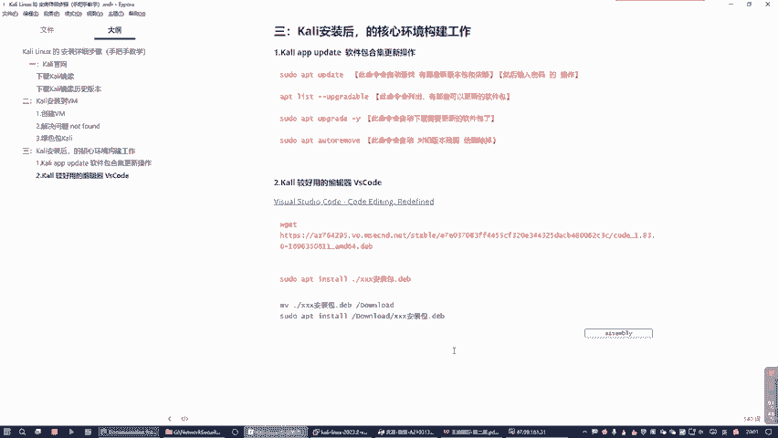

好吧，我这己就放弃了。因为你看我这边的话也下载了大半天也没用，你看到没有？😊，哎，他卡住了吗？这样的话它下载多久，这个都下载到一个下午时间，就是将近。😊，大半天的时间都没搞定啊。

说以的话就是这边是属于于网络的快和慢，网络快的话就是搞定了。网络慢的话，下在下载了半天时间。

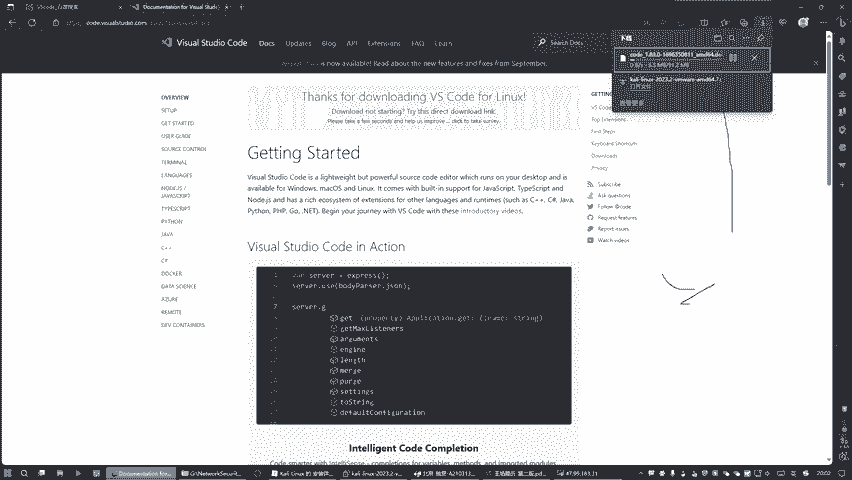

也没有搞定，是不是啊，或者是跟看这个是一个效果，他也是。没什么动静，我们就不等他了。好吧，装好之后的话就可以用了，就是现在还没装好。所以的话呢我们就告诉大家是怎么装的。哎，不是。盖这个是怎么装的。

就是这样装的。这种就行了，好吗？然后装了装完之后呢，就怎么用它，用它的话我们。假到后面有一个什么有个open。点大家无们路上这个樱桃就打开，可以啊。知道吧？哦，不是不是，这说错了是。

这个5Scode的code的点好吧，那么code点的话就可以打开当前目录，就是可以用什么用那个5Scode打开单前单前目录。这个意思是什么？我给说一下。在。当枪。目录。用VS code打开。好。

然后嘞剩下的工作就不用讲了，为什么呢？因为剩下的工作。😊，就是5S扣着的操作了。那么关于VS扣的使用，你只要百度一下，就彻底明白怎么用了，它就是个工具了。威斯克的使用。你可以这样看看图解。好吧。

这样我就可以搞定这个事情了。😊，他这个。😔，是可以告诉你就是工具怎么用了，是不是？😊，好，那我们就可以把这个给们放在这里了，就是无非就这样用嘛，是不是你到时候来查就明白了，好不好？

所以说我们这边的话再降一个点就是。😊，这样搜索主要是百度一下。当的话你可以自己寻找更好的文章，好吧，这都这没关系。放下来。好，基本上的话就这块就是这样的，只不过它算上是我们是有由于什么？

由于在这个过程中。😊，卡壳了。卡了这个大半天的时间下不下来啊，这网络的问题，应该是啊网络快的话就很快的是吧？网络慢就是等于半天都没用。所以说我就把这个就这个就给跳过了，再给你们讲后面步骤。

再个这样干就行了，知道吧？好。😊，这个不好看的颜色。个红色娃娃，搞个红色。

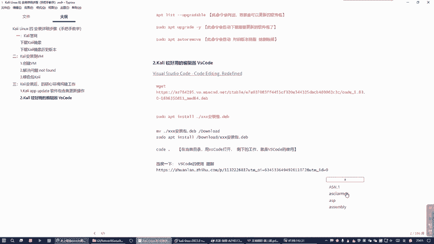

好。😊。