# 2024最新【网络安全／黑客】入门到精通课程教程，包括Kali Linux安装与CTF比赛教程（附安装包） - P11：09.Kali中的用户权限 - AI-大模型基础 - BV1SK421Y7kA

那么我们需要明白我们这个看连的话，它是属于这种linkux式这种形式的。所以的话我们就需要学习的这个重要的环节，就是它的权限。那么首先的话，我们这面是登录进这个countning。东西呢，关是我是拷贝。

但是放这里啊，就是一样的保持下，要拷贝一份。即。然后这里面的话我就ctrl加C把它给放弃掉。看一下，然后我这面应该是没有下载成功。这网易吧，他这个在这里看没有，但是这个不完整是吧。

被我们强制性卡住加驶给终止了。什么啊需要。把它干掉。没了吧没了没了。好，然后呢，我们怎么做呢？我们就需要在这里面把屏幕给清空一下。😊，好，这地面的话我们把它放大放大一点。😊，稍等一下啊。放大点。好。

这里里还怎么做呢？就是我们最里面权向这块呢？首先我们现在的话，你看看这是个什么符号。😊，这是一个美元符号，它就是。不是不是吧，不是超级权项，就是这种普通级别的权限。

但是如果说假设我们需要做一些这个需要拿到最高的权限，做些更多什么更深的事情的话，那么基本上他这个是做不到的。因为他是个普通的权限，很多更加高深的权项这种深的权限拿不到这条事情做不了。

第就只能是做百分之七八十的事情，想要做百分百的事情的话，必须拿到权限。什么权限呢？就是超级权限，那么就需要切换权限没有好，切换到超级权限，又有最高的权限，也就是root用户。😊。

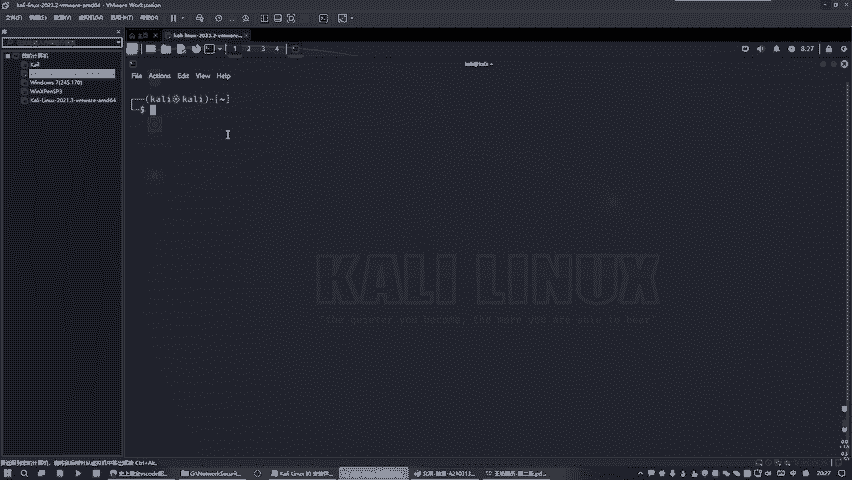

喜欢的root用户。好，这面拷贝它。😊。

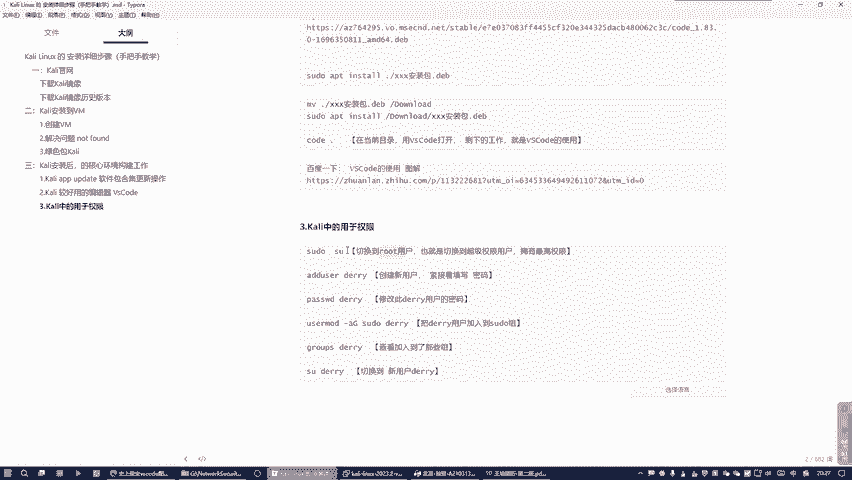

那么再说的话，你再来看一下它的区别。好，那么需要输入密码，密码没有任何提示啊，看ning是网超回车。好，这时候你会发现什么区别，区别就是变成一个井号。😊，好，看到没有？然后呢是这个井号的话。

对面就是代表拥有什么拥有这个超级权限root权限，超级权限就是有什么什么事情能干了。好吧，拥有最高权限。好，那么这里的话，一般情况下这里面会出现一个什么那种人头的，但是没有出现，不管它好。😊。

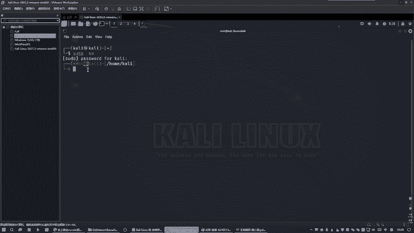

那么这个权的话，我们可以干嘛就可以给他增加个权项。就是一般讲这个的话是属于这种最高级别的这个权项，有点像什么？有点像管理员的权限。接实后来我们需要给他增加个权项。那么。

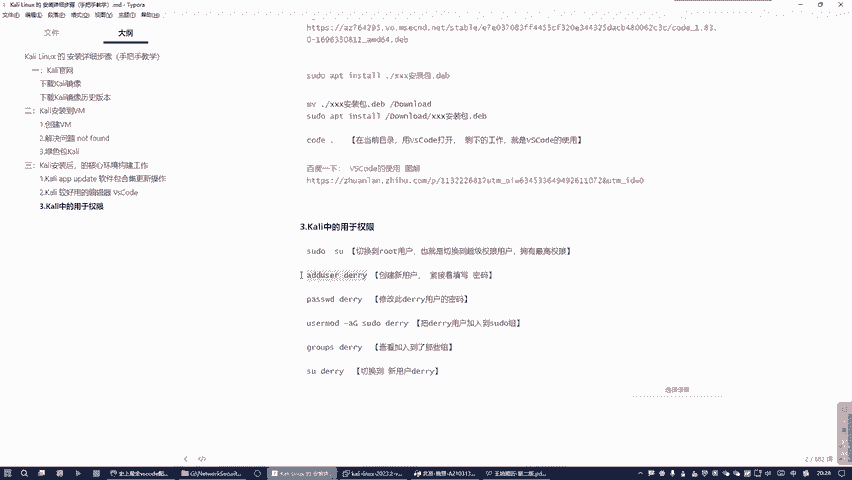

这个名字随便写，我这边写一个代理是吧，你随便写都可以啊。😊，这次不要写中文呀，今天不要写中文。好，那么再加个权项，那么就需说给这个。😊，说给这个用户是吧说错了，是这一个用户。

需要给这个用户代于这个用户增加一个密码，密码就写一个一样的名字，也叫什么？也叫DERRY小回车好，需要确认一下DERRY。ok。好，那么这边的话就是很多这些信息，你是否要设置啊，我说不设置敲回车。

我也不设置敲回车，也不设置敲回车，就是什么全部全部超过不设置这些信息，就是这个什么这个单于这个用户的这些什么其他信息，我不管，全部敲回车，空白的敲回车敲回车。好。😊，Yeses。okK搞定了找位之后呢。

那么我们的现在搞定之后，就显在是用户名，用户主是代理，密码也是代笔，好吧，是保是一样的。😊。

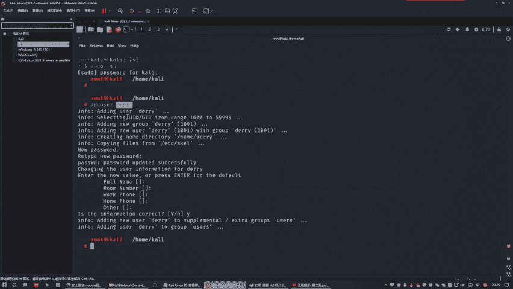

那那个之后，那么我们干嘛？就是如果说你后面的话，你想去修改他的这个待遇这个用户的密码是可以这样修改的。好吧，这写完之后的话，你需要敲干嘛要重新输入两次密码新密码才行。😊，就是假设。我之前这个命令的话。

干嘛？他需要你要求让你输入两次新密码，保持一致的就行了，好吧。就是修改这个代用户的密码。然后呢，我们这边的话也可以干嘛？也可以去把它加到这个。😊，十度组组里面去好吧。就是我可以把这个夹字里面去啊，哎。

这个字干嘛在这里边追加的意思，要追加到这上面去。你不写这句话的话，黑干码会把之前的西给冲掉的，这是很危险的事情。😊，就是之前的话，这个s度组有很多的用户。然后你不讲这句话的话，他就会直接把墙面给冲掉。

哎，这句话是代表追加。特别追求它的行业啊。好，那我们就需要把这个拷贝上。

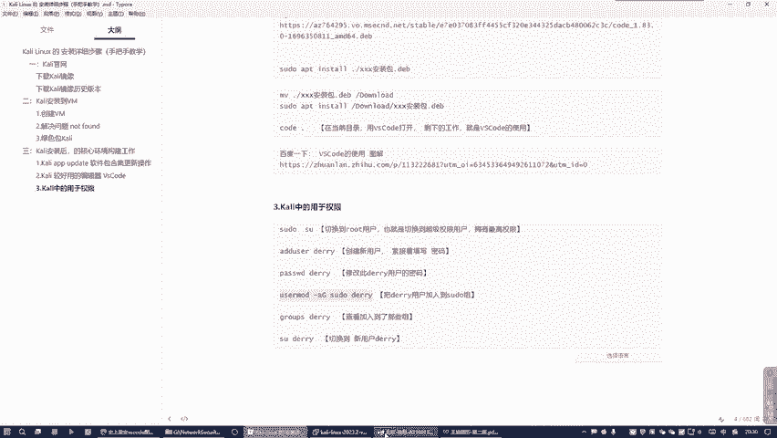

暂贴。好，那么是把我们这个待宇这个新用户给追接到这个school组织组里面去了。那么我可以查看一下这个组织关系。

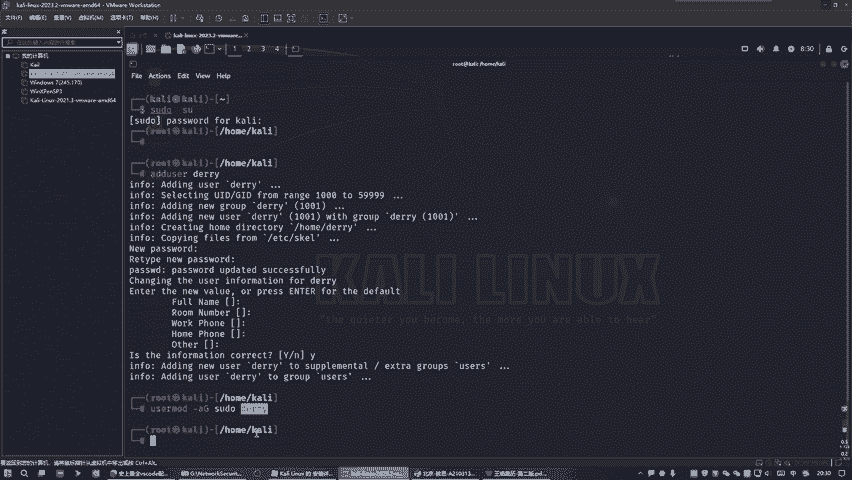

所以这边就是干嘛，就是可以看一下这个待遇用户在哪个组里面去了。

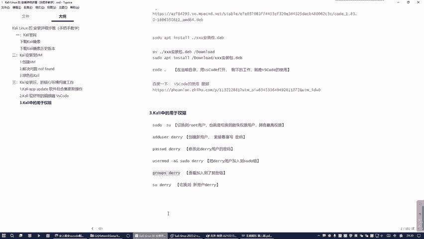

我就直接拷贝这个。好，看到没有？我们这个待遇用户，他现在是在十度组里面看到没有？看见了吗？然后呢，我们这边的话给切换的用户，因为我们当前是属于哪里？

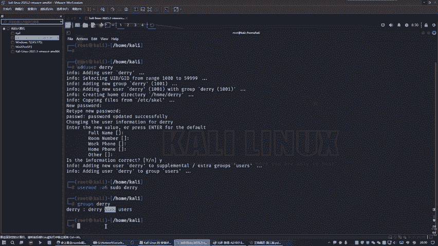

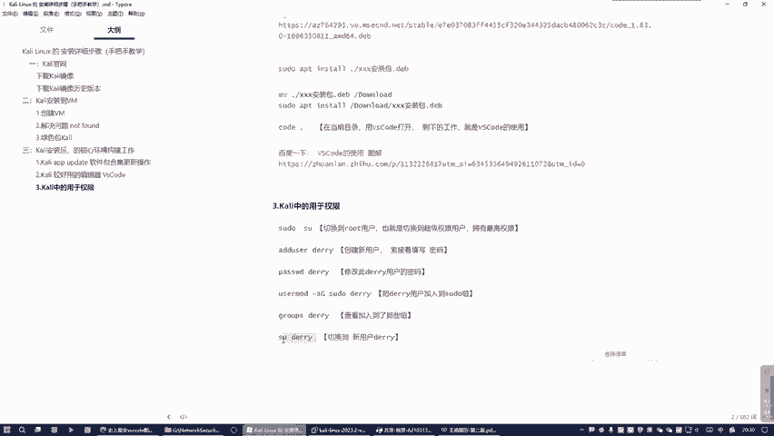

大家是属于在root超级权限用户，我们就可以切换到这里来。所以说我们需要给切换一下，你看。看区别情况下。好，这是一个方像又变成什么？又变成这个美元符号，变成普通用户了。看光线了吗？好，这一世节的话。

这个应该是最频繁的这个car林的权限操作，就这些。好吧，首先。

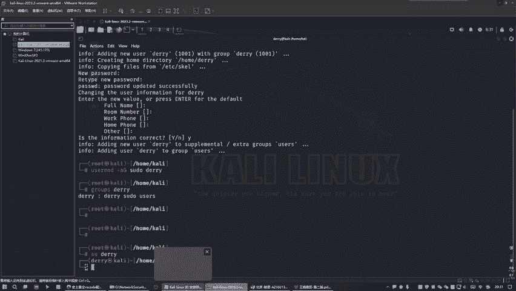

从普通用户。从默认的普通用户。给切换到了超级权限的用户，拥有最高权限。看到没有？因为这里面的话可以给他增加一个新用户叫代理，代遇就是新用户啊。好，知道吗？然后的话这是干嘛？这是修改这个代语新用户的密码。

这句话消完之后呢，他要你输入两次新密码要一样就行了。好吧，然后这个的话是干嘛是要把我们这个代语新用户给追加到school组里面去。这个scool组里面有很多其他的用户，你不能把给把给干嘛？

不要不要把给冲掉了，需要讲这个关键字，代表什么？代表是。😊，保留前面的实故左下的所有用户的前提下，在追加新用户待遇，是这个行业啊。卡有。然后呢，这个他可以查看当前这个代语这个新用户在哪个组里面。

然后呢这在可以干嘛，再去从当前那个超级权限。给切换到新用户这里来就搞定了。

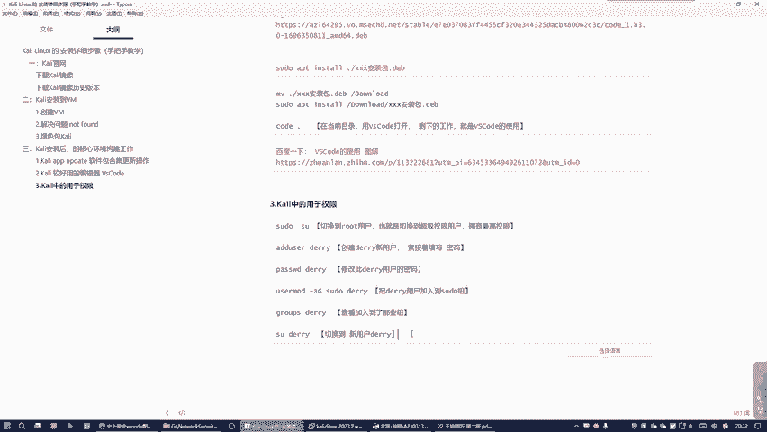