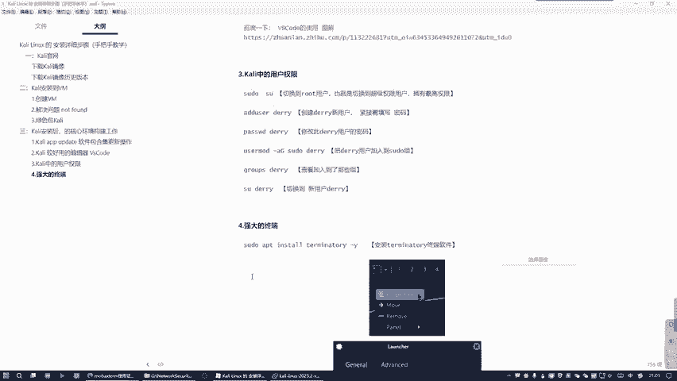
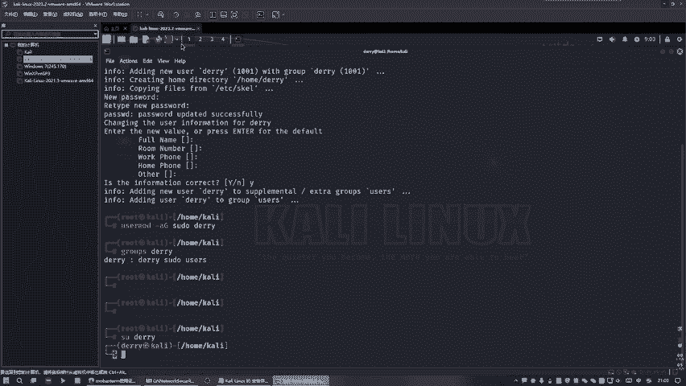
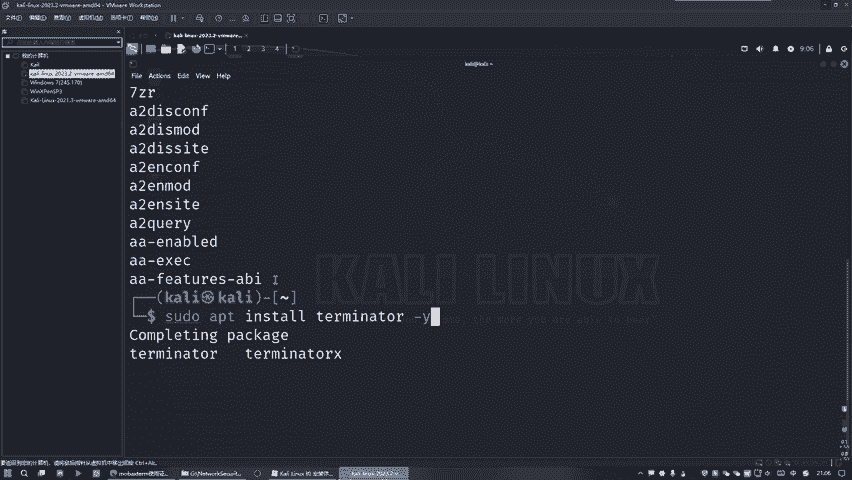
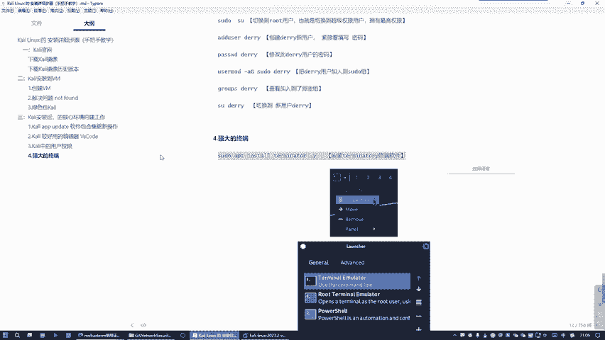
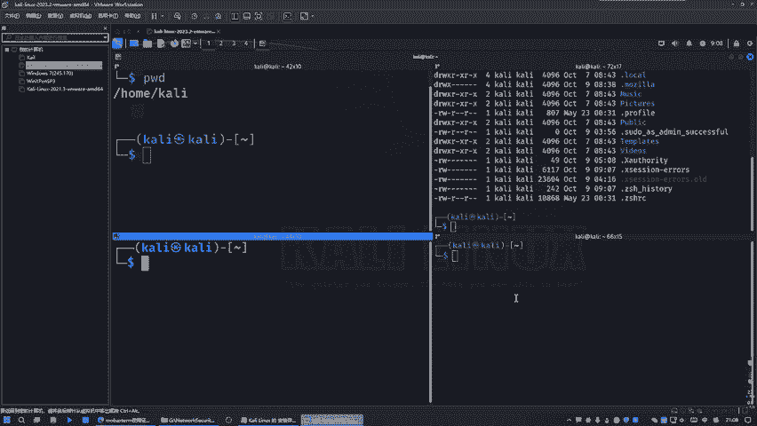

# 2024最新【网络安全／黑客】入门到精通课程教程，包括Kali Linux安装与CTF比赛教程（附安装包） - P12：10.Kali中的强大终端 - AI-大模型基础 - BV1SK421Y7kA

那么接着之后的话，我们来看一下这个在看你这里面，它其实它默认给我们提供了一个终端，是不是？也就是这个终端。好。好，那么我们这样打开的话，它就是默认是这种普通的看你默认的用户，也就是普通权限。

你可以看到这个效果是不是？嗯。他没有快捷键吗？我看一下有没有快捷键。有有有。什么叫就是那个shift加ctrl键加这个加号。这三个叫通杀。好，那么这是一个什么普通用户。然后我们可以这样做。

你看我在检测的时候呢，我选择这个什么ro用户。😊，那我就需要输入这个root的什么。这就是输于他那个什么超级权限的密码，也就是看你。这时机发现有什么不同？是不是变成这个井号了，是不是看顺边的吗？😊，好。

然后我们再点过来再看一下，你看啊这两个之外，我这边点它嘞。😊，啊且这个我们一般这种方式也是一样的，然后点它就是这个是要你输入这个。超级权限的root用户。是不是啊好，这个这我知道是吧？

但是对于什么问题就是你看。😊，就这里。就什么？就是多个终端之之间的切换是很麻烦的。你发现没有？你看我切换这里面就没了是吧？就是用的这一个桌面只能打开这一个终端。这我在下一个桌面。😊，才去打开下一个终端。

这分钟这很麻烦这样。😊，是吧那么所以说这边就是一个问题，就是它自己自带的这个看你的终端是不好用的。是不好用？发现识别了吗？像比比它必须一个桌面只能用一个终端，它不能摆放很多个。看。

说说话就在这个第四个终端才行使用。等下。选这个是吧，然后呢第一个终端选这个还有这样的切换，那就意义不大了嘛。你看这个是浏览器管上不要了。😊，好，这里还有一个中断。第四个人还有一个组装，看到没有？

所以感觉感觉他这个。😊，不太好用，所以说我们不选这样，我们习惯的是用一个桌面摆多个终端，而不是说一个桌面只能用一个终端，是不是啊？所以说呢才会引出。

我们今天要讲的另外一个点，就是要安装另外一个终端。

拷贝这个命令就行了，好吧。执行就行了。我们这边的话敲的是杠Y，代表是什么？所有的问题都要所有的询问都全部选择y视同意。需要输入这个密码。好，这这个时候的话就注意啊，你看我现在是在哪里是待语用户啊。

我现在不想用这个用户啊，换掉换掉一个，好吧。😊，光家啥。好，用这个用户好吧，因为那个用户的话是我们在上一篇新建的用户，就用这个默认的用户好一些，不要每次都切换。好，我因为它默认打开去这个用户。

我就以后就不用切换了，知道吧？好，这个然后呢我们怎么做就是把那个命令给粘过来。😊，哎。你找过来。好，输入这个密码，看你。哎。我们这个有问题吗？看下。这用户这块等下我是没打开队啊，不是不是。

这个红色是root用户。黑色的这个才对吧？刚才打开错了，抱歉，刚觉一个蓝色的是吧？这个才对。😊，说这个看你。哎。这个还是一样的吗？我看一下啊速度APP。你是多。这 그렇지。然后嘞。对，是有的呀。

看可以查到啊。好，没有歪小错是不是小错的，看见没有？好，那么我刚才按什么键呢？我刚我刚才是。😊，不停的按那个table键啊，在在补全，知道吗？你看我别说。😡，看到没有补偿退不进看到没有。

退步进退不进退步进退步降，他帮我自动找。😊，我我在不停的按这个t键做些这个关系啊。说的话你刚才是敲错了，是不是啊？😊，退不进。这不见是不是没有这个Y，这个才对吧。好。😊。

这个笔记改一下，这个没有这个Y写错了，是不是？所以说这些命令的话，不是你去记载，就是说只要这个大概的样子，就可以使用这个t键来补齐的。好吧，好，做完了。😊，好，做完之后的话，我们怎么用呢？就是。😊。

这场是搞定的是吧？搞定之后来我们需要。😊。

这样做，你看。要点击这里面不是点击它，对啊，不是右键。😡，呃，不是不是左键，是右键，要点击右键才降，什么意思？要点击右键。好吧，你点左键的话，你看你一点左键的话是这个是它不对的吧，要点这个右键。

看以出来了吧，就他。好像之后呢我们需要在这个加号里面。😊，添加一个我们刚才安装的这个终端，知道吗？好，找到没有？好。我刚装的是不是这个？是这个吧，看到没有？给它要给加进去。加进去。进去之后呢。

我们关掉之后跑这里来吧，是吧，再把它给移到前面去。那么移到前面去的话，就代表我们默认就是打开它。😊，看吧，就以后我们再去点的话，默认就会打开我们这个终端了，而不是用它官放的终端。😊。

他官方中间就被我们给放后面去了，知道吗？😊，好，这时候我们再全部关掉。😊，再点开好，这实话说打开中端就不一样了。😊，好吧，那么这个东西的话有什么好处呢？好处的话就是它可以分屏。

比如说我现在来1个PWD查询路径是吧？然后呢，我可以在点这里面给它上下分，左右分都可以，左右分看到没有？好，在左右分这里面的话，我可以干嘛？再去查询一个，比如说查询所有然完之后呢我可以干嘛？

在这里面再来一个上下分。😊，看有笑了吗？这边就是。这边就更加灵活，就是更加符合于我们这个整个程序员这种思维，就是整个开发者的思维是不是？就是更加灵活。好。当当然话你可以对他这给再分的话，都可以都可以分。

好吧，看没。😊，而且它的好处就是可以按一下这个ctrl键滚动鼠标的滚轮就可以放大，看到没有？这个比官方那个更加强大更加好用。好，看光线了吗？就分就是一个屏幕，可以分4个屏，分四个画面。

而且呢这个搞定之后。基本上你会以以后用的话，你就发现它有很多好处，很多亮点，就是比官方更好用的，好吧。

