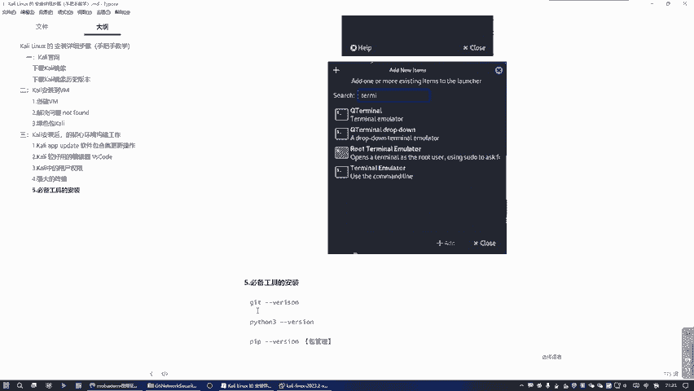
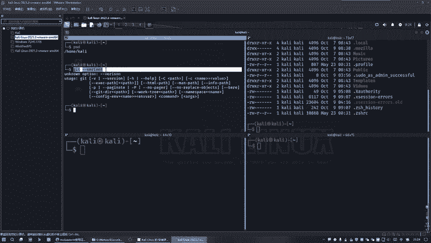
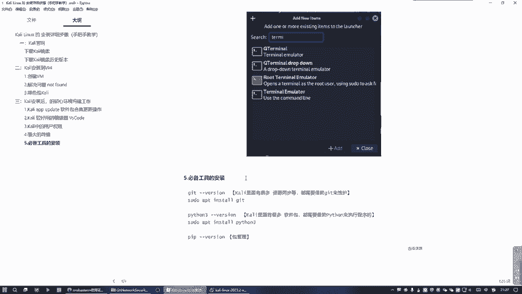

# 2024最新【网络安全／黑客】入门到精通课程教程，包括Kali Linux安装与CTF比赛教程（附安装包） - P13：11.Kali中必备工具 - AI-大模型基础 - BV1SK421Y7kA

我们在上一篇中这个强大的终端这块，我给大家写好这个图解的，好吧，再来看就明白了，是不是？然后几点之后呢，就是我们。有一些必须装的工具啊，在整个count里这里面的话是一定要装的工具啊。

不装的话可能会有很多问题，后面的话是缺少不完整，知道吧？所以说我们这边的话，首先第一个点就是我们那个get。

好，因为有很多的下载同步这些信息交互都要cget，知道吗？系。这之后的话，我们比如说我们现在。😊，这对面是输入一个。ge。哎，这个有点大放小一点啊。少一点。太大了。吃发大只放小。好，看发小了吧。好。😊。

因，我们这个get。我们地铁等一下，我们地址这个有点有点问题哈，稍等一下。

我是不是写错了，看一下。那个退步价。好，刚写错了，还敲错了是吧？这啊，任何问题就是不用记完，只需要按个t键就能补全了，知道吧？我改一下。😊，然后这边的话。把给放到这来。好。那为什么这样做就是因为什么？

因为在整个count里里面。有很多这个啊资源同就资源同步啊。对，都需要借助。G他。来维护。好，然后我这边的话还有一个python。为什么这个很重要？就是其实很多的这种包管理工具。

很多这种包的软件基本上都离不开pathon了。那么我们这边需要检测python这块的这个有没有问题。从拷贝上。好，也没问题。好，如果说假设他有问题的话，怎么做处理？好，就是假设他有问题是吧？

你可以这样做。😊，知道吧？先这样装啊，我说搞懵逼了啊。APT。AP7。意识道。get就是跟前面那个安装是一样那个一个思路，还记得吗？😊，这个安装是一个实度啊。但是如果说我们想拿到更高的权限的话。

要加上这个石度。就是有可能说你的安装是需要更高权限的，我就基本上是这样做的对，知道吧？这就假设一个速度的话更好一些。所以这个时的话要把它给放进来。看完事了吗？好。😊，然然后的话它也是同样的道理。

如果说假设这个派遣上没有装的话，也需要给他装上去。然后这边的话。这是干嘛的？就是因为什么？因为我们这个基本上可以说。这里面有很多的这个什么包装件。软件包。好，都是靠嘛？都是靠。

python来执行的就是这种包的程序执行，这是靠python来执行的。都是借助python。知道吧？是这个原因啊，因后还有一点就是这个包裹你的话，后面可能会用到就是这是为了干嘛？

就是为了让这个更加完善起来，更加完整的话，我们还是给它加上去，就检测一下它有没有安装。😊，OK这没问题好吧，没问题。O搞定。😊，那么这就是我们在整个看点里面必须要装的，就必须搞定这三大工具，好吧。

否则后面没法玩了好。😊。

