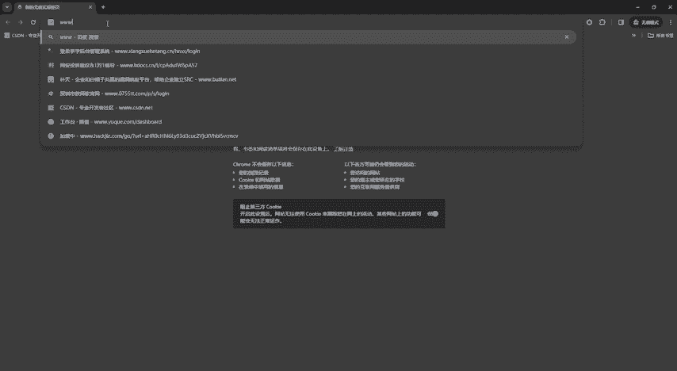

# 2024最新【网络安全／黑客】入门到精通课程教程，包括Kali Linux安装与CTF比赛教程（附安装包） - P14：P1-数据库介绍 - AI-大模型基础 - BV1SK421Y7kA

大家好，我是方舟。今天给大家带来的内容呢是数据库介绍。为什么要新讲数据库介绍呢？因为后续我们会讲到搜口注入，所以我们要了解一下数据库它到底是一个什么东西。所以数据库的一个定义呢。

数据库它是存放数据的仓库，它的存储空间很大，可以存放百万条、千万条，甚至是上亿条的数据。但是数据库它并不是很随意的将数据进行存放，是有一定规则的，否则呢它查询的效率会非常低。

所以当今世界它是一个充满的数据的互联网世界。因为我们现在互联网是已经非常非常发达了。所以我们在利用网站上网的同时呢，我们如何去在网站存储我们的数据。所以数据库就是为了存储数据而生的。

所以比如我们出行的记录啊，消费的记录浏览的网页啊，然后发送的信息等等这些。除了文本类型的数据，图像、音乐和声音，它也算是数据也是可以被数据库存储进来的。所以总体来说呢，数据库它就是存储数据用的。

所以为什么我们在建设网站的时候，数据库它会成为我们的后端，对不对？就是支撑网站运作以及存储数据用的，就比如我们在淘宝啊，在。一些QQ啊、微信啊等等这些东西我们要保存东西，又要聊天浏览记录以及什么地址。

要保存我们放到淘宝这些里面去，他会帮我们记录，对不对？其实也是放到了他们的数据库里面，从而所以在淘宝。唉，这些东西中，我们就可以体现出来，看到我们就可以直接选择我们之前屏入的地址，对不对？

所以他们也是利用这个数据库来进行一个保存的。当然他数据库。刚刚老师有讲到，它就是是后端嘛。所以我们在浏览这个淘宝网页的同时是看不到的对吧？所以那么。接下来呢我们就讲一下这个数据库啊。

它有很多种以及它的一些发展的介绍。在1950年前呢，哎它应用的就是国防科学研究。那这个时候它的数据库就分的很不是很清晰，就只是一种层次数据库和网状数据库，对吧？然后。后面随着互联网事业的发展。

以及数据库的发展，到1970年的时候，哎，他就开始使用一些商业处理了。就比如买卖东西啊等等这些的时候，因为数数据量太大了，用的东西太多。你用一张张纸写，那肯定存储不过来，对不对？

所以他们就开始哇小型机的方便下方便，而且广泛，对吧？所以就出现了什么oracle还有什么关系型数据DB2这个oracle的数据呢，其实就是类似于我我们之前有了解的甲骨文嘛，甲骨文这么一个公司。

它所用的这个数据库呢，就是这个oracle。然后到1990年。开始我们的电脑出来了，然后服务器啊、局域网这些都陆续发展出来之后，像他就唉可以用企业就可以用了。然后个人他也可以用娱乐，对吧？

个人用来办公啊，用来打游戏啊，这些他们都可以用了，所以就开始干嘛。就出现了很多种数据库，像什么dedbase啊，然后s server啊这些等等。有很多数据库。然后它这里呢就出现了什么关系型数据库。

然后数据仓库和PC单机数据库，对吧？然后到了2000年，我们的互联网正式走向。快一个高潮小高潮对吧？就媒体呀搜索社交、电子商务，我们百度这些其实都有都可以使用数据库，对吧？来支撑我们去在网上冲卖。

对不对？所以像这种就数据库开源啦，就买so狗嘛。现在我们很多主流的网站都是使用的买so狗。因为它好用，并且还便宜，还免费，对不对？然后还有什么readdies呀，然后mongodB啊等等这些数据库。

可能大家在日常生活中了解的这种数据库比较少，但是买so狗，我相信大家可能或多或少都会进过还还有一些什么oracle的数据啊，数据库和搜么serv的这么一个数据库。然后到2022015年开始。

因为我们云嘛云上因为开始出现这种嗯云数据。大家就可以看到什么新媒体啊、云计算、物联网这些出来之后，直接把东西全部放在云上，对吧？所以就出现了很多一些呃我都不会读的一些数据库。

对吧所以当然我们现在主流的了解的还是买收口和欧瑞这个server这些我们日常了解的嗯，基本上就是这些。那么。在我们遇到这些数据库的同时，因为大家我们可以很看到很多嘛，对不对？像什么百度啊、网站啊。

这些网站我们也不知道它用的是什么数据库，对不对嗯，对吧？然后当然我们在进站的过程中，我们在进站的过程中，它随着。

这个数据库它产生它使用，它是后端，对不对？那它前端它也有也要有啊，那是不是也要需要一种计算机语构建这个网站。那么。像计算机语云，有什么python啊呃什么java呀，然后C加加。

然后PHP等等这些它都是计算机语音。那么他们主要是配合哪种数据库呢？常见的它有以下三种数据库，就是PHP。他这种计算机云通常就是使用买so口数据库，因为它不说也是金金融性比较好吧。

就是比较常比较常见的配合，就是PHP加买soco。然后java呢它就是带跟oracle，然后AP点net呢，它就使用scle server这三个数据库。那么我们如何去判断呢？

第非常简单的办法就是这个方法比较粗糙。但是呢对付平台猜测它是什么数据库。也呃足够了，就是AP点net它的后缀呢，它是顶ASP叉，对吧？它ASP叉，我们看看看它是顶ASP叉的这种呃网站后缀。

呢可能使用的就是scle server数据库。然后java的java进站呢，它就是顶GSP啊，或者是顶du，对吧？可能有时候大家会看到什么点GSP网站后缀的。

然后点丢的网站后缀它很大一种可能就是使用的oracle的哎一个数据库，然后还有PHP非常非常简单，就是大部分的它都是使用的是什么。买收口这个数据库，而且PHP也很简单，它的后缀就是顶PHP那么。

我们了解到这些网站互缀啊，计算机云啊，这些之后呢，我们去怎么去看呢？因为老师好像讲解的讲出来又没东西看，对吧？所以我们就使用一个什么东西的1个PHB study。

这个PHP18底呢就是我们可以看它进站的所有的配合都是什么？都是PHP可以看到啊。稍等一下。A为PHP是 study，然后它的一些数据库可以看到它就是使用买搜口的。然后在我们进行网站配置的时候。

它也是使用PHP和买手口这么一个。配合来进行一个网站进站的。所以大家。哦，卡住了吗？等一下啊好ok了。所以可以看到什么他的呃网站啊。我们可以看到它网站管理是什么PH版PPHP版本，对吧？

然后数据库是什么？数据库就是买手口的数据库，对吧？可以看到我们的数据库，买手狗的数据库服务。所以我们基本上使用的使用的这些进账PHP study就是PHP语言加买搜狗来进行一个进展。那么我们接下来呢会。

逐着重讲解买收口数据库的这么一个介绍。然后再根据这个PH study，我们来搭建网站，搭建网站之后呢，来讲解后面的什么收口注入。但也是针对的是。买收口。

