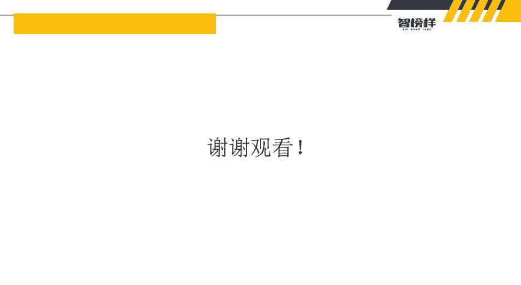

# 2024最新【网络安全／黑客】入门到精通课程教程，包括Kali Linux安装与CTF比赛教程（附安装包） - P15：P2-数据库基本操作 - AI-大模型基础 - BV1SK421Y7kA

大家好，我是方舟。上节课给大家讲完了我们数据库的一个基本的发展介绍。那么我们接下来呢就讲解一下数据库的一些小小的命令，以及它有什么数据类型。我们这节课呢主要内容就是这些哎，我们先来讲一下这个实验环境呢。

就是买搜口数据库。因为我们在上节课讲到了我们主要的讲解就是买搜口数据库。因为它数据库态多的一个个讲解。太复杂太多了，所以我们就分一个个来讲解，主要呢就新讲买s口数据库以及工具PHB study。

因为PHB study呢，如果像有一些同学他知道呃怎么搭建环境，怎么进系统。唉，他可能就会用到这个PHB4 study，而且PHB study呢他很方便。在之后的课程打场啊。

这些我们都会利用到它来搭建我们的网站。所以我们就直接用他自带的一个数据库，所以我们进入之后呢。我们了解第一个东西就是创进数据库。因为我们要有一个数据库的时候，是不是第一第一步是不是要创建。

所以这个create databaseb数据库名就是哎创进数据库了。然后还有什么删除数据数据库tridb数据库名，还有什么选择数据库use databaseatb name。

但然这个datbase name呢，其实就是我们的这个数据库名了。所以为什么呢？因为可以看到我们右侧这个这幅图。

它有很多啊那什么inform information这个数据库和mys口数据和SYS这些数据库，对吧？所以我们又不知道用哪些是不是是用首先第一步要use，对？又就是选择我们想要查询的数据库。

因为可能不同的数据库里面它有不同的数据，对吧？比如说我们呃这个information这个数据库，它可能存放了一些小视频，对吧？然后呢我们这个SYS那可能存储是些文本，对吧？不同的内容。

我们就选择不同的数据库，啊，然后呢接下来呢我们创建数据库的时候，我们是不是后续创建数据库又要给它里面放东西也要给它定义东西，所以我们就要学习到一个什么数据类型买s的。所以它分为了几种类型。

第一种呢它是数值类型，我们可以看到它什么类型有train什么。smt，然后什么int类型，对吧？它有范围的哦，可以看到什么这个范围什么-128到127，所以这个区间你取值都可以取。然后还有什么范围。

就是0到25，然后还有什么，对不对对不对？我们从上往下看。他取势是越来越大，对吧？所以当然我们平常呢是用不到这个，我们平常是用的类型，基本上用linkt类型其实就够了。谁拿那么大的数字，对吧？

我们的余额都没有那么多，对不对？所以那么。讲完这个数值类型之后呢，还有什么日期和时间类型，日期就很简单了。今天是多多少月多少日多少号，对不对？所以这个可以看到d类型就是今天是什么100年1月1号。

什么9999年，12月31号，这个都可以填，对吧？还有什么time类型，其实就是我们的什么时金值啊，持续时间，还有year，什么2000年啊，1901年啊，2155年的，对不对？这么以内它都可以填。

还有什么data name，然后就是呃今天是100年1月1日，然后零时零分零秒，对吧？就是包含了这些，还有什么字符串类型，字符串类型它就很多了。还什么chair定长字符串有大小0到255字己对吧？

还有什么Vch0到65535，然后还有什么trainport，然后什么是什么二金字符串，还有什么test短文本字符串，还有什么嗯不是这个Tam test是短文本字符串，然后test是长文本字符串，对吧？

可能我们有时候跟女朋友聊天呀，做错了事，对吧？要写道歉，要写检讨，对吧？我们是不是就可以哎把平时找到的一些道歉信，放到我们自己的数据库里面，对吧？就放在里面，有时候要用的，直接拿出来复制给他看。

是不是那是不是就省去了写小作文，这么一个阶段，对吧？大家可以学习一下，然后呢。😊，我们讲完了这些理论上的知识呢，那总要实操一下吧，对不对？所以我们接下来呢就是使用我们的这个PHB study。

这里呢老师是开启了买搜口这个服务的，怎么开启怎么停止，就这里点击停止点击开机，因为老师这里是开启了，看到没？它这里启动了。然后我们如何去连接数据库呢，他这里呢有一个数据库工具。

然后这里老师是你用了这么一个，他两个都可以用，我比较倾向于用这个所以我就点了这个点了这个之后呢，就会出现这么一个界面。然后呢，大家可以看到是不是这里它有几个数据库，12345对吧？然后。

但是我们要想一下，我们想创建一个新的数据库怎么样，是不是create。create是吧data base嘛，data base然后数据库名。因为之前那个PPT里面显示森林嘛，我们就改成森林一。对不对？

301，然后右键运行，看到没？是不是出现了出现了一个森林一，对吧？我们的数据库就创建成功了。当然这么一个命令创建了一个数据库里面是没有东西的，它没有任何东西，它是空白的。可以看到我们像这种数据库。

我们点击这里看到没？它有很多这个什么email啊，什么user啊，什么re，那么我们创建了这个数据库它没有，因为我们只创建一个数数据库，它空的，我们还要给它写表啊，写数据，对吧？然后还有什么。

我们再创建一个嘛，create什么databdatab，然后什么森林2。大家要记住一个点啊，就是我右键运行或者是顶这里它都可以运行，都可以执行我们这个命令。那为什么？老师要告诉大家，注意呢。

因为有些命令它是因为我们点击这个运行，它是全部运行的。但是呢看到没？我之前建立了一个数据库，就是我已经建立了数据库了，这个数据库名它有了，我们再运行一次才会报错。所以大家要注意这么一个点啊。

所以看到可以看到我们点击运行，看到没？它直接就报错了，不能创建数据库是01，因为我们已经有了呀，对不对？所以我们拿干嘛？删掉哎，再运行看到没？它是不是出现了森林啊，所以我们创建出来的数据库它是没东西的。

它是一个空的所以。我们现在又懂们那那我们又不想要了，我们干嘛呢？我们就tp把它删掉。对不对？别把它删掉。好，不想要声明了。森林太绿了。对吧去我们把这三个巡删掉，我们这次顶这个，那么？

那一下是把三个数据库删了。那么我们删完之后，我们再运行一下呢，因为它没有数据库了，所以它也会报错。因为它是从头到尾的啊，从123开始的，从上到下开始执行的，所以它没有。那么。接下来呢我们是把数据库删了。

那么它有命令的方式，那有没有一些更简单的方式呢？它有有什么更简单的方式呢？哎，这里是不是有个locos的，你点击右键，它这里有一个新进，哎，点一下数据库，它这里就出现了一个新的数据库，那里去填。

我们就改成。嗯，沙漠啊，改成沙漠好，看到没？他就创建了一个新的沙漠。当然它创建这个数据库。沙漠这个数据库它也是没有东西的。后续我们要填对吧？

所以大家可以看到这个locgo里面是不是也创进了一个这么一个沙漠的数据库，而且我们不用命令，因为有些呃初学者啊或者是一些同学他可能喜欢用什么命令的形式去打，因为使用命令的形式呢。

在对我们后续使用做搜搜口注入的时候，哎，他都是需要用到命令的，所以呢。用命令版会让自己更加的熟悉数据库的一个操作，还有什么？对吧？呃，当然它还有图形化的形式，当然老师其实并不推荐使用图形化的形式。

使用命令的话呢，在后续进行搜库注入的时候，无论是做什么的时候，搜库注入查询的时候。大家最终都会使用到。是这个查询这个是命令的形式去进行查找的。所以大家老师还是推荐大家着重呢，还是。使用这个命令的形式。

多打几遍哎就熟悉了。然后干嘛删除嘛，不想要沙漠。太黄了，对吧？然后哎就给它删除掉了。所以以上呢就是我们这节课的全部内容。简单的说把这个PHP study。那为什么要使用这个PHP study呢？

因为后续呢我们会用它来建立网站讲解搜购输入，所以就用它自带的数据库，而且非常方便。你们也不用自己去呃下载数据库啊，又去呃安装啊等等，这些它都集成了。所以大家初学者啊。

我是建议大家呃去使用这个PHB study这么一个软件，它非常好用啊。这就是以上这节课所有的内容。如果想要课件啊，或者是一些学习资料的，大家就可以去什么去我们的评论区去领取一下这些课件。

