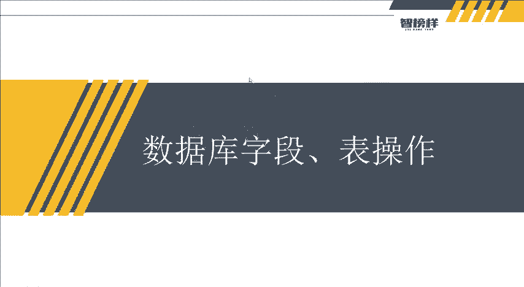
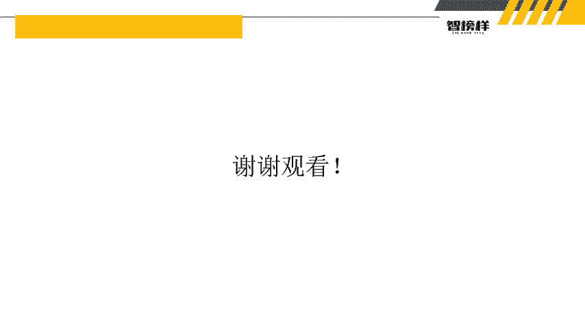

# 2024最新【网络安全／黑客】入门到精通课程教程，包括Kali Linux安装与CTF比赛教程（附安装包） - P16：P3-数据库字段、表操作 - AI-大模型基础 - BV1SK421Y7kA

大家好，我是杭舟。这一个讲的内容呢是数据库字段和表的操作。因为我们上节课呢所讲的内容是数据库，它如何去创建数据库。在我们创建完数据库里之后呢，我们也看到了它其实是一个空的，我然后还介绍了数据类型。

介绍这些数据类型呢，这作用就是我们之后要给数据库创进东西。那这个东西呢就是字段和表的一个东西。所以。接下来呢我们要了解创建数据库买scle这个表里面的。要需要什么东西呢？一个是表名。

一个是表字段名和一个每个表字段的数据类型。呃，怎么去理解这么一个东西呢？它有两个方法。第一个方法就是新进，就是之前老师给大家上节课有讲到，是不是我们可以用这种方法去新建一个数据库。

其实在这里它也可以新进掉哦，然后呢。餐进表。因为它就会出现一个表了，然后还有什么，还有另外一个方法就是。create table table就是表的意思。然后create就是创建嘛，在上节课讲了。

然后user就是user这么一个表，然后ID就是我们的字段名。和，user name什么emailbrace啊这些这些它然后后续可以干嘛？ink类型的wherech干嘛，看到没？

weair啊data对吧？所以这些类型的。然后后续的这个我们可以不用管它。这个就是不为空的，不不能为空。然后这就是主监的意思。呃，这后面呢大家可以几忽略，我们就了解它是什么in类型，we要券啊。

这是什么，它就支付类型，对吧？所以还有什么d类型，日期。之前我们上节课都有讲过过，然后还有什么？然后下一个呢就是删除数据表。

删除数据表呢就是之前我们删除数据库是什么tritri database数据数据库名，对吧？表呢就是tritri。然后在这t，然后数数据表里看到没？然后当然它有两两种删除的方法，就是第一种呢。

它是直接删除表，不仅它是否存在，它就直接进行删除。那么他遇到了什么？遇到了它不存在的，它表已经删除了，它就会报错，就自己上期有讲到弹框框嘛，对吧？那么还有一个呢，就是。

tpe tap衣服 table name就是如果衣服 is，如果表存在，它就删除。如果表不存在，它就不删除，所以就避免了弹一个框框说哎，这里报错了，不能删除，对不对？所以它有两种方式。然后方法二呢。

其实就跟我们之前一样，它右键哎有一个删除点一下就以删除。然后还有参数数据，因为我们讲的主要内容就是增删改查嘛，对不对？所以我们就干嘛呢？这一个增增加我们写了删，我们刚刚删了。

然后插哎插入数据就是iner插入嘛，对吧？iner in to就是插入这个表里面，然后它是不是字段字段名有几个字段名，然后值value value值，然后插入数据是什么？当然这里它有一个小小的知识点啊。

待会我们会进行实操的。然后呢，还有什么增删改查嘛，对吧？这就是查询数据，查询就是select的嘛，select的，然后什么呃字字段名啊，from表名啊，然后where在哪里啊等等这些。

然后待会儿呢也会给大家去讲讲，这里它有一个例子。select的user name from特特就是老师的一个字段嘛，然后这唉它有点卡。然后表明就是看到没？这个username它是t。好好。

我们理论的讲完了，那我们接下来呢就实操。哎，又是利用到了我们数据库里面的一个这么一个东西。然后。第一步创建一个表，对吧？我们先复习一下我们上节课讲的内容，创建一个dabb。デデータ。faceok呃。

这个数据库里面它所讲的是使用嗯这个U创建。一个测试的一个数据库嘛。好，那我们就创建一个测试的数据库测试好。然后执行。看到没？就出现了一个测试的数据库，里面没东西啊，然后呢，干嘛呢？我们就create嘛。

创建这个数据表。然后怎么算建数据表？之前老师在上节课是不是讲到要usR测试。就是选中这个数据库，然后在这里面呢创建一个table表，我们就创建一个user嘛。因为我们之前写了user。

然后就输入一些值啊，对吧？就把这些什么ID然后in类型，然后什么。All to。因。crrement，然后还什么pre。这个mary怎么打的哦，mary。老师英文不太好，mry key，然后。

逗号再创建一个什么user。name然后威尔强注意啊，就是我们要注意它这个类型啊，这个in类型是什么？它只能是数字啊，知道啊，要了解ch。50。然后not他。no就是不能为空。好，还有什么还有一秒。

NoVR强。然后他是翼博。对吧not no然后还有什么race嘛。不认识这个不打了，有点有点累。好。哎，来，我们来咨询一下。运行哎，看到没？出现了一个表吗？里面有什么IDUC name和email。

对不对？但是我们要看一下哦。它这里面是没值的，没有值的，没有没有任何一个东西。你看UID user手里面都是空的。所以那么我们如何去呃增加里面的内容呢？哎可以看到我们是不是要用干嘛。

真嘛是不是插入数据插入数据这个语法音射的in相对来说比较复杂。所以我们就实操一下。好，实操大家要记住啊，我们已经创建了这三个东西了，我们再运行的话，它会报错，这把它删除。删除之后呢。

我们是在insert。insert into啊，对不对？insert into数表明我们的表明是什么呢？大家可以想一下，看看是不是表面useruser这个表，然后呢，里面它有什么东西啊？字段一个是ID。

对不对？还有一个是什么user name，还有什么，还有一个email。对吧这里面的三个字段，然后值呢插入输入值嘛，对不对？这值里面它有什么东西呢？我们要了解啊。ID它是int类型。

in类型是不是就是写一依就是int好user name它是where字符串类型，字符串呢要用两个单引号表示里面的内容是字符串，所以呢我们就写入一个username test嘛，对吧？然后逗号。

然后再输入两个。冒单引号两个单引号就是代表里面的字字符是字符串，里面的东西它是字符串，所以能写进去。好，就test嗯艾QQ点com。好，执行一下。哎，他应该成功了。然后呢。我们输入之后，它应该成功了。

我们如何去查看呢？那就很简单啦，对不对？我们就先把它注释嘛。先把它注释掉。好，注释掉之后，我们就去看下一个。下一个是什么查了嘛？因为我们插住了数据之后要查呀。查的话呢。

我们是不是要干嘛select星星号。From user， user。这个信号就是所有的意思查询表所有的数据你先讲看到没？是不是我们成功插入了什么插入了一个ID为一就设name为test。

然后e秒为test点QQ点com的一个数据是不是已经插入成功了，所以增删改查呢，我们已经讲解完毕了，还有就是这是方法一，我们使用命令，对不对？那么我们去使用什么使用那个第二个方法新建新建一个表。

我就直接在这里面写就可以，还有什么索引，然后还有开可以增加字段，这些都可以增加，哎，对吧？你想增加什么就可以增加什么，所以它用图形化的方式也是非常的简便。然后以及。这个命令函的方式。

当然不要说看到老师讲解的这个内容，就只有这么一点增删改查。我删除一个数据库，增加一个数据库就够了。我就只答这么一点，大家可以多打一点，就比如什么我insert。因为呃在初学者看呃学习的时候。

你们打一遍是远远不够的，一定要熟据。熟记于心啊，老师的普通话不标准，不好意思，然后熟记于熟记于心。所以我们闭着眼睛，我们不用看老师的课件，不用看视频就可以干嘛ining in two。

然后user表什么IDuser name，然后什么email，然后什么value的值嘛，对吧？然后里面就2，然后就写endmin，然后就写什么。enemyQQ点com嘛，对不对？看到没？

所以我们执行完之后。是不是又多了一个anQQ点com呀？所以大家在嗯进行增商改查的时候，一定要记住，一定要了解。还有就是我们把这些干嘛？都注释掉都注释掉之后，我们再创创造一个呃table嘛。

再创建一个表嘛，就这个表就改成嗯小弟弟嘛，对吧？就把它改成小弟弟表，小弟弟表里面有什么呢？ID然后in类型，然后哎not。啊。no对吧？就打开增的。让他执行一下就可以了吗？让他执行一下也可以啊。等一下。

谢银色的intoQ里你啊，我把这个删掉，把这两个全部删掉。然后创建一个表。看到没？创建那个小弟弟的表里面有1个IDin类型，对不对？所以我们都就都可以去实践多多建造几个表。然后我们不想要表呢。

怎么怎怎么办呢？去。Table。然后小弟弟。对吧。T table name。难道是老师有错误吗？看一眼。Table or。你看老师都有点记不住，对吧？tri table，然后小弟弟。哦，打错了，兄弟。

O。哎，他就删除了，对吧？所以嗯多时践多实操看和记和背远远没有自己去按着这个。视频或者是笔记去操作一遍，来个实在。所以大家可以发挥自己的想象力和呃一些操作实操来进行一个加深的印象。

为什么要老师要一直强调让你们去嗯。加深这些增商改查的印象呢，是因为后续我们售会注入中呢是会用到的一些哎。搜后注入的命令以及函数如何去造成注入的情况。所以需要大家在这前面的几节课程呢，多用心。

多操作数据库。在后续的生活中呢，以及后续如果大家选择的这个数据库计算机专业，学到数据库，大家也可以。去更加好的去理解老师上课讲的内容。好，这节课呢主所有的内容就是这些，希望大家在课后要多多的去练习。

像这些PPT啊、资料啊，或者是一些工具啊，大家如果想要的话，就在呃评论区去领取就可以了。然后还有最后就是。谢谢同学的观看。

