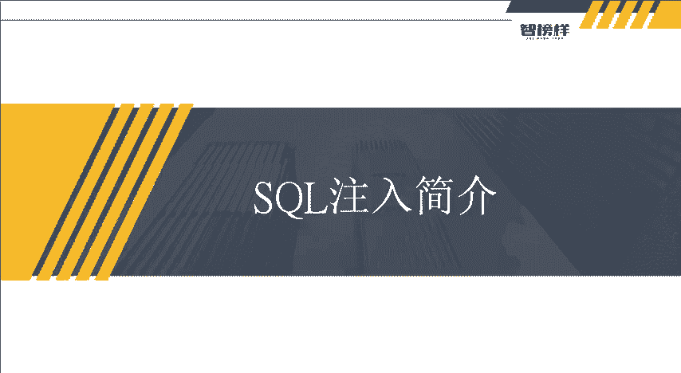
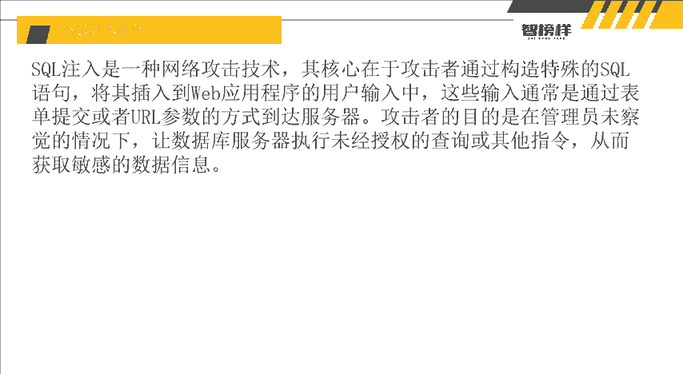
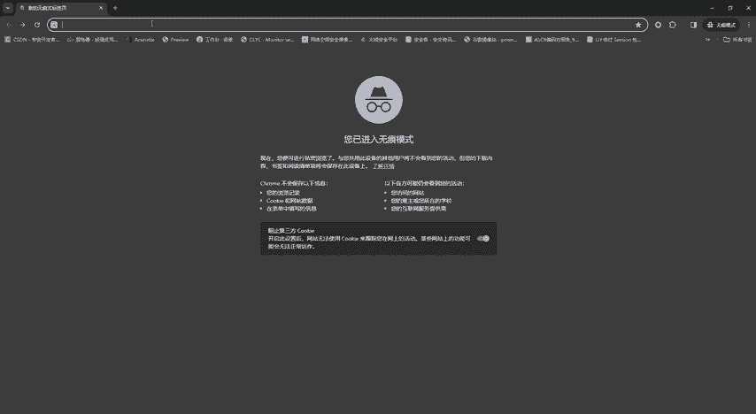
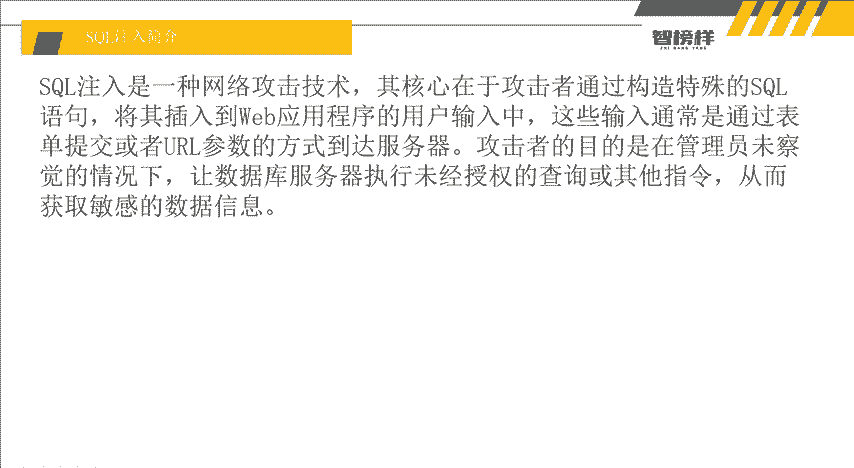
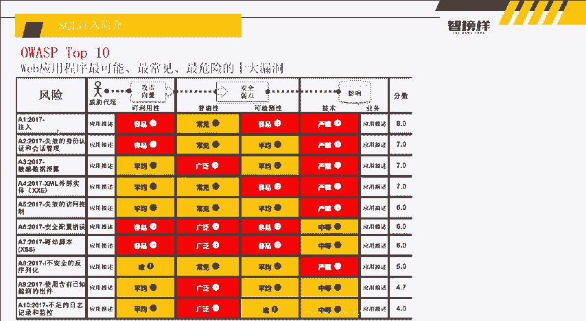
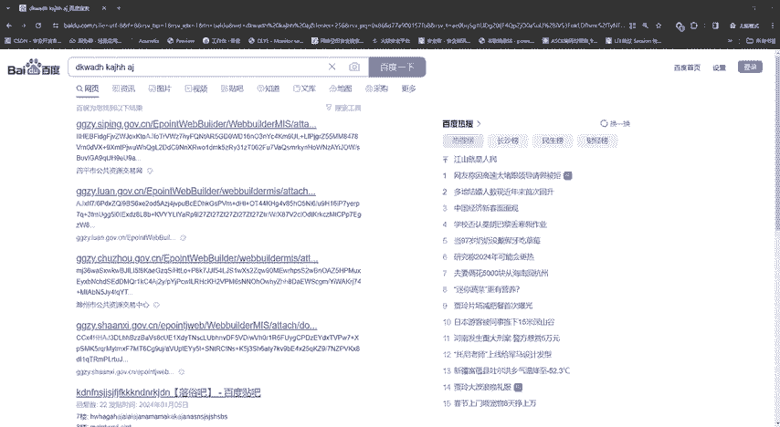

# 2024最新【网络安全／黑客】入门到精通课程教程，包括Kali Linux安装与CTF比赛教程（附安装包） - P17：P4-SQL注入简介 - AI-大模型基础 - BV1SK421Y7kA

大家好，我是方舟老师。这节课给大家带来的内容呢是搜狗注入简介。因为在下节课呢，我们就要正式的演示我们的搜索注入了。所以在演示搜狗注入之前呢，我们前面讲的数据库。

所以这节课呢我们讲解一下搜口注入它的一些来由和一些危害和一些运理。好，那么我们话不多说直接开始搜狗注入呢，它是一种网络攻击技术，其核心在于攻击者通过构造特殊的搜狗语句。

将其插入到外部应用程序中的用户输入中，外部应用程序呢，其实就是我们的网站。然后还有用户输入就是我们在一些搜索啊登录啊，这些大家可以看到很多。就比如我给大家举个例子。

像这种百度3W点。

百度。点com其实这个搜索它也是从数，它可能也是从数据库里面搜索，对吧？所以它这些有框框的地方呢，它可能就与数据库有连接。我们输入的东西它可能就会在里面执行。所以他是这个意思。

然后呢这些通入输入通常是通过表单提交和或者是UL参参数的方式达到服务器，对吧？是不是就是我们的这个呃随便输入一些东西。然后后续我们看到什么IE等于什么呀，BP等于什么呀？TN等于什么呀？

这些它其实都是哎我们输入的一些数据达到服务器，然后它给到我们返回我们一些东西，所以这些都是。提交或者传产都是一样。可以。与可能与数据库有交互。然后呢，攻击者的目的呢是在管理员未察觉的情况下。

让数据库服务器执行未经授权的查询或者其他指令，从而获取敏感信息。大家要想一下，数据库里面它存储的都是很都是自己的隐私，对不对？不可能我们把一加一等于2这个东西放到数据库里面嘛，对不对？

我们通常是不是都是把我们的什么把我们的地址啊，我们的账号密码呀，等等，这些东西放到数据库里面，对不对？所以呢在但是这些数据库操作是不是只有我能操作，因为我才是这个数据库的主人。对吧所以为什么在未经授权？

如果我是一个攻击者，我的数据库本来是我能用用的，但是攻击者呢，他是不是不能用，就像我们访问百度一样，我们能控制百度的数据库吗？控制不了，对不对？那么如果我们控制了百度的电脑的数据库，我们是不是。

就可以查询百度里面的数据了。我是不是就可以查询你在数据库里面放了什么东西，对不对？你可能放了你跟你女朋友的照片，对吧？也可能放了自己的隐私，那这样的话，我是不是就可以看到你的隐私，看到你的照片，对吧？

所以就是这个意思，所以这个就是收口注入。然后呢，获取到敏感信息呢其实是收口注入中的一种危害。它不仅仅只有这么一种。那我们接下来呢就讲一下这个OWASPtop10。这个呢就是我相信大家在学习网络安全制。

在接触这个的时候，大家都会去了解到1个OWASPtop10是一个什么东西，就是十大漏洞排行。第一个就是注入。注入风信。它是非常容易利用的，而且很普遍。然后呢很也很容易，但是它是非常严重的一个。

然后后续还有什么私效的认证，身份认证管理和绘画管理和敏感信息泄露啊，还有叉M叉ML外部实体注入啊、私效的防控制啊，叉SS快散脚本啊等等。这些这些它都是存在而且而我们的搜口注注入，它就排在这个死档。

漏洞排名之首。所以我们最主要着重呢就是讲这个搜术。当然后续的这些呢，可能在后续的一些呃一系列的内容，老师可能会讲，当然这是后话了，我们先讲一下这个是辅之路。

然后呢呃搜出它的攻击步骤就是判断注入点嘛，对不对？第一步就是攻击者寻找应用程序中未对用户输输入数据进行检查和过滤的地方。这通常是什么外部应用程序。对用户输入数据的合法性，没有充分的判断位置。

为什么我们要了解输入的数据合法性没有输，没有充分判断的位置。因为我们输入的数据平常呢是不能进入数据库操作的，对不对？它是写死的。但是如果我们能控制这个。输入的数据。从而让数据库执行呢，对不对？

那是不是就出现了注户点，对吧？然后我们第二步发现它存在注户点之后，我们就插入我们恶意代码，对吧？插入进行构造的排入收购代码。这些办法就可以执行各种数据库操作，我就可以想看就看，想看什么就看什么，对不对？

那数数据库是不是就是我的，就等于是我的，我就可以为所欲为了，对吧？啊，还什么读取敏感数据啊，修改记录等等，这些，还有什么执行查询呃，什么非授权的，本来是你能访问了，但是现在变成我能访问了，对吧？所以。

这个搜索注入的攻击步骤，第一步就是插手注入点。然后呢。他的搜口注入到公击云里。在这讲的这个原理，就是输入的数据当做代码执行。大家在学这个课程的时候，前面的这些你都可以不用听，你都可以不记。

但是一定要记住它的攻击云里，就是输入的数据当做代码执行，就这么简单。代码是什么代码？收口注入数据库的代码，我们输入的数据当做数据库的代码执行，它又存在收口注入。所以大家一定要记住这一句话。然后呢。

还有收收口住的一些攻击危害，这个它就很多啦，什么未经授权给访问数据库的数据，对吧？盗取用户的隐私以及个人信息，还有造成用户的信息泄露。大家可以看到很多我们在新闻上看到什么。

某某某公司被攻击泄露了多少多少数据，泄露了什么什么用户多少亿几亿的用户数据，这些他都泄露了。他从哪里泄露呢？数据库里面泄露。对不对？他就从数据库里面泄露这些个人信息用户隐私。

所以为什么就嗯我们有会有很多的一些我们不认识的人打电话给我们啊等等。这些还有以及不认识的人发什么一些短信，这些我们其实都没有输入，但他莫名的就会。发到我们的手机上或者打电话给我们。其实。其中有一个部分。

有一个情况，那就可能是收不住。造成了危害。那后还有什么？通过操作数据库对网页进行篡改，还有修改数据库一些字段的值嵌入网网码，另一接就是网页误码，简称网码，另一接进行挂网攻击。

那么还是攻击者可以对网页进行篡改，发布一些违法信息，这种违法信息就非常非常的严重了，对吧？就呃发发布一些不好的言论啊，这些都是可能要被发现了之后要进去干嘛，对吧？吃国家饭的，这种是非常严重的。

还有什么服务器被隐程控制安装后门，就是安装后门之后呢，其实你们的电我们的电脑呢被安装到后门的话，其实就会有变成一个非常好听的一个名字叫肉机，对吧？我们就变成了呃攻击者的肉机，他就给控制我们的电脑。

然后我们干什了，他都知道，是不是没有一点点隐私了。也对吧？那么还有什么对数据库的数据进行增加删除操作。呃，我们呃如果是有学计算机的，或者是有是程序云出身的一些同学学习网络安全。

大家在学习的过程中可能都会听到。这么一个词叫做山库跑路。山库跑路呢。就是把数据库里面的数据进行全部删除，然后就上不跑路了，对吧？我们也有手提看到一些新闻，这新闻里面也讲了什么某某程序员在离职之前。

把公司的数据全部删了，对吧？危害造成的危害也很大。因为公司所有的数据都放在数据库里面被删除了，如果恢复不了，造成的损失是非常非常大。那还有什么破坏硬盘出去，导致全系统瘫痪嘛，对吧？

因为我们数据库它是一个后端的一个东西，它也是维持网站运行的一个。标准。如果我们破坏了这个数据库，那网站可能就运行不了了，是不是也造成了很大的危害，对不对？所以这些一个是。搜狗注入的攻击云里。

输入的数据当做代码执行，还有什么搜口注入攻击危害。以上呢就是我们这节课所有的内容。我们下节课呢就是正式讲解收口注入它是一个什么东西，以及它的隐视靶场。呃，还有就是呃收口注入呢，大家一定要先。熟悉。

收口语句。然后在待会儿呢在下节课老师就会利用这些搜口语句给大家一一的展示s口注它是如何产生的。

