# 2024最新【网络安全／黑客】入门到精通课程教程，包括Kali Linux安装与CTF比赛教程（附安装包） - P18：p5-SQL注入演示 - AI-大模型基础 - BV1SK421Y7kA

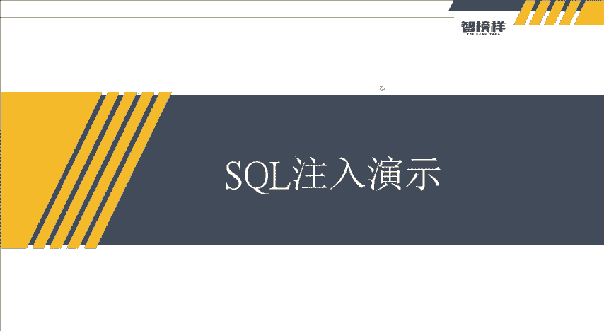

大家好，我是方舟。这节课给大家带来的内容呢是搜口注入的隐视。因为在上节课和之前的内容呢，老师给大家讲了什么是搜口数据库，什么是搜口注入搜口注入的原理啊，它的危害是什么。

那我们这节课呢就简单的来演示一下一些初级的比较简单的一个搜口注入的类型以及磁信。然后还有最后面的靶场操作。那么我们要先讲解一下我们的实验环境，就是scle labelbels。

这个搜cle labelbels呢就是嗯聚集了很多很多种类型的注入。比如说行错注入啊，时间注入啊，瞒住这些它都有实践。那么我们接下来就是找它最简单的一个什么请错注入来进行实验。那么在实验的时候。

我们要告诉大家如何去搭建这个靶场，这里呢有一个搜cle labelbels是这么一个文件夹，然后我们把这个文件夹呢，本来它这里是没有的哦。

然后我们把这个文件夹移到这个PHB18底这个3W的目录下面把它放着啊，放着之后。

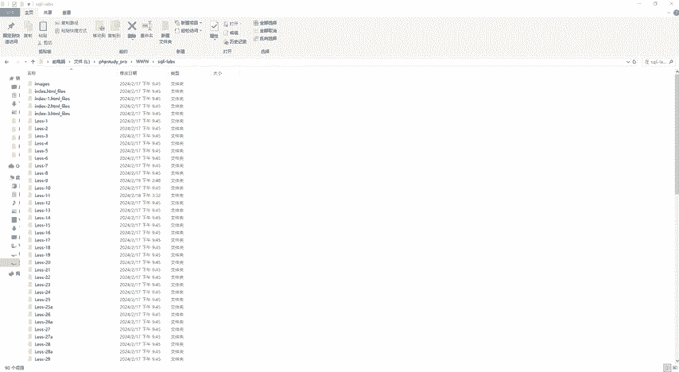

然后呢，我们要干什么？开启PHB是打底啊，开启PHB然后cicle labels呢，它主主要是用到的环境，它用的是mycicle一。然后和什么和哦这样子把它开这个，然后看下放题。他说占用了。

我们稍等一下，点击产关闭哎。嗯。我的PHB大底被关掉了，等一下，稍等一下。运行一下就可以了。

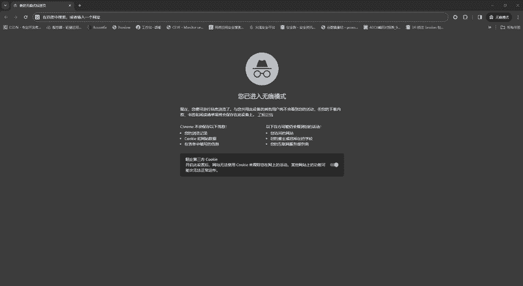

好了，可以看到我们运行了这个micsql105，然后再启动。因为个显示端口被这呢，我们就尝试关闭端口就可以。s的话就启动这个启动啊发行。好，好了，我们现在这两个已经启动，启动了之后呢。

我们可以看一下这个网站的配置啊，PHP版本是5。6，一定要是5。6左右的版本跟麦sq5。1版本，我们才才能安装这个circle labels。因为用高版本的话可能会引起它的报错。

所以我们就直接使用呃circle labels，然后安启动好之后呢。

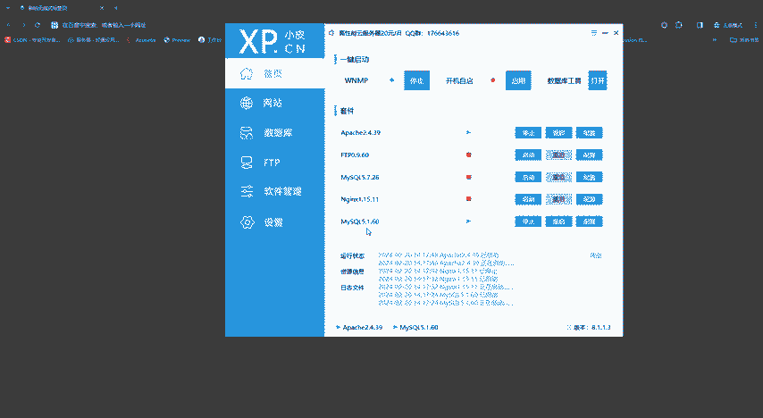

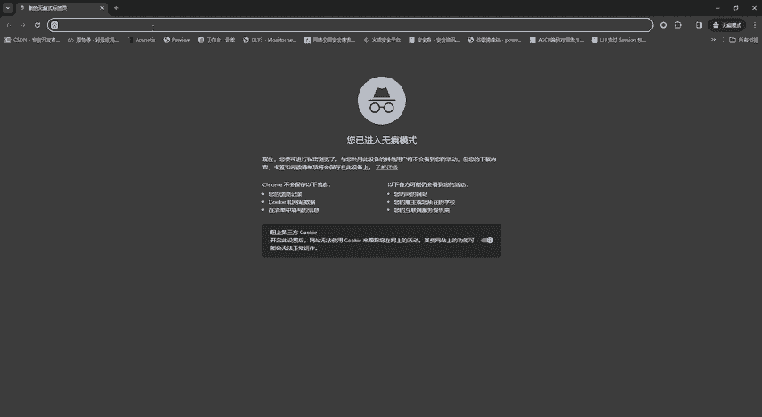

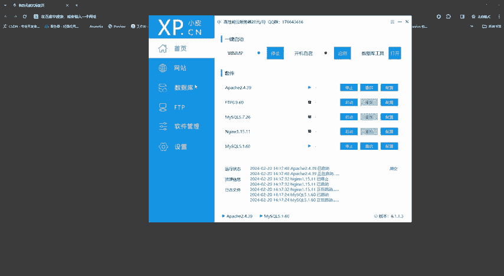

就访问127。0。001。把这个目录。然后第一点啊就是第一步就是在我们。刚刚开始建力的时候，这里有个。安装数据库，如果我们是刚刚进的，进站还没有去呃进行测试的时候，刚刚放进去，我们要先点一下这个。

点一下这个之后呢，它会自动的安装好它所需要的数据库和软可一些东西。然后呢，接下来我们就点一下这个好，点一下这个之后。我们就可以看到它有它有很多关，对不对？还有22个关卡。

然后我们这一节课呢就先讲第一个关卡。

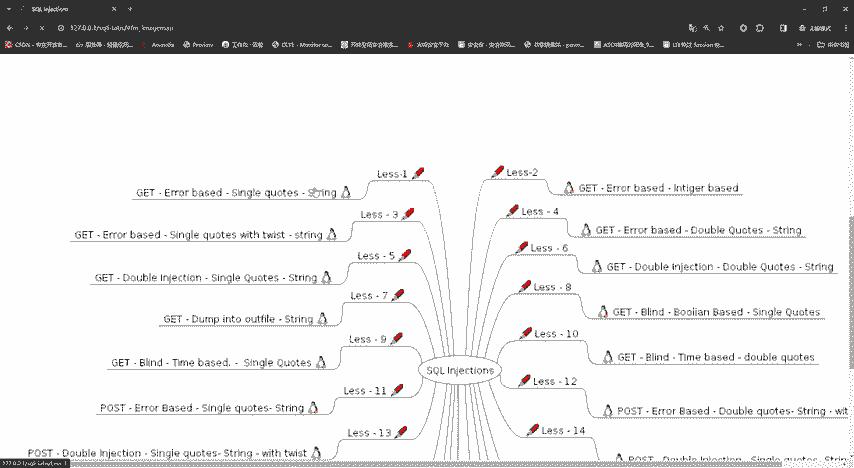

我们点进去之后，哎，他要等一下。啊，响应比较慢。好，它这里有想了，请输入1个ID这个参数对不对？所以我们就选先干嘛呢？先问号ID等于一嘛，对不对？先问号ID等于1。

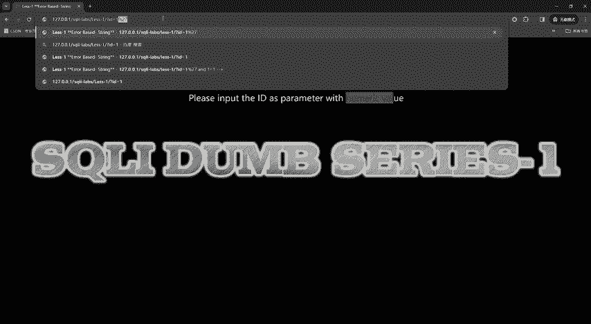

好，看他出现什么。哎，他说他说你的登录账号呃是。dble，然后这个密码也是dble好。那么我们接下来呢就继续讲解我们的这个PPT。

这个谁环境刚刚讲解了我们如何去搭建的。我们讲完之后呢，哎就看一下这个搜口注入的一个步骤，它分为有几步呢？第一步。判断注入点。因为之前在课程里面有讲到过，就是我们去。搜索注的原理。

它是我们输入的数据当做代码执行，对不对？那么我们如何去输入数据呢？输入的数据当做代码执行这个点，哎，它就叫做注入点。那么它尝试闭合的类型，例如什么冒一个单引号啊，双引号啊，还有双引号。

一个括号等等这么一个。有很多方式，然后包括仅不逊于这几种方式。然后这个蚕试闭合的类型，那么。接下来呢我们知道注入点了，然后我们要判断字段数。之前啊老师有给大家去看了什么，就是我们在建立数据库之后呢。

我们要增加字创建数据表，对不对？创建数据表之后是不是要创建字段，里面有哪些什么ID呃，usernamepaword这些对不对？然后还有什么判断字段数之后换断显错位。因为在。网站呢。在网站中不是每一个点。

它都是会显示的。比如说像我们一些网站。

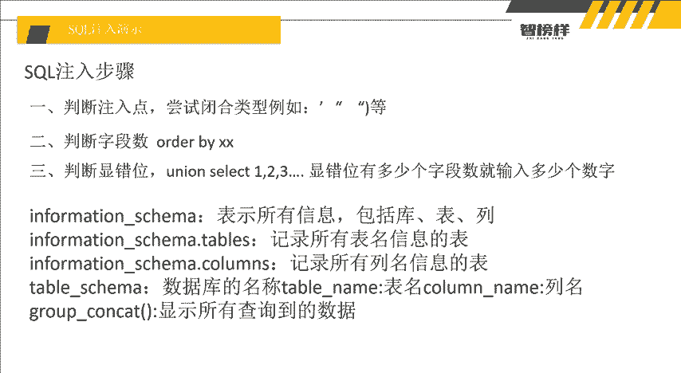

像这个网站哎，welcome什么DH这个，然后还有什么d普啊，d普，那它这些它都有可能是从数据库里面拿出来的数据。所以我们要输入什么123看一下它回显是在哪哪里，是从数据库里面回显的。

所以我们再从那个回形点里面干嘛呢？查找我们想要的数据。

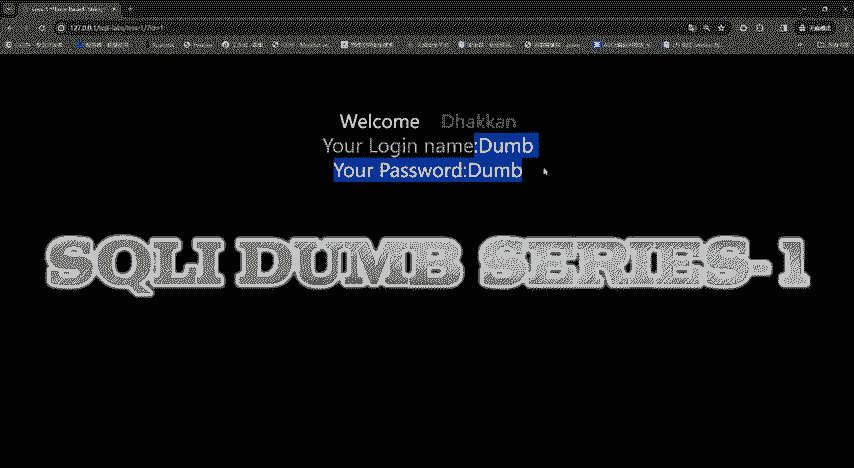

那么。还有就是什么一些小知识点啊，什么information s，这个表示所有信息包括库表列，然后information s，然后点tables就是记住所有表明的信息的表。

然后还有什么information呃 chrom记住所有列名信息的表。其实意思呢就是唉这个information s，它本身就是这个表里面是集合了数据库，我们所有数据库里面的库名表明列名。

它是一个总体整合，然后呢还有什么table，就是数据库的名称，然后table nametable，然后下划线 name name，然后就它就是表明，然后还有什么呃chrome name就是列名。

还有还有一个什么gcon是吧？还是查询是所有查询到的数据。当然呃这个呢可以利用。然后但我们。后续呢还有另外一种方法。去因为在不同的网站呢，它可能显示的数据可能没有呃。不能全部显示。

所以它可能一行一行的显示。那么我们接下来呢。就哎可以看到呃查询表明什么uniclect的table name information s。那你看查询吗select的，然后什么表明。

然后information s点tables是不是所有库里面的这个表，然后在哪里呢？在这个数据库名的table databaseabbase，对不对？然后什么查询列名就是。列名。

然后informationgema是所有表，对吧？所有库这个所有库里面的列，然后在哪里呢？在tablegemadabbase，然后where。哦，这里是应该是按的啊，这里应该是按的，待会给大家实践一下。

这里应该是按的。先来改一下。啊，这里应该是and，然后河马，and是河马。然后实践呢就是什么判断注入点啊这些。那那么这里呢就先不讲，然后老师呢就先给大家讲解这么一个内容。

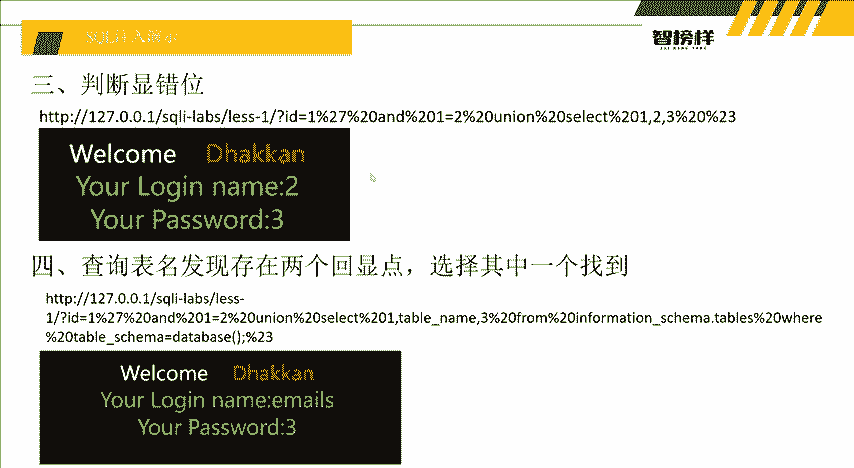

在我们最开始去访问这个呃数据库的时候，我们因为我们不知道它的里面是什么，对不对？所以这一节课呢老师呢就新干嘛？先访问这个路径，把这个数据库第一第一关这个数据库里面的搜搜索语句把它拿出来，单独拿出来。

放到我们数据库里面演示一遍。哎，大家就可以去清晰就是深入的了解它到底我们输入的数据如何是闭合的。好，它是在干嘛？它是一个呃在这个目录里面，对吧？在这个目录里面。

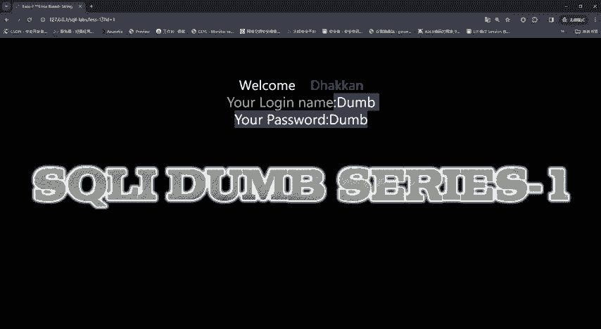

index点PHB好，我们找找一下它的数口，哎，可以看到可以看到是什么。select的型号from是不是这个就查询语就因为大家可以看到啊，可以看到什么我们的ID。

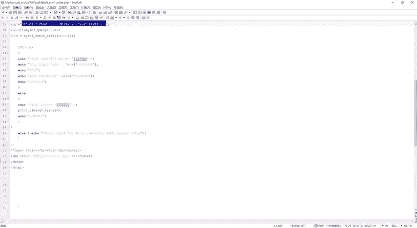

ID等于于是不是ID在这里好，我们把它复制一下，复制一下放到哪里呢？

放到我们的数据库管理工具里面。

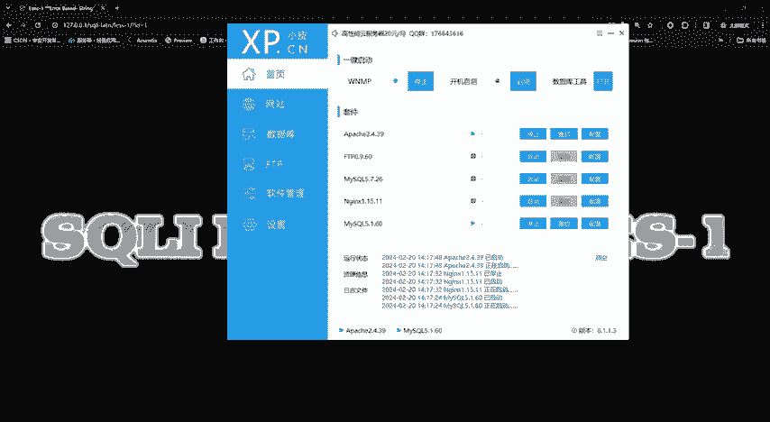

好。我们要进入这里。然后呢。可以看到我们去执行大下。它是是没有的，对不对？为什么没有？因为我们ID呀ID没ID它是传拆呢？所以我们为什么ID等于一，它输入进去呢？哎，它就是一。哎，看到没？

是不是出现了一个什么usernamepa worddd，对不对？那么。可以看到它我们输入的数据是干嘛？顶顶。两个单引号，然后变应量ID对吧？那么。我们输入的数据好像可以当做代码执行，对不对？

那我们才是闭合一下，怎么闭合呢？就是我们是不是输入的一，对不对？我们ID等于一，对不对？ID等于一。你看我点一下ID等于一，它出现的是单不当不是吧？

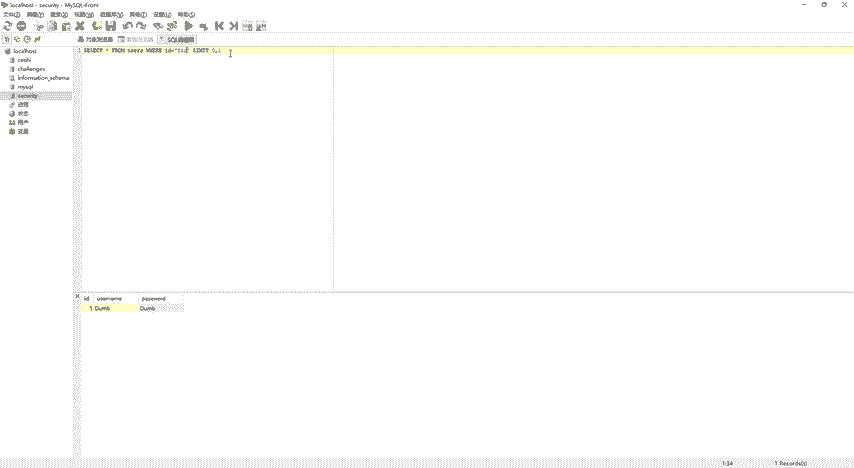

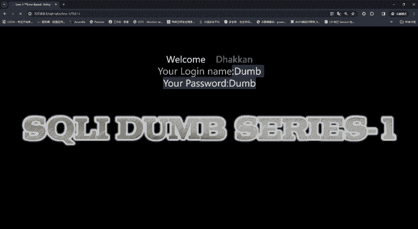

那么哎它这里是不是执行的是一，然后它执行的是WW，然后我加一个单引号呢，加一个单引号之后，哎，我andand是零合嘛，and一等于一呢，对不对？然后因为大家可以看到我们输入的数据之后。

它这里后面是不是也要输入数据是不是就错误了。大家可以看一下，我运行一下，它是报错了，对不对？报错之后，我们是不是要把它注释掉，如何注释掉呢？是不是？哎，他有专门的一个。数据库注释符就是横横哎。

两个横就可以了，加一个空格啊，哎，注释了，大家可以看一下运行。哎，看到没？它运行成功了，对不对？哎，好像它是不是把我们的这个放进去了，是不是执行了，那我们不对，再试试看，我们就哎。加一个2一等于2。好。

到没它不显示，为什么不显示？因为大家可以看到就是select的信号from信号 from userwhere IDD等于1and。一等于2and是什么？and一等于2一等于二是foralce啊。

一本来就不等于2啊，那它是不是错了，是不是就不显示了，对不对？好。那我们知道它这里存在的注入的是吧？我们知道这里存在注入之后呢，我们下一个。看到我们的这个就判断字段数。我们知道这里是出现了一个呃。

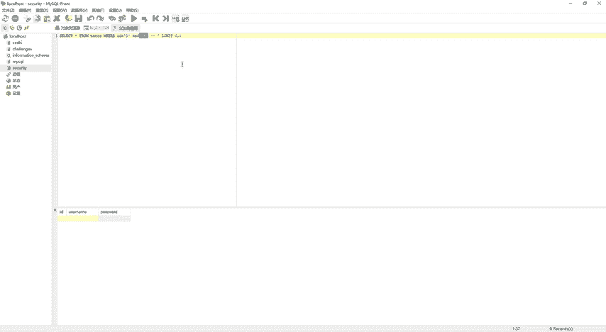

注入了对吧？出出现了注入之后，我们就直接放在这里面呀，对不对？我们放在这里面，或者哎我老师再讲解到这个判断字段数这里。

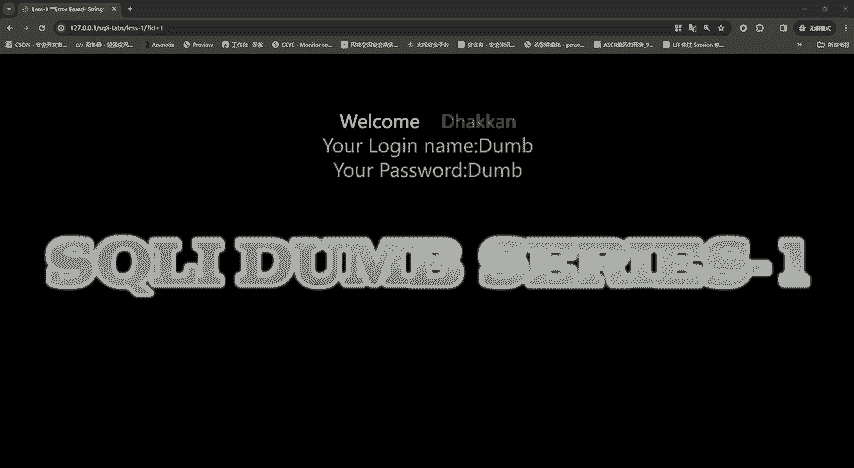

我们就把这个去掉。看到了没？old find嘛。我的办一看一下。哎，他是不是有一个字段，因为它正常回醒了呀，对不对？好，那么我们按。哎，他也回旋了，那我们三。他也回险了，那我们四呢？哎，失败了，看到没？

他是不是说只有三个字段，没有4个字段，是不是我们证明它是有三个字段。好，那我们证明它有三个字段之后，那我们接下来要干嘛呢？我们就回到这里嘛，对不对？因为我们数据库里面已经可以发现它存在住了。

那我们就在数据就在这个网站里面试一下嘛，然后干嘛呢？一个单引号and一等于一，然后狠狠加，为什么要加一个核能加呢，因为它会进行一个加，它是在这个UL栏里面，它等于是空格，这个空格呢？

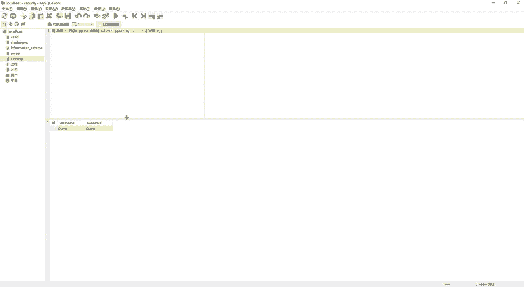

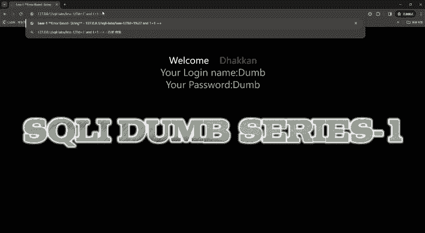

放在里面是不是其实好看一点，对吧？就是注释对吧？人家这个注释，然后哎。

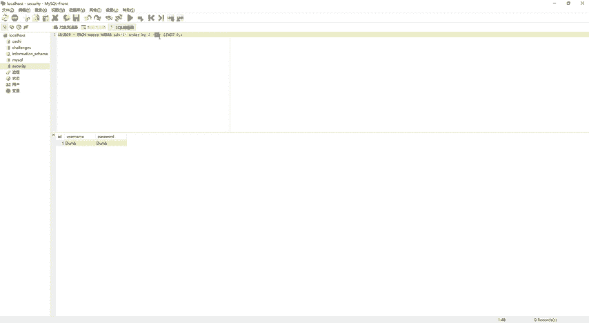

我们执行一下。看到没？执行之后，他好像可以出现淡不淡薄，对吧？那我们一等于2试一下。哎，失败他没有东西显示，那是不是就证明。证明什么啊？我们的这个ID等于1ID这个注入它存在注入点。

这个船舱它是不是存在注入点ID对不对？所以那我们接下来就干嘛呢？接下来就。or buy嘛，对不对？因为大家可以看到它这个URL里面这个百分号20啊，百分27啊是什么？因为在URL栏里面呢。

它会自动解码一次URL解码编码解码。然后这个。百20呢就是哎空格的编码URL编码，所以我们就。怎么呢？我们就重新写嘛，对不对？然后干嘛order by。因为之前是不是3，然后它我们在数据库里面有三个字。

它是它显示有三个字段，对吧？那我们在网站这里也也也试一下嘛，auto派3，看一下它能不能出院。哎。正常回行啊，那我我的拜4呢？or4，他这里就说他们不知道有四行，那是不是证面有三行，对吧？

我们知道有三行之后是要干嘛呢？是不是要unic like的123，因为有多少个自段数就输入多少个数数字嘛，对不对？那我们就干嘛and一等于2。

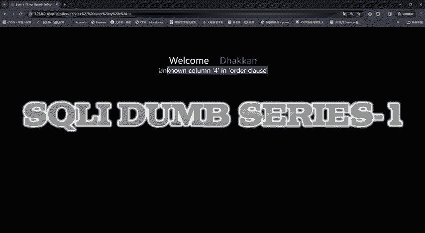

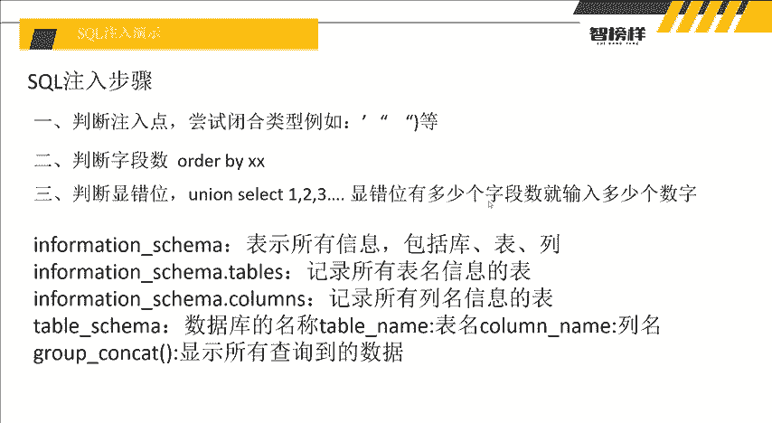

然后un name select。什么123。看到没？这里是不是显示的，显示了一个2跟一个3，对吧？那么我们唉它有二有3，这个二和3是不是可以回写我们的数据啊？回选我们的数据之后呢，哎我们可以看下一步。

它查询表明它直接un the select table name information schematables where table sma等于dabbase。那么。

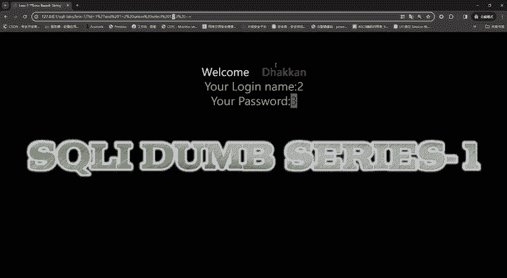

他好像是直接就是查询数据表，那有没有说直接查询数据库的，有直接输入dabbase。这。Face。看到没？等一下啊。哎，是不是显示出来，是不是显示当前所用的数据构失是个security。对吧啊。

因为大家可以看到啊，因为它是有两个回形点，我们可以在二啊或者是3。都可以输入databbase。Data。Face。它都可以输入啊都可以输入dabbase。等一下它显看到没？它都可以显示。

不是说只显示一个，它有两个回心点嘛，一个21个3嘛，对不对？好，那么我们接下来干嘛呢？

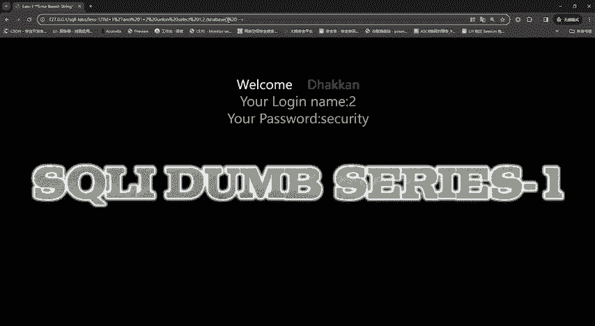

继续看我们的PPT继续学习我们的PPT查询表面。因为我们知道数据库名了呀，我们是不是要知道数据表啊，干嘛呢？un那那个table name嘛，是不是这里我们就要改成table name。

我们这样看起来很复杂，对不对？看起来有点难看。

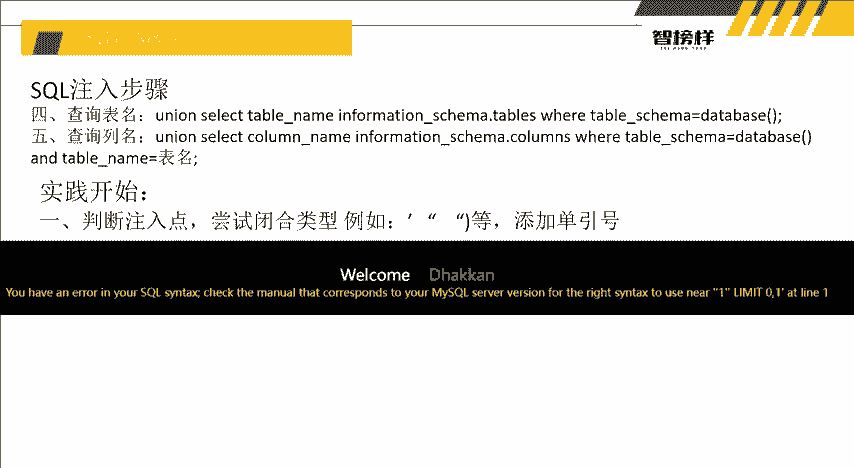

那么我们干嘛呢？我们就。建立1个T叉T嘛，建立1个T叉T的一个。

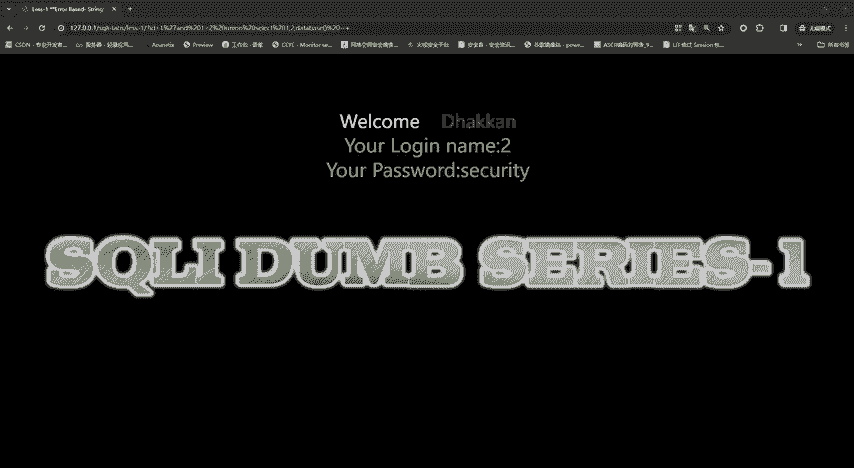

文档哎把它放进去，因为它有很多有点难看唉，对吧？有百分号27，分号20这些好，这里呢老师给大家分享一个东西叫站展工具，站展工具。好，有1个UIL解码，我们看起来很难看呢？我们是干嘛呢？

把它复制进来解码一下。好，哎，看到没有？

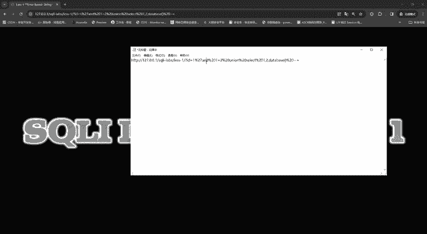

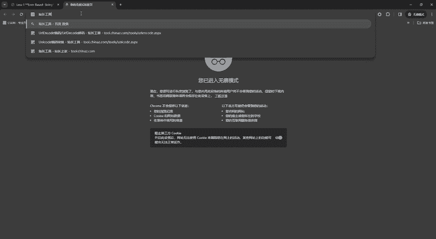

是不是就变得很好看呢？好，那么dtabase我们知道数据库名，数据库名。喂。Security。对吧好，那么我们接下来要干嘛呢？把它变成table name嘛。

payper name是不是注意表明paper name。tableable name干嘛？我们就对着他写嘛，对不对？我们一开始不熟练的话就对着他写，然后什么inform。Scammer。

Thank tables now where。T包。时间嘛，等于对。Yes。对不对？这不就解决了吗？对吧？好，我们复制一下，我们就把它复制。

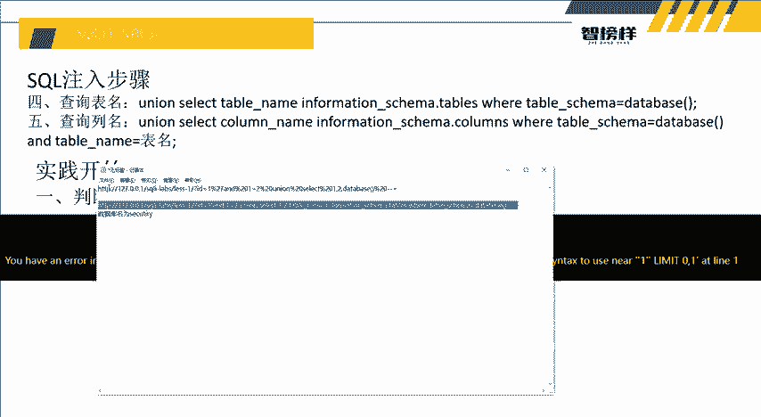

到这里面看一下。如果成功哎，就可以找到它的表明了吗？对不对？哎，它显示哦多了一个。多了一个。多了一个这个冒号。哎，看一下啊，你的数据库名错出现错误，tablecama等于dtab，然后可能增加。

把它复制下un unit select12tableable name。tableable name， information tables。

where tablechema点影 databaseabbase。正确呢。看一下啊，老师看一下。重新打重新打一遍。U and一等于2。有ね。Sa。然后因为是123嘛，对吧？Table。

name然后点删，然后from information。哦，打错了一个拼 for。leaaching scan，然后点tables。然后V啊。A。时间嘛。Yes。看一下，哎，看到没？出现一秒。

那就是老师刚刚打错了，打错了，打错了一点英风微先呃，这个打错了，应该是打错了。所以。

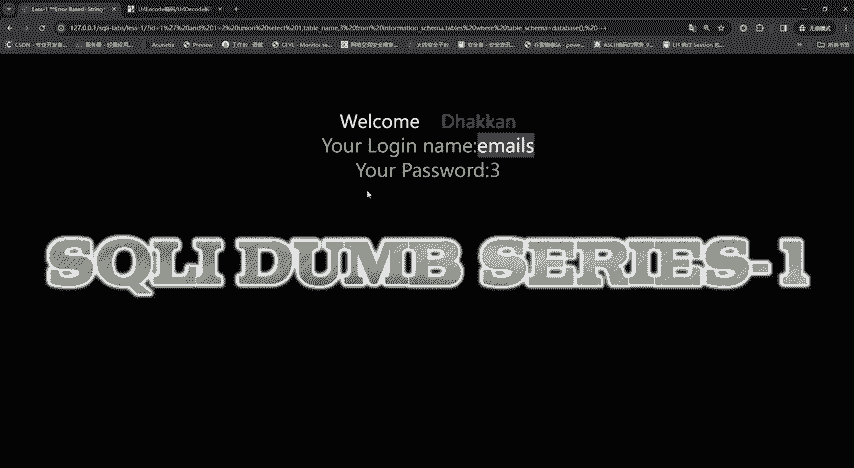

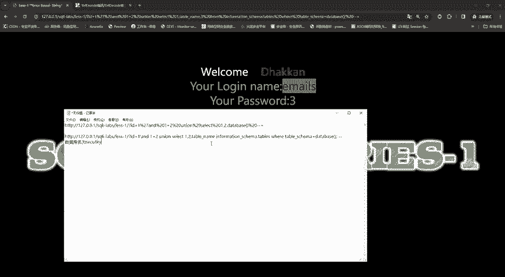

就导致了什么导致了我们出现了呃，它不显示，但是现在好了啊，现在tableable name from information sche，这个对了。

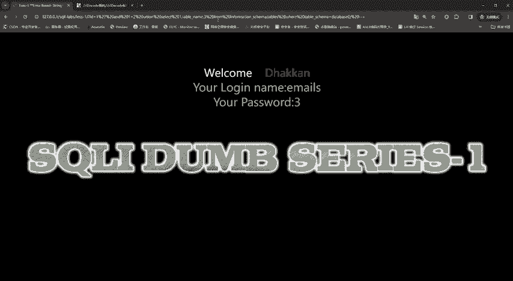

所以大家可以看到它的表明，第一个表明是不是emails。第一个。第一个数据表。一年。emails对吧？那是不是有很多啊，对吧？它可能数据表不可能只有一个，因为email它中文翻译过来是邮箱，对吧？

那我们就再找嘛，怎么找呢？刚刚我们这里有一个group content。

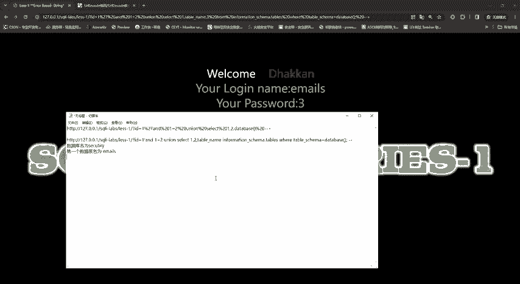

就把它改g。Conact。对吧可以看到什么出现了4个表，emailsre。UAUAJ然后users对吧？那我们正常我们的数据会放在哪个表呢？users对吧？它正常情况下应该会放在user是吧？

不会放在呃我们想要的这个什么emails啊 referenceUAJ，我们都不知道他翻译的过来是啥，是不是？所以那我们是不是就唉找这个users里面的。好。我们就把这个输出搞了。第二个。

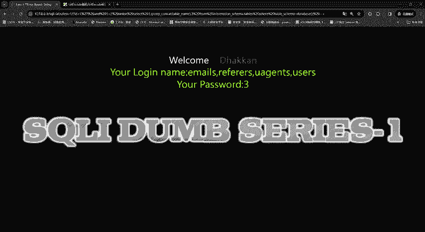

就把它复制复制过来嘛，对不对？我们做一个记录，第二个、第三个、第四个好，就打一个第二。第三第四一个是什么？为。fi对吧一个是UAG。还有一个是。us啊，是个表。那我们要怎么查询。Users。面的值好。

我们要查询user是里面的值呢，是不是要下一步要干嘛列明对不对？列名好，那我们就继续输嘛，对不对？就继续输嘛。

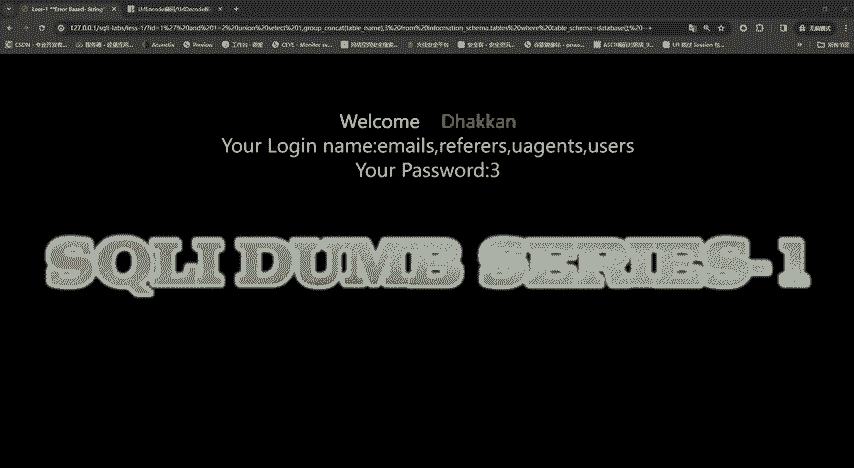

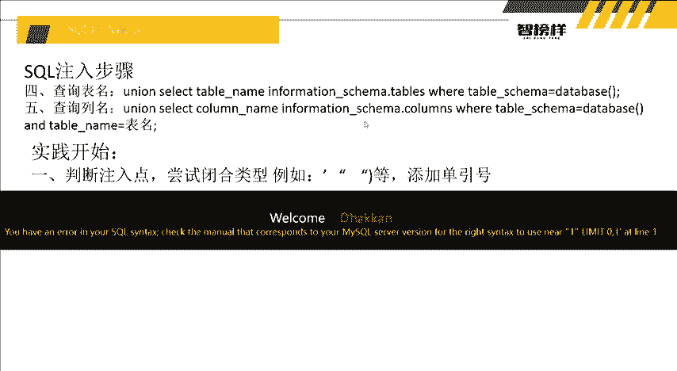

把复制过来。

然后解一下码。啊。解码出来之后。把它放在里面嘛，这个是就改了嘛，对不对？就跟着他打哎，chrome。等一下啊。老师也有点背不住啊。对着他吧comrome。chrome。

然后informationchemachromes。V天次M码等于。好，然后干嘛呢？然后and。没报。对等于我们的表明是users是吗？右色是这个表好。复制。

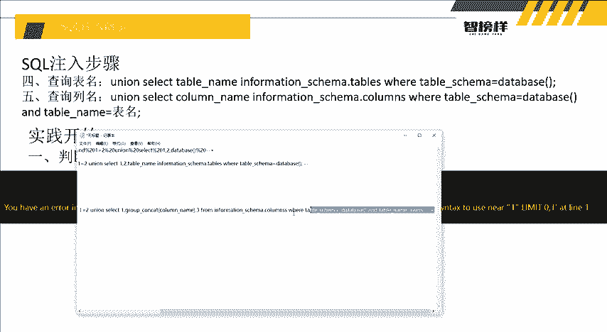

搬进去。试一下，看一下人家能不能出来。哦，又多打了一个croros哎多打了一个。所以因为它的语数据库语境呢非常的长，所以大家呢就注意users。

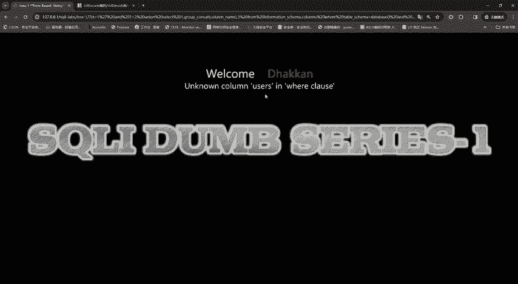

是有手是吧，我们刚刚呢打字。

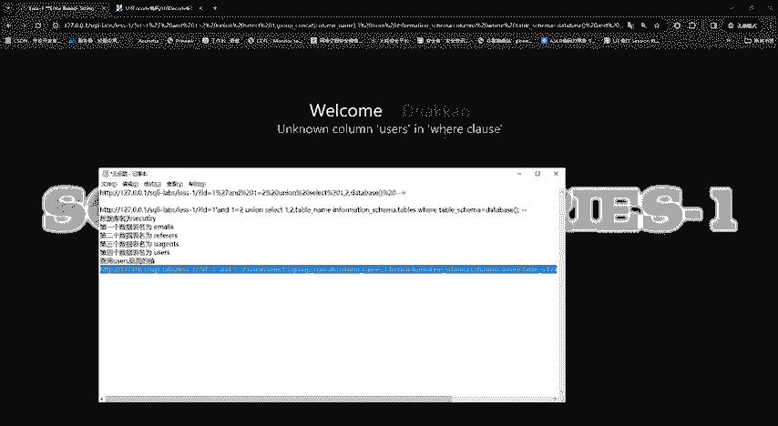

有损失没有。播放分情。哦，us色时呢它是。我们要加一个单引哈。带两个单元号看一看。哎，看到没有？空的看到没？空的是什么东西呢？那我们就把它。删掉嘛，对吧？把这个总的，因为它可能一次性出行不了，对不对？

那我们就看一下这个哎。哎，不显示了。chrome。Comm name然后。腾确。然后。usrs看一下它有什么列列名，看下有没有好，他说这里面是空的，那么它是空的的话呢，我们就换一个email。对不对？

就换一个email？Email。Yes。我们的user是没有，唉，看到没有？一个是ID，一个是email IDD，它是不是有两个对吧？那就证明我们的user室里面没有列名，它是个空的。

所以我们是不是要找哎emailID啊，email IDD啊，对不对？好，那么我们找完这个呢，其实我们的列名就找出来了，对吧？

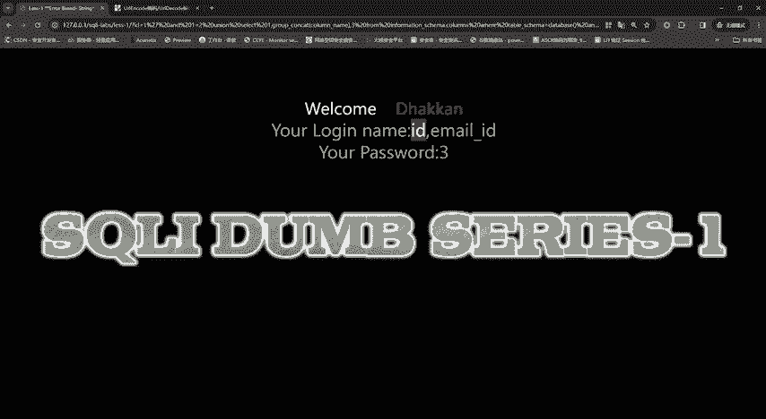

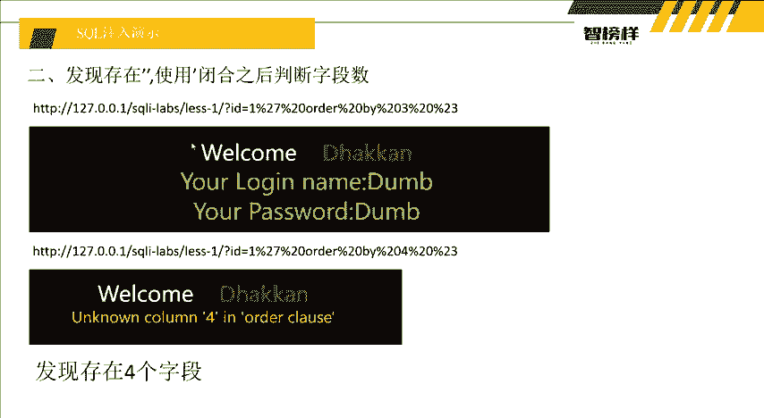

那么我们列名找出来之后要干嘛呢？是不是要查询它的数据啊？ID嘛查询数据是什么呢？selectID。from什么 from表明是不是user，所以我们就这么很一大串我们就不写了嘛。就ID嘛。然后干嘛呢？

这些全部删掉。From。Emails。一秒是这种秒。Yes。看到没？是不是ID是不是等于一，对不对？

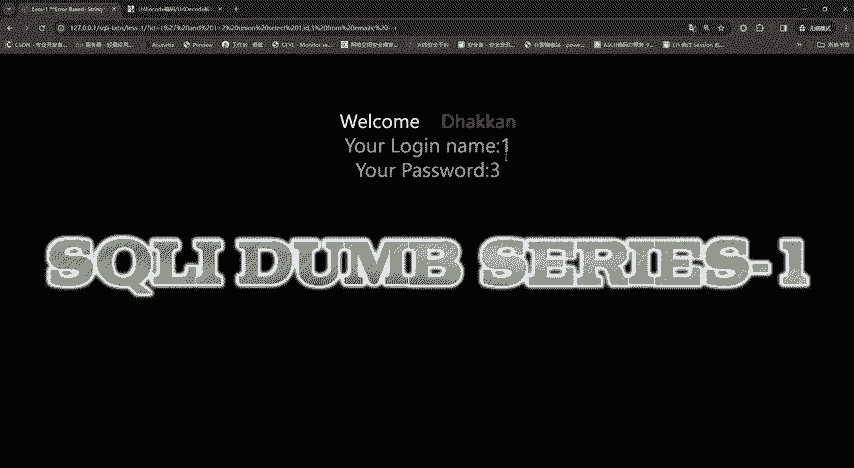

是吧我们现在已经知道了知道了知道了。知道了。一秒里面有。表力有两列。第一列是。Email。ED thisID。第二列是。一秒。ID好，然后我们查知道了列名，知道了表明，我们就干嘛查询数据库。

数这个email。理表里的数据是不是干嘛seck的嘛？老师之前给大家讲过正山改造查询seck干嘛sck的ID from emailmail。

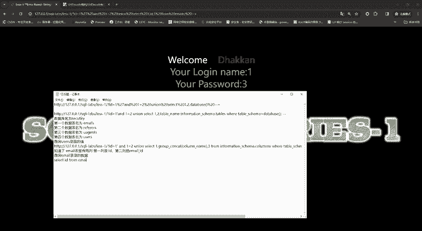

email这个表哎，就查询了，它ID等于一嘛，对吧？还有什么？就看一下他们他的什么，它的另外一列是什么一。没有下划线ID吗？对不对？但是说淡过，然后这个点com对吧？我们的数据都已经查询出来了，对不对？

这就是出口注一整套的这么一个流程。所以大家呢就可以去按照老师刚刚所讲的一些办法，然后以及呢这些判断醒错位啊，这个PPT啊。

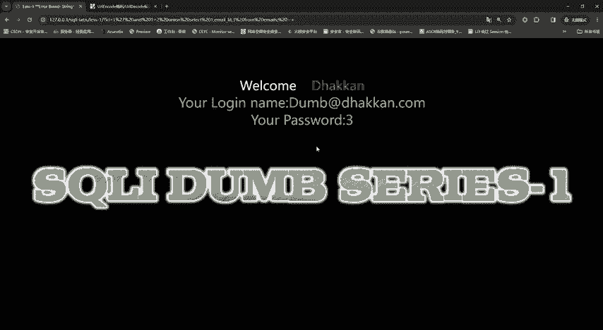

这个从判断注意点判断字段数请错位以及呃查询表查询列查询数据数据，这些大家可以跟着适验一下。那么后面呢就是一些呃老师，就是搭建完之后呢，一些。

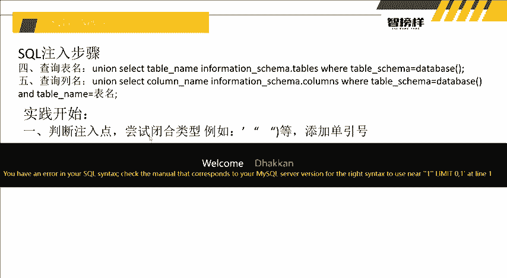

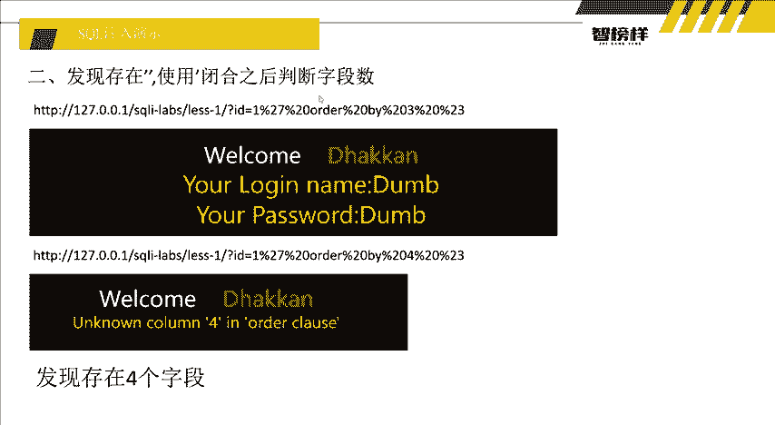

执行的语句都在这里面。如果大家想要去做呢，想要去看呢，大家就可以去按照老师的这个PPT课件自己去复制粘贴啊，或者是跟着老师的视频去打做一遍就可以。好，以上呢就是呃讲解的全部内容。

然后如果大家想要这个scle labels这个漏洞环境呀和PHP study啊，还有这个课件啥的，大家就可以去呃下方领评论评论区下方领取。

