# 2024最新【网络安全／黑客】入门到精通课程教程，包括Kali Linux安装与CTF比赛教程（附安装包） - P19：P6-POST注入方式 - AI-大模型基础 - BV1SK421Y7kA

大家好，我是樊舟。这节课呢给大家带来的内容呢是pos的注入方式。因为我们上节课讲的get注入隐视。那么我们这节课就讲一下pos这个两不误嘛，对不对？

所以实用环境呢还是我们熟知的这个circle labelbels式cicle labels呢哎看一下注入隐视在这个地址里面。

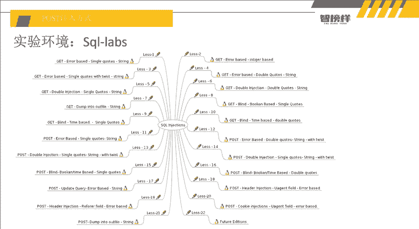

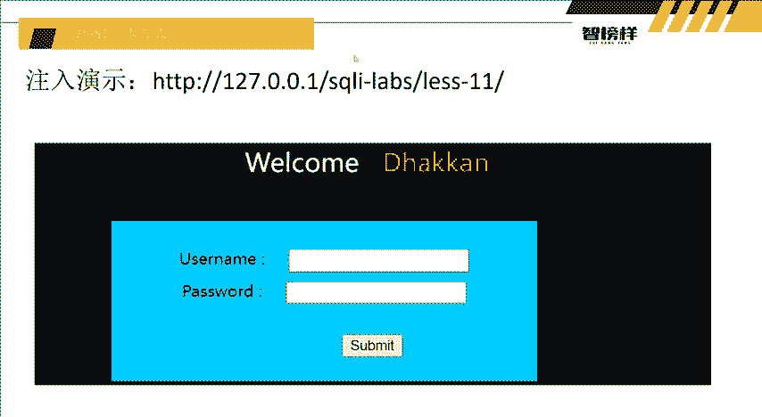

因为在这里呢，老师就给大家讲一下，就是get传参和pos的传参呢有哪些区别。第一点呢就是你看我们输入安。关掉。输按德没按德没之后，它这里其实是不显示的。UI栏里面它不显示值。它我们是看不见的对吧？

我们是看不见的，所以而且还有一点呢，UL栏里面大家可以看到我们输入的东西，它会自动UL编码一次，对不对？那我们干嘛呢？我们之前输入的这个横横。横横加呀，我们说的这个横横加唉，它在UL编码。

然后再解码一次，它就变成空格就变成注释了，对不对？那么我们就放在这个哎，这个pos的传上里面看一下它能不能直接使用啊啊，点号and一等于一嘛，对不对？一等于1试试，看一下它能不能注释。好。

大家可以看到报错了，好像注释不了。那这里显示的是横横横横加，对不对？那我们看一下恒横空格呢。对不对？嗯，空格。嗯，看到没有？横横加它报错了，横横空格它没有报错。因为它在pos里面呢。

它不会自动UL解码一次。所以大家可以看到我们之前在输入横横。加号的时候，它我们12L栏里面，它编码了，它编码了之后，在数据库里面它会自动解码一次，解码一次之后就会变成横横空格。

在数据库里面执行就横空格注释掉。所以在poss里面，它没有自动解码，它没有自动解码的话，我们就要干嘛呢？就输入横横空格这么一段，它不解码，我们就直接输入横空格，直接注册掉之后，看没？我们end and。

它后面这一段单引号闭合之后按一等于一之后，它好像没有执行后面的这个对不对？它后面它这里是显示的andend并没有报错，也没有显示后面的这个单引号按一等于一是是证明我们输入的数据单做代码执行了。

我们就证明我们单做代码之前，我们再看一下一等于2，对不对？哎，我两个都输入一等于2。我不知道哪里嘛，那我就直接输入一等于2。哎，没了，为什么没有呢？是因为一等于2，它本身是个forse，它就不显示了呀。

那是不是就证明哎。它存在注有力。然存在注意点的话，那我们直接按 me冒号。你要干嘛呢？还是老样子吗？or。好的哎。哦，对。把一嘛，横横空格。对不对？我们就直接执行横横空格嘛，我们就反正两个都是注点。

我们就放一个恒横空格，看下有没有？哎，有an enemy有，那我们放2。二看看可不可以。二也可以，那我们就放三呗。对不对？我们按3试一下，所以在判断字段数的时候，我们就。哎，看到没？它只有两个字段。

因为它三个报错了，对吧？因为呃如果是因为老师这个系统呢字段它是比较少的。如果大家呃在实战中遇到的这种数字判断字段数的时候，不用从1234567890开始，用二方法，就是轻弄十。如果他不影他不显示。

对吧那就证明它没有10元，那我们就除以25如果它显示了，那是不是就在5到10之间，那你又又算一个7嘛，对不对？所以这二方法它是在实战过程中是一个非常快捷的一个内容。但是老师这里它只有两个字段，对吧？

两个字段之后干嘛呢？and一等于2，然后un select干嘛12。对吧。嗯，看到没？U password word12，这两个它都是一个什么都是回形的东西，回形的东西，那我们就试试呗，对不对？

and一等于2，我们就照一样老样子嘛。好样子把这个复制进来，因为大家可以看到pos的传单是不是比ULge传舱好像好看很多啊，都不用编码了，对不对？我们也不用解码的，直接干嘛那什么uniclect。

然后12，然后。

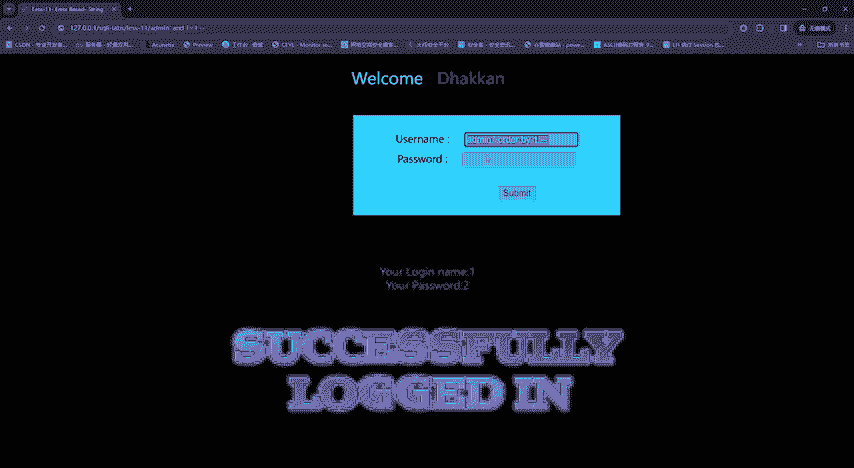

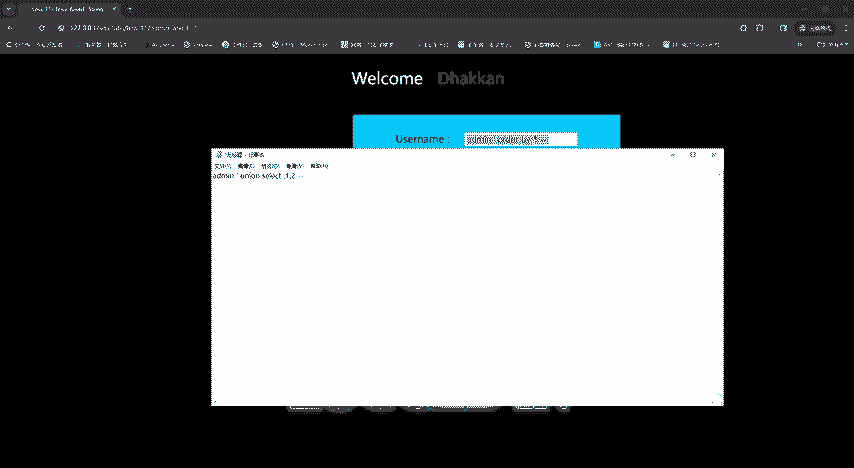

好，放进去嘛。看进去之后，它显示的是12，对不对？

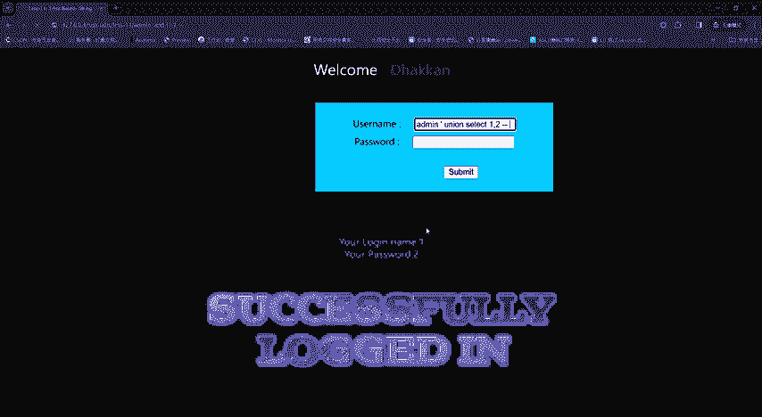

显示哎。等一下啊，O and一等于2N一等于2，用的是l的。

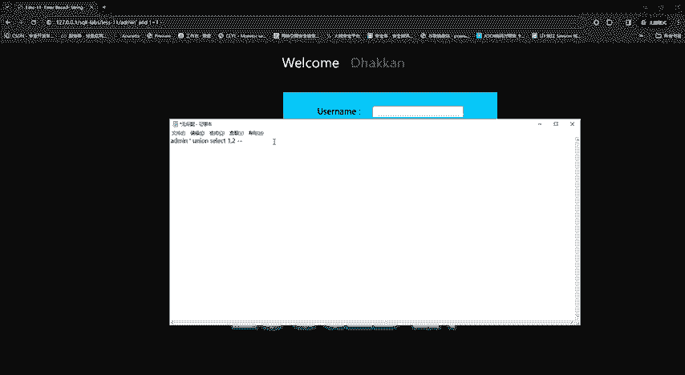

看到没？12好，我们12之后呢，它有两个核心点嘛，一个是一，一个是二嘛，对不对？那我们就。

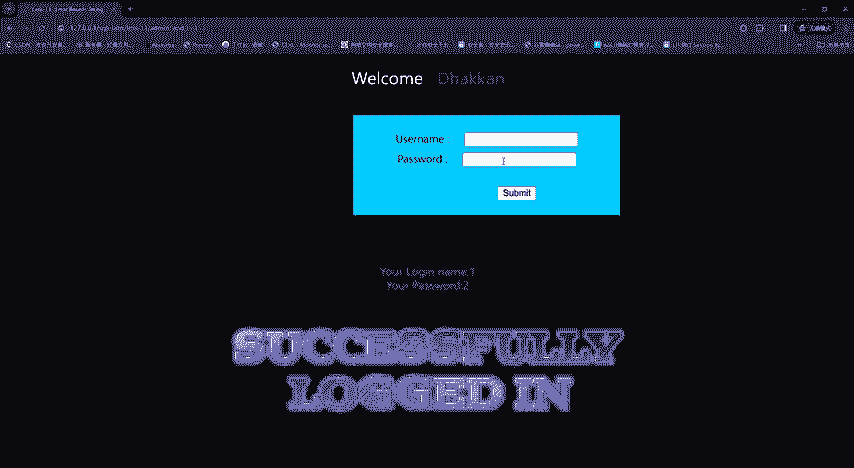

And。就复制上面这一个复制下来。录下来之后，dta base嘛，大家看。え事。对不对？

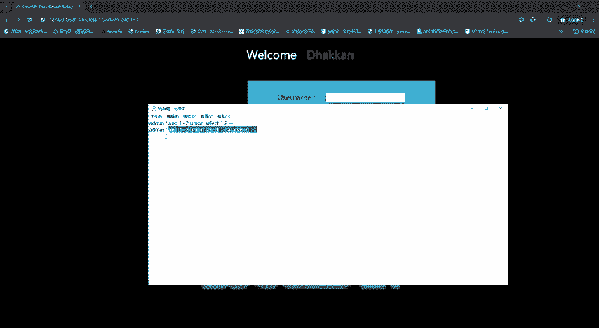

看到没有？数据库它也是这个媒题。对吧知道数据库名了，数据库名。Saker。Second it。

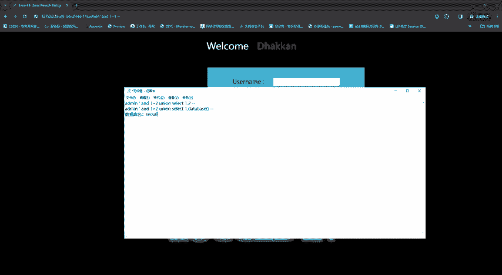

对吧我们拨打数据库也可以啊，root嘛。user嘛对不对？user是单心用户嘛，对吧？我们这些也是科外的一些小知识，看到没？root local的，那是就证明我们当前的数据库用户是是root，对不对啊。

单全。当前数。当前数据库用户。root对吧？我们是不是又了解了一点哎，查询。数据库用户。Useer。哎，是不是又加了增加了一个知识点，对吧？好，那么我们接下来要查询。表明。查询表名干嘛。

是不是又是之前老师的PPT没ge注入的语句的话是一样的，就干嘛复制。好，干嘛呢？table name。Table name。Inform。Smer。4、边源码电源。tables，然后where干嘛呢？

table。name配个时间。等于data。

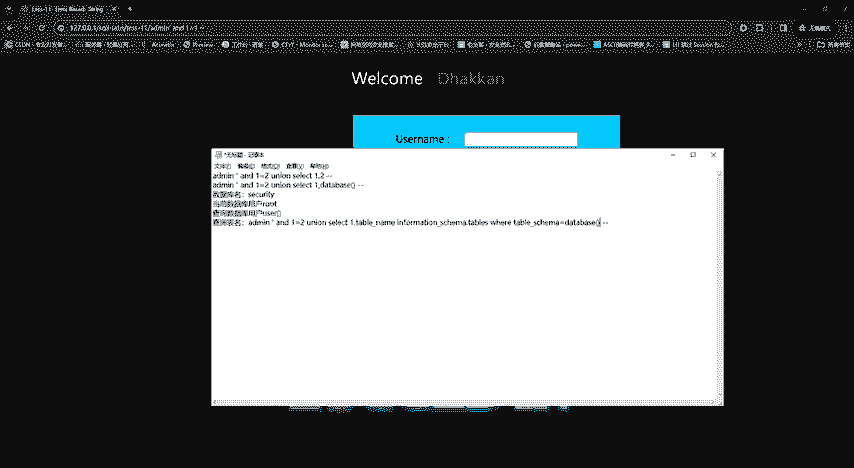

看到没？这个查询表明。就我就提交看一下对了没有？嗯。😊，等一下table。哦，是不是又打错了？

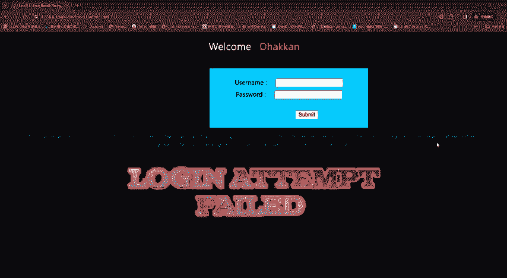

Table nameーム。Information。You they say like the table name， information。哦，from稍打来一点from。

你看所以老师在讲解的过程中也是。

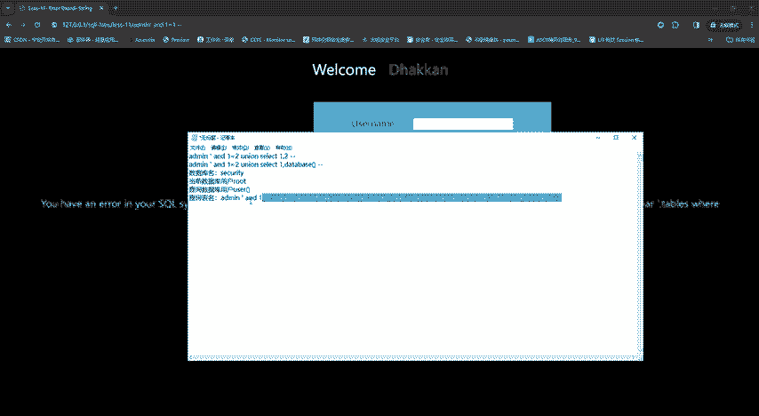

会出现一些操作，因为它太长了，对吧？所以大家就可以一个多看呗emails。

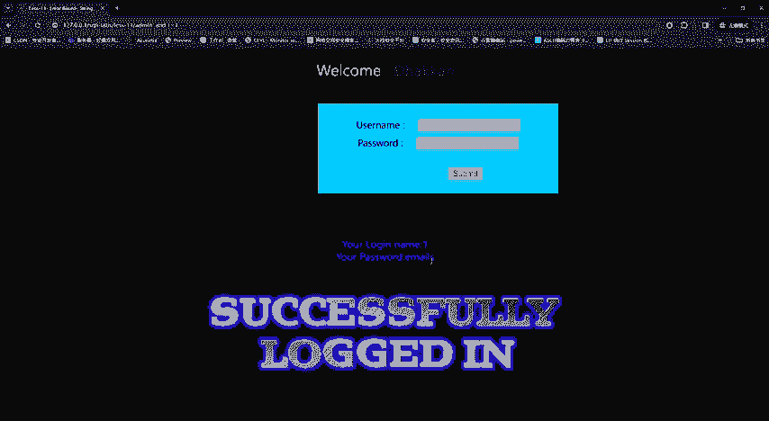

对吧。然后除了知道他的意面是干嘛呢？老样子嘛，compet。

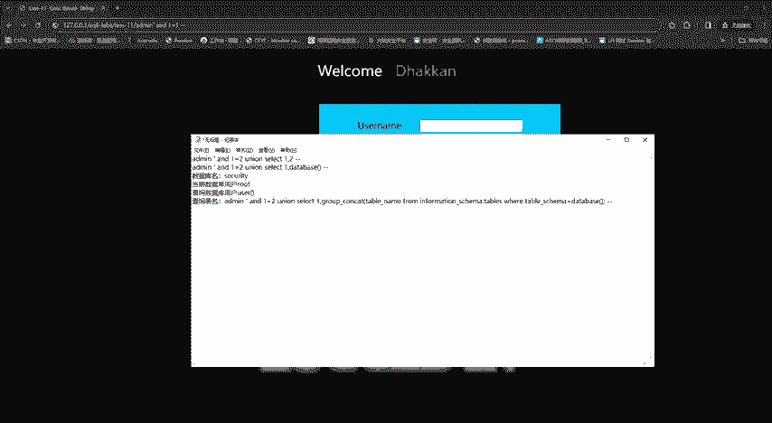

对吧所以在呃。同学们刚开始去做这这个时候，因为它很长很长，干完呢？就多打几遍啊，多背一下，看到没？email reference yourag and useless。

这一下就找到了，然后还干嘛呢？查询。查询表明查询列名。域名不就。再给大家打一遍，对吧？ene enemy me。给大家展示一下我帅气的时刻好。Select他。一然后也g吧，g快一点。对吧如括好。没有。

From。Information。Scam。大家多打几遍之后呢，他就熟练了，看到没？你一次性你就可以打这么一场团。我操，可能旁边如果有呃女同学我操这么帅吗，对不对？他可能就会觉得好帅的一男孩子。

Database， and。Table。name等于。等名是什么e嘛？是一秒吧。还打错字了。哎，EMS好。好嘛横横空格好，把它。复制。

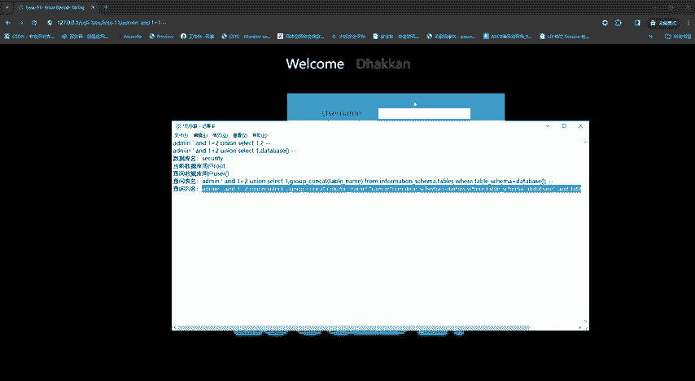

当天。好，给他提交一下。

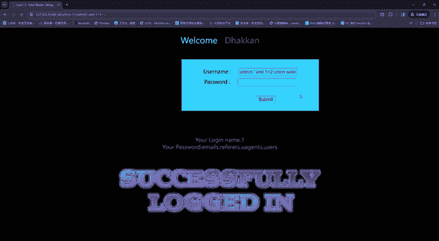

Funation global container。 global container was real。N等一等于用的这个度。哦，又答错了一个，不好意思不好意思。

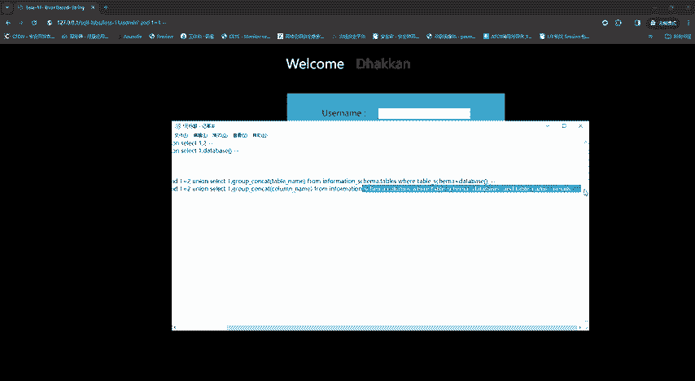

老师又失误又翻车的。以后叫我叫翻车狂魔吧。哎，看到没？I页面 ID那我们接下来是不是什么 ID from users就可以了，它的东西不就都出来了吗？对不对？

所以pos呢它就注入它就不比这个get注入那么难看pos注入直接我们就输入这些东西对吧？直接简简单单好看的很，所以他们的差别，他们的区别呢其实不是很大，数据库注入的方式和形式都是一样的。

都是一个步骤判断注入点查询字段数和那么查询回醒的字段，对吧？所以看到没？然后接下来不就是查询数据库名表明列名查询数据，他们都是一笼统的，只是大家要注意一下，就是编码的一个问题。

因为get编码呢确实稍微有一点点难看啊。

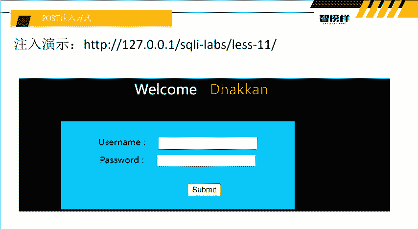

这一个内容呢就讲到这里，大家如果想要去领取资料啊什么的。就在评论区下方领取就可以了。

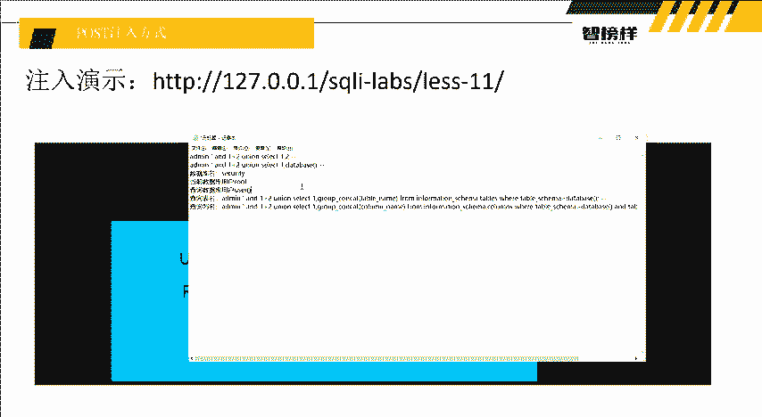