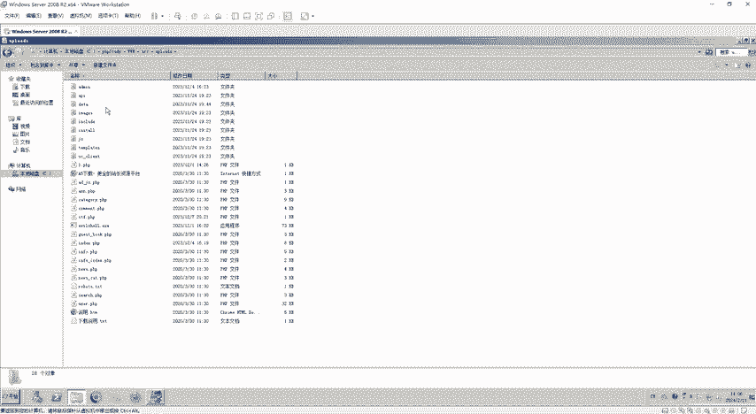
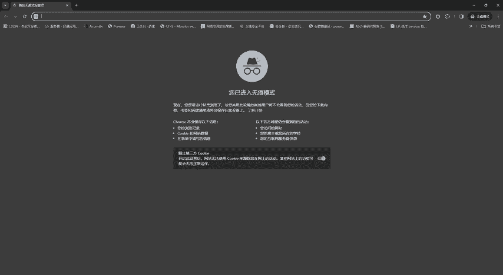
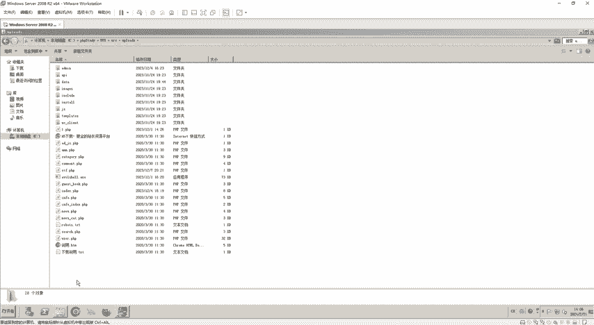
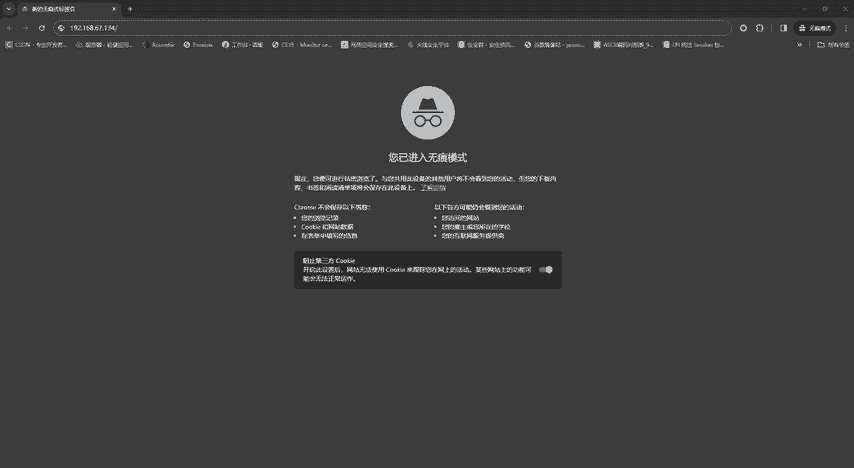
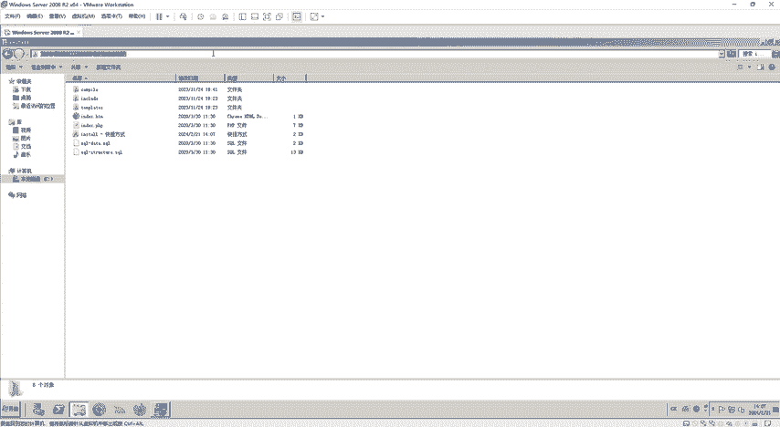
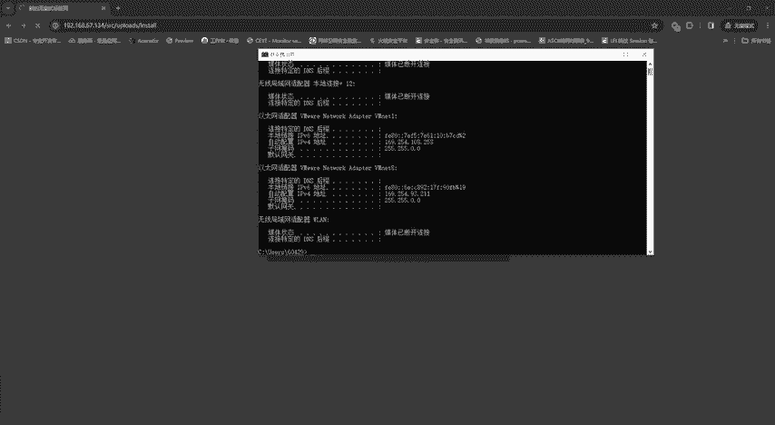
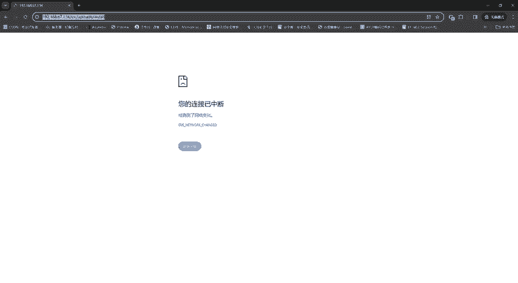
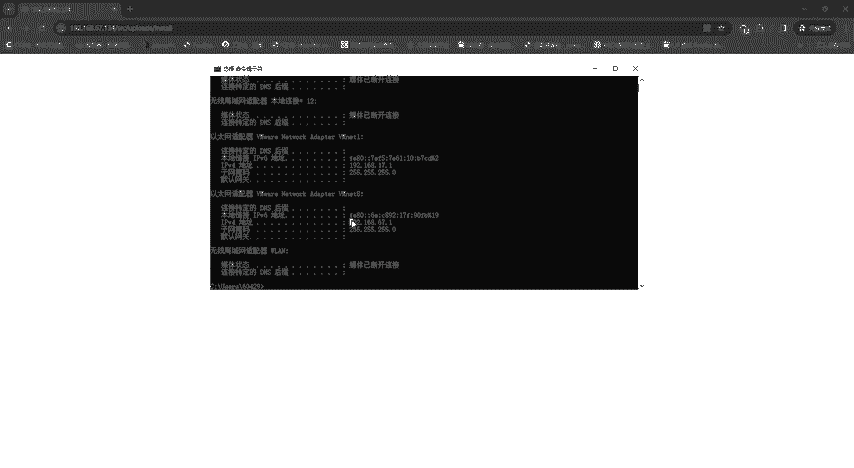
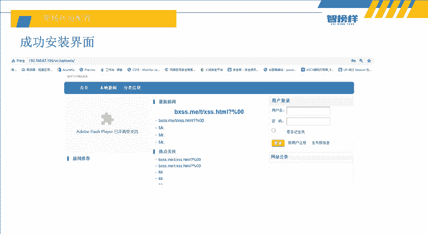

# 2024最新【网络安全／黑客】入门到精通课程教程，包括Kali Linux安装与CTF比赛教程（附安装包） - P20：P7-靶场环境配置 - AI-大模型基础 - BV1SK421Y7kA

大家好，我是方舟。这节课给大家带来的内容呢是靶产环境配置。因为在上节课我们已经讲完了哎收口注入和中的poss的注入和get注入。他们一些简单的一些注入类型。我们已经给大家讲讲完。

那我们接下来呢就直接搭建靶产进行实操。那么这节课讲的就是我们的一个环靶场环境配置和我们的一个实操实战的目标和过程。然后这里呢是实验环境，里面是靶机windowsserv200822。

然后它的IP呢就是192。168。67。134，还有我的攻击机，就是老师这台本机，然后以及耳机环境就是blue cMS为什么要选择这个blue cMS呢？因为它比较脆弱啊，所以就选择了blue CMS。

然后呢，我们的实战目标是第一个。是由N map简介，然后获得它的运行服务扫描以及。第二步扫描目录，然后到后台第三步就是包括账号密码。第四步就是CMS识别和漏洞搜索。还有第五步就是搜狗住入口的账号密码。

因为大家可以看到，就是我们这个实战目标123456，其实它分了两种。具体来说就是从我们。获取到这台这个blue cMS的竞单系统的后台账号密码登录到后台，它分了两种方式。第一种呢就是从我们开始的嗯m。

然后端个扫描，然后再扫描目录，然后再进行包破，这是一种方法，以及我们利用了我们自行学习的搜后注入。和一些CMS识别来获取它的账号密码。那么我们接下来呢就可以看一下，分了两种方法，对吧？

一步、两步、三步、四步、一步、两步、三步，对吧？所以。这里呢就开始讲解讲就是我们如何进站。因为我们用的进站呢，还是之前课程的PHB study来进行进站。然后。第一步它还是解压blue s这个压缩包。

然后呢再将解压出来的数据包放入PHP study底的这个3W目录下面。对吧因为3W目录就是它进站的一个目录。所以我们把解压出来的安装包放到这个目录里面，然后开启PHP study。

然后这个PHP study这个PHP版本呢一定要是5。2左右。因为呃版本高了的话，它有些时候会报错，所以就是5。2。17，我实是选择了5。2。17，就是正常没有任何的报错。然后我们。开启之后呢。

就直接访问这个目录下面的一个inst文件，然后一直点击继续就可以了。然后成功安装界面就是这么一个样子。因为这里呢是老师进行了一些测试啊，这里一开始都是一些白的，没有的，需要大家自己评价的。

那么我们这个步骤看完了，我们就来进行实操一下。这里呢就是用了老师的一个虚拟机，这这个windows2008嘛，对吧？然后第一步呢，就是按照之前讲的那种，就是不CMS有个VIP，然后把这个。拖出来对吧？

把那把这个复制一下嘛，对吧？复制一下复。粘贴哎，就可以把这个。文件夹给粘贴出来，因为这里老师是已经解压了哦，已经解压了，看到没？这里已经出来了一个，但是老师已经解压了。

然后大家第一步呢就是把这个放到这个PH study的3W目录里面，然后放到这里面，放到这里面之后呢。就开启我们的这么一个PHB study。然后开启PHB study之后呢，因为大家可以看到它的这个。

它的这个目录目录里面有一个什么up grade和upload，我们要进入这个upload里面，然后有一个什么inst文件夹。这个访问这个inst文件夹的目的呢。

就是那这个进站系统自动帮我们安装数据库这些东西，所以我们就干嘛呢？就访问嘛，因为我们的IP可以看一下啊，我们的IP看一下对了没有？

IP configurefi configurefi configurefi可以看到我们的端口是我们的IP地址是192。168。67。134，对不对？所以我们就直接进行访问就可以。

可以直接去进行192。点点168。192。168。67。134好。可以看到我们的目录啊，我们的目录67。134就是在3W目录里面，然后要进这个S2RC这个目录，然后再进upload这个目录。

然后再进instyle，所以我们就要复制什么复制。

这个S2RC upload和ext这个路径放到这里。

稍等一下啊，老师这里有点卡，我看一下看一下老师的IP对了没有？I比卡这个。哦，没有对，因老是要重启一下IP地址。如果大家遇到这种情况，就是我们的呃这个虚拟机的地址啊，就是这个网络适备接到变成169。呃。

254。93。211。这个时候呢大家就直接干嘛呢？

在这里面更改适配器选项。然后找到这两个，把它禁用。把这两个禁用掉之后呢，再重启一下。然后就可以获获得我们的那个IP地址正常使用了。因为有些电脑会出现这些小问题呢，假这里唉老师看到老师这个方法。

我们也可以刚好可以执行。然后我们再访问一下试一下。

在使用IP看这个。哎，可以看到我们的IP已经变成了192。168。67。1。唉，那这个时候我们反复应该就能访问出来。哎，看到没？

然后呢，直接就进来了这个blue cMS的这个安装程序。然后这里呢，因为我们的这些。虚拟机里面的东西都已经装好了，PHP study也装好了。然后买搜口的账号密码呢。

它就是root rootot啊root rootot如果大家想要怎己去进站，想要这个PHB study的话呢，就呃去到时候去领取资料嘛。好吧，然后就点击这里点击继续好。

那这里干嘛服务器引擎什么阿巴奇PHP这些就是我们直接可读可写，就一直点击继续，然后他会帮你安装安装完成之后呢，因为老师这里已经安装完成了，然后就不给大家演示，安装完成之后呢？他就会跳到这个页面。

这个页面就是已经是进站完成了。然后这里这些新闻啊热点啊，到时候呃你们就是安装录录，就是安装完之后有后台，然后管理员你们就想发布什么东西就发布就可以了。所以就非常简单，这么一个进站系统。

所以这里呢就是这节课的内容，就是这些就是叫我们如何去搭建一个呃网站。然后下节课呢就是。我们的。开始去Nmark警戒了，告诉一下大家这个Nmark怎么使用啊，以及。扫描我们这个IP，然后获得的一些服务。

然后我们再根据这些服务呢再进行进一步的进行攻击。所以大家可以利用这节课哎，去学习一下如何去建立一个属于自己的一个网站。那么这个PHB study和blMS的一些安装包啊，大家可以在呃评论区领取。

