# 2024最新【网络安全／黑客】入门到精通课程教程，包括Kali Linux安装与CTF比赛教程（附安装包） - P21：P8-nmap简介 - AI-大模型基础 - BV1SK421Y7kA

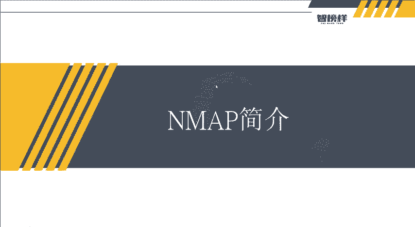

大家好，我是方舟。这节课给大家带来的内容呢是n map警戒以及n map的使用。那么我们话不多说，直接开始n map，它是一种。网络扫描和主机检测非常有用的工具。就是其实在我们日常的渗透测试啊。

或者是在以后做什么项目的时候，我们都可以利用Nmap去对呃目标进行一个端口扫描。然后它刚可以干嘛呢？可以用于信息收集信息和枚举，同时可以作为一个漏洞探测器或安全扫描器。

这个漏洞探测器和安全扫描器呢稍微哦稍微呃。对比于说它收集信息的功能来讲呢，这嗯。路洞探测器和安全扫描器稍微有一点点的小不进大物了。所以我们最主要呢拿Nm是可以用来搞什么，就是搞收集信息端口上面。

然后它的主要功能呢是检测存活。活在网络上的主机。为什么是活在网络上的主机呢？就比如刚刚上节课老师有讲到就是。我们的IP地址有192。168。670134，对不对？那可能我开了其他的其他的呃虚拟机。

那是不是就会有192。168。670128131啊等等这些。哎，它就可以进行一个。网段的一个扫描就可以扫描存活在网络上的组件的可能扫出来就不止一台主机了。然后还有什么警测主机上开放的端口。

就是哎之前老师不是开了80端中那个PHP studyD，它可能我还开了其他的，但其他的端口，它可能又开了其什么服务，对吧？然后还有什么警测到相应的端口服的软件和版本，然后警测操作系统。

硬件地址以及软件版本，还有警测脆弱性的漏洞，这个就需要m的一些脚本啊。那么这节课我们主要讲的呢，就是哎警测。主机上开放了端口，然后呢，还有什么活在网络上的主机，这个可以给大家演示一下。然后呢。

它有很多的那些参数，就是说干大A综合性扫描杠T4就是指定扫描过程中使用的程序，它有6个级别012345，然后级别越高扫描越快，因为但也容易被防火墙或者IDS警测屏蔽。因为在扫描的过程中发的量是非常大的。

如果他使用扫描过快，可能就会有那种防火墙啊，这种入侵警测工具觉得。这好像不是人操作的吧，对不对？所以他就会把我们的什么把我们的屏蔽掉。

然后还有什么干O指定N mark进行呃系统版本扫描赣SV指定让N mark进行服务版本扫描干P指定扫描端口等等。这些它有很多。但是呢我们今天呢就只它也可以直接不用参数直接进行扫描。然后。

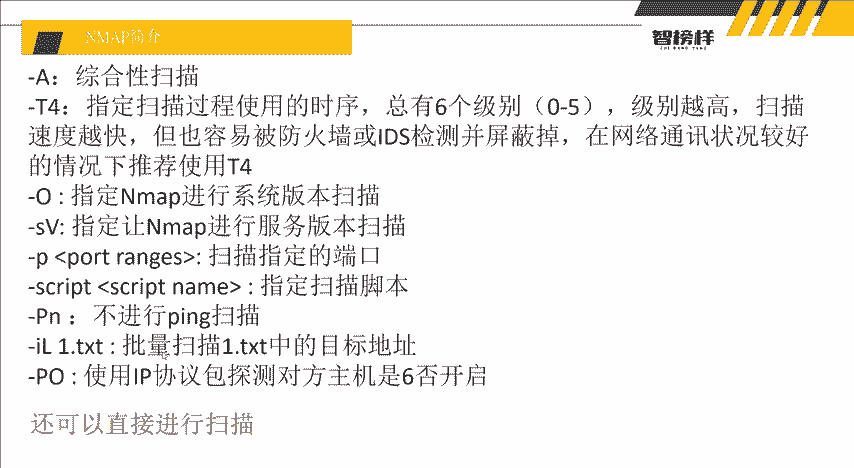

这里呢它就有容一例例子，你看就扫描出来这么多东西。然后那么呢我们讲解了这个Nm它扫描，为什么它大家可能会想为什么它会放在第一节，就是放在第一节来讲，呃，这里我告诉大家是为什么？

因为在呃真正的就是渗度测试的过程中，我们是不是要一步步的对目标进行一个信息收集啊？这个其实就是信息收集的其中一步。那么。

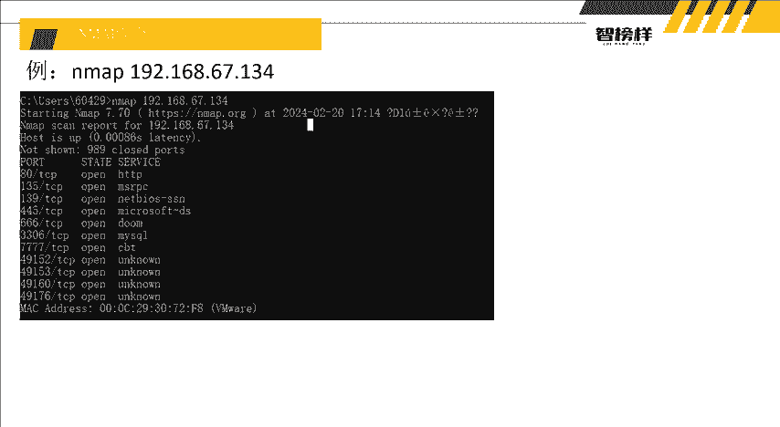

其实老师简个举个简单的例子，其实我们这个渗透测试啊，然后这些实操其实就跟我们的什么找找女朋友差不多。不说找女生吧，就是找不说找女朋友，就是呃接触接触喜欢的女生，对吧？其实他有很。很相信大家可以想到。

就是假如啊假如我喜假如我喜欢一个女孩。对吧但是我想去我想接触的。我想跟他在一起。那我要跟他在一起的话，我什么都不知道，难道我直接跟他说，请做我女朋友。那我是不是就变成了小丑，对吧？

所以那么我想要跟他去接触，从而让他嗯变成。我的女朋友，我是不是要先了解他喜欢什么，是不是要了解。女孩。喜欢什么？对不对？那比如说他喜欢吃喜欢吃炸鸡汉堡，喜欢喝奶茶。然后还有什么还有什么呃。

他喜一些小癖好啊，喜欢一些运动啊等等这些。那是不是要一步步？的了解女生女孩，万一他可能他喜欢女的呢，对吧？万一他不喜欢男生，那你是不是就你是不是就不能跟他在一起了，你就在一起不了了，因为他不喜欢，对吧？

所以你是不是要了解女孩喜欢什么，他一步步进一步的了解他可能到后面女孩就是说。哎，好像我们还很很合得来，喜欢的东西都是一样的，那我就被你搞到手了嘛，对不对？其实生活测试也是一样的，就是我们一步步哎端口少。

目录扫描，然后就疯狂的发现网站的一些呃开多开放的端口啊，开放的服务啊，然后还有目录扫描，因为他可能我们看这个目录，看这个网站，我们点一些东西，好像出现的，好像也没出现后台吧，他不可能把后台放在后面吧。

不可能把后台放在上面，他是不是也会稍微做一点隐藏，我们是不是就跟找到后台，万一我们去进了他的后台呢，那是不是也可以把网站拿下来，对吧？是不是就跟这个哎干嘛追女孩是一个差不多一个道理。

所以啊话不多说我们就开始呢就先用Nmap来进行一个。

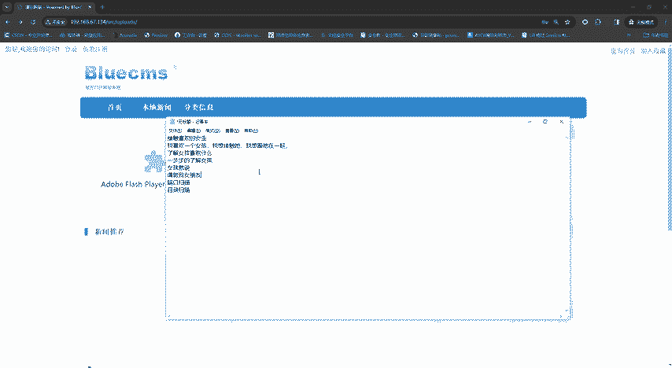

扫描。第一个呢就是之前给大家有讲到过的，就是。检测网络上存活的主机，对吧？nm的这个功能呢就是它可以扫网段，刚刚老师有讲到过，对吧？那扫网段如何扫呢？就是定六期，因为我们这个是六期的网段点一。

然后干嘛一个。斜杠，然后24。行个24呢，它就在网络中就进行一个扫描，在扫描的过程我们就可以等待一下。因为嗯这个NM map的网段扫描呢，通常是在渗透测试的过程中是作为内网。

就是比如说我们从一个网站攻击到别人的内部了。那他的内部是不是会有很多的一些电脑啊、机器啊、服务器这些。那他们要运行在公司内部的话，他们都会获得一个什么获得一个IP地址，他们可能是同网端的IP地址。

可能我们找到1个IP地址，又有一些网卡。他他一些电脑会有两张网卡，对吧？哎，可以看到什么？有呃扫描到了什么。192。134看到没？他有扫描到192。134，但是他没有扫到其他的。

因为呢为什么没有扫到其他？因为老是只开了一台192。134可以看啊，可以给大家看一下，我只我干嘛呢，我只开了一台，虽然老是有很多台虚拟机，但是只开了一台，只开了一台，所以他扫他只扫描到了一台。然后呢。

他还进行了一次单独扫描2。

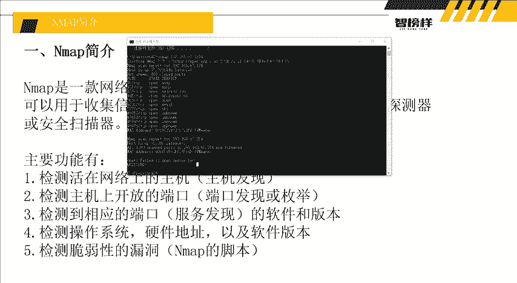

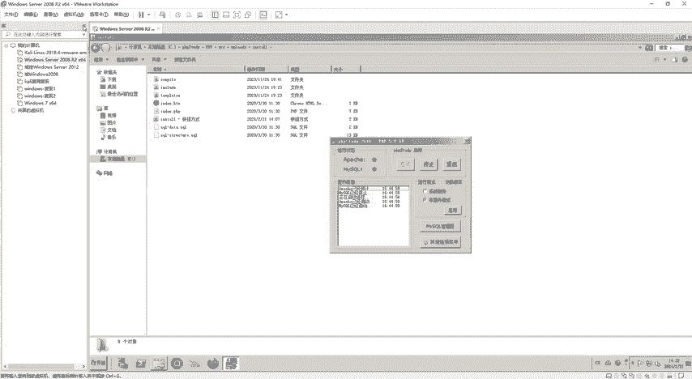

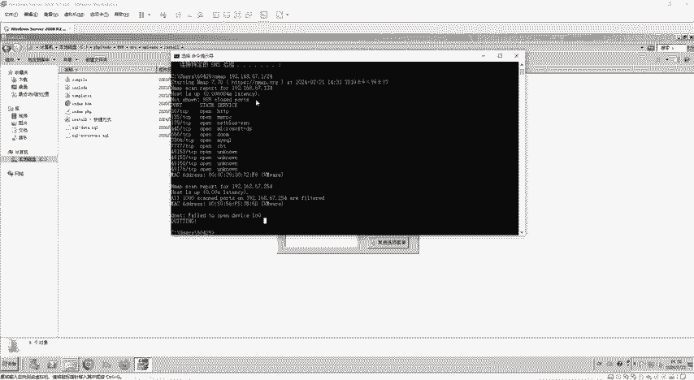

然后这个端口扫描可以看到它扫出来什么东西啊，扫出来了什么呃，他放了80端口，然后135端口，还有139端口，135端口跟139端口，还有什么445端口啊，666端口啊，然后还有7777端口啊，对吧？

还有3306端口，你看它后面都写了什么HTTP服务，开了什么什么服务，然后还有什么买搜口服务，然后还有什么49152，这个。

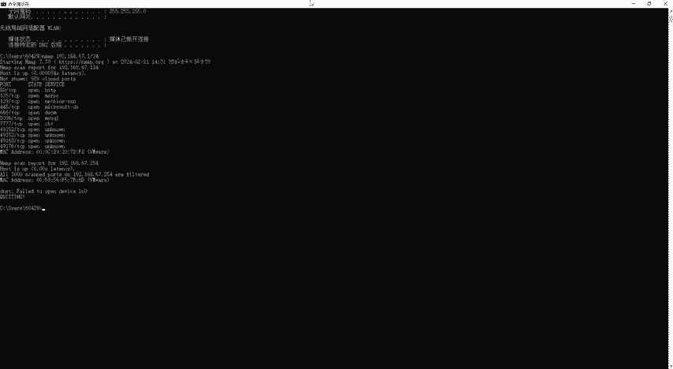

哎，我都不记得我开过。对吧？而而且他还看到什么m克m地址，还有它是什么we word，他还讲出来了，你是虚拟机。对吧。所以他还是非常有灵性的，非常有灵性。的这么一个呃嗯m还是非常好用的。

所以你看我们比如80端口对吧？192。134的80端口，我们先访问嘛，我们先192192。13480端口，是不是就是这个？

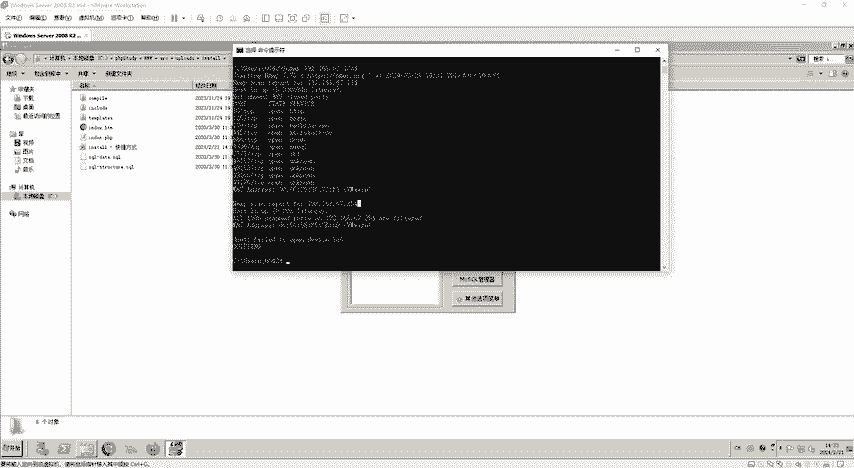

哎，看到没？我们进来了，然后有个S2RC，有个upload是不是就进站了，对吧？我们就一个个看嘛，因为他开了很多端口，像这种135啊，135应该是嗯。不知道进展哎，你看没有吧，没有，我们就一个个看嘛。

445啊，139这些还有666啊，666是什么，我也不太清。

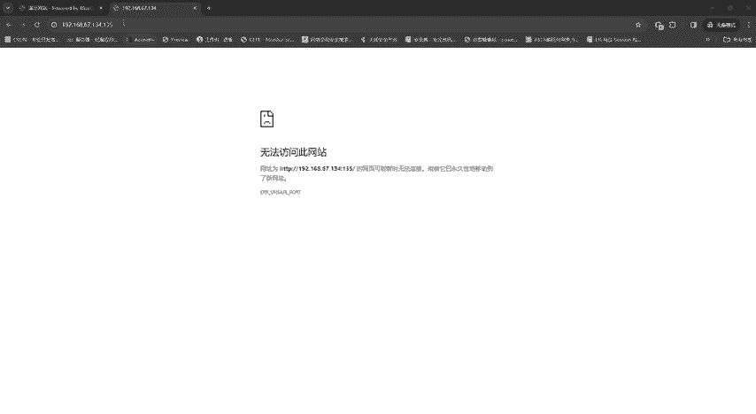

哦，666是业务管理系统，看到没？对吧？这个哦应该是老师在做其他的时候找不到自己做的一个系统，看到没？我们现在就做了一个业务管理系统，从在666端口里面找到，对吧？之前。我好像没有进站过这个系统。

但是也找出来了，是不是是不是又多了一个系统。那我们在对我们这个目标13192。162。670134进行渗透测试的时候，是不是又多了一个目标，之前是blue，现在又多了一个业务管理系统，对吧？

然后还有什么33063306呢，还是买收口的数据库，看到没？他还告诉你了，我开了3306端口，然后是S数据库，然后还什么77777777是？

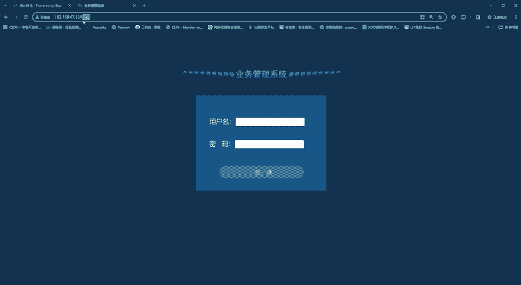

啊，这是密幻，看到没？这是蜜罐智能反真诱补系统，然后还有什么49152啊这些。一个个看吧，因为他你看他开了他不知道，然后我们就一个个看，这样我们是不是就找到了三个系统了，对吧？就找到三个系统。

那么我们今天的目标呢还是最主要是什么？它的原本的那个阿里统。

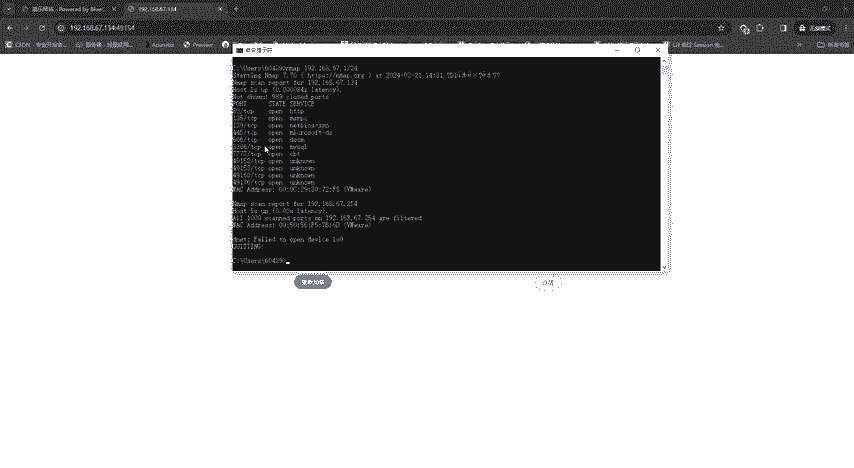

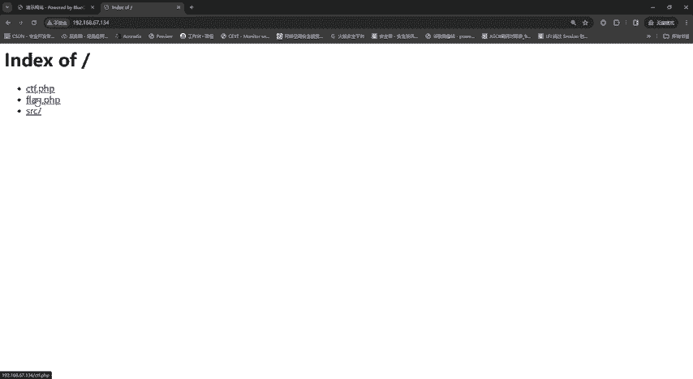

所以我们m大家可以看到，就是我们第一个扫描到它之后，我们找到了什么，因为它扫出来了这个134嘛，然后我们知道了它有三种80端口，它开了一个是blue cMS。然后还有什么666端口开了一个内容管理系统。

然后还有7777是一个密罐的一个登录系统，对吧？我们现在就知道了它开了三种，是不是？所以而且还知道了什么，它是虚拟机memo，那都给你成型了出来，所以m呢它是一个非常好用的一个端口扫描的工具啊。

就是信息收集是无论是在呃对外进行渗透测试，以及对内进行内网的进渗透测试。这个map都是十分好用的，所以这节课呢基本上就是呃讲解了这个m的利用方式。然后后续呢就是进行一个目录包破，然后目录扫描。

那么大家可以去跟着老师去自己搭建环境，然后进行一个什么对目标进行一个扫描使用啊。当然就是呃在扫描的过程中，不要就是非法对一些呃已经。建立了网站的呀呃这些不要未经同意，还是不要去进行扫描。

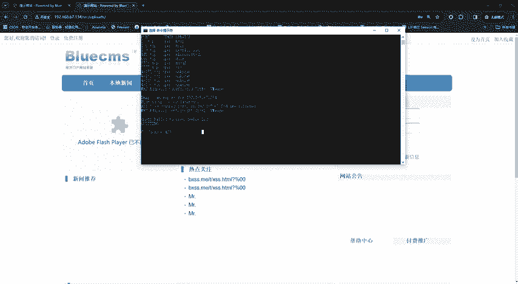