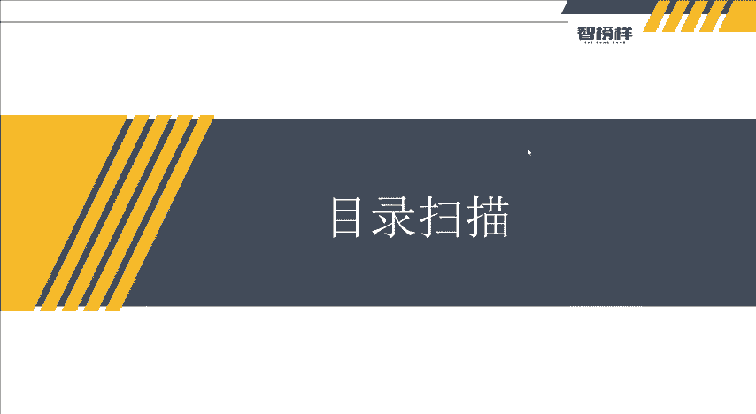
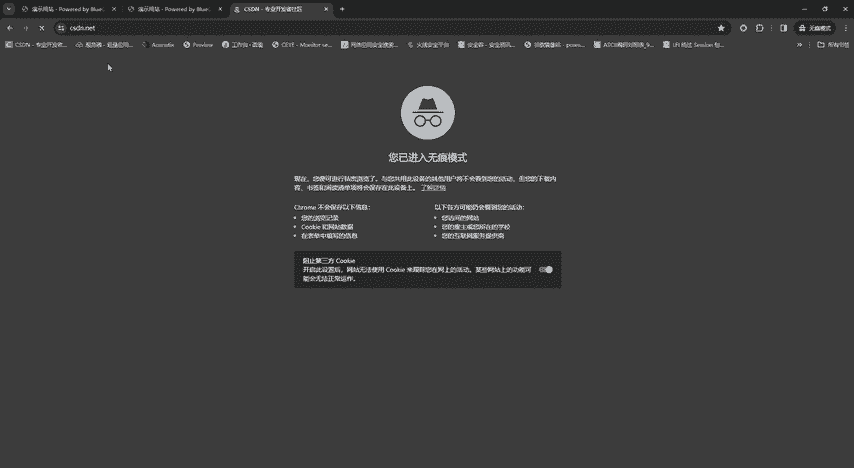
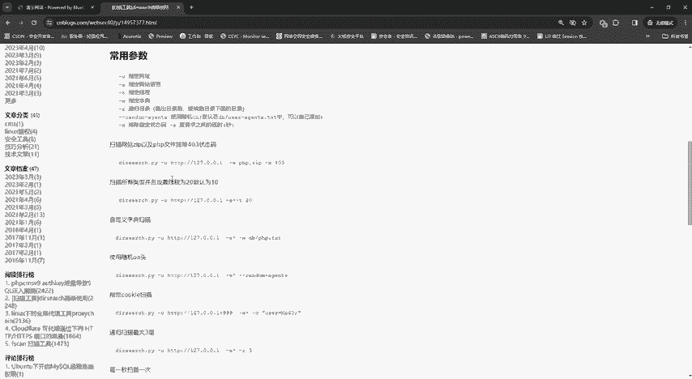
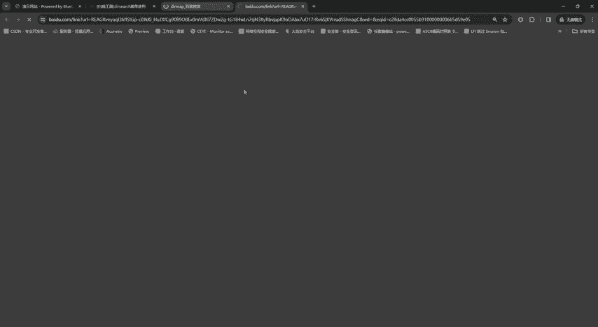
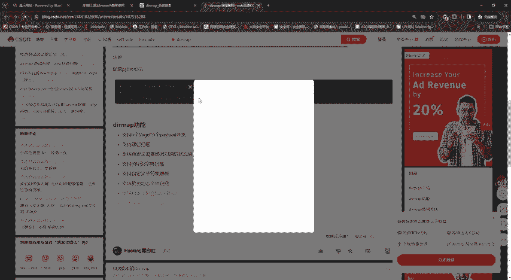
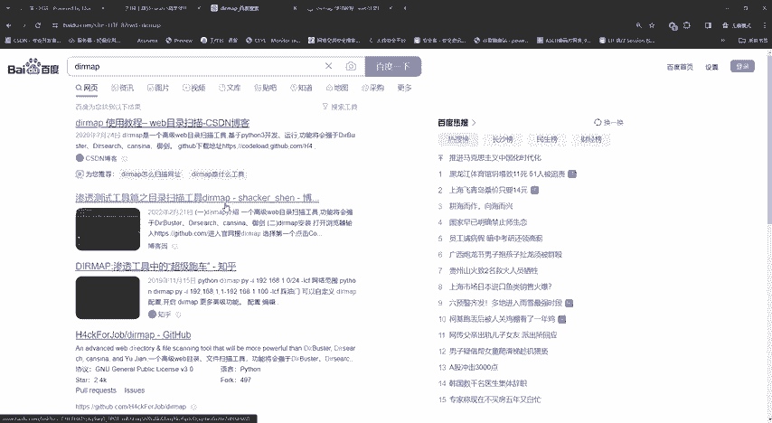
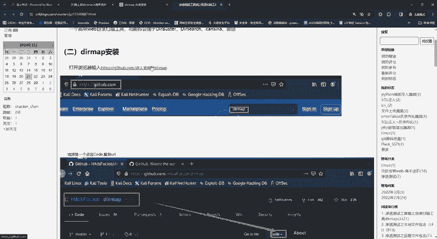
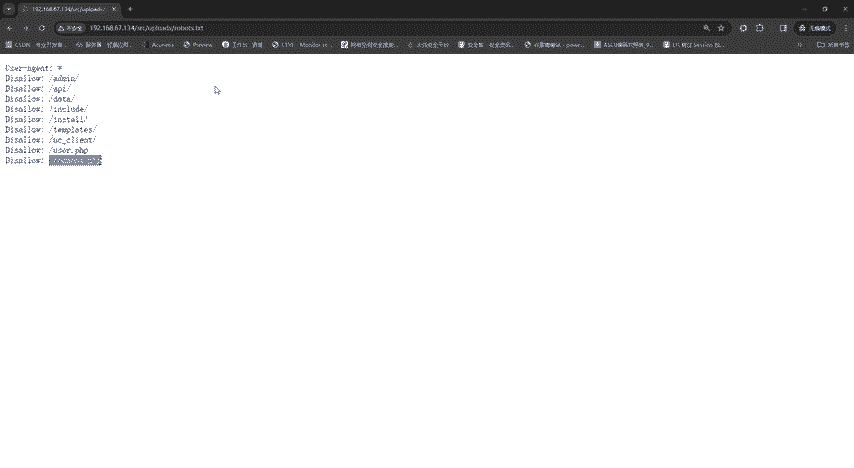

# 2024最新【网络安全／黑客】入门到精通课程教程，包括Kali Linux安装与CTF比赛教程（附安装包） - P22：P9-目录扫描 - AI-大模型基础 - BV1SK421Y7kA

大家好，我是方舟。这节课给大家带来的内容呢就是目录扫描。然后呢目录扫描呢其实在我们渗投支资的过程中是一个必不可少的一个呃阶段。是为什么呢？是因为。大家可以看到，就是我们无论是。

寻找什么呃网站测试什么网站，大家都可以看到他们都没有后台给我们，对不对？

也没有一些呃小小东西，小目录啊，你他们都把这些有敏感信息的，或者是稍微有一点点呃重要的一些东西，它都隐藏住了。其实给我们展示的呢都是一些呃。正常的一些页面呢。

还有这些影视网站以及像这种像比如说我们4S店N，我们我们不可能访问到他的一些管理员后台吧。他是不是只给我们看这些嗯。信息啊对不对？一些博客啊这些信息他不给我们看到管理员。

因为管理员只有他们呃公司内部的人能登录，并且基本上才能访问，对不对？那他是存在于这个网站里面的。所以我们目录扫描的就是经过。一些工具的一些扫描，从而发现什么发现它的一些敏感的目录，然后从而我们进去访问。

可能我们就找到了他的一些后台敏感的敏感的信息啊等等，这些他都有，对吧？所以呢接下来呢我们就讲解一下目录扫描它的。一个呃基本的功能和。能做什么？然后目录扫呢它是一个网络安全和渗透测试方法。

其目的是通过访问目标网站的目录来查找可能的管理后门啊。就是我之前刚刚说的呃，管理员后台，还有呃确定网站使用的组件以及了解网站的整体结构。然后具体来说呢。

目录扫呢它是可以帮助安全专家发现目标站点中存在的目录数量页面数量，从而对网站的整体结构有一个清晰的认识。此外，这里通过目录扫描可以发现敏感文件，后台文件数据库文件。

因为这些呢其实在我们上透测试过程中是屡禁不醒的，是真的会发现这些数据库文件，后台文件，还有甚至是他一整个网站的源码都有可能是进行发现。所以呢。目录什么它是一个非常重要的一个环节。那么在目录什描工具呢。

它有很多，它不是唯一的，还有什么气Bcan啊，还有嗯。the research啊和dmark预镜上的工具等等这些很多。那么。这些怎么下载呢？就比如说是像这种呃DR设计。

DR设计的DRm它是是最近它是命令函形式的，然后是基于python3，然后这两个目录扫描工具是近期是相对来说比较火的。然后这里可以给大家说一下DR设计的这个扫描工具呢。

因为我们下载那你看这个python扫描的工具，然后什么安装，哎，我们就输入命令。因为我们要知道这个DR设计这个工具呢，它是基于python开发，属于它的它没有GUI页面，就是它没有我们像这种页面。

它是直接就是打一个命令函出来直接执行的这种就是像这种。没有，就是可能就在这里面输一个什么命令python，对吧？这里有什么python3，然后DI设及PY这些他们就没相对来说没有那么好看。

然后呢可以看到呃它能干嘛呢？多平台多线程保持连接，然后还支持HTP代理呀，很多功能，然后还有什么。它有也有很多参数，然后什么干U指定网址啊，干一指定网站语言。因为之前老师有给大家讲到过。

就是它的一些网站，嗯，它可能是PHP键的，也可能是呃java键的，也可能是ASP键的对吧？这网站语言，它就可以指定还有指定性程，就是速度嘛，速度快不快嘛，还有指定的字典啊，还有递归目录啊。

就是跑出目录之后继续跑。下面它是否存在哪些目录。还使用随机UA啊，还有什么干叉排除指定的状态码，像状态码有很多像那种200403404，还有503等等这些。那还杠S请求延时多少秒，对吧？

这里它都有非常非常多的功能演示。所以大家呢如果想要只嗯使用这个DR设起这个呃也可以就是也可以去进行使用跟DRm它也有啊，对吧？DRm大家想要去看你看高级外部目录什描工具，它也是进python三开发。

然后如何下载呢，对吧？这里也它这里也给大家演示过了，然后下载，然后如何执行，然后配置pyython3之后呢。

这里然后大也讲了功能还要钱，没事，我们找不要钱，反正都是一样的对吧？然后直接在geh里面去安装。

下载好之后呢，哎我们就直接可以进行扫描了。所以它模块还是非常多的。这里呢因为网络上有非常多的这些DR设计DMMDRm这些工具的一些安装啊，以及使用教程。

大家如果是用呃这两个呢哎就直接搜索这几个网址去自己去安装下载一下。因为老师这里呢就不一一举例了。对，老师就用什么一个相对来说比较好看的一个TP scan这么一个。那目录扫描工具，大家如果。

想要这个工具呢去领评论区下方领取资料就好了。这里呢这些工具也会发送给大家。当然如果想要这两个呢，大家就去网上去找一下资料，进行对自己的网站进行一个扫描就可以了。好，那么。这个TBcan呢。

我们就把它找出来。稍等一下。这前机是在ok。可以看到切皮C干就在这里了。然后它这里呢它有什么功能呢？它非常的简单粗暴啊，就是这里。它这里呢就可以它也可以什么隐时扫描，其实它功能都差不多。

而且这功能还比它好看一点。然后还可以针对针对这个目录啊，就是扫描它可以精进隔多少秒，这里它可以也给大家展示的，也可以看启用还是不启用，不启用的话，你就直接让他扫描。然后扫描目标呢，你就不用输命令命令了。

然后你可以看到呃老师的这个。地址是这个对吧？复制粘贴就可以了。然后它有多UL扫描。多UL扫描呢，就是我们比如要导入URL，就是我们把我们想要扫描的工具的网站啊就放到一个什么一个T叉T里面把它导入，唉。

把它导入进去就好了。但是呢这里呢老师就被隐声用只有一个网站，对不对？所以我们复制。粘贴粘贴完之后呢，它有自定义，它自己有那个呃置顶啊，他自己有这个置顶。这里大家可以给给大家看到它这里有置顶。

有自己的一些字典啊，自带的这些字典都是自带的啊，然后还有一些。看到没？它有非常多的置顶，这里都是自带的，然后这里也可以选择这个置顶类型，然后还有什么ASP进湛的系统，然后还有什么PHP进站的ASP叉。

然后什么JSP这些它都有，以及什么还显示的结构状态码，它执显示200反映200的和3开头的对吧？还有403403就是拒绝嘛，对吧？还有自定义，这个也可以。那还有切换加载DOC这个选择的置顶呢。

这些这里呢大家就是可以选择自己想要的。如果自己，大家自己有嗯一些置顶的话，你也可以选择外部的置顶，让它自己输入进去就可以帮你跑了。所以它还是非常一个非常简单的。然后在这里哎老师就直接切换。

直接勾选就这个配置，它自带的，然后可以就直接点击开始。这里可以看到它就直接在进行扫扫描了，对不对？所以我们现在干嘛呢？我们现在呢就去旁边抽根钉，对不对？或者是呃去呃吃点东西，对吧？等他扫描完就ok以了。

我们就一一看一下，他就干嘛，对吧？做心做一些自己喜欢开心的事情，对不对？我们就在等它扫描。然后可以看到它读取字典码有1667个路径，然后呢，活动性成数是30，然后他就在一一的对网站进行一个扫描。

我们就在里稍微等待一下。其实目录扫描呢。他待会儿出镜来说起，它还有一个动能，就是你点击它，它就可以直接进行访问或者是右键复制，它也可以唉可以看到它已经出来了，好像出来了很多唉，对吧？然后这个403呢。

大家就不用看403它拒绝拒绝访问，所以呢我们就不用看这个红色，我们就看这个蓝色的。这里稍等一下啊，他还在还在还在扫描。然后我们扫描完成之后呢，我们就一个个看嘛，对不对？

一个upload databe对吧？我们右键就是鼠标定对着它按一下右键，好，右个复制。点一下复制就访问呗，对不对？就很简单。哎，他说他没有找到对吧？没有找到就下一个，没事，问题不大，对吧？下一个。

他没有就唉，这个他也没有没有就继续嘛，就继续下一个嘛，对不对？就像唉可以看到呢，它好像出现了什么后台管理系统管理中心bl如CMS我们是不是找到他的后台了，找到他的后台之后，那我们待会儿的是可以干嘛呢？

是不是就可以尝试找上的账号密码，对吧？他。但是张密码爆抛呢，它有一个很好很好的一个。想法啊就是有很好有很好一个说法。这里呢你可以看到就是它是输入的用户名和密码有误。

但是我们第一步是不是要寻找到用户名这里呢？这这里爆括呢就留到我们下一节课来讲，这节课呢我们就讲一下我们的这个目录怎描，然后讲完。看到没？an还有什么呃rots，这些T叉T对吧？

这个T叉T我们也可以访问一下哎。他好像出现了一很多目录啊，对不对？这些目录我们是不是都可以连接一下，然后还有什么inc啊，然后什么安德米啊。

这个instyleinstyle是不是就是之前我们要这个安装程序啊，但是像正常情况来说啊，就是我们进完站之后，这个安装程序是会取消掉的，就是我们网站是访问不了它的。

就是我们一些呃外部访问的人攻击者是访问不到的。那么如果他的访问呢，他是不是可以把整个系网站都重装了，对不对？那这个危害是不是非常非常大的对吧？然后还有什么还有什么imim image它应该就是图片嘛。

对吧？他看唉它不会写不会写算了。然后这里还有很多啊什么tamp啊，API啊，user啊，看一下这个user嘛，对不对？你下这个user。像这个user哎就是注册对吧？

然后还有什么呃comtcomt影片去看成是什么，哎，也不回信，看一下有名代码，对吧？我们这些都一个个看一下，哎，我们目标是不是找到了，找到一个呃那个。管理后台对吧？

那我们下一步是不是就可以尝试进行包括了，对吧？所以这节课的内容呢就是讲解这个目录扫描的一些功能。然后那么我们下节课呢就讲一下这个如何去进行一个报告。

