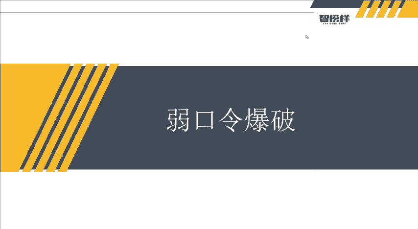
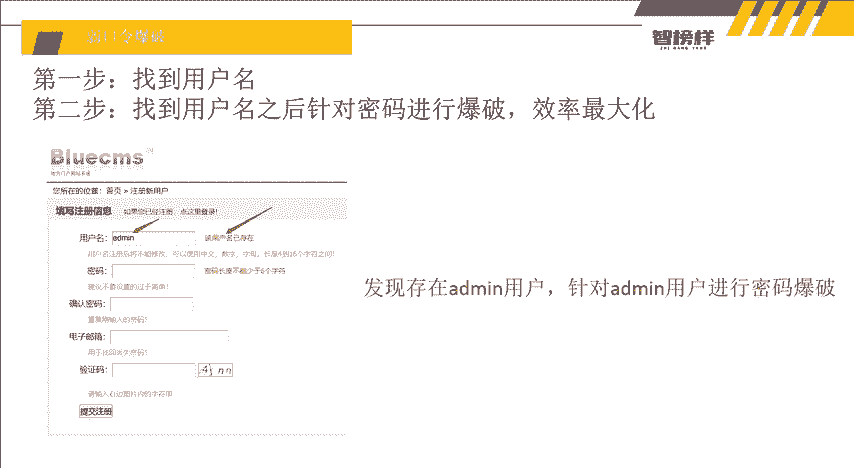
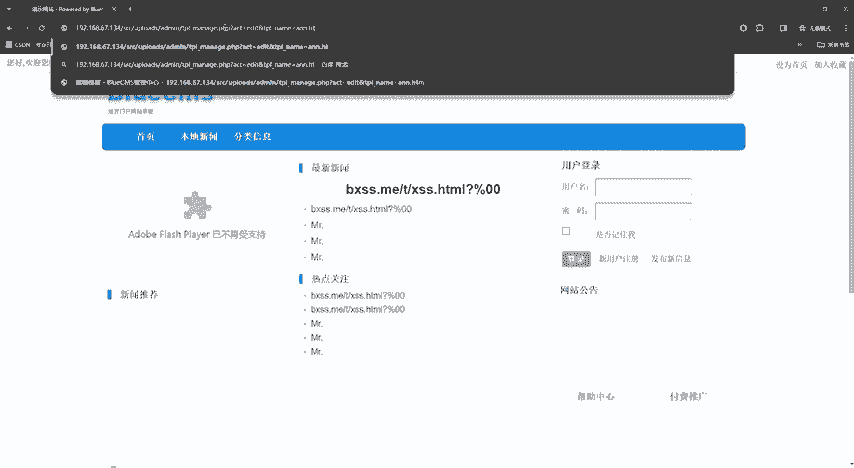
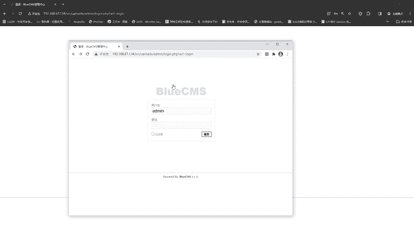
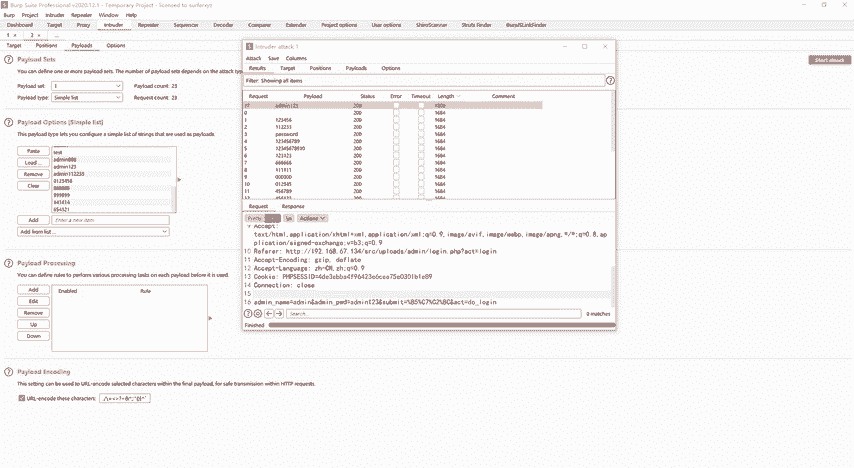
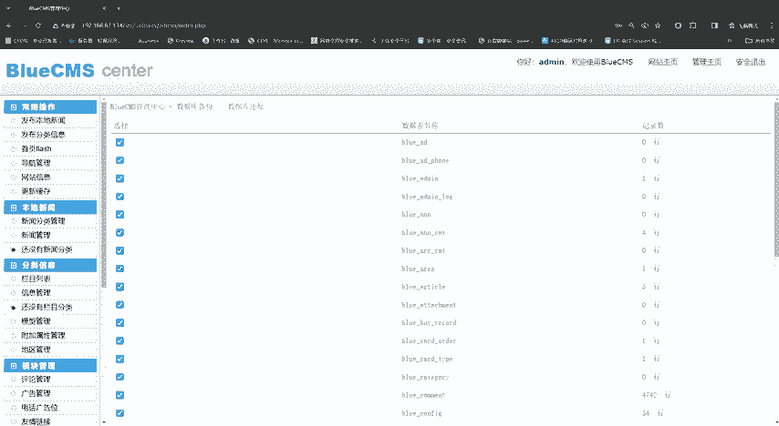

# 2024最新【网络安全／黑客】入门到精通课程教程，包括Kali Linux安装与CTF比赛教程（附安装包） - P23：P10-弱口令爆破 - AI-大模型基础 - BV1SK421Y7kA

大家好，我是方舟。这节课给大家讲的就是绕口令爆破。之前我们上节课讲到了，我们找到了他的后台管理系统，对不对？那么我们之前输入了一次他的账号密码，但是好像显示的是什么呃，输入的用户名有错误。

那么我们第一步呢？是不是要找到用户名，然后再根据找到的用户名之后，针对密码进行爆破。那。事情是不是就会非常的简单，就会变得我们只包括一个比包括两个要划得来嘛，对不对？

所以我们第一个是不是要找到有哎找到用户名存在的地方，看到它显示的用户名存在，我们是不是可以针对这个and米的用户来进行包破。那么如果我们只找到了这一步的话，那么我们是不是又要爆破and着米的账号。

又要包破呃密码，对不对？所以这个效果呢就会变得四倍公半。那么我们找到了其中一个呢，一个点哎，我们找到了用户名，那我们呢就跑密码的时候，我们就是不是就可以直接。整对爆破效率就给以最大化。那么我们如何呢？

在这里呢我们可以。

看一下。就是因为我们呃在之前找到这个andme的后台的时候呢，大家可以看到啊，就是我们输入andendend，然后他输入的用户名和密码有错误，对不对？那么我们退回来，退回来之后，我们就找有其他的嘛。

对不对？像什么嗯用户登录and and me。

呃，系统用户组不能从前台登录。然后那我们再换点其他的root。您输入的用户名密码不对。这里我们是不是就可以找到系统用户组admi，它的用户是存在的，要不然的话它不存在啊，它不存在。

你看我and米123and123哎，用户名不正确，但是我们输入的ad。Enmy， enemy。系统用户组不能从前台登录？我们是不是知道了这个用户名and名。那么这里我们可以找到。

那么我们找一下这个新用户注撑。等一下呢。下一个。看到没？它显示了该用户名已经存在了，用户名已经存在，是不是证明这个用户也存在这个用户还是enemy，我们是不是就可以直接干嘛？

进这个安德米的目录里面去找嘛，对不对？那么我们输入了安德米安德米之后。我们要如何去爆破呢？哎，我们就需要，因为我们爆破不可能一直点了，对不对？一直点多累啊，是不是在想有没有一个自动化，对不对？

自动帮我们进行一个爆破的，有没有呢？它有这个工具呢叫做BURP。仅称BP嘛，对吧？简称BP这么一个呃。抓包工具它是可以抓包的，然后又又可以爆破啊，又可以做非常多的事情。所以唉我们这里就干嘛呢？

因为这里老师是无痕模式啊，无痕模式应该是找不了光的。为什么要弄无痕模式呢？就是因为老师不想给你们看到我的浏览器记录啊。好好，就是唉我们这里呢它这个EP呢它也自带了一个浏览器。

这里呢就在这里在open这个。好，我们点一下点一下之后，它出现了1个BP，然后出现了一个浏览器。然后这个浏览器呢，它就不用我们装任何的插件，我们直接抓包就可以抓得住的。所以大家如果想要这个。

U2RP啊这些。还有字典呢，还有之前所说的目录工具啊，大家到时候去领取资料就可以。里面呢就有老师所说的这些课件以及工具啊，然后。还有什么如果有不懂的一些问题啊，哎，你们都可以来进行一个询问啊。

因为老师这讲的这个像比如之前的搜口注入啊等等这些，那可能只有一个类型，然后还有后续的什么报酬注入啊难度啊这些，还有什么临时注入啊等等，非常多啊，如果大家想要去了解呢，就可以私聊我一下。

到时候我们哎说不定可以带带你对吧？对，然后我们就把这个。访问嘛，对不对？访问好，我们访问的时候呢。换开我们的这个。URD记住啊，这个BURP呢。

它这里有一个什么inter k is off off是关闭的意思。我们点一下on，然后呢输入我们的enemy enemy。然后点G登录。点进路之看到没？我们就抓到包了。抓到包之后呢，我们要点一下右键。

右键有一个什么inter。introber introder这个一个模块好，我们把它放过去好，放过去之后呢，我们把它放过，然后。放过之后，唉，因为大家可以看到这个浏览器自带自这个BP自带的浏览器啊。

我们不用装任何的插件。因为如果是老师自带的浏览器的，它还还是要装一个插件的，这要装这个插件才可以啊。然后把这个浏览器这个BP自带的浏览器，就不用装插件，直接做报啊。然后呢，干嘛呢？

我们就这里是不是发送到这个模块里面。然后这个模块唉。

有一个什么questions点一下，然后我们看了好像有很多的这个并这个指定的对吧？所以我们第一项我们要点一个这clear清除。好，清除之后，它是就变回原样了。然后我们干嘛呢？选中我们想要包破的密码啊。

这里怎么知道它包括密码，我们第一个看ene name一个是enePWPWD passsword嘛，就密码嘛，对吧？如果你不觉得觉得不好看呢，你就选择就是anmy账号上密码是123456好。

我们就选择那个123456的地方进行一个包破就可以了。那我们是不是要把它圈起来，然后点一下这个ADD好。把它训起来之后再点击拍loads拍load呢第一个就是拍load set。

它是自动选择了这个呃simple list，我们这里不用改，然后点什么load load是干嘛读取嘛？读取点加像load，然后老师呢这里有它一个自带的字典啊，这个字典里面我们就选择一个简单的入口令。

然后有还有很多字典啊，如果大家想要的话，这个也可以给大家也是没有问题了。好，打开看到没？它是不是就出出现了很多啊，出现了很多之后我们直接执行嘛，怎么执行呢。开始攻击。start attack开始攻制。

好。点击。啊，它就会自动帮我们的执行。因为但是呢我们要看一下就是。呃，什么request的拍load的tra呃，这sch呢它就是一个返回码嘛，200嘛，对不对？然后好像他们的长度都一样啊。

那我们如何去找到那个不一样的长度吗？因为大家要想一下，我们登录成功跟跟登录错误，它返回的东西不一样，对不对？所以我们了顶一下这个长度，哎。从由少到多，好像哎这里有一个对吧？那么由多到少点一下在这里。

它是不是出现了and123好，我们就看嘛，对不对？看an等于nameene那anTV。PWB等于under米123，好像比他们都长了一点，对不对？那我们就尝试一下呗，对不对？尝试一下ene米。

N6名123。欢迎您回来专线管理中心。好，我们是不是就成功进入了他的后台啊。那我们是不是想发布什么东西，对不对？就发布了什么，对吧？那我们是不是就可以干嘛？这个我们爆括出来了，对吧？强扭的瓜好像也挺甜。

对吧？所以我们又可以干嘛？我们又可以呃添加添加发布啊，发布什么，就是说哎某某某，我喜欢你对吧？这些他都可以进行操作，所以还有什么呃分类评论的内容啊，这些可以删除，也可以拼编辑啊，还有什么会员管理啊。

对吧？你就把自己添加一个会员也可以，对不对？然后还有什么充值中心啊，然后哦还充了30块，啊，充了100块，这些哎你万一你你也可以编辑充值一下，对吧？还还能搞定钱，对不对？还有什么操作系统日志啊。

还有站点管理啊，这些对吧？还有数据库啊哦，还有数据库看到没有？万一我们把它备份出来这些数。是不是都是我们的了，对不对？所以这些都是呃进入后台的，我我们的功能就。一般的多的多的多了。所以。

后台呢是一个就是在渗透测试过程中，呃，在没有找到其他漏洞的过程中，哎，这个后台是一个非常重要的一个目标啊。以上呢就是呃这节课的所有的内容，然后哎大家如果想要这个置顶BP啊等等这些东西，哎。

大家可以找我领取资料。如果有什么问题呢，也虽然不是即使啊不是这个老师视频里面的内容，比如说一些渗透一些小东西啊，对不对？哎，大家都可以去我们可以深入交流一下啊。好。

