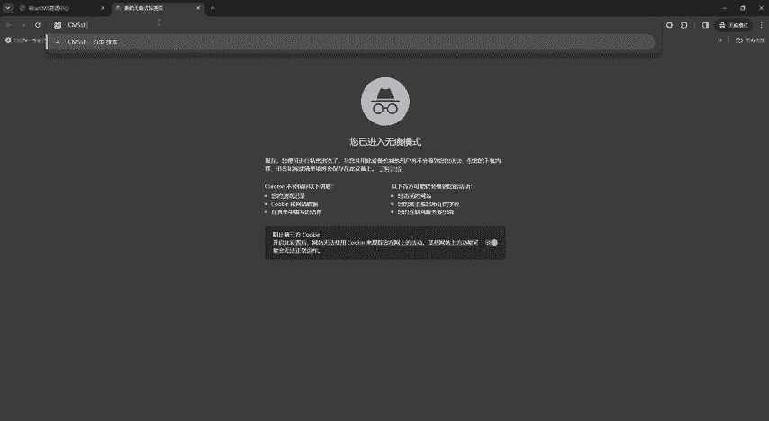
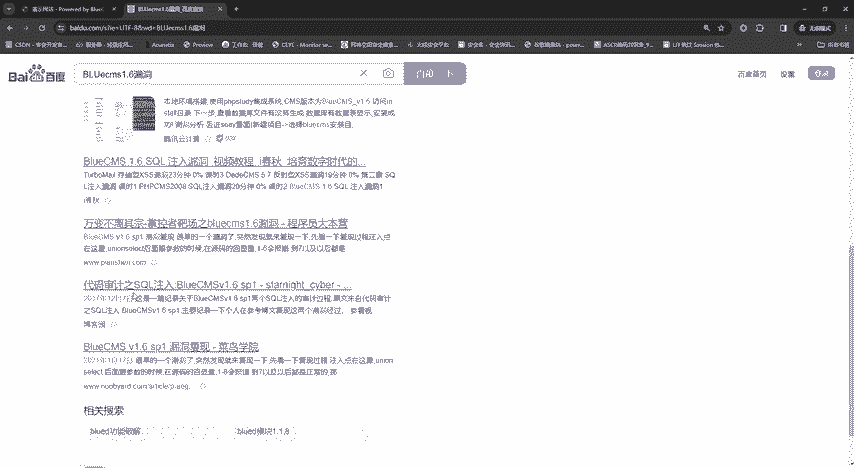
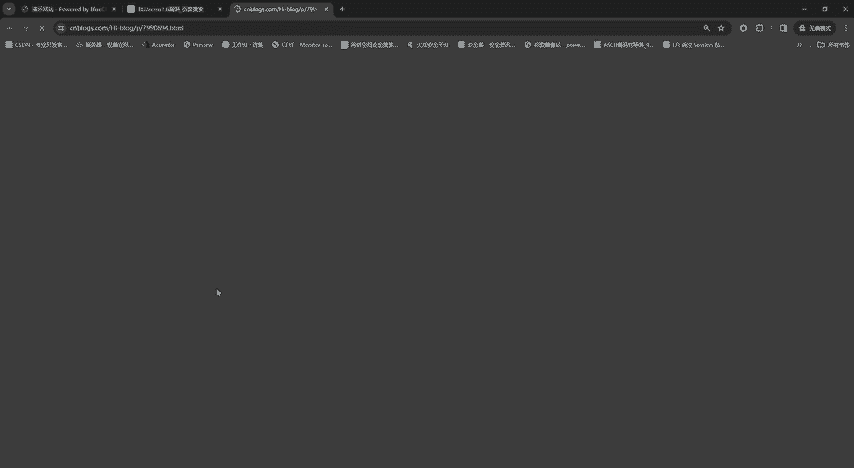
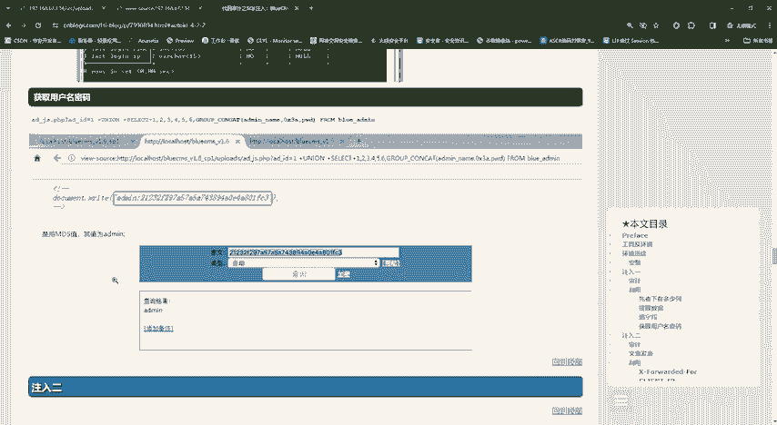
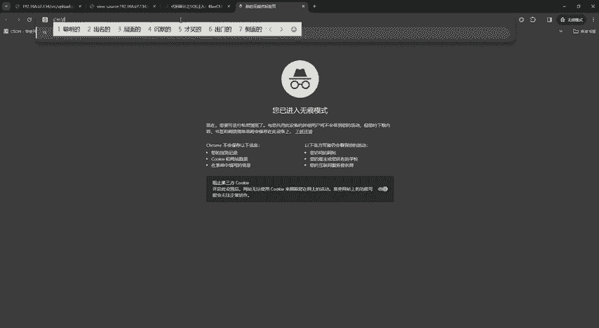
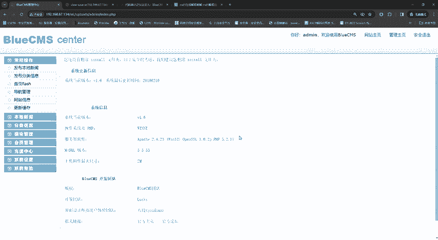

# 2024最新【网络安全／黑客】入门到精通课程教程，包括Kali Linux安装与CTF比赛教程（附安装包） - P24：P11-CMS识别漏洞寻找 - AI-大模型基础 - BV1SK421Y7kA

大家好，我是方舟。这节课给大家带来的内容呢是CMS识别漏识别和漏洞寻找。为什么会讲这么一节课呢？因为之前老师也会讲到就是信息收集嘛，是渗透测试的本质。那么呃之前有讲到什么我们的NR博端构扫描啊。

还有什么目录扫描啊，这些都它也是信息收集的一部分。那么还有一种部分呢，就是CMS识别和漏洞寻找。什么是CMS呢？CMS。它的全称是什么？我们直接搜好吧，它其实是一个进站系统，哎。

统一就叫叫做CMS就是内容管理系统。然后它有很多像什么bluesMS，就是老师进站的这个还有什么D滴CMS还有帝国CMS。

他都是一些进站的系统。这些系统呢就是为了方便，他把这些系统做出来。但是呢因为有很多公司，很多的企业想要去建立网站，对不对？那他经历一个属于自己的网站的话，它一费费时费力，对吧？又要去自主。

你看自主定制自主开发，自主维护网站，然后呢，他又耗费的人力，物力财力都是非常大的。那么为何就是可能就会想着那有没有现成的一些进战进站，有这个就是CMS，它就出现了。那就是一些小型企业，哎。

一个尽力网站的一个东西，就是因为成本不高。然后但是呢我们的老板呢就是看结果，不看过程，对吧？那这个CMS进站呢就横空出世了，就我们就可以拿着别人写好的网站，对吧？就花这么一点点一丢丢迷你，对吧？

一丢丢馒头，对吧？就把这个呃CMS给他搞下来，搞过来之后，哎自己进一下，然后自己把东西改一改，那这个网站是不是就搭建好了，对吧？你搭建的好看，哎，你们你们那个领导还可能还想嗯这小子不错，下次升他为主管。

对吧？所以嗯这个CMS就是这么一他就是一个进站的系统。然后呢，它CMS呢它有免费的，有付费的。这里呢就是免费的呢，它是属于开源的。所以为什么？为什么老师会说就是CMS搜索去识别呢？因为开源免费的对吧？

白嫖白嫖是最快乐的事情，对不对？所以那我们有很多这些开源的CMS呢，就有非常非常多的企业去搭进去用。然后呢，但是这些CMS出现了漏洞呢，对不对？因为它就像我们的呃手机啊、游戏啊，它有很多很多的版本。

对不对？什么1。0啊、2。0啊，那CMS呢它也有，它也有1。02。03。04。0。那它更新版本是因为什么？更新版本一是为了优化网站。二呢二是可能出现了漏洞，出现了一些非常严重的东西，它才迫不得已去更新。

对不对？那是不是。然后那全全国各地那么多网站，他用的同一个它那那他全部都会更新吗？不一定。所以有些有些公司他还是会用老版本，它不更新，所以就会出现了什么CMS识别，把它把这个CMS识别出来之后，哎。

我们去找它历史存在的漏洞，看一下去打一打，对吧？打一打，获取它是账号密码，对吧？所以那么这节课的主要的观念呢，就是告诉大家CMS识别以及漏洞寻章。那么我们如何去识别一些CMS呢，因为CMS它有一些特征。

还有一些特征，有什么特征呢？第一个就是。它的最下面就是有些CMS，它的最下面它是署名的什么嗯power world by blueMS1。6，它会告诉你它是什么CMS的，然后还有什么什么版本。

或者是有些人，有些就是什么pro by什么什么公司，对吧？我相信大家有时候会看到就是唉，他意思就是它是基于什么基于这个公司开发的，因为这里有一点点带宣传的意味，对吧？所以我们第一个。这个就很好猜。

退出登录。然后这个就很好猜，为什么呢？因为它这里看到它是blue section，然后我们划到这下面看一下。不是3个是1。6。哎，我们知道它的blue它是什么CMS进程，知道它的版本。

我们是不是就可以搜索什么搜索bllu。Same asset。1。6都弄。对不对？那他是不是就有很多呀，对不对？像什么后台直接拿需啊，那我们刚刚进入了他们的后台。

是不是就可以获取他的权限并的控制他的电脑了，对不对？那还有什么？还有什么万能密码登录啊，还有什么搜口输入啊，对不对？这种哎，看一下搜后输入，那我们之前学到了搜后输入，我们是不是可以点进去看一看，对不对？

这些都可以点进去试一试，就看一看。然后万一他有开漏的，然后万一他打成功呢，我们是不是就直接。

不会吹非之力把它拿下来，对吧？是不是又可以摸鱼几分钟了，是不是？所以看到没？这个那么有些网站它非常非常的方便，可以看到它。它是有什么进展的对吧？但是有些网站把这些删掉呢，你怎么看呢？对不对？那这里呢。

有一款专门的就是识别识别CMS的啊，识别CMS那这个东西是什么呢？这里我给大家找一下，有这个工具，然后这个就是算一个小小福利吧，因为这个工具也是才搞出来，才找到的。然后呃它也是预镜，然后唉。在这里面。

有一个预镜外b指纹识别系统，嗯，看到没？就我们添加这个域名之后呢，它就直接可以进行扫描了。如果大家想要呢，也可以进呃去要个资料，这个老师也会呃给到他们。然后你想要的话直接发给你就可以了。

然后还有什么还有在线指纹识别，在线指。外部自么识别。在线他也有，对吧？像什么有一些公司呢哎他就专门的去找这种呃指纹识别啊，对吧？去搜索一下。你看CMS指纹识别对不对？它也有。

像这个是它这里就是潮汐指纹识别，对吧？云溪指纹识别，还有什么web type，这些都是在线的一个呃指纹识别完。那如果大家不想要工具呢，然后直接就直接去识别一下就好了。然后还有什么云溪啊。

因为云溪好像以前是免费的，好像现在是要钱了，然后看到没？对吧？呃这些呃潮汐指纹识别，这些大家都可以去看一下，去访问一下，去看一下，对吧？毕竟都是免费的白嫖嘛，对吧？

然后还有工具，看到没？这些工具都有啊，对不对？还有什么呃窝en配配置啊，对吧？这些都有啊，这窝en配置呢呃老师好像也有，只不过这隐私模式呢呃它没显示出来啊，然后也有。如果大家想要也可以给你们发。

然后言归正传，言归正传，我们找到了它的呃它存在出搜口输入，对不对？成为搜口输入，哎，我们就一个个看嘛。一个个看。哎，看到没？好像跟我们搞的都差不多哎，对吧？然后，看到那这里呢大家就可以忽略我们要干嘛呢？

因为我们是初学初学者，对不对？初学者第一件事我们就需要干嘛，跑到最先找什么。找现在怎么呃拍漏的啊，看一下没有拍漏的。看下有没有排楼的。对不对？获取报字端用户名哎，对吧？哦，好像找到了，对不对？

找到了一个获取用户名密码，就在这这个目录下面。好，我们去看一下它这个目录嘛，对不对？呃，在这个blue c uploadload是 uploadload是 uploadload是不是就是这里啊 uploadload是不是就这个好。

他说的是在AED下划线GS这一串，哎，把它输入进去嘛？对不对？他这个是ene，我们看一下我们的是不是ene嘛，对不对？复制啊。进去之后呢，干嘛呢？再然后我们跟着他讲嘛，对不对？看到然后查看网页云代码。

对不对？查看网页云代码啊，哦，看到没？enemy这里出现了，出现了enemy之后这里。有一个有串值，对串值呢在这里，因为数据库呢正常情况下是MD5加密的。那么我们如何去呃。

因为它给了我们MD5加密的值啊，对不对？当然如果大家啊大家我们只知道拍漏的就可以了。因为不同的网站的密码是不一样的。你看它这里是21232F，我这个是0192023，对不对？那么MD5不一样。

那我们的值就不一样。那如何去解密呢？就改CMD。

破解CM65把这个密文放进去查询查询就按123，是不是我们是不是就把密码找出来了，然后就干嘛呢？就去访问嘛，对不对？就去访问我们的那个艾密码。对不对？就。那等于那等于右少。进来搞定是不是清楚明白了。

对不对？好，所以这个呢就是一整套的这个我们CM的识别，然后去搜索历史漏洞啊，对不对？把这漏洞万一他存在找到了直接攻击进去，我们是不是省了非常大的一笔力量，对不对？所以这节课呢所有的内容，就是以上这些。

大家可以呃根据老师讲解的内容去尽造出就是自己属于自己的一套呃渗透测试的思路体系啊，因为这个每个人的想法都是不一样的，所以老师呢只是给大家呃提一些建议啊，对吧？给大家展示一下。啊如果嗯有同学有更好的对吧？

更好的内容也可以分享，对吧？我们也可以一起讨论。

