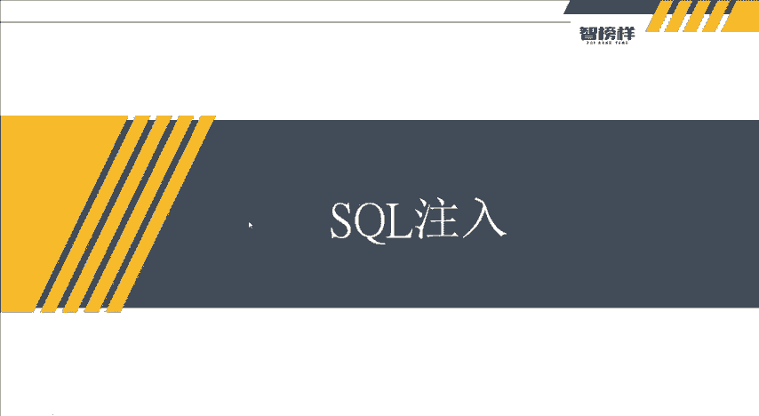
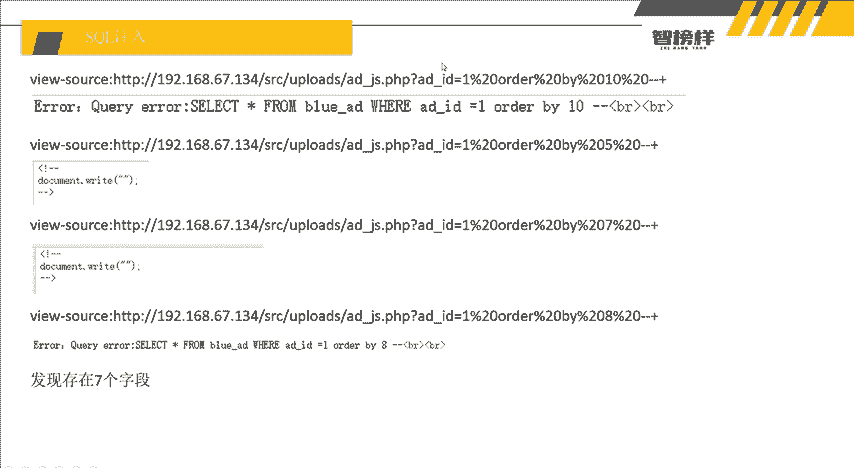
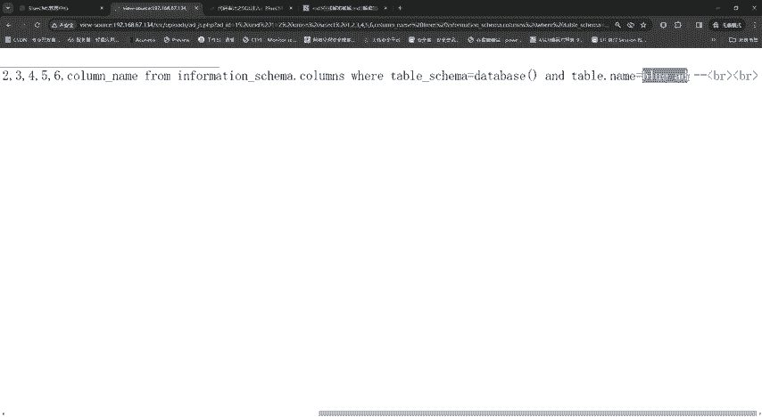
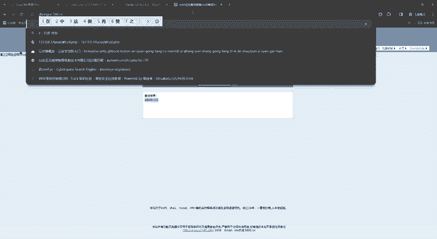
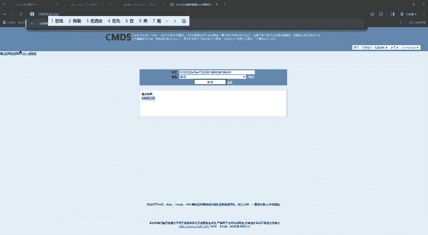
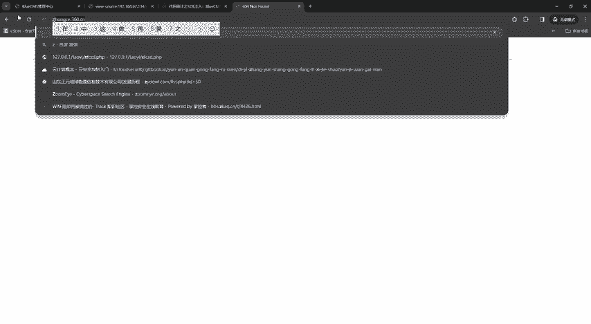
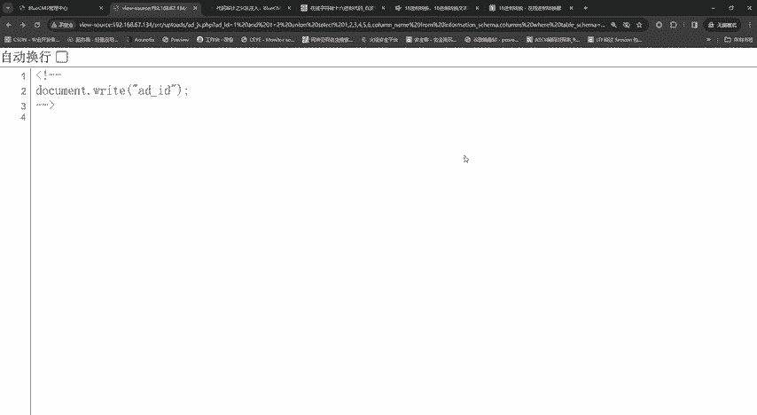
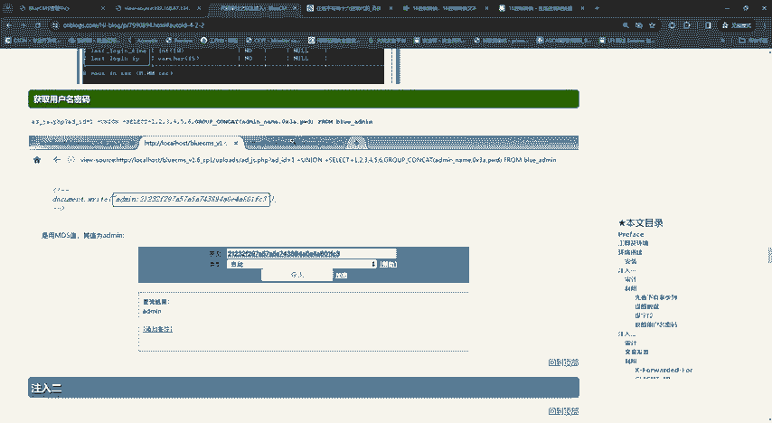
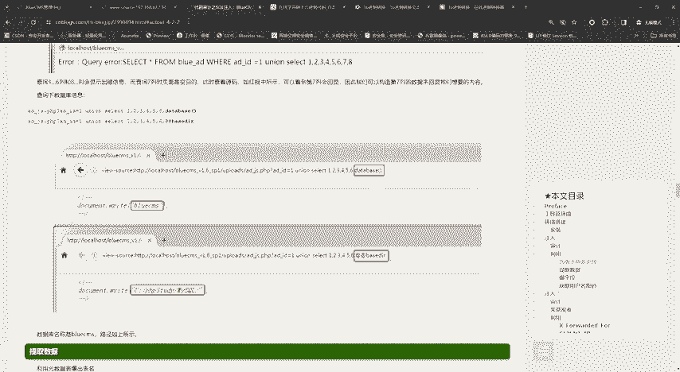
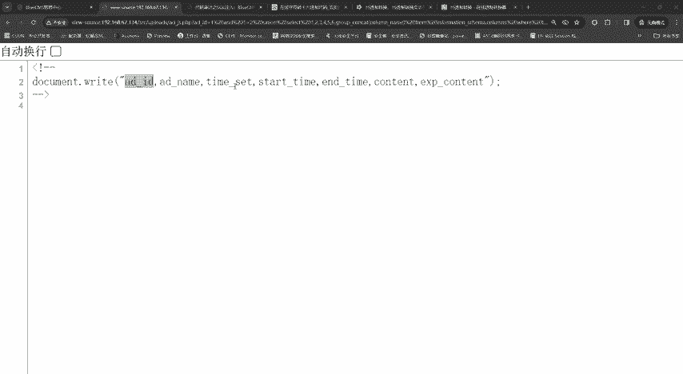

# 2024最新【网络安全／黑客】入门到精通课程教程，包括Kali Linux安装与CTF比赛教程（附安装包） - P25：P12-SQL注入 - AI-大模型基础 - BV1SK421Y7kA

大家好，我是方舟。这节课给大家带来的内容呢就是搜狗注入，也是我们本次课程的系列最后一次内容。那么这个搜活注入呢就其实是很简单，也是利用到了我们之前在呃课程讲解的过程中讲到的那几种方法。

就是什么呃查找那个值啊呃字段呢等等这些。那么我们这节课最主要讲的是什么？为什么要讲这节课，好像我们这个搜索注入之前，我们在上节课那个CMS识别和漏洞寻找是不是找出来了，我们都进后台了，对不对？

那我们如何去嗯。为什么要做这个呢？第一是因为就是。要督促大家，让大家去更加的熟练使用这个生活注入。然后第二点就是万一我们在寻找的过程中，他不给我们拍漏的，只告诉我们注入，或者他没说呢，对不对？

那就说这个存在注意点。那我们如何去做出来呢？那我们是不是唉去自己去打一下，熟练一下，对吧？那就利用我们前面所学到的知识嘛，我们就不要这个了，把这个删掉，对不对？我们就。

那个支持是什么？对不对？第一步，判断注入点，看它是否存在注入就干嘛单引号闭合试一下。啊，嗯。明白看到没？他说你的搜口注入错误了。

他说他他的射口注入是se selectlect星号from blue AD where IDD等于1唉，他这里有一个。他这里是一，对不对？那他是不是就不用闭合呀，对不对？不用闭合的话。

我们直接就上old by呗old by by。然后这里呢，因为我们不知道它字段的长度，哎，老师就推荐大家用二分法，什么是二分法。哎，之前我也讲过了，对不对？我们就先十嘛，对，十分人家。哎，他说十不行。

那我就五呗，对不对？我们就五嘛，五它可以，那这个字段存在的范围是不是5到10啊，那我就又在取中间嘛。7。哎，七又可以，那是不是就是7到10，那我就输入八呗。8他不可以了。那我们是不是就知道字段数为7呀？

那我们知道字段数为7之后，我们是不是就是unic select，我们就直接under and一等于2，然后什么un select。然后1234567，因有7个字段。看到没？它回旋的值是7。

那我们就在7这里干嘛输入一个dab basease。是不是老师之前检到过？哎，它的数据库名称是什么？blueax，那后还有什么看一下他的用户嘛，对不对？users。rootloc号什么。

所以我们是不是就找到他的用户名，他的用户是谁，当前用户是什么？是root，然后当前的数据库是blueCMS，我们也可以这样去慢慢自己啊靠自己一步步的去寻找啊。因为这些。一呢是为了就是去呃。

提高我们的记忆力什么？我们现在是不是知道的数据库名，我们是不是找表呢，是干嘛table name嘛，然后from information。scamer点tableswhere干嘛？没呀。Table。

Sca嘛？是变吗等于什么对它。对不对？合多AD对不对？合作AD不就有了吗？对不对？那么还有什么？那我们就这样把它加进去嘛。Gpro can。放好。他有很多他有他有多少个数据表。

bl如ADblAD phone，bl aD enemy，bl enemy log等等。这些它有一堆看到没？它有这么一层的这个数据。这么多数据表对不对？那我们是不是就可以一个个看，对不对？

然后我们找我们先第一个找到了，哎，我们先用这个bl录AD。然后第二步呢是查找列嘛，对不对？我们就查找列嘛。Oh。干嘛就把它改成chros。对不对？你改成proise。

然后tableable nameca and对不对？andtable。内。等于。好多。AD。太下了，哪里又错了。from name from information哦又得多打了个S。多打一个S。

哎 and information chroms。是考us斯。他马上他们下不要直播。时间吧。K勾杠O就不要这两点。看到没，然后。他说table and table name等于不录AD。

不如AD不行的话呢，我们如何呢？还有老师教给大家一个技巧，就是干嘛十六星制零乘多少？哎，我们就把它。

换成什么在线。

16进制。禁止。在线。

转换哎，对不对？哦，不见了。

16、进止在。禁子。在线转换。对不对？这里有一个小技巧，对吧？识别性是在线转换嘛，对吧？我们就把这个呃我们的这个东西转换一下。哦，不对，我们的是数字字符。字符转换。16、金制。然后在线。搜索一个在线。

看到没有？我们是不是就可以找到。嗯。😊，不录AD，然后支付转16进制。好，16进制呢，它前面要要输一个凌晨啊，凌晨。凌晨就是代表是16天制，那我们就把它反在后面嘛。个方便看一看。喂。

所了信号from unit and unit。嗯，123456chrome informationsma然 chromrome where。table干嘛，然后等于这个。

然后tabletable name哦table name这个 name容啊是。哎，看到没？是不是找到了这个ID。对吧哦，他这里老是打错，那这个就不用16进制了。直接不如。哎，等一下啊。

我们看一下之前的一个内容，bllu下划线AD我们就把它换成bllu下划线ADC。不如全黄线AD。不如下划线ADA它不对，不对的话，我可以看到我们就直接用十六进制嘛，对不对？

所以我们就学到了一个小小的知识点是什么？就是十六进制。

他我们也可以进行数据合作，对不对？所以你可以看到我们哦他这里也讲到了，对吧？也讲到了16进制，对吧？这个t name它也可以用16进制进行一个转换，对吧？所以。

我们在做这个测试的过程中，我们是不是也学又多学习到了一个知识点，就是我们使用十六进制的方式，是不是可以避免在我们这里填写daabbase啊，table呃name幕啊，这个呃我们输入它的那个。

名字好像出不来，对不对？报错，我们就可以用1六进制的方式去进行一个绕过。呃，看到没？它就出现了ID然后接下来我们干嘛就一个个找嘛，对不对？啊 robotport小件。Okay。啊，把它包裹起来。

是不是就出现了ADAD nametime set，然后一看这个就不是password呀，对不对？那我们就去找另外其他的嘛，所所以哎。我们就可以按照自己的思路去找数据库里面的内容啊。

然后这个也是一个提升的方式。哎，当当然大家在正常的渗度测试过程中呢，首先第一步我们还是直接直接去看这些漏洞，然后直接打开漏ot啊，打开漏ot。为什么老师会讲这些可以让大家自己去做一次生活注入呢。

因为主要是初学者，就是刚步入晚安行业的人，或者是一些呃小白来说呢，哎，我们就是能自己去操作，就自己去操作。因为到后面就是基础要打牢嘛，对不对？所以以上呢就是这节课的所有的内容。

大家就可以按照老师的一些讲解，哎，自己去进行一下搜活做。因为它有很多数据表啊，你。只找只要他的账号密码。有。有什么大用呢？对不对？我们是不是又可以我们的目的是找到他的生活助。

然后去找他数据库里面所有的东西，对不对？所以我们就可以查找其他的呀，对吧？比如说什么MA这个bl录AD的表，还有其他的表都有很多。所以我们就可以跟着去查询一下。所以以上呢就是这节课的所有内容。

大家如果想要嗯前面课程的一些资料啊，科件工具，然后大家就直接在下方领取就好了。或者私聊我也行，私聊我也的话，我就直接把这些东西全部打包给你，打包给你的话也可以。

