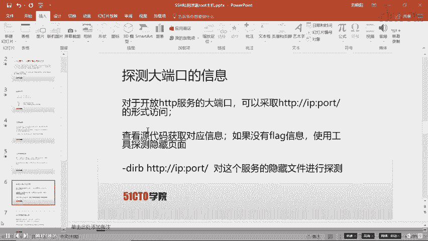
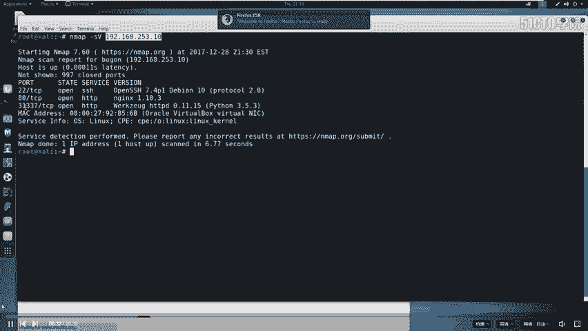
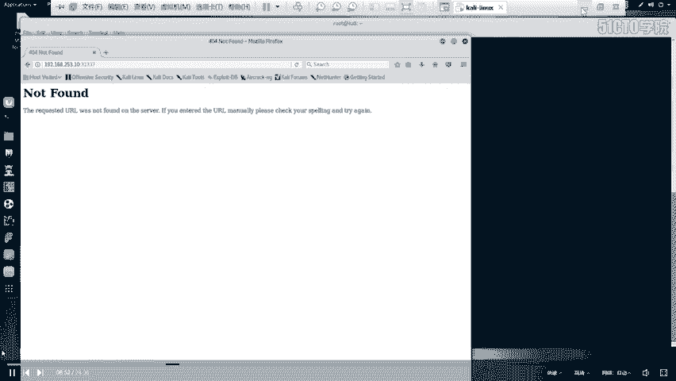
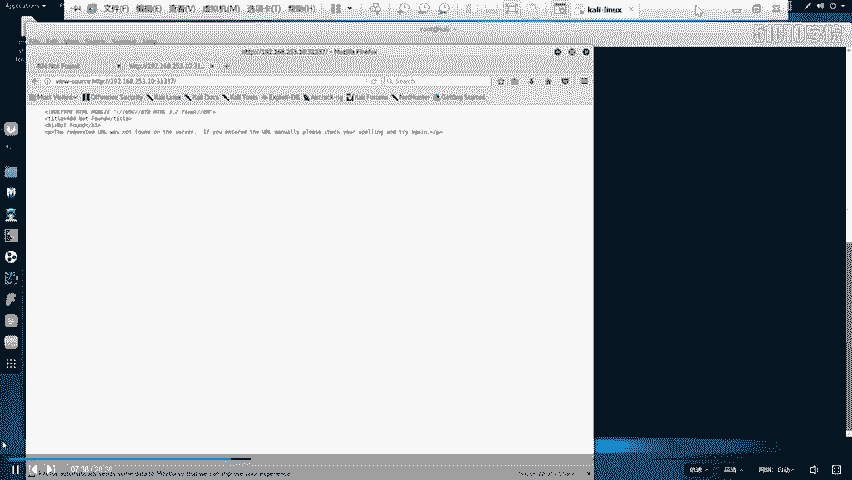
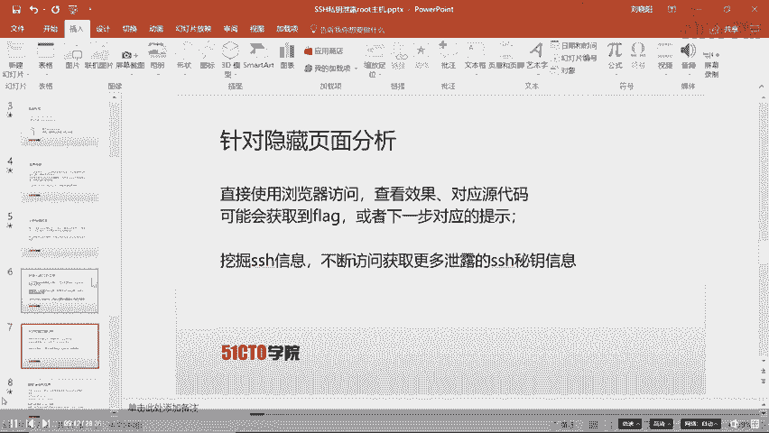
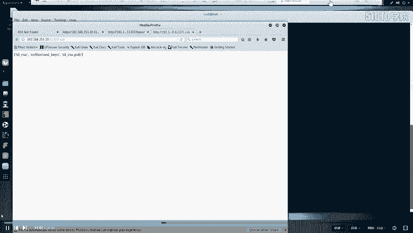
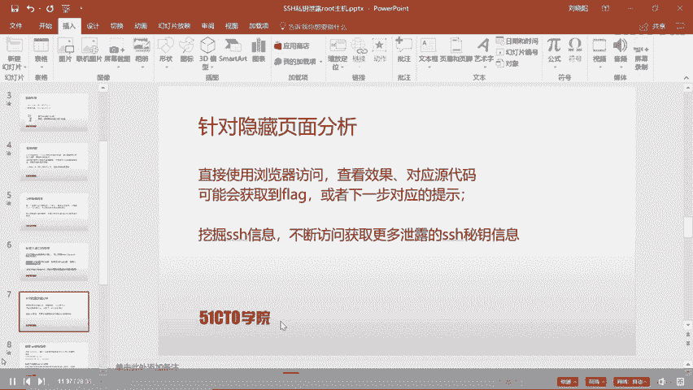
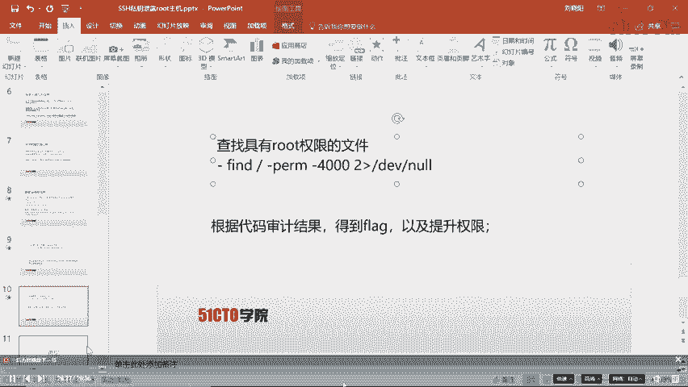
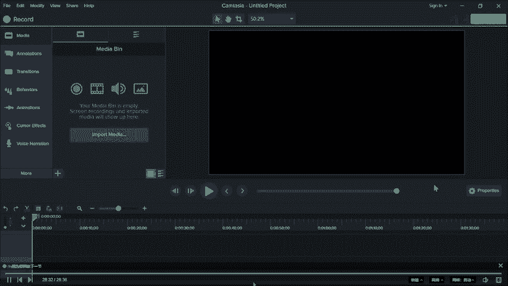

# 2024最新【网络安全／黑客】入门到精通课程教程，包括Kali Linux安装与CTF比赛教程（附安装包） - P27：2.3.CTF-SSH私钥泄露 - AI-大模型基础 - BV1SK421Y7kA

大家好，我们今天来学习一下CTF训练当中的SSH是要泄露的问题。我们并且通过这个泄露的私钥，哎，最终从靶场主机的外部进入到靶场主机，并且哎最终得到靶场主机的root权限。

在靶场主机上哎取得对应的flag。在课前呢哎我们先介绍一下CTF比赛当中的哎比赛环境。首先，比赛环境哎大致分为两种。第一种哎是给予在同一局域网中的攻击机和靶场机器。通过web方式来访问公积机。

通过哎公积机来测试靶场机器。最终获得对应的flag值。在这里特别给大家强调一点。一般情况下给予的哎这个公积机是卡利linux。并且哎咱们个人是不需要携带任何电脑的。

举办方会给我们提供哎一切哎这个电子设备。比如说咱们需要用到的计算机。第二种哎，这个方式就是给予一个网线接口。这里哎咱们参赛选手哎，用户需要自备工具，包括个人的PC以及各种比赛过程当中需要使用的工具。

当然哎，在整个工作程当中，咱们选手的笔记本哎，或者是个人的其他PC了，电子设备是可以接入到互联网当中查询对应资料。当然啊咱们最终目的也是进行哎这个渗透靶厂机器。而咱们这个把厂机启到IP地址。

这个举办方会给予我们。🎼我们直接使用哎自己的攻击机来攻击靶场机器，哎，取得对应的权限，获取对应的flash值。以上哎就是CTF比赛当中比较常见的两种比赛环境。下面哎我们看一下今天课程的实验环境。

首先呢呃我们的卡利lin啊打IP地址是192。168。253。12靶场机器打IP地址是192。168。253。10。我们想一想，我们拿到这样一个实验环境，我们该怎么做呢？首先啊无论参加任何CTF比赛。

在靶场攻击的过程当中，我们一定要抱有一种目的性。就是获取靶厂机器的上的flag值。然后哎提交上去获取对应的分值。首先第一步哎，我们需要进行一个信息探测。举办方给我我们IP地址之后。

我们需要哎对这个IP地址进行对应的扫描测试，探测这个靶场机器上开放的服务。其实呢哎在咱们日常工作当中，渗透测试哎其实是对靶场机器上的服务进行漏洞探测，然后再进行对应的数据包发送。

通过构造机型数据包来取得异常的回应。这时候哎，通过这种异常来获取机器上的最高权限。接下来哎咱们就使用公击机来探测一下靶场机器的哎这个服务信息。这里我们使用M map加杠SV，也就是探测服务信息。

然后加上靶场的IP地址。下面我们回到卡利linux进行探测。首先呢N map杠SV192。168。253。10回撤。这时候哎我们把场机器。就被我们这卡利inux正在探测。探测还是比较快的。

这里我们看到哎它开放了啊一些。这个服务哎，比如说SSH服哎，以及HTTP服务开放了2个HTTP服务。这时候我们探测完毕，在探测结束之后，哎，我们需要对探测结果进行分析。这里啊我们提前给大家说一个知识点。

就是每一个哎服务对应计算机的一个端口。我们在计算机当中，哎，可以说是有很多服务的。我们计算机实现资源共享和信息通信，是通过每个服务来进行的。而计算机上多个服务唉都对应着不同的端口。

通过不同端口之间的通信实现一台计算机上可以拥有多个服务。那么常用的端口有0到1023。这些端口已经被化为已知的啊一些个服务。其实还有很多其他类型的这个服务使用的并不是这里的端口。

比如说3306mys数据库的。端口号。我们通过哎这个扫描可以查看这个扫描结果当中是否具有特殊的端口。然后针对哎这个特殊的端口进行哎更进一步的探测。尤其哎对于咱们今天这个靶场环境来说。

开放大端口的HTTP服部进行一个深入的哎测试排查。首先哎我们要探测大端口的信息。怎么探测呢？对于HTTP服务，我们可以使用浏览器来浏览对应的信息。

下面我们回到公积机当中。打开浏览器。花py。我们的大端口号是31337。

我们打开浏览器。加冒号31337回撤。我们会看到哎，他返回了对应的界面。

返回对应界面之后，我们并没有看到哎任何我们想要的这个flag值。这时候我们就需要更进一步的探测。首先。

我们在CTF当中，信息很大一部分是引才的在。HTM的源代码当中。这时候哎我们对于今天的这8场，我们也探测一下它的源代码具体是什么内容。右键。查看。页面源代码。这里我们就查看了页面的源代码。

但是页面源代码也没有暴露任何我们想要的信息。这时候我们需要哎执行下一步操作。

因为我们查看语言代码没有获得flag信息，就需要探测下这个。服务下是否还有其他隐藏的文件呢？对于探测隐藏文件，我们使用到另外一种工具。DIRB来探测。

加上HTTP冒号双斜杠IP然后冒号端口号斜杠来对这个服务的隐藏文件进行探测。我们回到公积机当中。DRIB。HTTP。192。168点。253。10。31337。然后点击回撤。

这时候哎我们这个工具会对我们当前这个服务哎进行对应的探测。可以看到哎，我们这时候探测完毕。这里哎我们有5个探测结果。我们可以看到这5个探测结构当中。我们发现两个探测结果哎比较醒目。

比如说SSH以及robots的TST。首先哎我们将。对他一个进行深入分析。分析一下我们如何来挖掘。

这里给大家介绍一下robots点TST的作用。我们搜索引擎在探索一个网站页面的时候，首先会探索网站页面下的跟目录下的robots点TST。robots点TST文件当中存放着哎。

这个不允许搜索引擎所探测文件名。🎼以及允许被探测的文件名。下面哎我们打开这个robots的TST。通过哎，这里。右键。open link使用浏览器打开。这时候我们就会发现。我们这里。

不允许探测点base点RC以及点profile这个文件，以及不允许探测。TAXEX文件。这时候哎我们就。发现了一个敏感文件。TAXES文件。我们在浏览器当中浏览TAXES回撤。

我们在浏览同事忽然发现啊眼前一亮，发现了一个flag值。哎，这就是我们找到的dfl。在进行完哎这样探测之后，我们发现robots啊已经没有任何哎利用价值。我们已经找到了对应的defl。

这时候我们向上看看到了点SSH哎这样一个文件。那我们哎也同样的方法来对它进行打开操作，来查看对应内容。在打开之后，我们会发现哎这些这样一些信息。对于这样一些信息，我们也要进行深入的探测。

这时候呢哎我们就开始探测。在这里哎给大家说一点SSH的作用。SSH的作用哎，就是可以使远程计算机通过SHH客户端登录到这个我们本地服务器的SSH服务上，然后实现远程计算机对服务器的远程操作。

对于SSH的认证方式是这样的。首先呢我们要有1个IDRRSA这样一个私钥。之后与服务器上IDRSA点PUB这公样进行对比。这样一种。加解密操作。对比成功，哎，那么就。可以登录服务器对比不成功。

那就登录失败。下面哎我们继续来探测。这里啊我们留下了。这样一些信息。对于这样一些信息。以及外服务。我们最直接的想法哎就是它是否存在。这样一个文件呢？🎼那我们就尝试一下。加一个反斜杠，加1个IDRSC。

回撤我们会发现哎进行下载，我们点击C5。这时候我们就把IDRSA这个公私钥文件来下载了。以及这个认证关键字文件。没有见花配。再把它复制到这里。回撤哎，看到又让我们下载，点击下载。

很多同学哎在这里会想到我要不要下载这个公钥呢？答案哎是。不需要的，因为公钥是存储在服务器端的来进行远程访问。说需要使用到的。这样啊我们就不需要下载。我们点击这里哎查看下载的文件。为了方便操作。

我们把它复制到桌面。木土。Desktop， select that。

这时候啊我们就在桌面上。出现了我们的私钥文件，以及我们的认证关键字文件。在这里。我们先尝试一下，使用私钥文件来登录远程服务器。首先，SSH。输入哎参数杠I。啊，对于这里，我们先切换到桌面。

因为我们这个文件现在在桌面。回车LS。SSH。在进行SSH的时候，我们需要哎把这个私钥哎进行赋权限，赋予它可读可写的权限。我们首先查看一下私钥的权限LS杠ALH回撤。

会发现我们这个私要文件是具有可读可写的这样一个权限的。那我们直接使用SSH杠I。使用。认证文件。之后使用对应的用户名。这时候我们会发现没有对应的用户名。🎼那我们怎么办呢？

首先想到了啊之前我们看到了一个organed key，它是一个验证性的关键字文件。我们双击打开。打开之后，我们会看到这里使用SHH服务端，通过哎这个密钥进行登录。登录之后哎，使用我们的用户名。

登录对应的主机名。这时候我们就发发现。这个simmo啊就是我们的用户名。C more。然后哎输入服务器的IP地址。253。10回车。在回车的一瞬间。我们收到一条消息。说我们不能建立连接，哎。

我们需要哎这个指纹识别，那我们这里输入yes回撤。这时候哎看我们刚才没有对他进行付权限。是不是就出现了权限？拒绝的这样一个。提示。这时候我们重新对私钥进行附权限。600。ID。RSA赋予这个文件。

可读可写的权限LS杠ALH回撤。我们查看到现在哎它被我们重新赋予了读写权限。接下来我们继续使用上一条命令远程登录。突然哎跳出一个提示，说需要我们输入密码。我们这时候输入一个smo，看是否能登录。哎。

还是不能登录。我们看到我们没有输入正确的密码，是不能进行登录的。那么这时候我们就需要更进一步的哎探测SSH密钥信息。首先呢我们拿到了SHH私钥信息。我们就可以哎对私钥信息进行破解。

来得到这个私钥信息当中的哎密码文件。以及他的密码。下面啊我们就第一步来使用SHH。2、draw这样一个工具来将IDISA密钥信息转换为drwn这个工具可以识别的信息。下面我们回到卡利攻击机当中。

首先使用SHH two撞。之后输入我们需要转换的文件名。之后输出到RSAcrrack。这样一个文件当中。回撤我们在桌面，这时候就出现了我们这样一个可被撞识别的这样一个文件。出现这个文件之后。

我们需要对它进行解密。解密的时候，我们是需要使用字典对其进行逐步解密的。这时候我们就要使用they cant这样一个工具。来。榨取。😡，这样一个路径下的。runnk you点TSTGZ这样一个文件密码。

然后通过管道逐行传递给dwn。刚刚pipe哎，就是我们使用这个管道的输入当做dwn的输入。然后刚刚ros使用ISAc。的这个规则来进行解密。下面我们就在测试机当中来输入这样一条命。

the cant杠user share what list。R you。注以管道符号之后，daw。IPE。刚刚。Rose。接下来输入我们需要解密的文件，回撤。这时候哎我们就会发现。

我们出现了一个密码文件，也就是密码。Star Wars。这就是我们这个。密钥文件所要。打开使用的密码。下面我们继续来登录。这时候啊我们按方向键上回到上几条命令，回到这样一条命令，回撤登录。

这时候我们输入我们破解出来的这个密码。STA。WARS回撤。TA。RWARS回车。在我们输入正确之后啊，我们这时候就远程登录到这台主机上。这时候哎我们就取得了哎这个主机的访问权PWD回撤。

我们会发现我们在这样一个目录下LS我们查看一下。我们依然没有找到我们需要的key文件。那我们接下来怎么办呢？就需要进一步的哎探测对应的文件，以及探测更深入的地方。我们需要探测哪里呢？大家一定要记住。

在CTF当中，这个root跟目录哎绝对是我们需要值得注意的，而且需要经常查看的。我们CD。在卡利当中切换到。切换到跟目录，哎，这里可能是因为网络的原因有些延迟。杠ro。回撤。

这时候我们就通过smo这个用户名切换到root这里。我们alice回撤。哎，会看到flag掉TST。希望在即我们查看一下flag点TST的文件内容cat。flag叫TSG回去了。在我们回车的瞬间。

仿佛更加失望了。我们发现我们并没有权限来查看这个flag点TST。说明我们simmo啊并不是root用户组里的一个用户，而只是一个很普通用户，并不能执行root的权限，所以说无法查看。

这时候哎我们就需要提升权限。在提升权限之前，我们需要查看一下哪些文件具有root权限。这里我们就使用到一个命令finight。然后从根目录开始，一直。逐承向下。来查看。具有。执行权限的。这样一个文件。

这里是表示具有执行权限。而这里。是我们需要值得注意的，它是避免错误输出的这样一个命令。实际上，如果不加这里，可能我们在查看的时候会出现。意外的错误。所以说我们必须要加上这样一条命令。

我们下面在卡利当中来执行一下这条命令。首先，finide。跟目录下，杠杠PRM。杠。PRM杠4000。接下来我们执行。一个避免错误操作的这样一条。回去。我们会发现。我们具有。这么多文件是具有。

root权限的。我们往下看往下看。我们会发现哎，road message。是跟我们。根木里下的。read message C文件是类似的。那我们下面。

就来查看一下这根目下的这个read message点C的文件内容。首先catread message点C。这时候我们仔细逐行来查看。首先这是标准的图文件。接下来会发现两行注释。哎。柳岸花明又一冲。

发现了一个桃花岩。我们仔细看两个。是这里哦，这是我们的flag高，我们很幸运找到了flag杆啊。接下来。我们就仔细阅读原代码。进行一个代码审计。来挖掘内部的信息。首先定一个数组啊，这是我们的。

message这个的目录啊是我们可具有。操作的讲一个目录。接下来是一个缓冲区数组。之后又是一个认证的。数组。首先pri whats your name。是询问语句，然后输入b。

也就是把输入哎给复制给buff这个数组。接下来啊出现一个判断。判断这里。条件是。是否这个。认证的这个数组和这个我们输入的这个数组的前五个字符是否不相等？加了反斜杠，就是表示是否相等。相等的情况下，哎。

我们就输出message。也就是我们输入的这个内容。然后哎执行。我们输入的这个。message的这个程序。然后点击弄。Else。然后是表示哎表示他没有匹配上。那么就执行一个退出操作。通过这里我们会发现。

在我们错误的时候，我们会执行哎这个message。message是具有这个。root权限的这样一个。目录。那我们下面就来执行一下messageread message这个程序。

rateate杠message程序。我们输入哎一个姓名。要嘞。IU哎他会发现啊错误了。那我们下面执行一下正确的操作。R。message回车，让我们输入姓名。我们这时候哎就输入。C more。AAA不撤。

会发现啊我们。进来了这个目录。会发现。他给了么一些提示。输出了很多信息。这时候哎我们就想到，如果我们把它移除，它还会不会执行。我们一出之后的结果呢。你就在这里输入。R。message回车。

接下来我们输入s more。AAAAA这时候我们输入10个字符，然后再输入10个字符。12345678910。接下来我们让它跳转到并目录下。刚。并。SH。我们通过这样一条命令来提升一下权限回撤。

我们会发现我们仿佛来到了。root权限下PWDwho Iho。who am I回撤，我们发现我们成为root权限之后cat一下flag。Thatt。不撤。这时候我们读取到了这个文件。

我们会发现哎通过以上这样一些实验，我们最终取得了对应的所有flag值。所以说在CTF当中，我们需要逐步深入的来去挖掘各种有用的信息。并不要哎一味的说我直接利用一个漏洞，直接获取了所有的权限。

而是要根据题目的提示逐步来深入，逐步来挖掘，不要放过任何一个细小的提示。

那我们的课程也就到这里。

