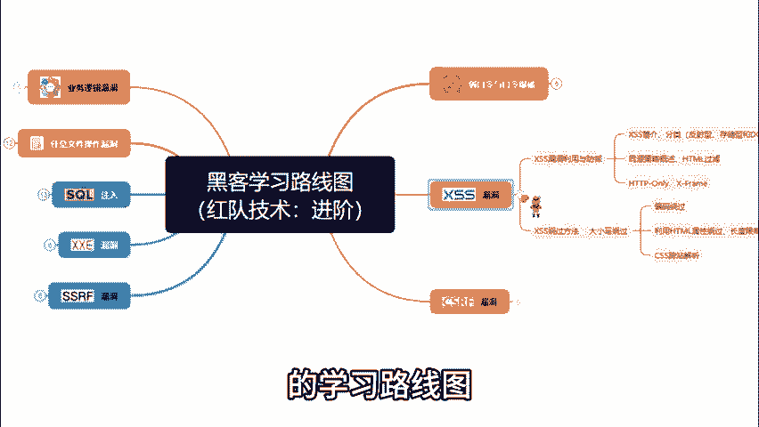
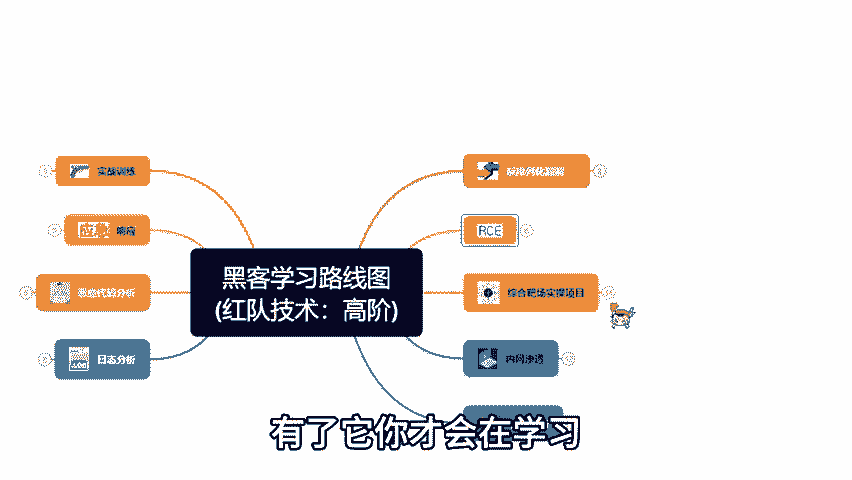
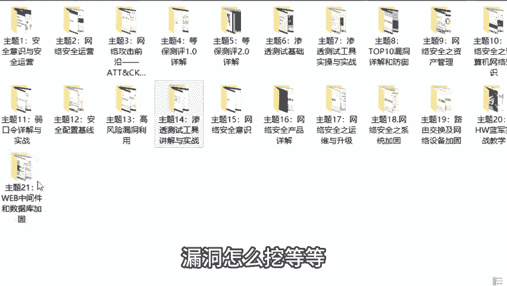

# 2024最新【网络安全／黑客】入门到精通课程教程，包括Kali Linux安装与CTF比赛教程（附安装包） - P2：【粉丝福利】免费分享网络安全／黑客全套学习资料整理 - AI-大模型基础 - BV1SK421Y7kA

如果你是一名什么都不懂的黑客小白，不管是想找工作或者专研黑客网安技术，成为一名厉害的网络安全工程师，这份粉丝福利千万不要错过。本人最开始也是自学过来的，知道新手期最需要什么资料。

首先是我给大家整理的学习路线图。上面有从零到黑客高手要学的技术点，都写的明明白白，有了它，你才会在学习的过程中不迷失方向，一步一步朝重点稳步前进，其次是我自己录制的190节网络攻防视频教程。

软件怎么装漏洞怎么挖等等。我在视频中都有详细的技术讲解，学完你就能达到白帽高手的水平。打比赛，挖漏洞和找工作都没有问题。如果你觉得自学比较困难，不适合自己，那你可以找我，我带你从零开始。

