# 2024最新【网络安全／黑客】入门到精通课程教程，包括Kali Linux安装与CTF比赛教程（附安装包） - P32：7.8.CTF夺旗-Capture the flag - AI-大模型基础 - BV1SK421Y7kA

我们来起CTF训练当中的captured flag。我们来探测靶场机器上存储fag的位置。并获得对应的值，提交对应的值取得对应的分数。下面我们来介绍一下。CTF。CTF是一种流行的信息安全竞赛形式。

其英文名可直译为夺得flack。也可意义为夺奇赛。他有这样的流程。参赛团队之间通过进行信息对抗、程序分析等形式，率先从主办方给出的比赛环境中得到一串具有一定格式的字符串或其他内容，并将其提交给主办方。

从而得到对应的分数。当然，为了方便称呼，我们也把这样的内容称之为flag。在CTF比赛中，涉及内容比较繁杂，我们要利用所有可以利用的方法获得对应的slaack。下面我们来介绍一下今天的实验环境。

我们给出公积机卡利linux，它的IP地址是192。168。1。111。靶厂机器使用lininux系统，它的IP地址是192。168。1。110。那么我们现在拿到这样一个实验环境。

该如何进行对应的操作呢？接下来我们所有的操作都要具有一个目的性，那就是获得靶场机器上的flag值。我们再拿到。靶场机器的IP地址之后，我们需要对其进行第一步操作，那就是信息探测。

首先我们来探测一下靶场机器开放的端口号。这里我们可以使用Mm加上杠P。杠表示扫描所有端口号从0到65535的所有端口之后，我们再加上杠T4表示使用N map的最大线程数，也就是N map的最快速度。

对我们靶场IP地址进行对应的扫描。下面我们在卡利当中进行对应操作。首先我们输入M map。加上杠P之后再加一个杠之后，我们使用最快速度按T4。最后输入把厂家IP地址192。168。1。

110之后我们回撤。那么当前n map使用最快速度探测所开放的端口号。这里我们已经扫描完成，并且把它所开放的端口号以及它对应的服务哎进行了对应的显示。当然，我们除了可以使用这样一条命令。

扫描主机上开放端口也可以使用其他命令。扫描主机的全部信息。那我们这时候再使用M map加上杠T4表示使用最快速度之后，加上杠大A表示使用M map的所有扫描模块。

之后加上杠小微表示将M map扫描的结果详细显示出来，最后再加上靶场的IP地址。下面我们在卡例当中实践。输入n map之后，加上杠大T4。之后加上杠大A之后加上杠小V之后是八场IP地址192。168。

1。110之后回车。那么这时候M map以最快速度对我们该靶场地址进行所有信息的探测。其中也包括了对应的开放端口的探测。但是这里会发现它开放的端口并没有我们之前。所扫描到的。从11337端口。

2220端口以及6000端口没有这些端口，会发现它使用全部模块扫描的时候会漏到一些端口号。所以说我们在进行信息探测时，一定要使用n map这两条命令，对该靶场开放的所有端口进行对应的探测。

我们在探测完该信息之后。对于开放HTTP服务的靶场，我们还可以使用其他的工具对其进行探测。这里我们再使用两个工具，对靶场的敏感信息进行探测。首先是neick two之后加上host，加上STTP。

加上8场IP地址之后，加上端口号。这里的端口号如果是80端口，该端口是可以省略。如果不是80端口，一定不能省略。进行敏感文件的探测。下面我们在卡例当中实践。

首先输入nick two之后是杠hot之后是咱们HTTP。192点168。1。110。我们这样写。之前首先要查看一下该靶场开放80端口哎的一些端口号，可以看到这里。HTP是在80端口开放。

我们可以直接对其进行扫描。并且我们在下边也看到9090啊也开放HTTP服务。首先我们对80端口进行扫描，省略I80端口号回撤。我们再打开另外一个终端，对9090HTT服务进行对应的探测。首先。

sic two加上。杠host之后ATTP。192。168。1。110之后，我们输入9090端口号之后回撤。那么尼 two对咱们9090来进行对应的信息探测。我们让他们在这里扫描。

我们继续来查看另外一个工具扫描。我们可以看到可以使用DRIB加上对应的参数，也就是8成IP加上端口号。这里的端口号和nwo端口号的使用方式类似。我们使用该条命令来探测该HTTP服务所。

拥有的目录以及对应的文件。下面我们就使用DRIB来进行探测。我们再打开一个中端，首先使用DIRB。之后我们输HDP。输入IP地址。110之后，哎，我们先探测80端口。

这时候我们就来探测80端口上所开放的哎这样一个辅目录或者文件探测完毕，我们再来探测9090。192。168。1。110艾之后市9090回撤。可以看到哎，我们很快进行探测完毕。

并且哎这里发现DIB并没有回显对应的目录。我们在信息探测完毕之后，哎，就可以对我们探测到的信息进行对应的深入挖掘。分析M map和nic two的扫描结果，挖掘其中可以利用的信息。

比如说我们对于大端口的非HTTP服务，可以使用NC来探测该端口的banner信息。使用的命令是NC之后加上IP地址之后加上对应端口号。下面我们查看一下刚才探测结果当中是否具有对应的大端口号。

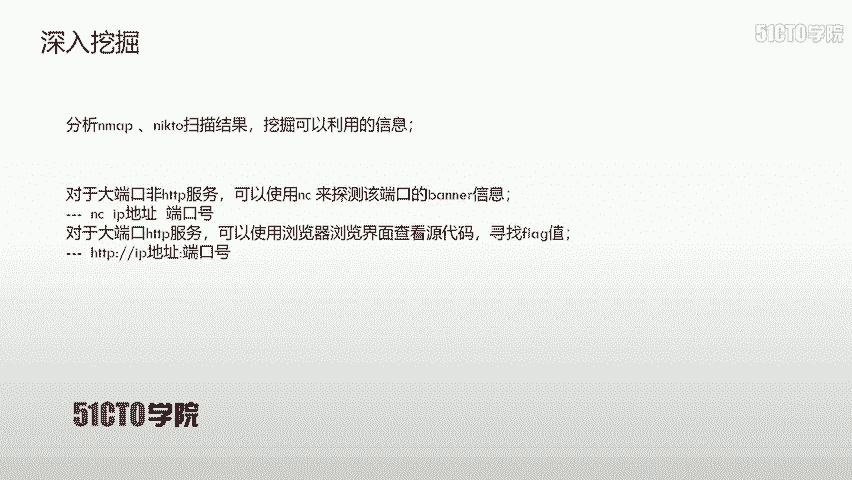

我们打开终端。这林然在扫描。我们继续打开一个另外的终端。首先IM map来继续扫描一下哎我们刚才学到的命令。扫描一下该靶场所有的端口号使用最快速度。

可以发现很快给我们返回对应的结果。这时候哎我们来查看一下所开放的大端口号，这里开放了。

1337哎这样一个端口号，并且它并不知道上面所运行的服务之后又有1个600这样一个端口号，并且我们同样不知道该端口所运行的服务。那么这时候我们就使用NC来探测一下该端口号的ban扰信息NC加上IP地址。

之后加上对应的端口号，首先探测13337这样一个端口号，13337回撤。我们可以看到该端口给我们返回了哎对应的banner。在banner这里我们发现了第一个flash。是这样一个flanang值。

那么这时候我们就可以把该flanang值提交给主办方，获得对应的分数。接下来我们再来探测一下600端口号的哎这样一个斑脑信息。首先NC来之后对应的IP地址。之后是60000回撤。

我们发现呃正在返回对应的办览信息。有时候哎我们这里有些停顿，哎，我们可以是等待。我们重新来。执行哎，我们忽然发现在重新执行的时候，哎，它会返回一个shall类型的这样一个命令行。

那我们接下来来使用一下最常见的一些命令。首先ID我们查看一下该 shellll返回的权限，发现哎并没有ID这样一个命令。我们这时候更想查看一下我们当前的工作目录。

我们是在root blank号啊这样一个工作目录之下。查看完之后，我们可以使用LS来查看一下当前目录下所存在的文件。我们发现有一个flag点TIC。这时候我们可以使用cat来查看一下该flag的内容。

不错。我们这时候发现了第二个flag值。如果我们把该fl提交给主办方，哎，那么就可以获得1分哎这样一个分数。我们在查看完之后，哎，我们就退出该fag，该连接按ctrl C退出该连接。

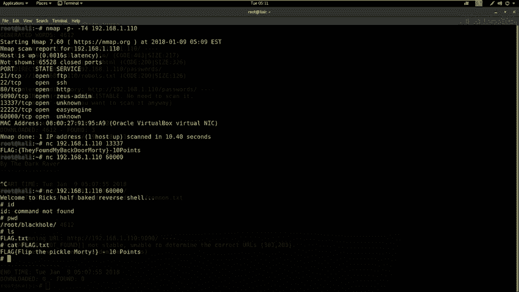

我们现在已经分析了大端口的非HTP服务。我们如果扫描结果当中存在一些大端口HTT服务，那我们就可以使用浏览器浏览界面来之后查看源代码，寻找对应的flash值。

并且这里的UIL的写法一定要加上对应的端口号。下面我们回到卡例当中来查看我们是否扫描到。

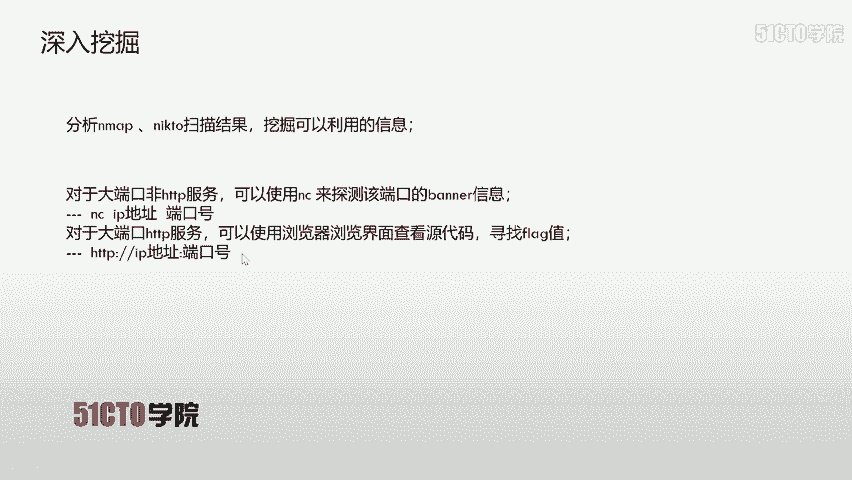

大端口的HTT服务可以发现9090I是开放了。这样1个TCP这样一个服务。那我们刚才哎使用N map杠A发现它是1个HTTP服务。

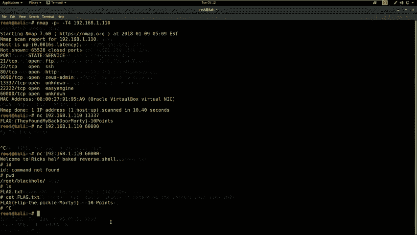

我们回到这里来查看一下n map。刚才哎说是。扫描到的哎这个大端口开放的服务。这里哎没有，我们再在这里哎，这里no。你须向上。这是哎我们刚才。扫描哎这个对应靶厂机器得到的哎全部服务信息。

在这里我们发现9090端口开放的是ACTTP服务。那我们接下来就使用浏览器。来浏览一下。该端口的HTTP肤。打开浏览器。我们把刚才的哎这个链接复制到这里。来访问9090端口的HTTQ服务回车。

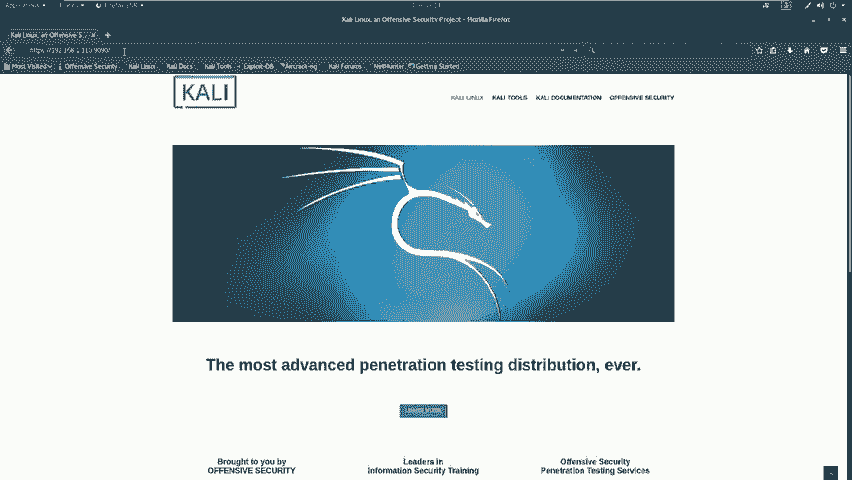

可以看到我们这时候在页面当中出现了flag值。我们这时候取得了。对应的flag哎，就可以把它提交给主办方，来获得对应的分数。

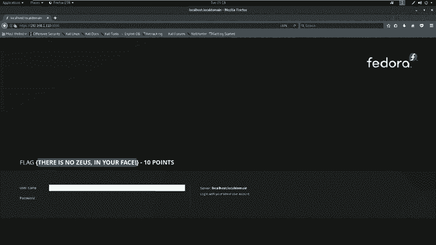

我们再探测完。大端口的服务。包括HTTP服务以及对应的非HTTP服务。那我们接下来就可以对HTTP服务哎使用浏览器哎这样。来查找对应的敏感页面。大端口的HTP服务哎，我们已经查看了。

那我们接下来来查看一下80端口或者是其他端口的HTTP服务。我们回到卡利当中。我们查看对应扫描结果，会发现80端口是开放HTTP服务的那我们接下来继续来查看一下它扫描的一些敏感页面。

在这里我们在探测80端口的时候，发现了具有passwords哎这样一个敏感目录。并且我们来继续查看一下DRIB所扫描的结果。我们把这个关掉。我们回到DIIB扫描80端口的一些信息。

在这里我们首先来打开该链接。发现啊他是一个站点。一个好几张图片所组成的哎这样一个站点。之后我们再来打开CGIB这样一个目录。我们会发现I403不允许我们访问。那我们再来打开。

index HML哎这样一个页面发现依然是哎首页。那我们接下来看到一个word这样一个password这样一个目录。那我们下面打开该目录。会发现该目录下哎我们可以。有两个文件显示出来。

并且一个是flag点TST，我们打开。这时候啊我们就得到了哎对应flag值，可以把它提交获得对应的分数。但是在这里我们要有一个passwords呀HTML这样一个文件。

我们下面打开会发现该文件并没有出现对应的flag值。那我们哎这里就需要进行更深入的挖掘。我们首先哎可以查看对应的源代码，来挖掘一下它源代码当中是否有对应的信息。我们首先来查看源代码。

在这里我们要注意对应的。默名链接哎，或者是未知链接以及它的注释。我们可以看到它的pasword是win哎这样一个单词。那我们下面啊就记忆了啊一个密码是win，我们之后可能会用到。在进行更深入探测的时候。

我们还要对该靶场所开放的其他端口来进行对应探测。比如哎我们刚才扫描到的21端口FTP是存在匿名登录的。

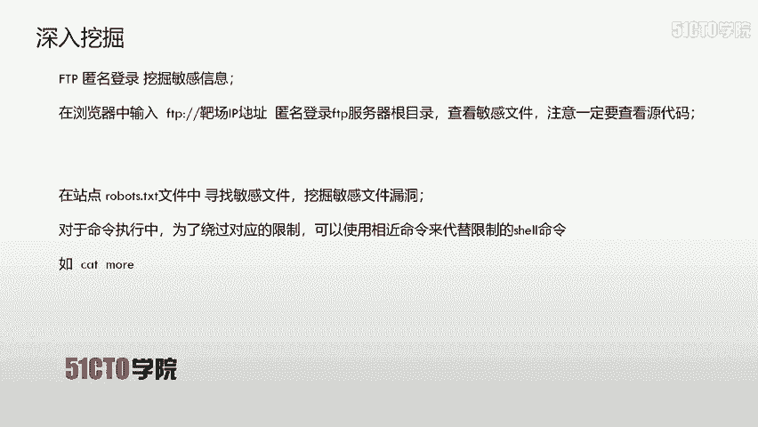

我们来查看刚才的扫描结果。把它最小化。之后哎我们来查看。这里哎我们开放了21号端口。并且这里是可以进行匿名登录的那我们就可以直接在浏览器当中输入FTP之后，把成IP地址来匿名登录FTP服务器的根目录。

我们在根目录下一定要寻找对应的敏感文件，之后查看对应的源代码来挖掘其中敏感的信息。

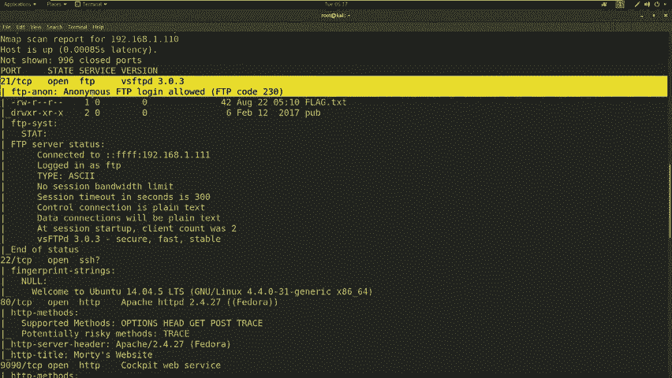

我到靶场当中。首先我们在浏览器当中来查看一下靶场的FTP跟目录192。110回去了。这时候我们浏览器开始访问该靶场的21端口，并返回该靶场FTP服务的根目录。我们在它的根目录发现了一个flag点TST。

我们点击打开会发现我们又得到了一个flag值。那么这时候可以把它提交主办方获得对应的值。

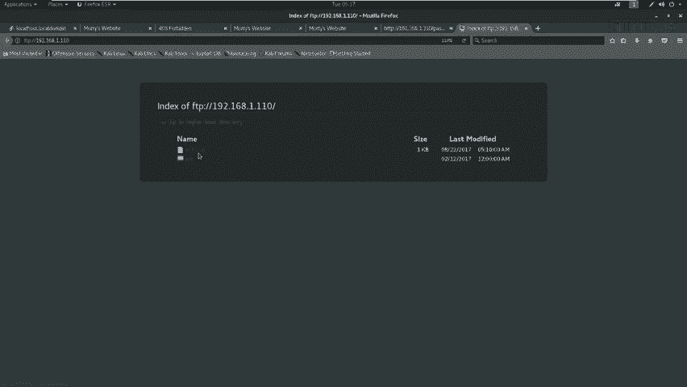

之后我们又看到PUB这样一目录，发现该目录下并没有任何想使用的文件。

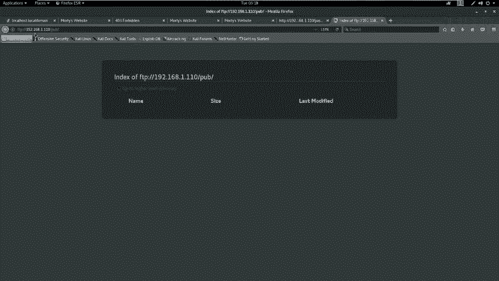

那我们在。挖掘完FTP匿名登录的flag值之后，我们可以在站点robots文件当中寻找敏感文件，挖掘敏感文件信息，以及发掘其中的漏洞。

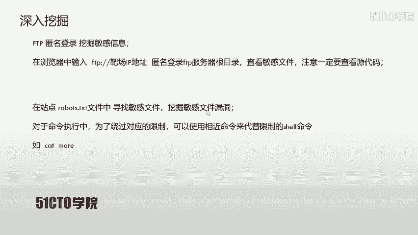

下面我们回到刚才扫描的结果当中，来查看一下是否具有robots哎这样一个目录。

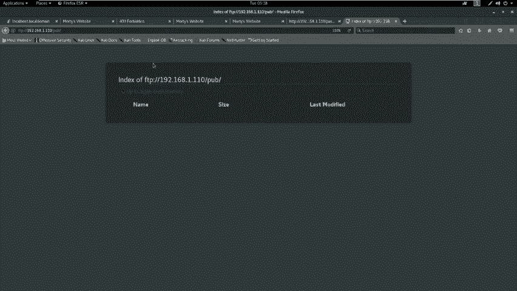

文件。嗯们来看看DRIB。可以发现哎，在这里我们有robots点GST啊，我们来打开。在robots点TST我们会发现有这样三个目录，我们下面来依次打开来查看其中的内容。首先我们把前面的一些内容关掉。

我们这是好爱输。把这个去掉之后，把conr位回撤。

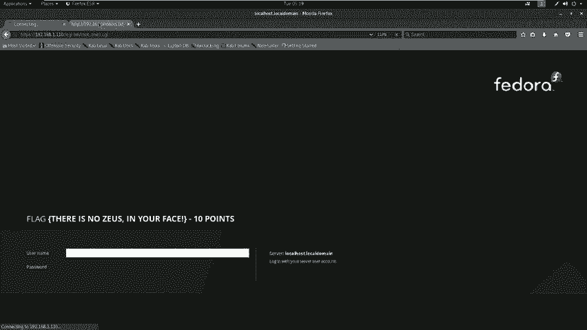

把这里多了一个斜杠回撤。你再把这个。文件和目录CGI的目录和文件花呗出来。最后哎把这里。萝卜刺。T again。1102我们。打开。192。168点。

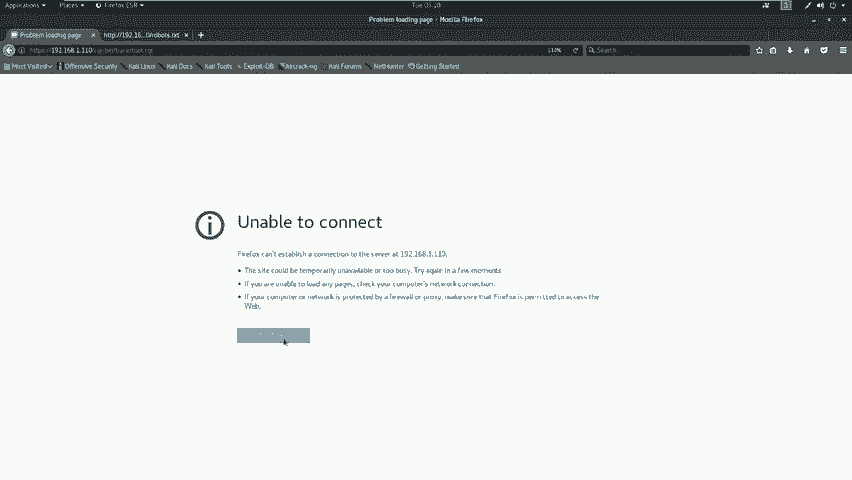

如果说哎我们碰到这样的情况，哎，可以使用。对应的终端来查看我们主机是否跟我们当前的环境下面。

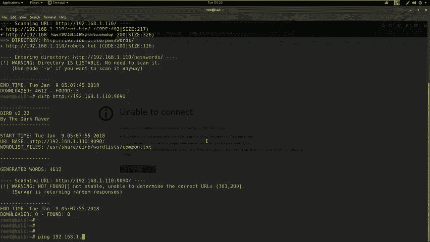

回车而发现联通，那我们来继续访问。初见。我们把它改为I对应的。

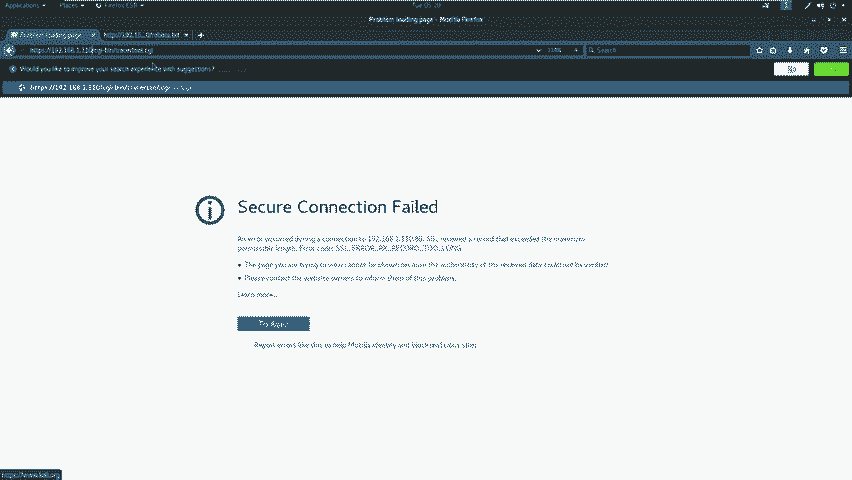

9090端口。来连接。哎，发现使用9090端口，哎，它并没有哎跳转到哎对应的这个CGI的目录文件。

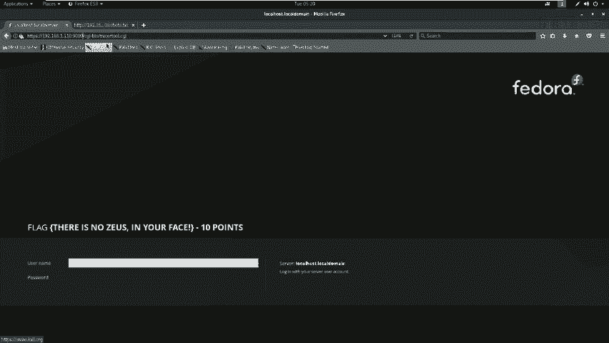

不能连接啊，并且这个我们需要查看一下。对应的信息。复制出来。192点。之后我们加上对应的目录信息和文件。哎，这时候哎我们在进行尝试之后，哎，登录了啊这样一个界面。

我们再把哎刚才这个root项CGI来打开一个新的界面当中来查看。之后啊我们把它复制进来之后，我们把一个单斜杠去掉回撤。哎，所以说在咱们哎比赛当中，哎一定要多去尝试。如果说一次尝试不行，哎。

一定要继续尝试几次之后才能判断当前哎的这个操作是否正确。因为网络有时候是不稳定的。咱们在打开该页面之后，会发现root cell点CGI并没有哎任何可以利用的地方。

那我们哎在另外一个chor to点CGI发现了哎这样一个窗口，啊，让我们添加1个IP地址来进行哎路由。我们首先输入1个127。0。0。1，让它csure一下。发现啊他会返回对应的信息。

我们发现在这里哎如果是有经验的话，会发现它可能是存在命令执行漏洞的那我们下面就来验证一下我们该弱点是否存在命令注入漏洞。首先输入127。0。0。1，可以看到哎，我们在刚才输入的时候。

也是通过get方法传递127。0。01给IP这个参数之后，参数传到CGI当中执行。接下来我们输入一个分号之后输入ID来查看一下我们当前用户对应的权限回撤。我们会发现。

哎在这里已经显示出了对应的哎这样一些参数，可以发现我们并不是root用户执行的，而是一个阿帕奇用户来执行的。我们这时候会想到，我们刚才在敏感password点HTML当中挖掘了一个密码。

也就是winter这样一个密码。下面我们是否可以想一想查看到对应的用户名，那该用户名就可以与我们密码结合，密码结合之后，我们就想一想是否可以通过远程登录该靶场机器。最后执行对应的操作。

这时候我们更多的会想到。ETC。password哎这样一个文件。该文件当中存储着inux系统。里边的用户名以及对应的密码，但是密码只是用新号来表示。并且该文件是所有用户都可以查看的。那我们下面。来使用。

对应的命令注入。首先分号之后是cat。我们点击ta。会发现我们使用ca的时候，给我们返回了一个类似于猫的这样一个图案。那我们这时候就会想到。该命令执行当中。靶场机器做了对应的限制。

我们该cat命令是不能进行操作的那我们这时候就可以使用对应相近的命令来代替刚才限制的cat命令。如cat可以使用more来代替。下面我们来使用more来查看一下该机器的对应用户名。首先输127。0。0。

1之后是分号，之后是more。之后是ETCpassword点击classor。那我们这时候哎返回了这个对应的。文件。也就是PASSWD当中的内容。在这里我们主要是要找对应的用户名。

我们在这里发现了smer哎这样一个用户名，并且它是在home目录下这样一个目录下的一个文件夹。我们在这里可以判断smer就是一个对应的用户名。我们把它copy出来。我们在取得用户名和密码之后。

就想一想是否可以远程登录。我们接下来就来登录靶厂机器。首先啊我们linux远程登录一般情况下使用SSH来登录对应系统。我们来查看一下我们的扫描结果是否具有SSH符。你把它小。

然后再打开另外一个会发现22号端口开放的SSH服务。那我们下面就来使用一下2122号端口来登录下该靶场机器。首先SSH之后是使用。smer这样一个用户名之后艾符号之后是靶场IP。回去看。我们会发现。

这里SSH啊这个交换这样一个验证方式，拒绝了这样一个远程主机。我们会发现，当前22号端口是不能进行远程登录的。那我们这时候取得该用户名和密码，难道就不能使用了吗？这时候我们继续看扫描的结果。

会发现5-2这样一个端口号，并且它有一个这样的服务下面。使用SSH。SSH杠P我们把这个5-2的端口说到这里之后，我们使用smer啊用户来登录。之后艾符号是靶厂IP地址。110回撤。这时候发现。

我们需要输入对应的密码。我们之前说过对应的密码是winter来输入WINTER回撤。这时候我们得到了哎这样一个反弹的效项。接下来我们在登录之后，需要继续操作来获取对应的flag值。

我们可以执行PWD来查看当前的工作目录，使用LS来查看该目录下的目录名和文件名之后，如果有flag值，我们使用cat来查看。我们也知道，该机器上过滤了cat这样一个命令。

那我们可以使用相近的命令来替代cat使用more命令。之后执行对应命令查看flag值。我们下面在机器当中操作。首先使用PWD。来查看一下当前的工作目录。因为咱们这个反弹的事要可能还具有一定的网络延迟。

所以说在操作的时候，大家需要耐心等待回撤。之后我们使用LS来查看一下当前目录下的文件。可以看到我们有一个flag点TST。那我们这时候先使用cat来查看一下该flag值。的气加气。可发现而是具有延迟的。

如果具有延迟的话，哎，大家需要等待回车哎，会发现给我们返回了一个猫的哎这样一个图案，并不是我们想要的flag值。我们使用more来代替cat。回去了。

我们可以看到这时候返回了flag的TST对应的flag值以及它的分数，我们就可以提交到主办方，获得对应的分数。这时候我们已经拿到了。对应的flag值，下面我们进行总结。

首先第一条大家需要注意未知服务的端口。对于未知服务的端口，我们可以使用NC获取对应的ban导信息。也许该ban导信息当中就具有我们可以使用的。敏感信息或者是直接暴露了flag值。第二条，我们在使用。

像命令时候对命令注入漏洞进行测试，我们可以使用。相近的摄像命令来绕过靶场机器的限制。比如cat和more这两个命令。最后一条是对于每个服务都是需要进行对应的探测的。我们不要放过任何一个可以利用的点。

这里我们可以看到FTPSSH。以及80端口以及9090端口，以及13337端口，以及5-2端口，以及60000端口。这些端口我们在该过程当中都进行了使用。所以说大家在比赛过程当中。

一定要仔细认真的挖掘每一个服务当中的弱点信息，获取对应的flash值。那么咱们这节课就到这里。

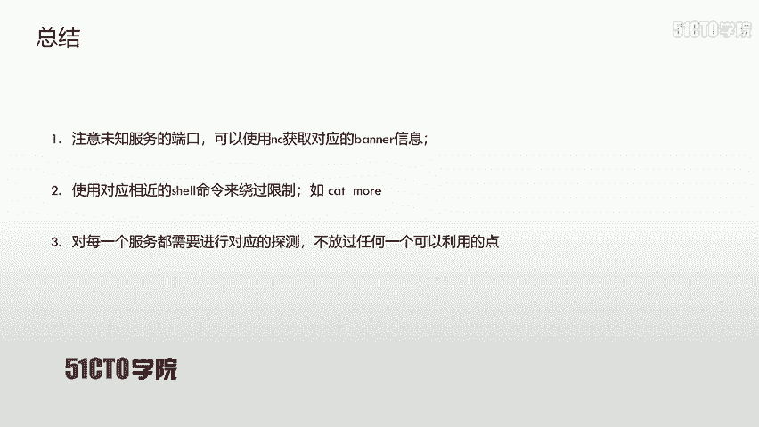

再见。