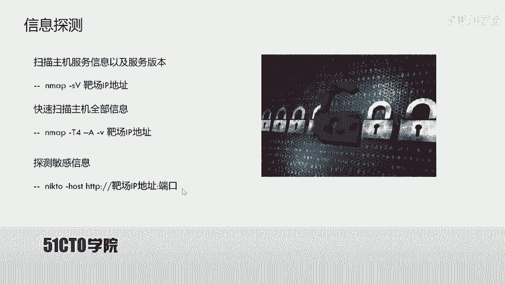
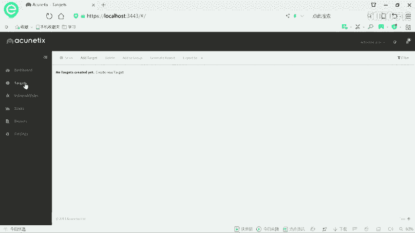
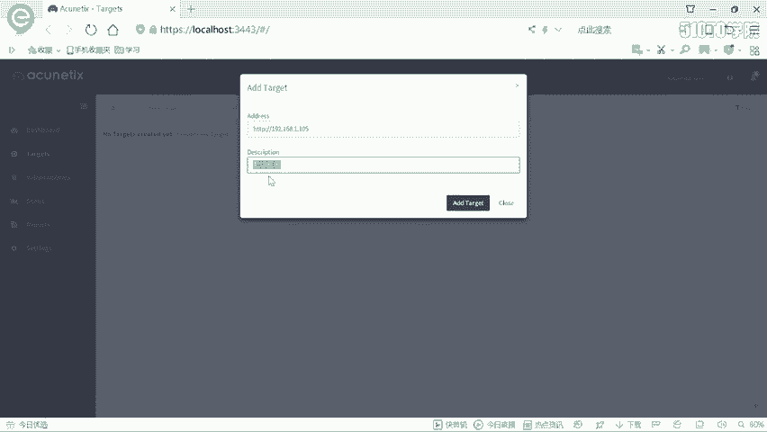
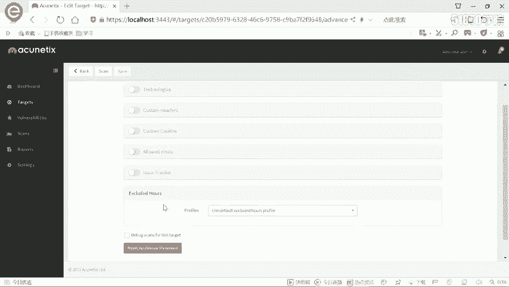
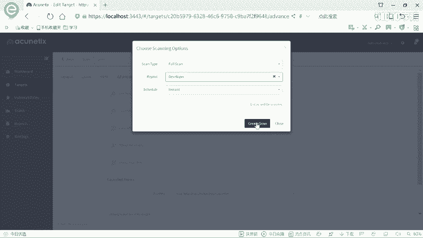
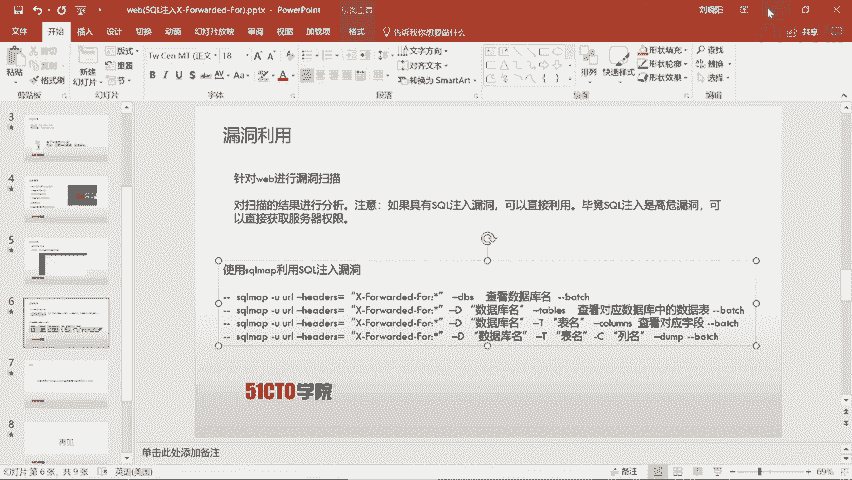
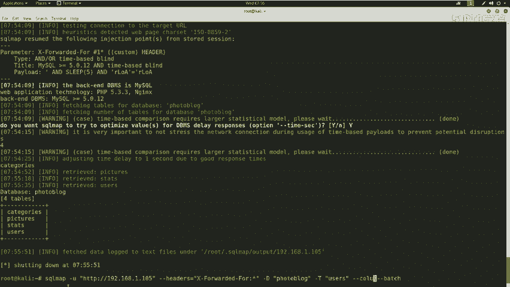
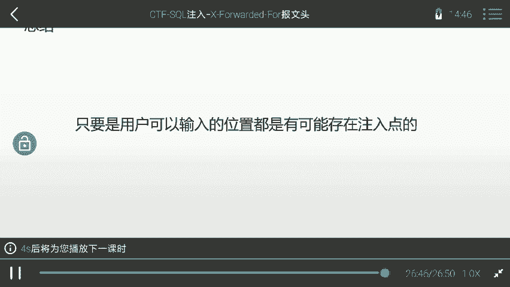

# 2024最新【网络安全／黑客】入门到精通课程教程，包括Kali Linux安装与CTF比赛教程（附安装包） - P35：10.11.CTF夺旗-sql注入(X-Forwarded-For) - AI-大模型基础 - BV1SK421Y7kA

第样我们开始CTF当中。完不安全，而苏客主劳动。其实哎在咱们外卖安全里面，这个circle注哎是一个特别重要的哎这个知识面。并且哎这里给大家说一下，就是咱们s科注入哎。

可以在任何一个位置都是哎具有可能性，都是可能出现的。那么咱们下面哎首先来介绍一下这个circle注意漏洞。首先s注入哎这个漏洞，哎，咱们通过这个漏洞进行攻击。

是指用户哎通过构建特殊的输入作为参数传入到哎咱们这个web in程序当中。web引用程序哎执行咱们这个传入的这个参数。导致咱们外背引程序执行了啊没有设置的啊一些srcle语句。

导致哎这个非法数据侵入到系统当中。这里给大家强调一点，就是咱们任何一个用户可以输入的位置，哎，都是可能存在注意点的。比如说咱们用户可以在URL就是这个网址标识符当中输入任意东西。比如说咱们有一个参数。

以干方式提交的ID这样一个参数，那么它就有可能存在对应的注入点。攻击者可以在这里构造恶意的srcle语句。之后传入给应用程序。以及咱们HTTP哎报网当中也是具有哎这样可以操作的位置。可以进行输入。

那么咱们构造对应的语句，也是可以来完成这个注入攻击的。下面咱们来介绍一下今天的实验环境。首先哎咱们是公积机，它的IP地址是192。168。1。104。靶场机器哎是192。168。1。105。

咱们拿到哎这样1个IP地址之后，哎，需要做什么呢？咱们今天的目的哎是挖掘web漏洞，最终登录哎系统。获得系统的登录权。以操作来咱们万命程序的来这个后台。下面哎咱们进行第一步来进行信息探测。

首先哎咱们拿到IP地址，哎，并不知道咱们这个系统哎运行的是什么系统，以及它上面开放了哪些服务。那么咱们就使用N map来探索一下哎这个主机的服务信息以及服务的版本。下面来咱们在卡利当中操作。

首先使用N mapap杠小S哎小S大V之后是咱们把厂的IP地址。1。105回车，咱们这时候im map开始对咱们靶场机器进行对应的扫描。并且发送大量的数据包哎给咱们这个靶场。

这时候哎咱们这个靶场就返回数据包给咱们N map。N map哎对于扫描结果会对其进行解释之后，哎，以标准的形式输出来。咱们除了哎可以获得这个服务信息以及服务的版本。

咱们也可以哎获取它上面哎这个靶场的所有信息。这里哎咱们就可以使用N map哎杠T4杠大A杠小V，然后加上靶场IP地址。咱们这里哎杠T4是代表哎咱们Nmap是以最大线程数，也就是最快速度对靶场进行发送。

数据包以及接受靶场回复的哎这个数据包之后是大A大A表示哎加载N map所有功能对靶场机器来进行扫描。杠V哎代表。咱们呃对于这个扫描结果哎进行详细的输出。对他探索过程哎也是进行对应的输出。

那么咱们下面在卡利当中实践。首先属于M map。之后哎杠T4之后杠大A杠小V输入靶乘IP。一点。105回撤。那么咱们这时候按 map哎发送所有的这个扫描模块。

到哎咱们这个靶场机器靶场机器根据响应哎返回对应的数据包来给咱们N map map来输出这样一些信息。对于哎咱们靶场信息之后，哎，咱们可以哎对其进行分析。咱们可以哎简单的看到，哎。

今天这个靶场所开张放的服务哎，只有HTTP服务，并且是80端口开放的。我们继续呃看它的这个全部扫描结果，会看到哎它的确是只开放了哎1个80端口，哎，并且这个80运行的是HTTP哎。

它的服务器是nes哎这样一个版本号的服务器。那么咱们哎下面就有必要去探索一下这个HTTP服务的敏感页面。咱们使用m two哎这样一个工具来扫描一下靶场机器的敏感信息。首先Ine to加上杠hot哎。

表示要加载一些主机之后是HTTP哎这个斜杠，然后是靶场地址，哎，加上冒号，加上端口号。对于这里的端口号，可以是哎任意端口号。但是哎如果咱们靶场开放的是80端口号的话，那咱们这里的这个端口是可以省略的。

如果哎它开放的这个端口。不是80端口，那么咱们这里的端口是不能省略的。下面哎咱们来操作。

使用n克 two杠hostHTTP。然后是靶场IP点105。因为咱们开放的是80端口，哎，咱们也可以在这里看到是80端口。那么咱们这后边就不需要加端口回车。这时候n to会扫描对应服务器啊。

以及挖掘啊内部敏感的一些信息。可以看到哎它的速度还是比较快的，并且哎挖掘到了一些敏感的信息。哎，有助于咱们后期来做这个更深入的分析。哎，也可以看到哎，这里哎找到了。一个登录界面哎。

并且哎这个是一个管理员登录的这样一个web界面。咱们下面哎就来打开一下哎这个登录界面。咱们在打开哎登录界面之前，哎，可以先查看一下这个网址哎，具体哎是什么样子。1。10。5、回撤。

咱们这时候哎发现是一个类似于哎。博客的这样一个页面。那么咱们下面啊来访问一下它的登录页面。这时候哎咱们打到了一个登录页面。对于登录页面，哎，咱们可以先尝试一下它的入口令。比如说addminadmin。

哎，咱们来尝试一下是否能登录。登录update哎发现并没有登录。哎，因为咱们的用户名或者密码是错误的，咱们再试一下哎，这个最敏感的一个绕口令，123456哎，这样来登录。update哎，发现也没有登录。

那么咱们这时候哎果断的放弃了弱口令的拆剪。咱们来看一看这个网站是否存在哎一些漏洞，可以帮助咱们进入到这个系统当中。那么咱们这时候哎就需要用到一个工具，一个。

AVWS这样一个漏洞扫描器来扫描一下web应用程序当中所存在的安全漏洞。当然哎咱们先介绍一下这个AVWS。它是一个功能强大，并且专注于万部安全的一个漏洞扫描器。怎么说他功能强大呢？可以说。他属于一个。

除了哎这个系统漏洞不能扫描外。它所有外安全漏洞都能扫描，并且哎它的这个更新速率也是比较快。基本上 web安全刚出的一些漏洞，它都集成到它自己的模块当中。所以说哎它不光是功能强大，而且更新速度也快。

所以说我们这里选择AVWS作为今天的漏洞扫描器。下面哎我们在我们的机器上打开AVWS。这时候啊我们登录登录之后，啊，我们可以使用它对应的功能。下面我们来添加一个目标，这里有tget。

然后点击and target来表示添加目标，点击之后输入咱们靶场的地址。

192。168。1。105。之后哎咱们这里描述一下。把厂机器。呃，这个描述哎，大家可以根据自己的需求去输入。

And他给他。那么咱们这时候哎就添加了哎这样一个目标。咱们这里哎选择normal，哎，这里不做改变。之后哎爬取的这里也不做改变。HTTP哎，这里也不做改变。以及他的高级选项。也不进行设置。

那么咱们直接哎点击扫描扫描，哎，咱们使用一个全扫描的类型，然后哎咱们生成一个报告。生成一个develop报告，那之后点击开始呃这个扫描。咱们这个扫描开始是需要等待一些时间的。

因为咱们AVWS需要内部加载很多扫描模块，加载完这些扫描模块之后，才能对咱咱们的靶场机器来进行对应的扫描。

可以看到哎，现在已经开始扫描了，并且哎这里具有这个进度条表示哎咱们扫描的进度。呃，这里也出现了一些这个安全漏洞的提醒。也可以看到哎，这里是一些这个中微漏洞以及一些消息，哎，或者是低微漏洞的这样一些信息。

呃，并且在这里也可以查看到哎，我们所抓取的这个靶场机器的啊一些服务器信息。比如说它的这个中间键，也就是它的这个服务器的中间键就是NGI。NX。以及他使用的这个语言是PHP这样一个语言。

我们这里哎正在扫描，并且扫描了32%的这样一个。过程。😡，但是哎我们忽然看见哎在这里出现了一个高温漏洞。那我们在这里看会看到一个盲柱，我们这时候点击一下哎这个盲柱来查看一下它的具体信息。点击。忙住哎。

是一个cicle注入。我们会发现。一直向下看，这里是漏洞的描述来，表示我们可以使用哎这个s哥注入来干什么，哎，并且可以达到什么效果。我们来看一下攻击的细节。这里哎他说了HTTP哎爆头当中的。

这个X forward for哎是可能存在一些漏洞的，并且它的这个脚本是这样子。并且他给出了一个呃探索的这样一个circle语句。可以看到它返红不同的时间。呃，我们来看一下哎，下面HTT爆头。呃。

并且可以看到一些漏洞的哎详细信息在这里。可以看到一些这个信息。我们通过哎刚才这样的扫描结果会发现，在我们HTTP黑暗岛当中的哎这个爆头是存在漏洞的。那么咱们既然扫描到了一个soccle注意漏洞。

我们怎么来利用它呢？那么下面哎我们就使用i circle map。来利用一下哎这个circle注油漏洞。首先啊使用circle map之后，加上杠U，加上对应的URL之后，杠杠DBS然后杠batch啊。

以及这个咱们这个handle啊，咱们要注意哪个点啊，这里是必须要加入hand的。adows啊，这里一直复制到这里，ctl C。呃，之后在这里。看rS。那么咱们下面就根据哎这个扫描的结果。

使用circle map来利用一下哎这个漏洞。

呃，咱们打开众卖。使用is circlecle map。杠U哎，咱们是HTTP。HDTP哎，咱们直接192点168。1。105。之后哎咱们注入它的这个ATTTP爆头。handow哎应该是heldos啊。

我们来查看一下。hel等于。X forty for啊，然后冒号，然后是星。等于。X。Forward地。4。行哎，之后咱们输入杠杠DBS表示探索一下数据库之后，哎，咱们输入杠杠batch。这个bes表示。

哎，咱们如果需要输入yes或not的时候，程序会根据哎这个实际需要进行自动输入。这时候哎咱们敲回撤。那么咱们这时候呃circle map会帮咱们自组来探索一下这个HTPhand当中注入点。

并且根据哎这个注入点来返回哎对应的数据。这时候哎咱们会基于哎这个HTTP爆头来逐步哎进行探测，哎，逐步注入。直到获取对应的数据。我们可以看到，哎，现在是。基于时间的啊注入。

这里来开始尝试一些时间的延迟来注入这个注意点。我们也可以看到呃 circlercle map给我们返回了呃当前的这个S four four啊，也是存在这个漏洞的。你想要探测其他的信息吗？哎。

咱们刚才加了刚刚bach。给咱们说到了，哎，这个直接哎不进行对应的探测。咱们这时候哎就开始逐步的哎进行这个返回对应数据库的名称。因为它是基于时间注入的啊，所以这里哎是一个字母一个字母进行返回。

可以看到哎，咱们这里返回了information哎schemer哎这样一个数据库。可以看到它是一个字符，一个字符而进行输出的。这时候哎咱们只需要等待就可以。咱们探测呃了一个数据库之后。呃。

马上呃这个scle map。帮我们开始探测哎第二个数据库名称。可以看到呃第一个字母是P啊，那么第二字母是H，第三字母是P啊，这样逐步来探测。我们从这里也会发现，哎。

这个circle map的确是一个强大的工具。可以看到，哎，我们这时候刚刚探测出两个数据库名。下面哎我们就对哎这个数据库哎进行。更进一步的探测挖掘内部的信息。

这里information scam是咱们系统自带的数据库，而photog block哎是咱们用户创建的那咱们下面哎就来探测一下这个数据库。呃，输入杠大D。PHOTO BLOG。

之后输入刚杠tables啊，来探测一下这个数据库当中的表明回撤。呃，咱们开始探测。并且啊和刚才的这样一个探测过程是类似的，啊，一步一步进行探测。这时候给咱们返回第一张表的表明。呃，可以看到哎，正在返回。

这应该是一个分类的这样一个数据库的表明。呃，咱们这时候返回了第一个表明。那么接下来呃开始探测第二个表明，并且逐个返回。其实呃咱们也可以在这里看到这个circle map。哎。

这个用户哎标记的注入点是用心来表示。呃，咱们可以哎用这个helsus the agent refer cookie。这样来设置，哎，也就是在这个hand里面。如果设置了星。

也就是咱们一开始参数哎星表示它我们想要srcle map探测的这个注入点。其实也可以在这个unerag哎来星来这个表示注入的位置。以及哎这个cookie和raffle哎。

这个重定向和咱们cookie也是可以使用这样一个操作的。然后他会询问你啊，是否来注入它呢？哎，这里咱们家刚刚bet哎给咱们进行了对应注入。这时候哎咱们看到哎返回了4张表明。

咱们下面就来探测一下呃对应的这个敏感信息，user user表示用户。所以说咱们就来探测一下Uer表。嗯但吃。杠T，然后是。Uses。刚ang刚culums。

咱们来探测一下字段。回车哎，咱们这时候开始探测。可以看到哎，咱们这里。呃，有时候会进行一些延时啊，然后。因为哎咱们这个网络环境，所以说有时候会造成一些延时，但，大家不需要担心，哎。

只需要等待circle map帮咱们自动恢复。嗯，可以看到哎，这个srcle map依然很坚强的被我们在探测着。哎，其实哎咱们也可以在这一条信息当中哎，看到circle map也会帮我们自动探测什么呀？

探测web in程序所使用的技术。比如说它的PHP版本。以及中间键所使用的哎这个类型。可能是neggs以及ap帕奇这样的一个中间键。咱们可以看到哎，现在已经探测出来了。第一个哎字段值是ID开始探测。

第二个字段值。其实呃咱们在以后的唉这个CTF比赛啊，或者是渗透测试啊工作当中，大家哎尽量使用这种circle map这样的circle注入工具来对呃对应的这个注入点进行测试，而不是啊进行完全的手工测试。

那样的话，哎对于这个自己哎可能是这个工作和这个比赛当中的这个时间都会花费很多。那么咱们这样的话就是事半功倍。可能哎别人用这个工具用一分钟就做出来了。而你自己哎逐个尝试circle语句。

需要哎大约好几个小时，甚至一天都无法完成。那么这样的话就是相当于哎你的这个能力还是跟别人就有所差距。毕竟哎咱们是要快速的完成测试的任务啊，以及比赛。

而不是哎为了展示自己哎cicle语句或者是自己的哎这个手工技术是有多强。一定哎不要万本求末。哎，现在咱们开始这个依然在。返回对应的这个值。嗯。当然这个过程有时候确实是比较缓慢的。

有时候需要很大的耐心去等待它爱的完成。可以看到，哎，咱们这时候就返回了哎对应的字段值log和pass word。那么咱们下面来猜测一下这个login和password的具体的值。这里来输入杠C。

之后是拉。应逗号PASSWID。之后哎，刚杠DUMP回车。哎，咱们这时候开始哎探测哎，咱们当前。这个login和password啊对应的字段的值。大家可以看到，哎，咱们当前的这个字段哎。

login哎已经破解出哎它对应的这个值是的命。并且哎咱们这个password还正在破解。由于哎pas是。那个MD5加密的密文，哎，所以说哎它的长度哎显示的是这个不规则的，以及它的这个字符，哎。

就是1个MD5的密文。并且哎逐一哎对它进行这个拆解。呃，如果这时候哎拆解过程比较缓慢，我们需要哎耐心的等待。我们也可以看到哎这个circle map。也给我们哎这个一个提示。请等待啊。

他正在在这个尝试破解。这时候哎我们破解完成哎，然后我们开始哎暴力来裁解这个MD5的啊这个密密文所对应的啊铭文。在这里哎大家也可以看到，哎，我们拆解完成。会发现哎。

咱们loging对应的这个值是admin咱们part哎这个密文所对应的名文是P4SSW0RD哎，咱们把这个密码复制出来。下面哎咱们破解成功之后，哎，就来登录一下这个系统。他的命哎。

然后把咱们对应的这个用户名哎输进去之后点击登录。会发现哎咱们当前就登录到系统的后台。咱们通过哎前面的操作哎，已经登录到哎系统的这个后台，并且哎可以在戏台。系统的后台当中哎执行很多操作。

比如说上传哎某个文件。通过这节课，哎，大家也发现哎咱们这个srcle注入哎是可以发生在任何位置当中的。比如说哎咱们URL哎是可以发生，咱们HTTP报文当中也是可以发生的。

只要是用户可以哎输入的地方都是哎有这种可能性的。

那么咱们这节课就到这里，哎，再见。