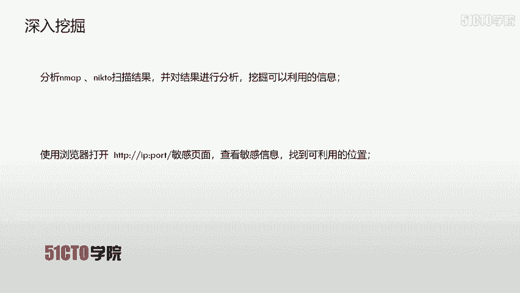
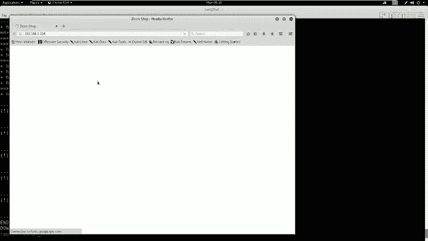
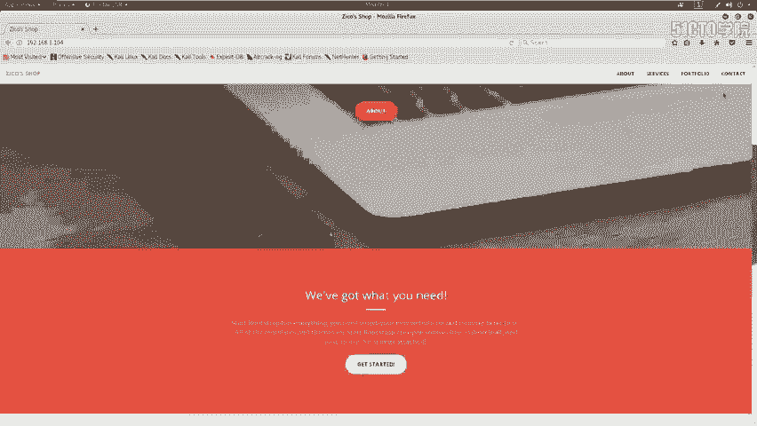
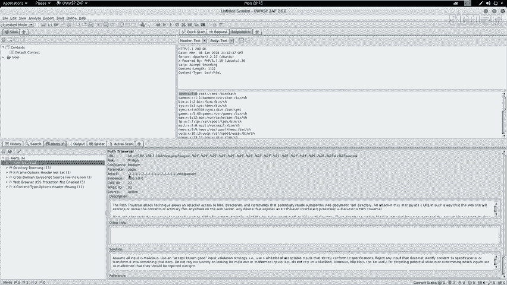
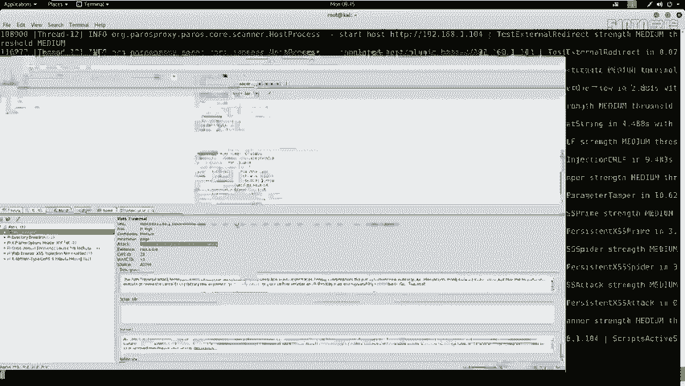
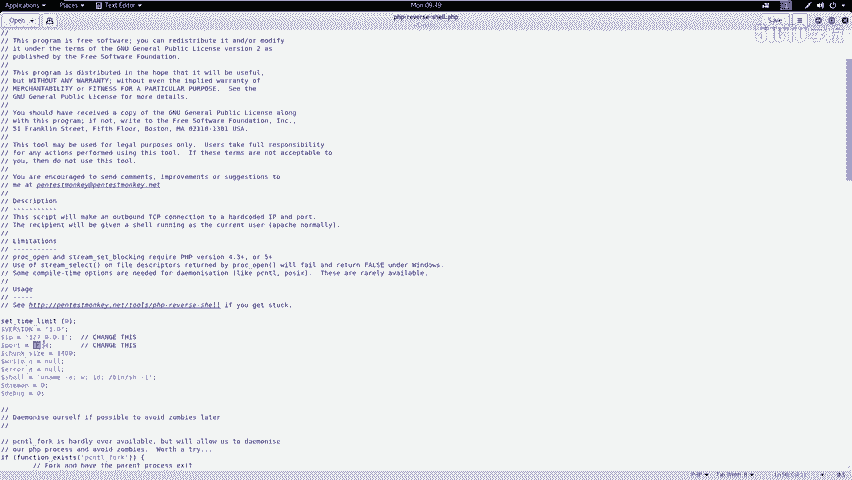
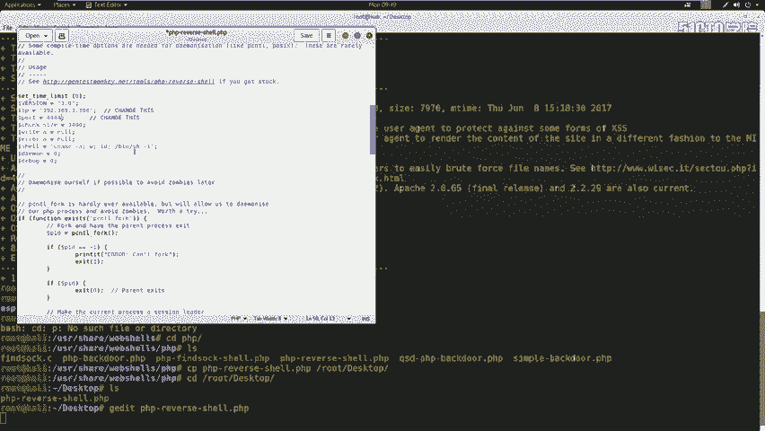
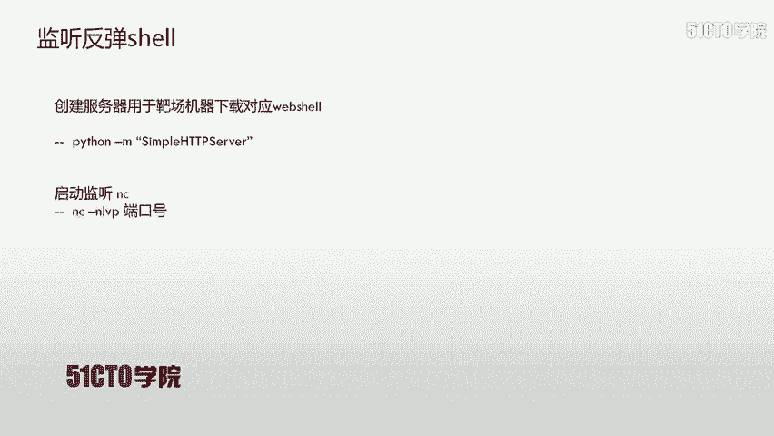
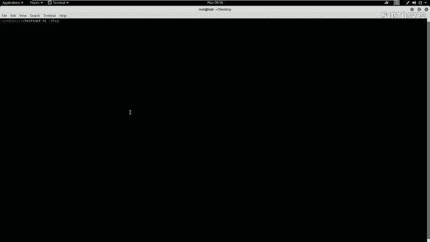
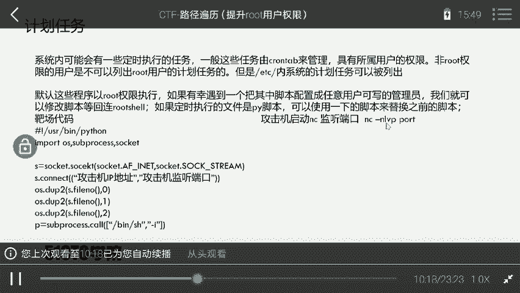

# 2024最新【网络安全／黑客】入门到精通课程教程，包括Kali Linux安装与CTF比赛教程（附安装包） - P37：12.13.CTF夺旗-目录遍历(拿到www-data用户权限) - AI-大模型基础 - BV1SK421Y7kA

我们来学习一下CTF训练当中的web安全当中的目录便利漏洞。我们通过目录便利漏洞，最终获得主机的root权限，取得对应的flag值。那么咱们首先来介绍一下目录便利漏洞。目录便利漏洞又称为路径便利攻击。

旨在访问存储在web跟目录文件夹之外的文件和目录。通过操纵带有点斜线序列及其变化的文件或使用绝对文件路径来引用文件变量。可以访问存储在文件系统上的任意文件和目录。当然，包括应程序的原目原文件。

以及配置文件和关键系统文件。需要注意的是。系统操作访问控制，如在微软的windows操作系统上锁定或使用的文件，限制了对文件的访问权限。如果我们在windows操作系统上设置了该文件对应的权限。

表示该文件不可读，那我们是不能通过对应的目录便利。来查看该文件的内容。其实，目录便利漏洞也称为点斜线目录便利、目录爬升和回溯。那么咱们下面就来看一下今天的实验环境。公击机我们采取卡利linux。

它的IP地址是192。168。1。106，把厂机器使用linux系统。它的IP地址是192。168。1。104。咱们现在拿到这样一个实验环境，该如何操作呢？咱们接下来的任何操作都要抱有一个目的性。

就是要获取靶场机器的root权限，得到对应的flash值。以这样一个目标去执行咱们接下来的所有操作。咱们现在已经拿到了把厂的IP地址。那我们接下来就需要对靶场上的一些信息进行对应探测。

下面咱们进行信息探测步骤。首先咱们要扫描该机器所开放的服务信息以及服务版本。这里咱们使用到A map。加杠小S大V。表示扫描。主机服务信息之后加上靶场IP地址。下面咱们在卡利linux实践。

首先打开一个终端。点击最大化之后，我们放大。使用M map杠小S大V之后加上靶场IP地址192。168。1。104回撤。这时候，n map开始对该靶场。进行电源探测。发送大量的数据包。到该机器上。

该机器会将响应返回到N map。N map进行分析之后会返回。对应的探测信息。以标准输出的方式输出到中班当中。看到这里，我们已经使用N map探测出该靶场机器所开放的对应服务。

我们除了可以探测该靶场机器上的服务，也可以探测该靶场上的其他信息。接下来我们就来探测一下该机器上的全部信息。这里我们依然使用N map之后加上杠大T4，表示使用N map的最大线程数。

也就是M map的最快速度来扫描之后加上杠大A表示加载所有扫描模块之后加上杠小V表示你发送的。这个数据包和接收的数据包都以详细的信息显示出来之后加上靶场IP地址。

下面我们来使用N map对靶场进行全部信息探测。首先输 a map。杠。T4来表示最快速度杠大A杠V192。168。1。104来进行全部信息探测回撤。这时候n map以最快速度去发送数据包。

并接收数据包。最终将探测结果显示到标准输出当中，可以看到我们速度非常快的来进行了全部探测，其中包括markag地址的探测以及网卡类型的探测，以及唉操作系统探测，以及最终路由信息探测。

当然也包括我们之前探测的服务信息。但是在这里我们看到服务信息更加详细。我们进行一个简单的对比。可以看到我们只是很简单的输出了服务信息。而在这里我们以更详细的呃这个探测结果显示。

我们在进行主机服务信息以及全部信息探测之后。会发现主机如果开放了HTTP服务，那么我们就可以使用对应的工具。对该HTTP服务进行对应探测。这里我们使用到neick to加上杠hot之后。

加上HTTP靶场IB地址，加上冒号端口号。这里大家需要注意，如果该端口号不是默认的80端口，而是其他端口，那么我们这里是必须加上该端口号的。同样，如果该端口是默认的80端口。

那我们这里的端口就可以省略到。下面我们使用ni two来对该靶场机器上的HTTP服务进行对应的探测。输入nick to，我们在进行nick to探测的时候，需要查看一下。

该扫描结果当中是否有HTTP服务开放。我们在这里会看到80端口开放了HTTP服务。那么这时候我们就可以放心的使用ni two来扫描该80端口开放的HTTP服务。

neick to加上杠hot之后是HTTP。之后是我们靶场的IP地址192点。168。1。104回撤。那么这时候ne two就对我们该靶场的HTT服务进行对应的探测。当然，我们让n two在这里探测。

我们来看一下还有什么工具可以探测，我们也可以使用DRIB加上HTTP，然后加上靶场的IP之后加上对应的冒号，对该靶场的目录信息进行探测。这里的端口号的使用和我们之前ne two的端口使用的方法是类似的。

接下来我们使用DRIB来对该HTTP符进行目录探测。首先我们打开另外一个终端。之后把这里放大。之后数DIB。之后HTP。192。168。1点。04。这时候我们回车。当下。

DRIB对该靶场的HTTP目录进行枚举探测。我们在探测的同时也可以。在这里会发现啊他也正在探测。并且探测出了很多结果。我们在DIB进行探测的时候，我们来看一下n to探测是否结束。

我们会发现它依然在探测。那我们先让它在这里扫描，那咱们这样探测HTTP的敏感信息。并且把这些敏感信息都进行对应探测。那我们就需要对该敏感信息进行深入挖掘。分析哎。

咱们刚才是用n map和ne two以及DRIB扫描结果，并对该结果进行对应的分析。挖掘可以利用信息。尤其是对于开放HTTP服务。的这样一个。情况我们可以使用IP之后，加上对应的端口号访问敏感页面之后。

我们可以查看敏感信息，找到咱们可以利用的位置。

我们回到卡例当中会发现这时候n two已经扫描完了。我们要来查看一下DRIB是否扫描完成。我们会发现DRIB也扫描完成。我们首先来分析一下ne two的扫描结果。会发现servva啊开放的是阿帕奇2。

2。22这样一个。中间键以及它的这个版本号以及它的操作系统。在这里也可以发现它有一些HTTP报投命设置。这时候可以造成很多的啊这样一些攻击类型。我们向下看，会发现允许的HTP的方法有option 。

get hand post。我们在下边也会看到。有一些哎这些。敏感目录。啊，以及其他的这样一些信息。以及它的PHTP的版本。我们这时候并没有发现我们可以马上利用那些敏感目录。

那我们这时候来查看一下DRIB是否扫描到一些敏感信息。我们打全屏。之后向上拉。会发现我们的当前结果啊是不太这样整合的。我们重新来使用该命令，对它进行扫描。

我们这里的扫描过程是枚举咱们user shellDIIB word list common TST这样一个字典文件，它里边共有4612个这样一个目录文件名。我们对其进行hand的方法探测，探测出。

究竟哪一个文件或者目录是存在我们该站点的？这时候我们也可以使用浏览器来打开一下干站掉。Open link。这时候我们使用火候亮览器打开。

我们会看到哎这里出现了一个类似商城的这样一个站点。

我们可以点击来浏览。浏览器中的内容。这时候我们看到。DRIB将该站点的HTTP服务来扫描完成，并且发现了很多这样类似的目录。在这里我们可以看到有一个DBatmin。

这样一个目录好像是一个数据库管理的界面。那我们现面就来打开该界面查看open link。这时候我们打开该目录之后，会发现有一个testDB的PHP这样一个敏感文件。我们点击打开。

会发现这里出现了1个PHP light amin这样一个类似数据库管理的系统。这时候我们发现了一些值得利用的页面。我们在挖掘完这些敏感信息之后。对于HTTP服务，我们也可以使用漏洞扫描。

使用对应的漏洞扫描器来进行web引领程序的漏洞挖掘。这里我们使用openwa ZAP这样一个web漏洞扫描器。来对我们今天的外营程序进行对应的漏洞扫描，这是它启动的界面。

下面我们就来卡利当中使用这个漏洞器，对站点进行漏洞探测。首先我们打开终端之后输avap。按tom键自动补全回车。咱们这时候开始启动。A was， they P。咱们在启动过程当中。

这个扫描器会加载很多这样扫描模块。我们只需要耐心等待就好。我们点击start。之后我们在这里。O。之后我们在这里输入我们今天的靶场IP地址。我们输入192。点168。1。104之后，点击attack。

之后我们这个漏洞扫描器会对我们当前的站点进行对应的爬取，爬取可以获得页面。取完之后自动发送到。主动扫描的模块当中，对该站点进行主动扫描，挖掘其中所存在的漏洞。在这里。也有我们当前扫描的进度条。

看到我们这里速度还是比较快的。并且在这里可以看到他当前发送的呃这个数据报已经发送了。1000多个1400多个。这时候我们也可以点spider来查看一下我们查取到的页面。我们可以看到我们已经发现了39个。

页面。并且我们对它进行对应的漏洞扫描。在漏洞扫描结束之后，我们点击alot可以查看来对应扫描到的哎漏洞信息。在这里。如果是红色的呃这样一个小极帜，表示是一个高危漏洞。如果是。黄色的话哎。

它表示一个中微漏洞。如果是浅黄色的话，啊，它是一个低V漏洞。可能并不具有任何利用价值。在这里我们发现了一个目录便利的漏洞。我们点击之后。会弹出具体的细节。我们会发现，如果我们访问该URL的时候。

就会弹出我们。ETCpass哎这样一个文件的信息。我们把该目录的信息，也就是该URL的信息controrl C之后。使用我们浏览器打开。点击conttrol位回撤。

那么这时候哎我们浏览器当中就返回了ETCpassword哎这样一个文件信息。通过这里我们也会发现。该站点是存在目录便利漏洞的。我们在扫完目录便利漏洞之后，我们需要分析一下扫描结果。我们刚才也在。

对应的扫描器当中发现了啊该漏洞。所执行的条件。可以看到我们这里啊使用了这样一个payload，那也就是对应的测试代码。如果我们这里ETC。password换成ETCs哎就可以查看。

该站点的sle文件内容。

我们下面回到浏览器当中来修改对应的内容。

这里我们只需要把pass修改为CR。都回车。但是我们并没有返回sele的内容。因为。服务器还设置了sddle是不可读的。所以说这里我们并不能查看到对应的sle信息，我们再把它改为pas word。

可以看到我们又回到了这样一个信息。所以说在这里我们修改对应的路径，可以查看不同内容。只要该路径下存在该文件或者该文件设置的权限是可读的。我们刚才对目录便利来进行了对应的分析。分析之后。

我们该如何利用该漏洞来获取shall呢？接下来我们提供对应的思路。首先我们要上传一个web share到服务器之后，通过对应的目录便利路径访问web shell执行web shell之后。

那么咱们就在卡地端。监听的哎这个反弹 shellll获取了访问服务器的sll。那么咱们这时候就可以在卡利当中执行命令来操作远程的靶场机器。这是咱们对应的思路。

咱们接下来就需要在敏感页面中上传web shell。我们刚才也发现了DBatmin敏感目录当中有一个testDB点PHP这样一个页面，并且我们可以登录。

但是登录是需要密码的那我们这时候就可以使用对应的弱口令来尝试登录。我们在系统当中，弱口令可以分为字母型和数字型。字母型大多数人是使用addmin作为登录的密码和用户名。

而数字型大多是使用123456作为对应的密码。下面我们来尝试一下admin进行登录，使用admin。点击登录，我们会发现这时候轻松的来进入到该系统的后台。我们在进入系统的后台之后。我们要查找，可以写。

web shop的点之后，利用该点。来写入咱们想要的这个weshop。当然，咱们卡利当中。也是具有对应的web shell代码的。咱们需要。对应的代码。之后写入到系统当中。

下面我们来查看一下web shop内容。首先我们打开一个终端。CD， you的 shall web share。L4CDPHP我们今天使用PHP的。Weshop L S。我们会发现哎。

这里有几个这个web share。我们今天使用。反弹的I这个we上。首先，copy。PHP。revo需要到咱们root目录下的desktop。拷贝到桌面之后切换到桌面。

我们来查看是否拷贝到这样一个we share LS。可以发现我们具有了这样一个web shell。接下来我们来查看一下web shell内容，并对其进行对应的修改。我们向下看会发现呃这里有一个。

需要修改一点。这里需要修改我们反弹的。这个IP地址，也就是我们公积机的IP地址，这里是需要反弹的端口号，也就是我们公积机监听端口。

我们首先可以查看一下我们该公积机的IP地址，打开一个终端F config来查看192。168点。1。106啊，把它拷贝出来。之后我们回到刚才的这个编辑文件当中。将1027。这样1个IP地址。

给它换成哎咱们卡利的IP地址之后把咱们监听的端口改为444。这里也可以使你想到的任何端口点击s哎之后，咱们这个wep shop编辑完成。

那咱们为了更方便操作，可以把该we shop修改对应的名字，使用木PHP。之后咱们改为hell点PGP回撤。这时候哎咱们就修改了该weshop。的名称，并且对其内容进行了对应修改。

首先哎咱们要找到对应的放写入we shop的点。这时候我们会发现。可以读可以写的数据库存储的啊位置。比如说这里user database test user也有user database exportport点PHP。

这时候我们就会想到，如果说我们数据库的名称改为点PHP文件，那是否我们在使用远程目录便利的时候来便利该数据库。该数据库是以调PHP结尾的。那么我们当然是以PHP。来执行该文件的。

下面我们来创建一个数据库，数据库名为sell点。PGP。点击quiit。那我们就创建了一个。shall点PHP的数据库，我们点击选中该数据库。那么接下来哎咱们又要新建对应的数据表。

之后新建对应字段字段的值。哎，我们可以设置为咱们要写入的这个web shell的对应的指令。比如说我们PHP要执行对应的命令。切换到tamp目录之后，我们使用web get之后下载该靶场。

也就是该卡利上的这个。web shell来之后下载到靶场机器上来将它修改对应权限之后，使用PHP来执行该web shell。接下来我们就来操作。首先这里我们输入一个字段。比如说我们字段名叫做肖。

之后我们添加一个哎字段。这里是它的table。之后我们输入hell之后我们这里type选择TST。这里我们就需要。输入哎，我们要执行的指令。这时候我们打开一个。GDIT。City， desktop。

Al莱斯DDIT。之后shall点TIG。我们来写一下哎对应的 shell项。首先我们要写入一个问号PP。接下来还要执行对应的指令。我们可以。输入S双引引号之后，哎，我们CD。Tempamp。加一个。

分号来表示第一条指令结束来输入第二条指令。我们首先we get。HTTP。我们当前卡利机器的IP地址表示，要从卡利机器上下载对应的web shell。PHP。下载完之后，我们需要对它修改权限。

给它加一个可执行的权限。在设置完权限之后，我们来执行。I will show。来获取来对应的。这个监听。是。我们下面来把这条指令复制到对应的字段当中。Control A， controll C。

之后我们在对应的浏览器中当中添入对应的字段。点击create这时候哎我们就。尝试写入了这样一段代码。接下来我们就要使用。对应的。监听。来监听反弹的事。

首先我们要在服务器创建一个用于靶场机器下载的we shell。首先要创建服务器，这里我们使用pathon的一个模块，是simple HTP server来创建一个简单的HTPserv。回到这里。

我们首先。切换到桌面。CD。That's talk。Al来。之后我们来使用pasin杠M。之后把我们是。HTTP。Simple。启动。该服务器ATP。蛇网不撤。那么这时候哎咱们就开始了一个服务器。

并且它的根目录是在桌面的。所以说我们直接访问。该机器的IP地址加上对应的这个800端口，就可以下载到该se。同时我们也发现刚才所写的这个hell是有问题的。我们下面来对它进行重新书写。我们继续哎加一个。

小一。他有一个字段。这里我们这个字段叫做sell，并且它的这个类型是test之后我们conttrol位。我们要把刚才下载的。这个地址后面加上一个。8000。Quit。

这时候啊我们就表示哎从该P地址的800端口开始下载web shell，对它进行修改权限之后执行该we shell。我们再下载了呃这样一个。文件之后就可以反弹并应是效。但是反弹之前我们需要创建。

创建该需要监听。端。这时候我们打开一个终端。这里使用NC。我们来看一下对应的命令。NC杠NLVP之后加上端口号。刚才我们反弹的哎端口号是444啊，我们该端口也使用444端口。

NC杠N。LVP。

444端口，我们启动监听。我们在监听的过程当中，哎，就可以使用对应的目录便利访问来访问该机器的。thewebshop啊之后获取反弹的项。我们在浏览器当中。找到哎刚才的哎这一段代码。

这时候我们不会访问ETC passwords。而是访问我们该机器上对应的user database。像PHP。我们把它复制出来。copy之后，我们修改哎对应的目录访问。看超威。

user database12点PP这时候我们回撤执行。我们回到。这个NC的监听单会发现这时候给我们返回了把对应的 shellll。我们把它变大。会发现我们当前唉是使用。3Wdate来登录的。

并且返回的该 shell要啊，只是一个简单的反弹 shell要，并没有来真正启动系统的终端。那我们接下来就使用pathon杠C来之后点击。使用PTY这样一个模块PTYspace，然后base啊。

然后启动对应的终端。下面我们来启动该终端。首先pasing杠C。之后是import pTY。TY封号。PTY讲pain。之后哎我们beinb。之后回撤，这时候返回了哎对应的PTY，也就是对应的终端。

我们在返回哎终端之后，哎，就可以对它进行操作。而我们现在拿到的用户权限是3Wd，并不是root权限，我们就需要对它进行对应提权。我们下一节课将给大家介绍如何提取对应的权限。下面我们来进行总结。

首先咱们可以通过目录便利，配合文件上传m shell之后启动对应的监听，反弹回咱们靶厂机器对应的shall。同时，目录便利也可以用来获取敏感信息。

比如咱们可以获取ETC下的passWD和sddle哎这两个文件之后，使用uns将两个文件。重新定义为dwn可识别的quied这样一个文件，最后使用d来破解该linux。用户名和对应的密码之后。

可以提升对应的权限，或者使用远程登录该服务器。这就是咱今天所使用的这个目录便利漏洞。咱们这节课就到这里，再见。WP也就是wordpress的渗透中启动对应的主题，然后在404页面上传对应的hell。

那么mattter bullet监听端就会获得对应的hell。那么这节课就到这里，再见。

是否具有？root用户所设置的可写的这样一个任务。我们回到卡例当中，首先cat一下ETC。croown tab回车。我们再查看该文件内容发。

