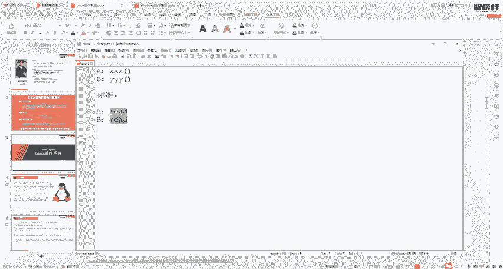
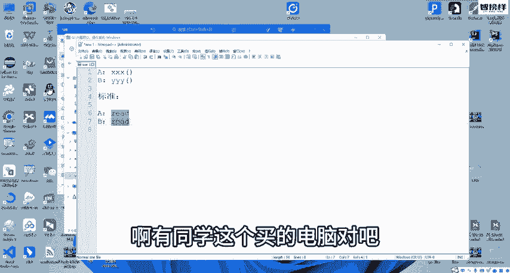
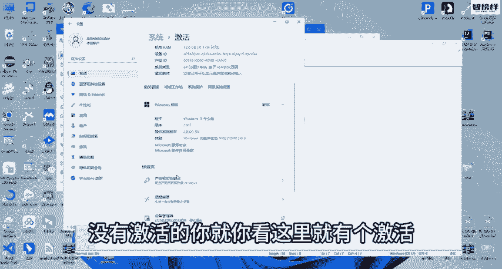
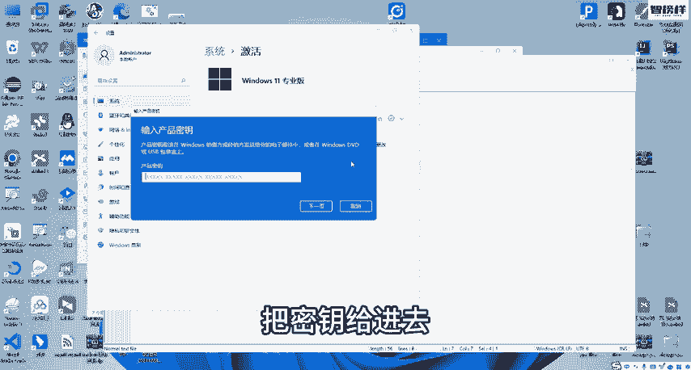
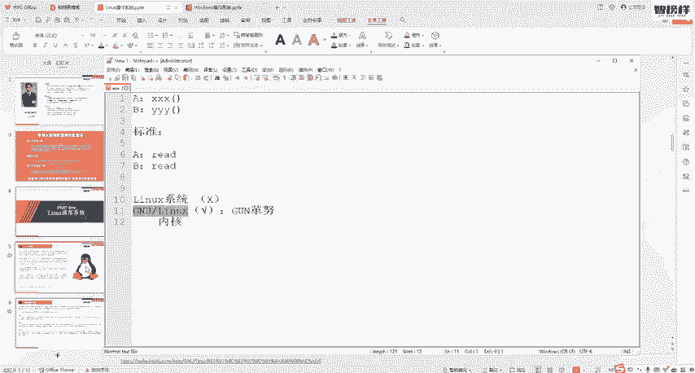

# 2024最新【网络安全／黑客】入门到精通课程教程，包括Kali Linux安装与CTF比赛教程（附安装包） - P3：02.Linux操作系统是什么 - AI-大模型基础 - BV1SK421Y7kA

hello，同学们大家好啊。那么接下来的话呢，我们来认识啊这个一款操作系统叫做linux啊，当然有人喜欢说成是linux啊，这个每个人对吧？自己喜欢什么样的读法都无所谓啊。

你要只要知道别人不管说linuxlinux指的都是这个LINUX。那么linux啊它也是一款操作系统，跟我们上节课程讲的window操作系统一样啊，它也是一款操作系统。呃。

那么很多同学可能没接触过linux啊，甚至连听都没听说过，对吧？啊没有关系啊，这个linux啊还是这个应用还是非常非常广泛的。那接下来的话呢。

我们就啊来学习一下什么是linux以及ux当中的啊这个相关的各种操作啊，ok那么这节课程呢仍然是由n扫事给大家带来啊，那么在课程开始之前呢，还是要强调一下啊。

同学们一定要遵守我们中华人民共和国的网络安全法，好吧？O好，那么这里啊我们直接来看什么是linux。呃，linux啊这一款操作系统，我们首先呢需要来了解几个名词啊，第一个是unix unix。

它本身也是一个操作系统啊，最早的时候是在220年代起啊20世纪70年代出来的。呃，它比我们的windows还早，对吧？windows是80年代，嗯，那么啊unux这一款操作系统啊。

在这一款操作系统基础之上呢，又去演变了很多不同的操作系统，那么这些基于unux这一款操作系统演变而来的系统，我们就把它叫做类unix系统啊，像我们的今天主角格鲁linux它就是一款类unux系统。

另外还有free bSD啊，open BSD啊Qex等等等等啊，像这个Qex对吧？大家知道这个未来啊，理想啊、小鹏汽车，对吧？像这些魏小李啊智能汽车，它们在汽车上面。仪表就说显示那个什么转速啊，马力啊。

对吧？大家没没开过车，你也坐过嘛，对吧？能看到司机面前有一个仪表盘嘛，那么这些汽车智能汽车，现在智能汽车的仪表系统用的都是Qex啊，另外的像这些什么其他的frSDR这些我们可能基本上都不会接触，好吧。

所以就不用管它啊，你只要知道他们都是类unix都是基于unix演变而来的系统，好吧，然后unix啊它这种系统呢。😊，它就制定了自己的一些标准啊，你要符合我的这种标准，同时又是由我眼进来的。

你才能够叫内unux系统。像我们说的这个苹果的电脑系统，mac OS，苹果的手机系统IOS是吧，什么安卓啊，它其实都是我们可以都都可以把它们看作是内unux系统。

但是啊但是虽然这些系统都是内unux系统。啊，就是虽然这些系统都是内unix系用，但是获得unux标准认定的也只有苹果的电脑系统nac OS啊，这是因为。你说人家不符合我的规我的标准，我的规定。

所以没有认定认证吗？不是的，而是他的这个标准认定价格太高了啊。苹果公司有钱作为商业公司，对吧？开发的这个呃基于unux，搞的这个类unux系统它这个去认证一下啊，但是linux啊。

我们今天主权linux的话，它它是一个免费的软件啊，免费的系统开源的系统，开发源代码的系统，它这个虽然没有认证啊，但是它其实也是符合unux标准的，好吧。O呃那么接下来再来一个名词啊，叫做啊。

这里出来很多名词啊，其实也没什么，大家有所了解就可以了。好吧，你不需要去做什么啊，我要把它全部背下来啊，像像我以前背这个语文书对吧？背课文一样全文朗读并背诵没必要没必要好吧。

这个大概了解一下什也是一种啊标准，但是这种标准呢不是像我们之前讲的un标准一样，而是什么专门针对于接口的一种标准啊，什么叫做接口标准呢？还记不得我们之前讲操作系统时。

我们说操作系统的这一个重要组成有内核啊，有驱动啊，有系统调用接口啊，对吧？还有外围啊那这里接口它这个就是针对接口的一种标准啊，这个接口什么标准呢？给大家举个例子啊。

比如说呃我们有很多很多不同的操作系统对不对？在A系统当中，我想要读它里面的保存的啊硬盘里面保存的某一个文件，哎，可能它提供的方法是叉叉啊叉。😊，你要调我的叉叉叉这一个方法，对吧？

叉叉就是我提供给你的接口嘛，你要去使用，我给你提供的这个叉叉来读文件。好到了B操作系统当中呢，我想读它的文件，它可能提供的接口叫YY哎，你要调我的YYY来读我的文件。那你看啊如果说不同的操作系统，对吧？

哪怕我们都是都是基于这个unix开发的都是系统，但是也有这么多呀，那一个系统它给你提供叉叉一个系统提供YY一个系统提供ZZ你想想多麻烦多难受，对不对？你要去用这个系统。

你要重新学重新把所有的这个接口都变了都不一样。你写好的一个程序，写好的一个软件在这个系统上面能走到另外一个系统你又要去改所有的代码都要改，那麻烦死了。所以这时候呢就定义了一种标准。听那种标准。啊。

这种标准就规定了说啊你这些呃类系统是吧？唉，你们都给我用一个方法来读文件，这个方法叫做read啊，就不管你A操作系统还是B操作系统还是C操作系统？

不管你是ux啊还是QX啊还是苹果你们这些系统提供给人家的要读文件的接口都给我叫read你看这时候那不就好了吗？对不对？我们只要学学就是开发的时候，我们开发一个软件，我是不是可以在A系统跑。

我也可以在B系统跑，对不？因为他们要读文件调用的接口都是read啊，所以这就是啊标准标准就是针对这种接口的一种标准那我们的ux呢就是一种基于这种标准的类系统是一款多用户多任务对吧？

多线程多CPU的那windows其实也是一样的，windows也是多用户多任务的但windows的话它就不是基于标准然后是微软自己的自己的接口自己的标准好。

它是免费使用开源的啊，它不像我们的苹果OS对吧？苹果OS它是闭源的要收费的系统啊，就你要用它这个操作系统，你要给钱给苹果公司，但s不用ms你可以完全免费使用啊，windows也是收费的嘛。

你要你要你要就是你要使用windows对吧？你要像微软去购买一个那个叫什么激活码嘛啊，有同学这个买的电脑，对吧？想说我买的电脑我没有买什么激活码，我就能够用windows了，这是因为什么？

这是因为对把这个。😊。

这个大家都知道的情一些情况嘛，就是有第一个有破解的对吧？第二个是你购买，如果你是购买这个正规渠道购买的电脑啊，那他一般的就是他这个激活码就已经是在啊在他的这个。就在他的这个呃。

你购买电脑的钱里面已经给他了啊，就这个系统的钱已经在电脑。这一个价格里面的，好吧，如果如果你是其他的渠道，对吧？我也不知道什么渠道，别问我啊，这个什么渠道，你买的电脑的话，对吧？他可能盗版的啊。

或者说没有激活的，没有激活的，你就你这里就有个激活激活状态，你要去购买一个密钥，对吧？把密钥给进去，你才能够才能够使用正版的这个windows操作系统啊，就这个意思啊，inux是免费的。

O那么linux的话，这里要跟大家讲一下，好吧，我们平时说lininux系统，其实。

这是什么？这是错误的。为什么呢？因为newux它实际上只是一个内核，对吧？我们操作系统只是一个内核，那光只是一个内核，你能用它吗？你没用啊，它没有驱动，没有接口，对吧？

你用不了其他的一些外围键盘鼠标都用不了，那你能用吗？你用不了啊，对吧？所以这时候我们平时日常生活中所说的newux操作系统实际上是什么？实际上是nolinux啊，这个GNU啊GNU。😡，机恩油。

这里的GNU是什么呢？😡，我们一般的把它叫做隔奴。阁炉啊阁炉它本身也是一个操作系统啊，它也是一个计划。就这一个操作系统啊是这样的，它的内核一直没有开发好，一直没有开发完。

所以呢唉它就把linux这一个内核拿过来了啊，跟自己组合到一起，对吧？就就格奴的话，它可能有有这个驱动，有这个接口，对吧？能够去使用外围啊，但是。😮，它没有内核，它内核没开发好。

但把inux内核拿过来就组成了这样的一款操作系统。格奴linux啊，只不过我们平时日常生活当中，对吧？你说格奴linux操作系统。格伦newux操作系统没人这么说，而是一般都说new有操作系统。

ux操作系统就是其实就是一种简称啊，就懒懒得说这么长嘛，对不对啊，就干脆说成newux操作系统啊，就这么一个意思好吧，就这么一个意思啊。😡。

OK呃，那么这里呢也有一个unux的标准啊，感兴趣的同学可以自己去看一看啊。OK呃，那么这里我们了解了一些名词啊，也知道了linux它哎其实指的是格奴linux。

它是一个格奴加linux内核的一款操作系统，它是一个免费的对吧？开源的一款操作系统，一款内unux操作系统。O这是这一张我们所了解到的内容。😊。

