# 2024最新【网络安全／黑客】入门到精通课程教程，包括Kali Linux安装与CTF比赛教程（附安装包） - P40：15.17.命令执行(使用集成工具测试) - AI-大模型基础 - BV1SK421Y7kA

今我们继续完保安全当中的命令执行的学习。我们通过命令执行哎，最终获得主机的对应权限，并且我们最终root主机获得哎这个主机的最高权限，取得对应的flag值。那么咱们下面来介绍一下命令执行漏洞。

命令执行漏洞哎，是这样产生的。当应用需要调用一些外部程序去处理内容的情况下，就会用到一些执行系统命令的函数。如哎咱们PHP语言当中的systemESEC shellESEC等。

当用户可以控制命令执行函数中的参数时，那么啊咱们就可以注入恶意系统命令到正常的命令中，造成命令执行攻击。那么咱们在调用这些函数执行系统命令的时候，如果啊没有把用户的输入。进行严格的过滤。

那么咱们用户输入将作为系统命令参数拼接到对应的命令行中，造成对应的命令执行，最终哎导致命令执行漏洞。那么咱们下面来介绍一下今天的实验环境。首先，公击机使用卡林linux，它的IP地址是192。168。

253。12靶场机器使用linux系统，它的IP地址是192。168。253。18。那么咱们拿到这样一个实验环境该怎么做呢？首先哎咱们一定要抱有一定的目的性去做一件事情。

而咱们在CTF比赛当中一定要抱有获取靶场机器上flag值作为对应的目标。来依此来进行对应的测试。咱们在进行测试时，首先第一步要进行对应的信息探测。在之前的课程当中，咱们使用了很多命令行的工具。

如nic two以及咱们DIRB这样命令行工具。在一个黑色的命令框中输出对应的输入和输出。那么咱们现在就使用更高级的工具sing工具来进行进行探测。它是一个对应的用户界面的这样一个工具。

它可以调用很多呃命令行工具之后将输出结果输出到咱们当前的这个集成框架sty当中。那么咱们下面就使用该工具对我们今天的靶场进行对应的信息探测。首先回到卡利linux。接下来哎咱们输入。

P来测试一下是否和靶场机器哎联通68。253。18回车。咱们看到这时候，靶场机器返回了对应的ICMP响应ctrorl C哎结束。在这里哎也可以证明哎咱们和靶场机器是联通的。

下面咱们打开今天信息探测的集成工具sspty。回车哎，这时候咱们打开了哎这样一个图形界面的工具。在这里，咱们首先将目标输入到spartty这个框架当中，可以点击这里。

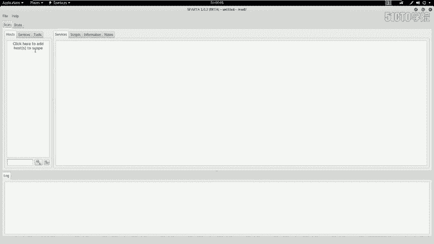

这时候输入咱们的靶场IP地址，192。168。253。18之后，点击and toco表示加入到扫描的范围当中。

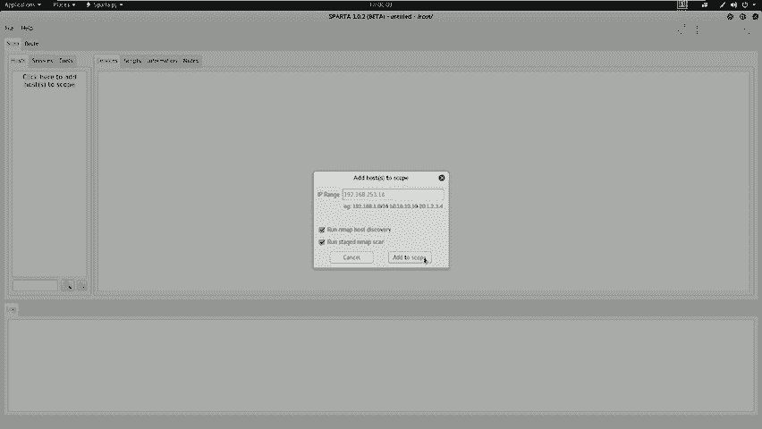

这时候哎咱们在输完之后会自动调用N map对咱们对应的靶场机器进行扫描。在扫描的过程中，除了调用N map，也会调用link two哎这样的工具，对靶场进行敏感文件的扫描，以及会抓取靶场的快照。

这里啊我们可以看到哎它扫描出来。的结果以及用了很多这个对应的线程调用不同工具来进行对应的扫描。咱们在这里可以看到哎对应的扫描这个服务。开放了23号端口，哎，以及80端口以及8080端口。

并且给出了哎他们对应的这个服务的名称。咱们进在进行完扫描之后，哎，是需要对咱们这个扫描结果进行对应的分析。我们下面来就来针对80和8080端口进行对应的分析。首先我们可以看到开放的是STTP服务。

8080也是开放的HTTP服务，以及它的这个版本，以及它的这个使用的编程语言。我们可以看到使用的是pathon2。7。1这样一个编程语言。

那我们下面哎就对当前啊的这个80端口以及8080端口进行对应的信息探测。在这里我们选中80端口之后，点击鼠标右键。可以看到出来很多选项。我们这时候首先哎打开一下浏览器来查看一下对应的页面。

这时候哎我们就打开了火狐浏览器，以及打开了靶场的这个站点。可以看到哎，这是它页面的首页。之后我们右键继续来查看一下。他所使用的哎这个CMS啊，以及他所用的哎这个语言。

可以看到what frame啊正在扫描。在这里啊也可以看到它扫描的进度会看到它显示啊这是一个哪个国家，以及它使用了什么语言框架，这里使用pathon张gle框架，以及它里这里有HTTPserv，啊。

也就是HTTP服务器的版本，以及这个服务器所使用的编程语言。又有它的这个IP以及它的title，以及它的这个t options这样一些信息。这里我们可以发现啊，当前这个站点是使用。pason哎编写的。

在收集完这些信息之后，我们还可以呃使用A map扫描该端口。这时候哎在下面我们可以看到N map哎继续来探测当前的啊这个80端口。可以看到哎探测完毕，这时候啊我们还可以使用。

nick two哎来进行扫描，可以看到哎n two也。回复了啊一些信息。并且啊对这些信息进行哎对应的注释。会发现呃，差这个SS的 protection这个保护头没有被设置。

以及后面给出了这个头的具体作用。可以看到哎，这里有一个叉 content type options，这个header也没有设置。这个允许啊用户代理啊去从定向内容到这个站点。

通过不同的哎这个mini type。这里我们也看也看到哎没有发现CGI的呃目录。这里我们也可以看到，该站点跟目录下是具有DV这样一个敏感目录。这时候啊我们让它在这继续扫描。除了使用link to之后。

我们右键可以看到这里还可以哎使用DII boost哎来进行暴力。探测该站点下的目录以及文件。我们下面使用DI boost来探测目录和文件。我们会发现，哎在这里打开了DI boost来探测站点的目录。

我把它最大化之后，我们选择对应的文件，可以看到finway list of DIL files。它表示哎我们需要打开文件作为目录或者。文件的哎这个字量，我们点击baloser来查看。

这里哎我们使用卡莉下哎自带的这些工具。嗯，这些目录文件我们在。D IR。不少。what list啊之后我们发现这里啊使用Dlist1。0，点击set。设置完这些之后，我们把它的这个线程也调大。

我们调到20。往大调点，调到21。之后啊我们其他选项不进行勾选。这里啊我们看到它的文件的扩展名是PHP实际上啊我们使用章gle来编写。该站点的那我们的文件扩散名就应该是PY表示pathon的这个后缀名。

之后点击start开始暴力探测。这时候我们这个当前DI boost啊就开始对我们该站点进行对应的目录探测。会发现哎这里哎正在探测，并且这里有对应的进度。我们可以看到要探测283402个目录。

我们现在已经探测了3000多个目录。这时候我们会看到哎弹出了一些哎目录信息。并且它的后缀名按是点PY结尾的。这时候啊我们先让它在这里进行探测。我们在探测完哎这些信息之后，哎。

我们就需要对当前信息哎进行深入挖掘。可以看到我们刚才使用浏览器打开了哎我们的站点主页。如果说我们稍后扫描到的哎一些页面或者目录是存在一些敏感信息的话，哎，我们就可以使用浏览器来打开。这时候哎正在扫描。

我们这里啊也可以来分析它扫描的结果。首先他发现了at命哎这样一个目录。如果说哎大家很有经验的话，哎，这个N的命啊是代表后台登录哎的这样一个目录信息。我们这时候就可以哎在浏览器当中打开这样一个目录。

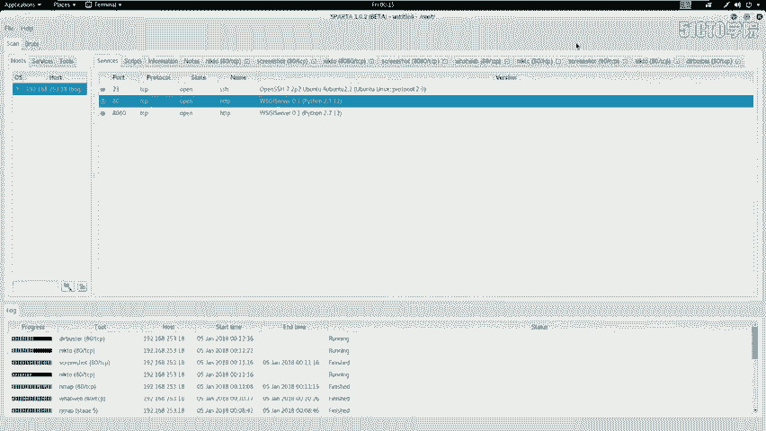

打开浏览器哎，之后我们输入。刚才的all命。回车。这时候啊我们会发现这是一个登录界面。

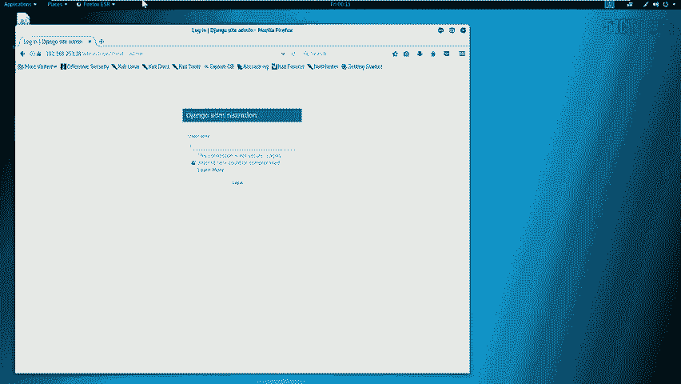

需要我们输入对应的用户名和密码。

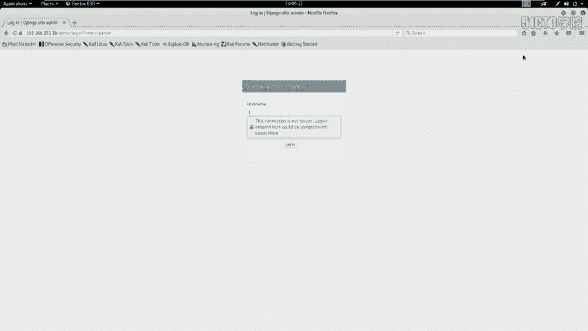

在这时候啊我们来继续查看一下是否还有其他敏感信息。

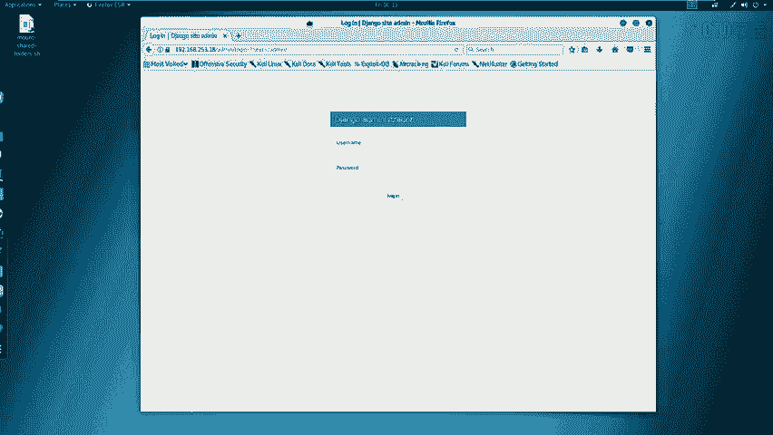

我们打开。Spy。之后我们来查看一下link to的这些信息。刚才哎我们在n two扫描结果当中会发现DEV哎，这里后缀显示它是可能。非常有趣的这样一个目录。那我们下面来打开一下DEV。好评爱之好。

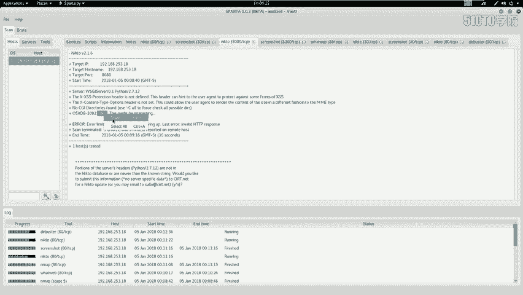

点击这里哎，我们打开一个新的地址。之后啊我们输入DV回撤。哎，我们这里多输了一个。不错。

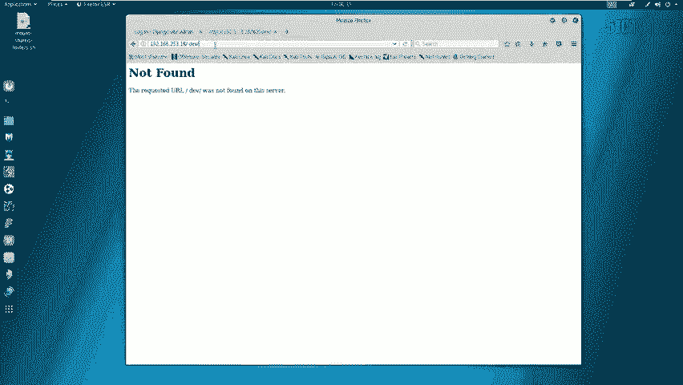

啊，这里有空格回撤。我们在打开之后，哎会发现弹出了这样一个页面。我们首先啊映入眼帘，这有一个web shell。好像是可以。

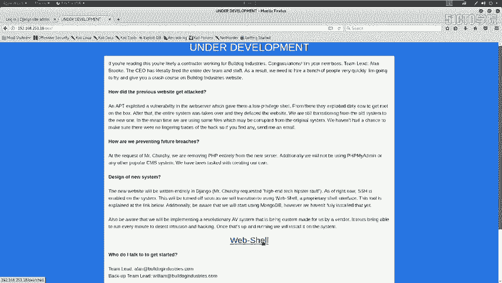

通过web返回 shellll的一个界面，哎，它是一个链接。我们点击会发现这里哎弹出了一句话，是我们需要哎通过这个服务器的认证来使用该web shell。那我们这时候会直观的想到，如果我们登录了系统。

那我们是否有权限来访问这个敏感文件呢？

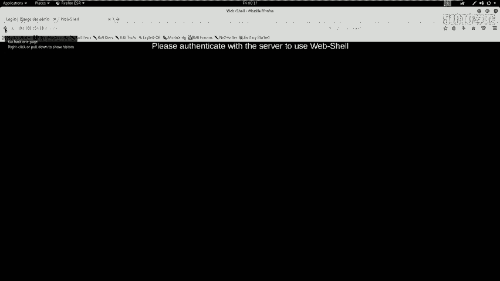

这时候我们继续回到刚才的这个探测页面以及探测结果，我们来寻找对应的敏感信息。我们来发现。大家也可以看到，哎，这里也弹出了对应的DV这样一个信息。并且这里有这个对应的这个目录，也就是认证用户的这些目录。

以及我们可以看这里是它呃的一些这个文件和目录，以及它的这个t will，啊，也就是它的相当于目录站点的这样一个will。我们这时候哎再回到浏览器当中。再回到DV当中。

我们在这个页面当中来查看一下是否哎具有哪些敏感信息。看到看到哎这里有一些邮箱。对于哎这个CTF比赛当中，大家一定要注意。存在敏感信息的页面当中，或者是主页，我们都需要查看一下对应的源代码。

我们刚才首先哎来到了哎他的主页。我们来查看一下主页的源代码。我们右键啊来查看一下。源代码。我们一条依次来看，会发现哎没有敏感链接，没有注释代码。这里仿佛没有我们想要利用的信息。

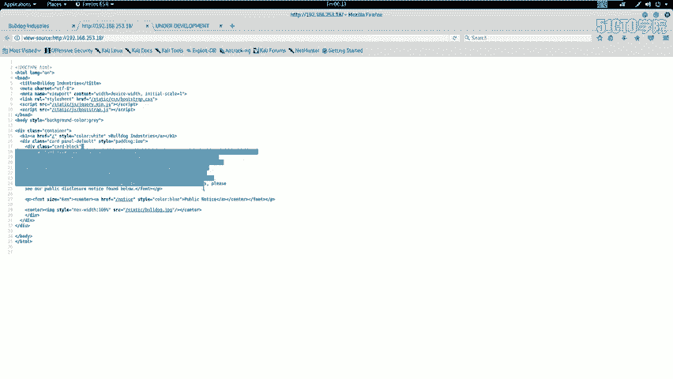

这时候我们把它关掉。我们再来查看一下刚才的登录界面是否有一些敏感信息。我们点击右键啊来查看源代码。依此来看是否有一些敏感的链接。

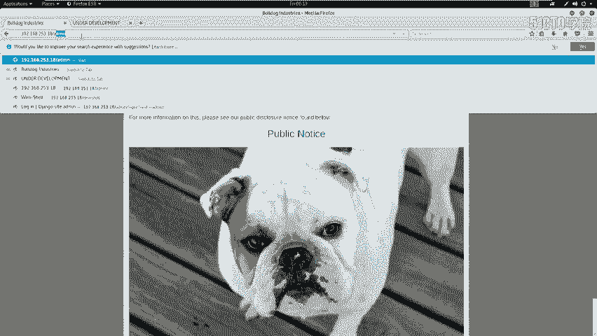

呃，这里没有。啊，然后我们继续向下看。这里仿佛哎有一些这个敏感信息。但是啊他。并不是啊一个我们这个特别注释的一个内容，而是一个为了防止CSRF啊来设置的这样一个value。

应该说每次我们打开这个页面之后，这个值是改变的。下面我们来重新打开。没有见。没有配置锁。可以看到RSAMRSAM阶体。毋饿了。啊，这里是相同的。那如果是这样的情况下，我们先记一下哎这个值啊。

因为它的登录页面有一个这样的防止CSRF的这样一个特殊值。然后我们继续看注释，哎，也没有任何注释。那我们这个页面哎，先把这里哎空着。除了这个页面之外啊。

我们还在web shell啊在这个页面链接当中具有这个页面。我们来查看一下该页面的源代码。我们在查看的时候，大家一定要注意。首先查看hand里面是否有一些敏感链接啊，一些特殊字符构成的链接，以及在。

整个HTML的文档当中，一定要注意它的这个注释，它的注释很可能存在一些敏感信息。我们在下面会发现很多哎这样的。哈C值哎，并且并不知道它的含义。那么我们下面哎就来处理一下对应的哈希值。

首先哎把这个哈希纸给它右键。花呗出来。然后在桌面啊我们新建一个文件来保存。该哈希纸。首先CD thats talk来切换到桌面。我说LS之后，哎，我们GEDIT。然后是哈西的TIG。

我们首先啊把第一个纸给它复制进来。之后我们打开界面，再将第二个值哎复制进来。

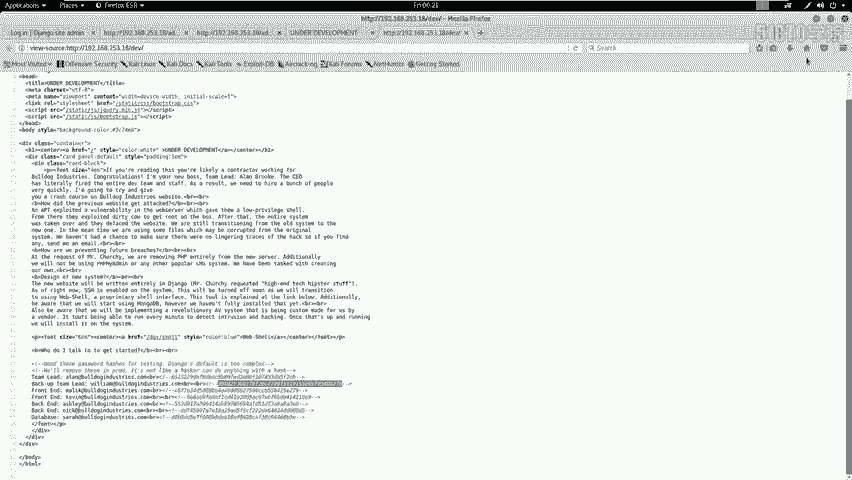

我们再来复制一下哎第三个。哈西杰。花呗哎然后。粘贴到这里。之后哎再来复制一下第四个值。花呗。之后哎复制一下第五个值。复制哎第六个值。来复制呃，第七个值。复制完这些值之后，啊，我们开始来对其进行破解。

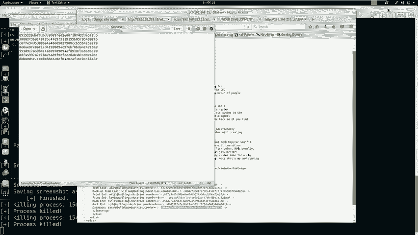

接下来我们把对应的哈希值拷贝到哎我们对应的机器上，通过哎对应的网站对该哈希值来进行对应的破解。

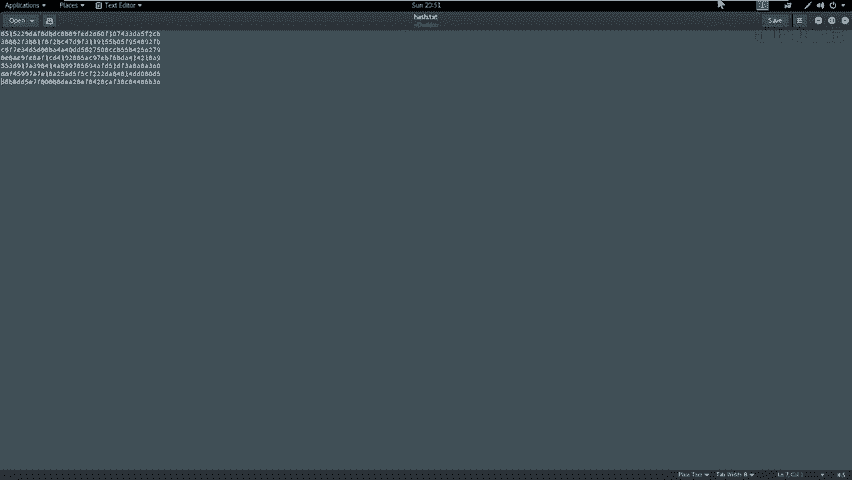

首先呢我们打开一个quick station点net这样一个网站之后，我们把对应的哈希值哎control进来，也就粘贴进来之后在这里输入对应的验证码来进行破解。OADE，STRE。啊。XTTRA之后哎。

点击。破解哈希。那么咱们这时候哎就已经破解了对应的哈希值，可以看到哎这两5条红的哎表示是没有破解对应的哈希值。在这里哎两条绿的哎这样一个哈希值是被破解出来了。

可以看到哎它这里的哈希值对应的铭文是bro以及brog glove哎这样一个效果。那么咱们哎接下来破解完哈希值之后，哎，就可以使用对应的哈希值登录哎，咱们对应的系统。我们回到这里啊，打开对应的浏览器。

我们首先输入靶场的IP地址192点。呃，因为我这里切换了对应环境，哎，咱们靶厂场地址，现在改为1。106回车。那么咱们这时候哎登录了对应的靶0场地址之后，输入第一V可以看到哎，来到了这样一个系统。

的这样一个隐藏目录的文件当中，哎，可以看到哎，这里是咱们刚才破解的啊一些这个密文所对应的哎这些位置。我们来打开哎，查看对应流言代码，可以看到哎这里有个nicick以及c啊，以及破解它对应的密文。

接下来啊我们就来尝试登录。首先我们点一下，我要试。可发现并不能登录。我们来继续扫描一下哎该站点的目录。我们打开终端。注DIB。杠呃。HTTP。之后，192。168。1。106回撤。

那么咱们这时候啊开始探测该站点的目录结构。我们看到一个admin来之后，打开该addmin。这时候哎是咱们对应的密码。首先啊我们看源代码。呃，在这里呃可以看到源代码对应的用户名是nicick。

我们下面尝试nicick用户来登录一下该系统后台nicick之后哎输入咱们刚才破解的波 dog。之后哎点击登录。remember可以看到哎，咱们这时候哎就已经登录到系统后台。

那么咱们接下来哎需要对该系统后台以及后台文件进行对应的漏洞扫描，挖掘对应的漏洞。咱们在刚才已经哎通过哈y qua station哎这样一个网站破解了对应的哎这个哈西值以及获得对应的名文密码。

采取用户名和密码的方式登录到网站的后台。并且进入了对应的页面。那么哎咱们想要对外部进行渗透，即使是需要首先找到可利用的点，也就是找到对应的漏洞。那么咱们往往有一种错觉。

就是用对应的扫描器对个别网站进行对应扫描，如果扫描器没有发现，那么就表示。该站点哎没有对应的漏洞吗？或者是我们扫描器就是全部可以通过扫描器发现任何漏洞。

下面呢我们就使用最好用的扫描器AVWS对我们今天站点进行对应的扫描。

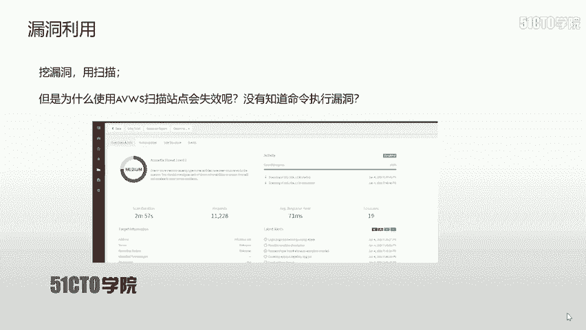

首先哎我们来回到桌面。打开AVWS。之后呃，我们新建哎，我们当前的站点。HTTP。192。168。253。18之后，哎是咱们这个web station。Website。一I之后添加到目录当中。

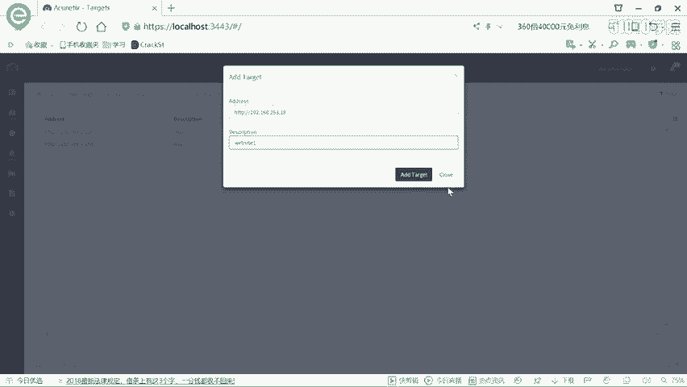

添加完之后，哎，咱们哎点击scam之后，哎选择全扫描之后，哎，点击scam。那么咱们这时候哎这个AVWS就开始对咱们该网站进行对应的扫描。啊，我们可以看到哎这个AVWS正在哎对当前站点。

发起哎对应的探测。可以看到哎，这里它已经发送了14047个哎数据报，249个数据包已经哎这个花费了25秒的时间来扫描该站点。并且哎这里是它的哎这个扫描进度条。我们可以看到哎，这里爆出来一个低V漏洞。

我们可以点击查看。可能哎这个敏感的目录哎，可以看到这里一些信息。可以看到这是它的HTTP爆头，也就是咱们哎发现了这个敏感的登录啊，这个目录addmin这个目录咱们back来查看。可以看到哎。

这里有发现了一些这个密码，啊，可以自动啊完成补全的啊这样一个信息点。也可以看到。咱们user也就是用户认证是呃通过名文传输的。之后哎这个password也是会自动补全，并且这个。

lockching页面哎，也就是咱们登录页面是存在哎这个密码暴力破解的哎这样一个攻击弱点。可以看到哎在这里，因为哎咱们的密码是通过铭文啊以及这个posts啊方法传送的。

所以说哎是存在暴力破解的这样一个漏洞的。但是哎该暴力破解是需要强大字典。所以说呃是如果管理员的密码设置的很复杂，是很难在短时间内哎拿到服务妻权限的。这时候哎咱们扫描也进行了哎大大半哎，到了82%。

可以看到哎，咱们马上就要扫描完成，并且哎这里。说到了哎咱们这个扫描的时间以及发送了多少个HTTP报文，以及哎咱们这个平均的回送时间，也就是响应的时间，以及找到了啊19个这个对应的页面。哎。

这时候咱完成了我们点击这里vener rebilities来查看一下扫描到的哎这些漏洞信息。点击。这时候啊我们会发现啊一些这个信息以及弱点漏洞，以及这个中微漏洞。可以看到哎，这里是对应的敏感目录。

可以发到发现这里有个第一位这样一个漏。敏感的哎目录，以及这里有咱们这个ad命哎loging哎这样一些。敏感的目录信息之后，哎是咱们这个一些。对应的信息哎，发现了email啊这样一个地址可以在这里看到。

咱们通过哎该。漏洞扫描器哎，扫描的漏洞发现咱们并不能直接使用该漏洞来获得对应的服务权限。那么哎咱们想一想。咱们是不是AVWS哎扫描过的这个漏洞就没有。漏洞的站点了吗？还是这个站点本身就没有漏洞的。

即使哎咱们在使用AVWS扫描站点的时候，只是探测了站点的一部分。如果说咱们该漏洞的页面是存在于该系统后台当中，而咱们这个AVWS并不能。通过哎这个扫描后台隐藏页面来发现漏洞。

而是需要认证哎登录该网站后台之后获得对应的cookie值，加载到咱们这个AVWS当中。那么咱们AVWS会使用该cookie值来登录该系统的后台。这时候才能扫描到对应的结果。

也就是咱们想要挖掘的一些安全弱点。我们可以看到哎在追重AVWS哎扫描结果当中发现了哎很多对应的敏感目录。哎，这里哎就有一条。呃，IP是192。168。1。

106哎DV这样一个敏感目录和咱们哎之前使用I Nick to哎扫描的哎敏感目录哎。

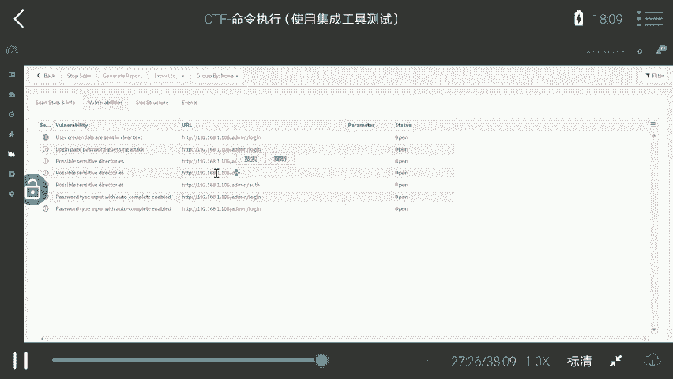

具有啊一致性。我们会发现。在这个nick two哎扫描的结果当中也有1个DV敏感目录。下面我们就在浏览器当中来打开哎这样一个目录。首先哎我们打开这样目录。之后哎我们输入DEV回撤。

我们会发现哎这时候就回到了我们之前获取对应用户名和密码的这样一个页面。并且我们之前也尝试打开这样一个we shell，并没有打开。

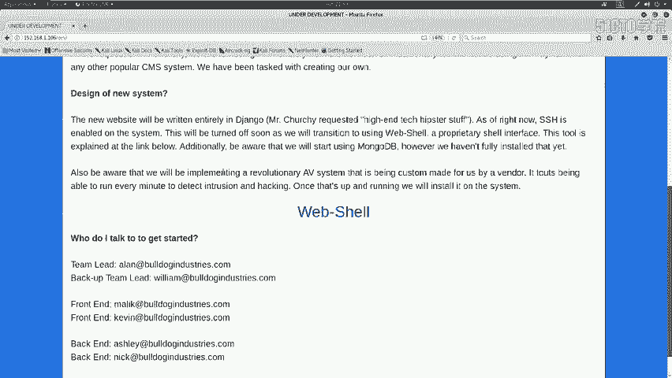

那我们下面再来尝试打开，会发现哎打开了。因为哎我们之前啊使用对应的用户名哎进行了登录该系统。

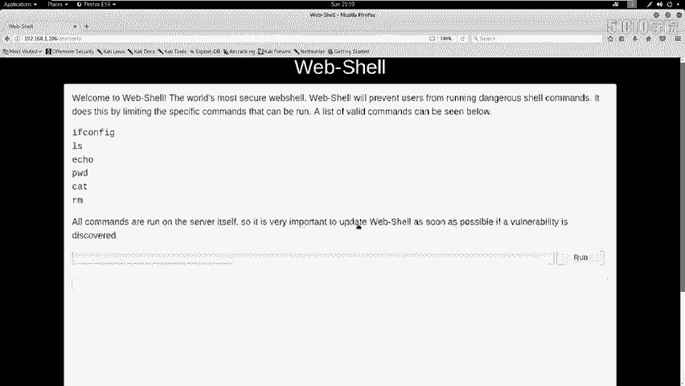

呃，登录啊页面是or me回撤。我们登录之后啊，就具有对应的cookie值，就可以啊直接来登录啊这个web shell啊这样的一个页面。我们点击哎登录。

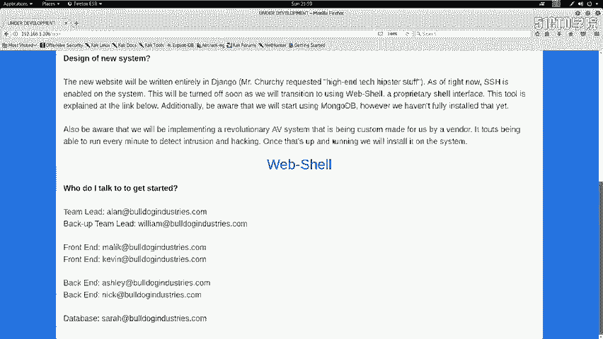

会发现我们登录之后，哎出现了这样一条信息，欢迎来到web shell。哎，这里是一个啊比较安全的web shellweb shell啊使用户可以在该页面当中执行危险的啊这个sha要命令。

他并且哎对一些命令进行了对应的限制。这里啊有一些咱们可以使用的啊对应的命令，我们来尝试啊是否可以使用。config哎点击回车Iron。我们会发现哎可以使用ID哎，我们再来尝试一下ID是否可以使用点击。

哎，这里会发现哎并不能使用哎这样1个ID命令。下面呢啊我们就来根据哎这样一个漏洞。

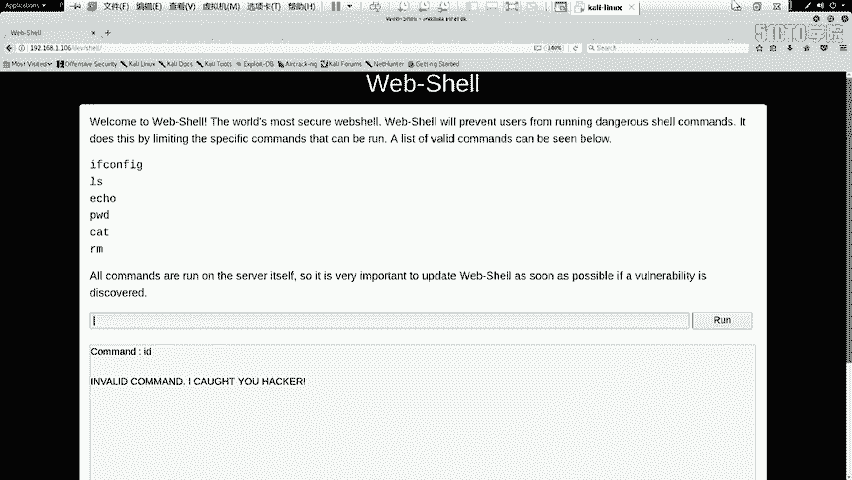

来使哎咱们这个靶场给咱们返回哎对应的 shell。今天哎咱们这里并不使用matpo来进行对应的测试，而使用NC直接来监听该机的哎这个shall啊，也就是这个444端口之后。

咱们把场执行这样一条命令返回哎咱们对应的哎这个shall。在之后哎咱们使用这个paon杠CPTY这个模块来返回啊一个终端，哎是咱们后期提全可以很好的执行。下面哎咱们来回到公积机当中。首先哎打开一个终端。

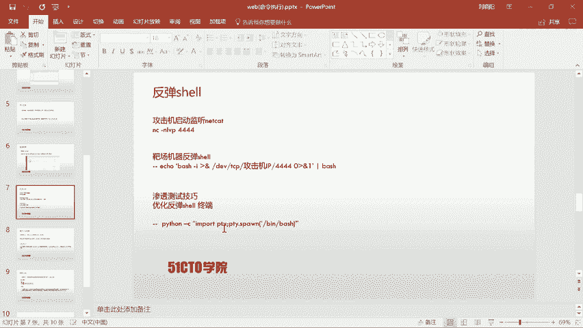

之后哎使用ENC杠。NLVP来之后4444端口来，咱们开始监听。在开始监听之后，哎，咱们回到浏览器当中执行Ieal执行哎这样一条命令。

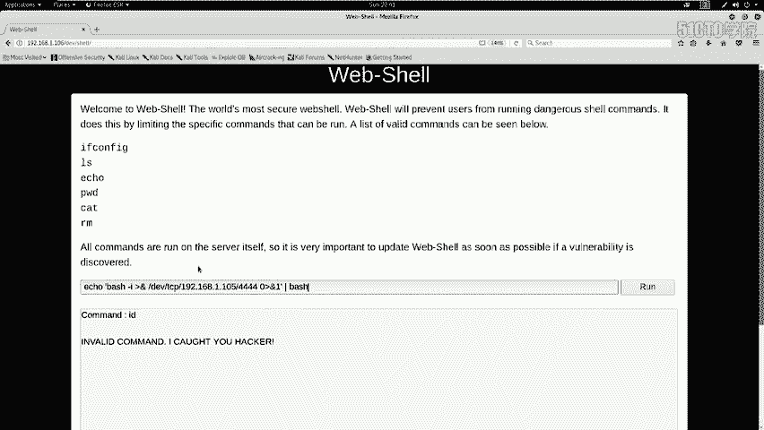

呃，因为咱们哎这个IP地址哎进行了变更。变更之后，哎，咱们把厂机器的IP地址哎是106。那咱们本机的IP地址是105。

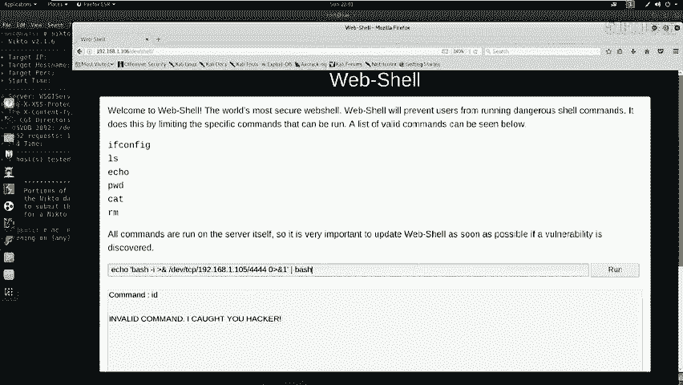

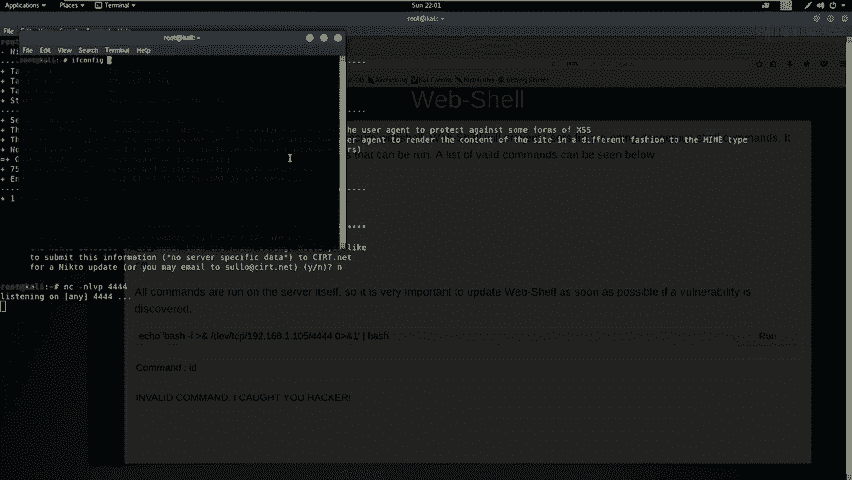

之后哎咱们来开始执行。

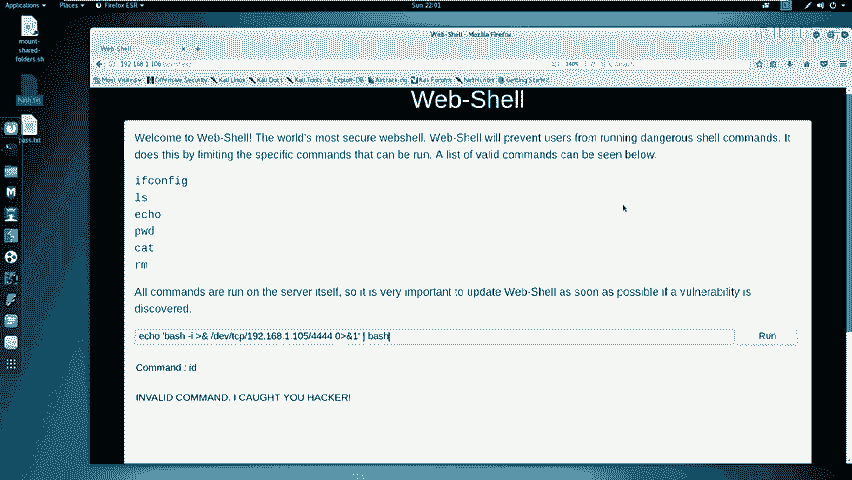

点击执行点击执行之后，哎，咱们来看终端是否返回了对应的shall。我们在这里会发现哎咱们该终端返回了哎咱们对应的shall。那么咱们在返回sell之后，哎，咱们需要使用pasy杠C。

之后哎输入咱们呃import。PTY。TY呃之后啊咱PTY点SPAWN。最后I输入一个Bbase。双引号，咱们在执行这条语句之后，哎，就返回了一个真正的啊终端回撤。这时候哎咱们返回了哎对应的终端。

返回该终端之后，咱们会发现哎，咱们当前并不是以root啊用户权限来登录的，咱们也可以使用ID来查看啊，它并不是零，所以说它不是哎咱们root权限。

也可以使用who am I来查看是否是对应的root权限。那么咱们接下来哎来查看一下是否可以利用哎对应的呃敏感文件来进行对应的提全。首先LS杠AL。发现哎并没有哎对应的敏感文件。

咱们下面哎就来使用CD点点杠。LS哎会发现也没有CD点点LS会发现哎咱们在后me目录下发现了一个de dot me哎，这样一个敏感用户名，咱们切换对应的敏感目录。呃，多个 order me。

回撤接下来咱们使用LS哎，会发现并没有任何可利用的信息。这时候哎咱们千万不能哎说是我LS下没有对应的敏感文件，哎就放弃了，而要使用LS杠ALH来查看一下全部的哎这样一个文件。如果说文件前面加上点。

那表示它是一个明码文件。这时候我们使用LS是无法查看的，只有使用LS杠ALH来查看这个隐藏对应的文件。我们在这里分析一下它隐藏的文件，会发现哎这里有一个隐藏的哎这个管理员目录，哎。

它这个起名哎都是具有一些特征性。哎，并且很值得怀疑的地方，隐藏的哎这个管理员目录。那我们下面就来切换对应的目录来查看是否啊有可利用的信息adadmin。Direct。陈瑞回撤。

接下来我们来查看干目下的文件。会发现哎该目目录下的文件。是有哎一个两个文件的啊，是有一个note，也就说明文件，并且有一个哎这个。custom portionAPP哎，仿佛可以使用它来提全。

在进行哎这个使用该文件的时候，我们先来看一下它对应的说明文件。会发现哎这是一个呃这个后台权限的一个资源，它哎是一个。呃，这样一个类型的，并且可以哎很好的运行。如果哎使用该APP啊。

那你就会获得啊这个你的用户密码，哎，这样你就可以使用root了。那我们哎对于这样一个信息，哎，首先来查看一下哎，我们该。custom personAPP啊是否啊具有一些敏感字符。

这时候我们就使用strengs啊这样一个工具来查看。该文件当中哎是否哎具有哪些敏感哎字符串？misssingAPP回车。我们来查看。查看啊，一直向上看一直向上看。

会发现哎这里有一段哎比较有含义的啊这样一个。文字啊，说是如果哎你。获得了一个可获得用户名来。使用root权限啊，那你就可以哎使用这样一个哎。程序哎，并且来执行对应的命令。

我们在它上面哎也看到了一个on H哎，没有H at的这样一个信息，并且它下面哎有了对应的一些字母。哎，从这里我们就发发现。这个抛去H之后，哎，剩下的啊这些文字就是密码组成。

下面啊我们就来把该文件信息当中的哎这段文字给它复制出来。哎，我们接下来打开一个文本文件。来执行啊，来把该。文文字信息啊保存到对应的文件当中。啊，首先打开一个终端。

接下来我们切换到终端CD desktoptop呃，我们使用GEDIT啊，打开1个pass叫TSG回车。那我们接下来啊就把刚才。

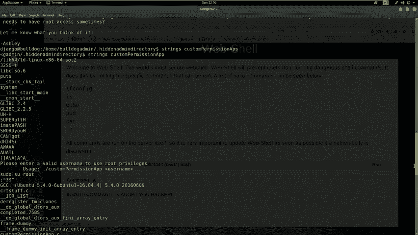

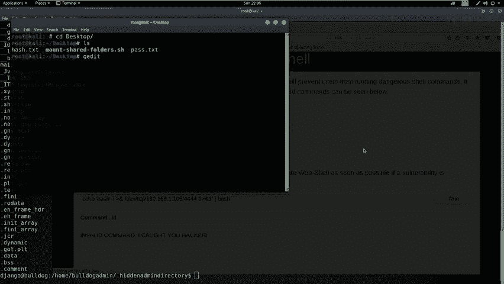

对应的啊，我们这个信息给它输到这里，tr位我们去掉H。去掉H之后，哎，然后我们。把第一段按这个onH啊也给它去掉。我们会发现哎这时候啊我们就得到了哎对应的一个密码。我们得到这个密码之后。

我们来把它复制出来之后啊，我们来使用它是否哎可以提升对应的root权限，使用SU doSU回撤。我们把刚才获得的该密码。

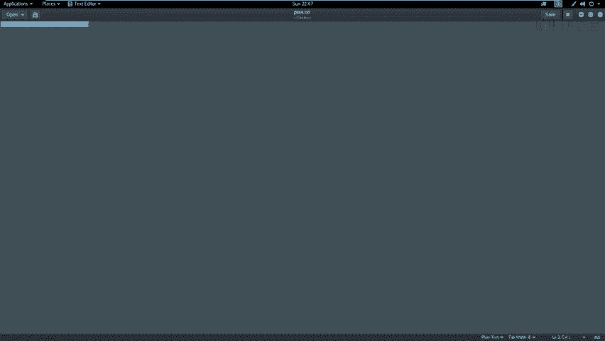

输入到哎对应的这里回撤。这时候哎我们会发现我们提升了啊对应的root权限。那我们用ID来查看是否是root权限。哎，这里出现了0，哎，表示找到了对应的root。然后我们要来。点亮Al。

L杠ALH回车CD点点。

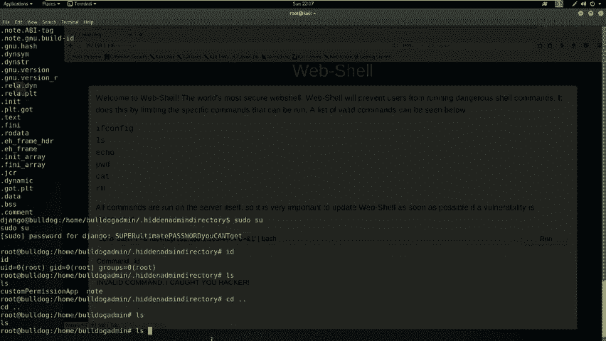

呃，这里我们会发现哎又有一个哎对应的这样一个敏感目录，我们来切换到对应的敏感的目录SU do杠as杠admin杠SUCCESSFUL回撤。呃，我们会发现啊它是一个啊文件，那我们来查看cat。

点SU do杠S杠Emin杠SUCCESSFUL。不去。嗯，我们会发现啊它是一个空文件啊，我们刚才没有注意到啊，这里它的文件大小是0K，啊，那么就没有任何信息。在拿到哎主机的root权限之后，哎。

我们就需要啊找到对应的哎这样一个敏感的信息之后，获得对应的哎权限，获得对应的flag值。这里啊我们也介绍了啊刚才咱们这个提全的一个过程，使用SU do哎，并且咱们反弹要之后。

可以向上级唉查找对应敏感信息，可以使用咱们刚才使用的strs之后，加上对应的敏感文件名查看该文件当中的哎这个字符串。咱们在唉CTF比赛当中提升对应的root权限之后，哎，需要进行最后一步。

也就是哎获得靶场机器的flag值。这个靶场和机器上的flag值一般存放在root目录下，咱们可以使用CDroot目录之后使用LS。

然后我们会发现fllaag啊这样一个文件是用cat命令啊来查看flag文件当中的内容。在查看完flag之后，哎，咱们需要写rite up，也就是我们实验文档。我们如何获取flag值啊这样一个过程？

当然哎，咱们在CTF比赛当中，哎，命令执行漏洞是具有很多过滤机制的，而咱们选手是需要使用各种技巧来绕过这种命令机制。好了，那咱们这节课就到这里哎再。

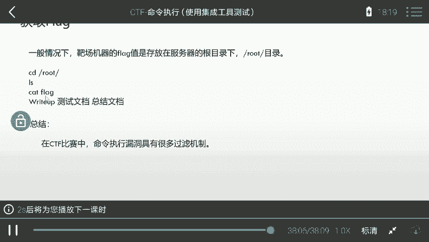