# 2024最新【网络安全／黑客】入门到精通课程教程，包括Kali Linux安装与CTF比赛教程（附安装包） - P5：03-2.网络安全基础：Kali Linux简介 - AI-大模型基础 - BV1SK421Y7kA

好，那首先的话我呃非常欢迎各位同学能够来参加我们这个两岸教育的一个安全的课程。好。那么首先我在讲课之前，我需要给各位同学要普及一些这个免责免责声明啊，那么这一块的话。

我们主要是为了共同创建文明和谐、合法的网络空间。那么本课程的内容仅用于教学啊，进行这个安全教学，禁止使用本课程当中的技术，进行一个网络非法行为。

网络黑产等有危害计算机信息安全和网络空间管理秩序的一个非法活动。那么如果有学员利用这个课程的技术进行一个非法的行为，造成了后果以本机构啊。😊，无关以及讲师无关。所以呢啊我们是一个倡导网络安全。

维护文明网络空间的人人有责的这么一个时代。清楚了吧？啊，所以说你们在第一天来上课，我就给你们把这块给说明了啊OK。

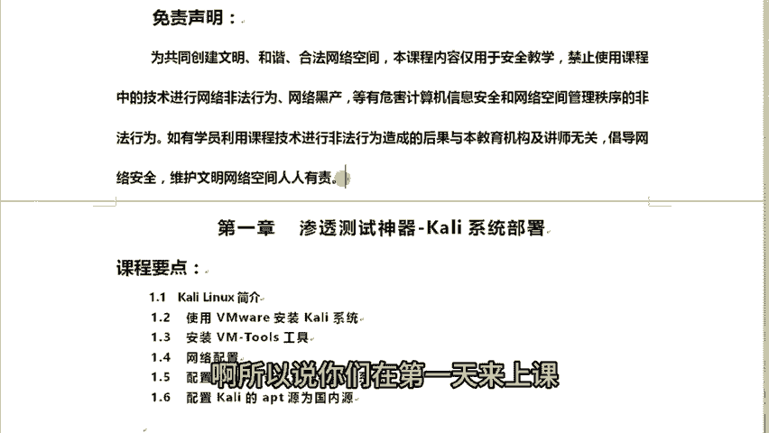

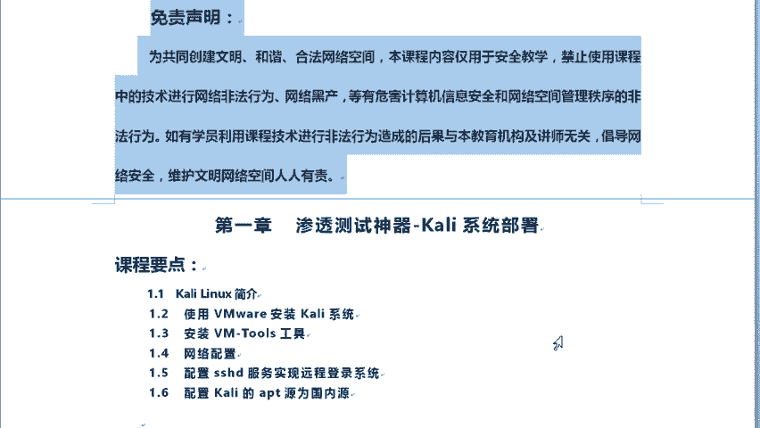

好，那么首先的话我们先看一下我们今天的第一章内容。我们第一章内容的话就是啊。😊，讲一下我们这个渗透测试的一个神器。卡里系统的一个部署。那在这里边的话，有很多同学啊，不知道你们有没有把系统安装啊。

那么在前面的话，你们再来进进来这个学习前应该都会把这个系统安装了，对吧？那么不管怎么说，这块老师还会给你们讲一遍。那我在讲的时候还是以这个咖里2019。3的版本为主。😊，OK2019。

3的这么一个版本为主。那首先的话我们会进行呃简介，看一下这个卡里linux的一个简介，以及使用ve well安装卡里系统，以及还有这个安装ve well to的工具。那么网络配置啊。

以及配置这个SSHD服务实现远程登录到视统。那么还有配置卡里的APT源为国内源。

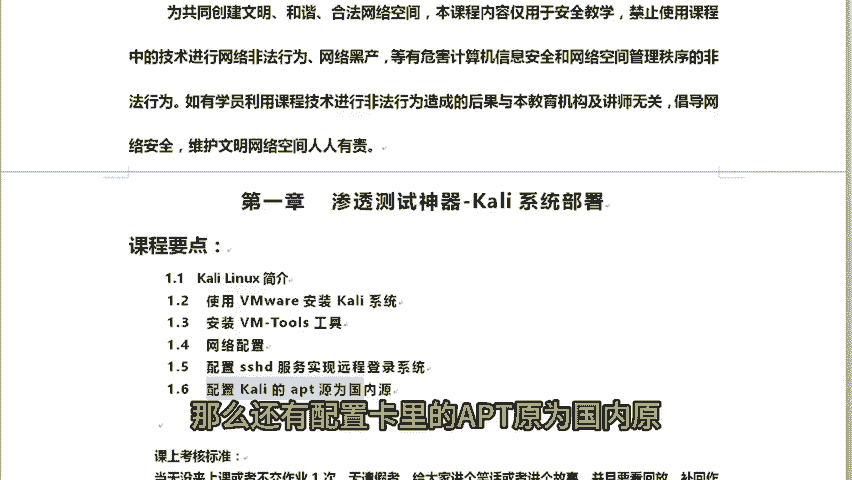

那么这些都是我们的要进行的一个啊。好，那首先的话我们先来先讲一下第一点。

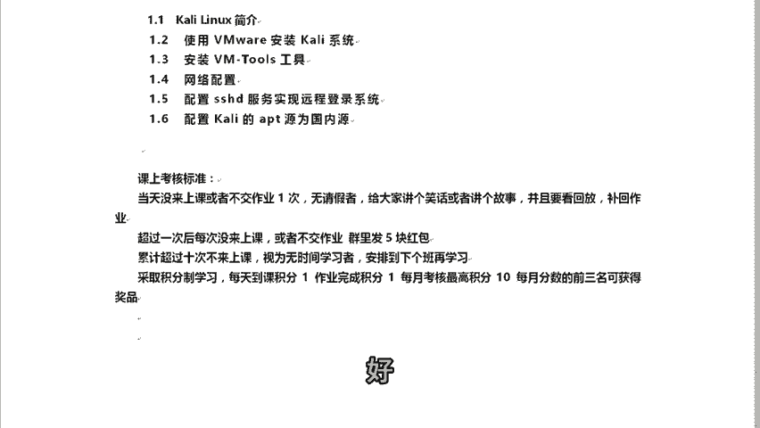

那么第一点的话，它是怎么样了？对，那么第一点的话，首先卡里这个linux的话，它是一个基于de的linux发行版。那在这里边我想问一下各位同学，你们知道发行版是什么东西吗？知道发行版是什么吗？

那么linux又是什么？发行版又是什么？😡，同学们要搞清楚这一块啊。好，那么通常这个会应用在高级渗透测试和还有一些安全审计这么一些场景当中。那像这个开里斯通话。

它主要它的特点最大的特点就是内置了数百种工具。而且呢它带自带的这些工具都适和各种信息任务的安全。比如说啊。比如说还有这个渗度测试、安全研究、计算机取证立项工程等等，它都是可以支持的啊。

那么当然比这还多啊，那么我简单就列了那么这么几个，好不好？😡，那么像这个里的话，这个系统是背后有一个组织来进行开发和维护。那么这个组织也就是offensivesec。也就是说offensive的话。

它的意思是有攻击性的意思，进攻性的。那么seecute就是安全。那这些公司中文名称的话，我们可以翻译成进攻性安全是由他们开发的，以及资助和维护都是他们OK。这人清楚了吧。好。

那么我在这边我简单说一下啊这个。😊，linux是什么？linux发行版又是什么？像这个linux的话，linux它首先。😡，是一个操作系统的内核，它不是一个操作系统。各位同学要分清楚这块。

linux只是一个内核而已，它并非是一个操作系统。😡，OK那我就画一个图给你们稍微讲一讲啊，这个操作系统我们怎么去理解它呢？😡，因为我知道啊有很多这个地方没有不会给你们讲这些啊。

他就会告诉你它就是一个系统。实际上我们认真分析分析下来，它不是的啊。首先的话这边有一个底层，对吧？那么上面的话还有很多这个应用场啊，这个底层我们我们称之为柯，也叫做内核啊。那么linux的话。

它就是这么一个东西，它就是一个操作系统的内核。😡。

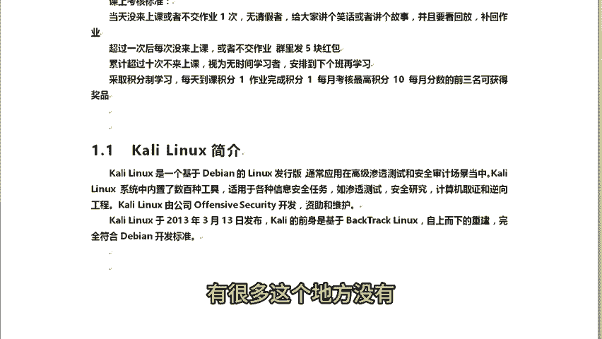

懂意思吧。那么这个内核的话，它能够提供多任务啊，多任务这种运行以及进程管理内存管理。网络管理对吧？凡是那些底层能够会用到的东西，通通由内核来进行管理。😡，OK那么实际上我们在很早的时候。

你要想玩一个历量死的话。我们没那么简单，拿拿这么一个小小的东西就能够去安装成功一个lininux的。在很早的时候呢，你很有可能你会直接到官网里边下载一个lininux系统的内核。然后呢。

你需要用到什么程序再去下载程序，再拼凑编译这个内核安装起来以后呢，然后呢再向上一一个一个的应用程序安装起来。😡，因为操作系统内核是主要就用于运行上面的这个程序的。那么由程序组织成了以后呢。

由程序加这个内核OK那么就形成一个操作系统。因此的话，那么后来了有很多这个人也就没有这个能力拿这个lin内核操作系统去进行一个拼凑出一个系统，对吧？他就没有这个能力，那怎么办？

你似乎就出现了一些啊OS啊，还有这些什么兔啊啊，这些他们都是属于发行发行商O他们都是属于这个发行商，什么叫发行商，他们是专门把那些应有的应有的这个应用程序跟这个内核给你们拼装成一个操作系统。

而且还以这个ISO的这么一种格式来向外提供给你。因此的话你拿到了这个ISO的镜像文件就可以展开安装了，这就省去呢你在拼装的这个过程，因此他们叫做发行商。😡，能清楚发行商跟lininux什么了吗？😡，O。

这个很好理解吧，对不对？😡，所以说我们的操作系统最核心的功能的话还是内核。😡，lininux它只是一个内核罢了。然后呢，所有的程序它是跑程序的，哪怕你是一个图形界面啊，注意你是一个图形界面。

有时候有有些时候说老师我这个是图形界面呢，它怎么理解啊？图形界面，它在lininux里面它也是展示为一个程序，它是属于程序的啊，它不是什么图形，它是一个图形程序运行这个图形程序。

那么我们就可以看到图形界面了。😡，那么如果说自啊这个命令命令提示服务的呢，它也是一个程序叫什么？😡，也是叫做excel啊，我们linux大多数用的是这个bsok它也是一个cll，清楚了吧？

是一个cel里面的其中一个分支啊，也是一个程序。所以说它内核里边主要就是为了运行各种各样的一个应用程序。😡，那懂了吧？有些程序能够为我们去完成的特定的功能。有些程序像这个cll，对吧？

这个sll这cel的话就是有bs阅行提示符，有这个图形终端啊图形界面。那么这个cll的话主要是让我们这个程序种类的话，我们称为cll，然后呢让我们人类能够跟这个计算机取得一个联系。

通过cll里边发送指令，让内核去进行。😡，所以说真正的我们能够驱使这个内核来进行为我们进行工作。那真正的话不是你有多大的能力，而是这个程序，你下达指令到这个程序，由程序来发到这个内核里面。

提交到内核里面执行，最终把结果拿回来又展会出来给你这个程序给你显示。能清楚这个操作视统的过程了吗？😡。

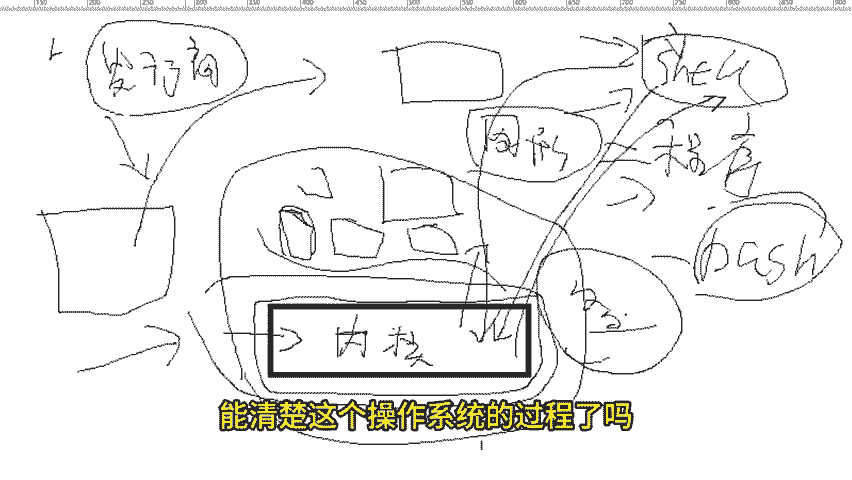

OK这就是操作系统啊。好，希望各位同学能清楚啊。好，那么我们再先来说一下这个卡里linux的话，它是在这个201年啊，2013年3月份啊13日发布的。

那么这个卡里在早期它不叫卡里早期的话它叫做这个呃lin也就是BTlin。那么到这个2013年3月份啊13日，然后呢，卡里就是。😊，啊，基于这个back checklinux自上而下的重构完成。

而且呢它也是完全符合这个debe开发标准。是以说代表他也是一个发行商。😡，懂了吧？那么底层的话，也就操作系统内核的话，它同样都是linux。😡，O。😊，好，这样能清楚了吧。

那么我们如何去下载这个linux这这个这个东西呢啊。😊。

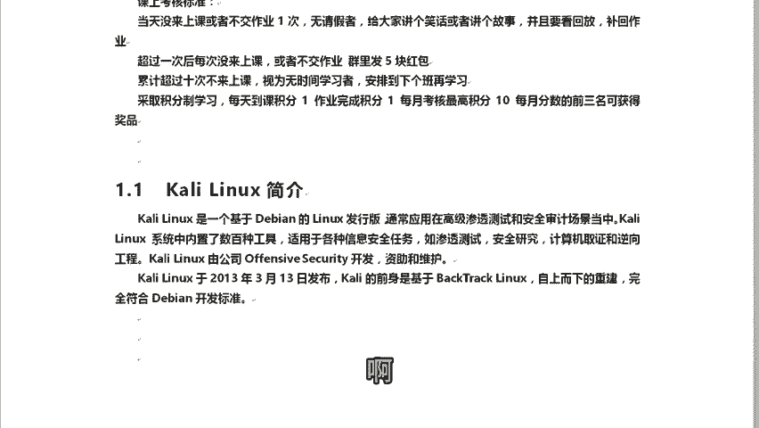

我们就要去下载它呢？😡，好，实质上啊我们去下载也很很简单啊，我们下载的话也是很简单的。那么如果说我们下载的话，直接去他官方网站3W点开里点ORG就可以进入它的到他这个公站点了。😊。

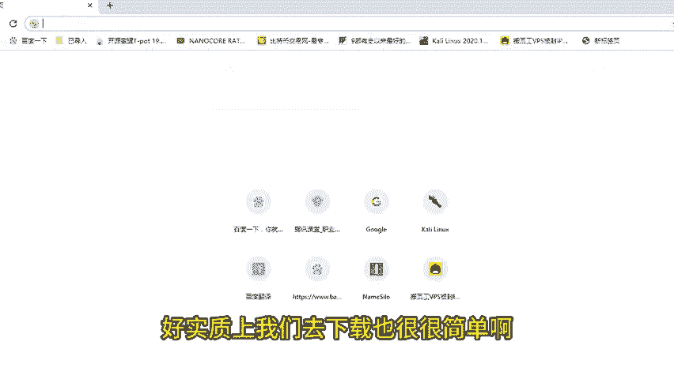

对吧还是比较简单的对吧？啊，那首先这边进入后还稍微有些小卡啊，那这边的话等它一会就好了。😊，那官方站点的话是个英文的那你想要进到这个站点里面找一些这个帮助手册啊，或者说看一下这个更新哪些东西啊。

因为这个系统的话会经常更新的啊，一年更新一两个版本都属于正常的。所以说更新了哪些。那么我们可以到他看它这个官更官方发布的这个更新文档。😊，要去看一看它有哪些内容不一样了。

OK那么今天我为什么不给各位同学讲这个20啊2020。1这个版本的安装呢？因为2019跟2020它是有很大的区别了。有一些的区别的，知道吧？所以说我还是想要啊我还是想要通过这个老的版本给你们安装。

从最老的这个稍微比较老的一个版本啊，也不是最老的吧？还是挺新的啊，对，从这个旧的版本开始给你们讲，以后呢，你们理解这个旧版本以后再去学这个新的版本，完以后呢，你就会知道从这个旧一个版本切换到新的版本。

它当中做了哪些改变。那这样的话各位同学也会对这个操作系统有更多的了解，能清楚了吧？好，有些同学觉得这个英语英语基础不行，那没关系，像我们现在的话，很多的翻译啊，对不对？哪怕你用一个谷歌浏览器。

右键点击这个翻译成中文就可以。那我这边还没有去啊，稍微等会啊，我开个加速啊。因为我这边这个国外的站点，我这边没没有加速，它稍微显得比较慢。好，那这边。😊。

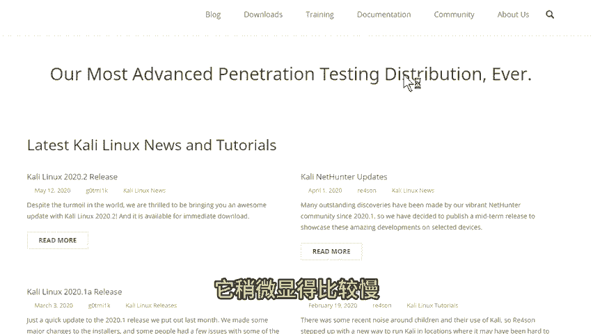

我就开始。啊，我打开这个加速好，这回就快了。好完以后呢，你可以右键点击翻译成中文，你就可以看到它这个中文的一个网站了。😊，okK这样会更好一些啊。好，它正在翻译，我们稍微等等它啊。😊，啊，没翻译成功。

那肯定我要刷新一下了啊。好，翻译成中文。稍微等会儿啊，我这边可能网络的问题，我重新刷新一下，翻译一下。

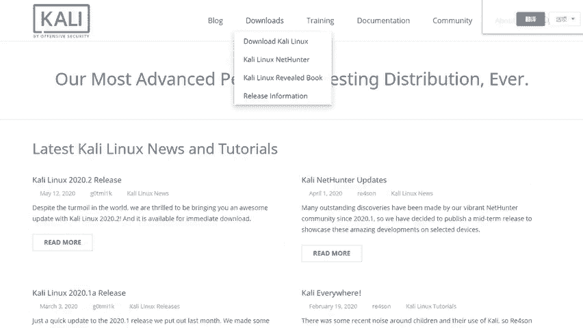

O。翻译。好。

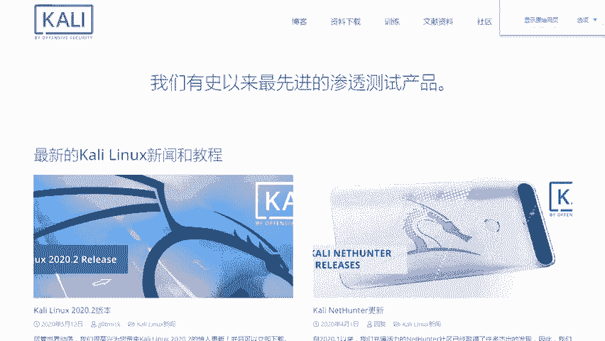

好，已经翻译成功了啊。那么翻译成功了以后呢，怎么样？对，我们就可以去这个资料下载里边。如果英文的话它为download的，然后呢可以下载colin，然后下边就开始有这个版本。那么现在的话。

最新的就2020。2啊，我有下载这个包，但是我还没有去安装啊，我也知道应该怎么安装是吧？好，那么这里边的话，我我老师我这边课上目前还是基于这个20222019。3的这个版本去给你们讲解。

那如果说我需要后续切换到这个2020。2的版本的话，那我到时候再发另外发一个通知给你们。😊。

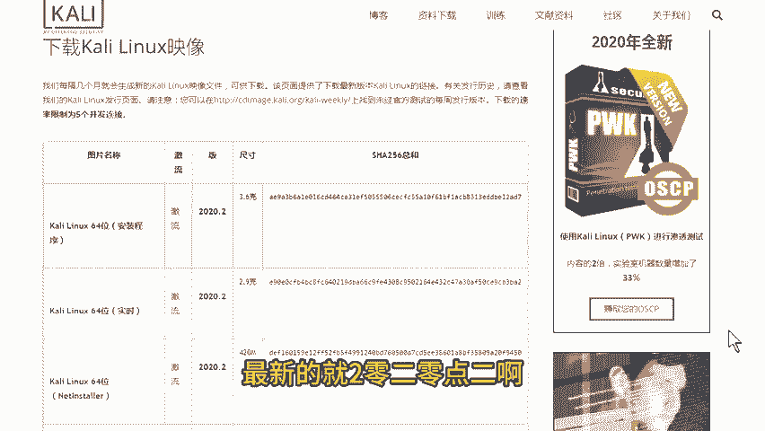

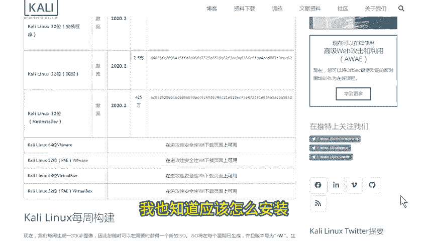

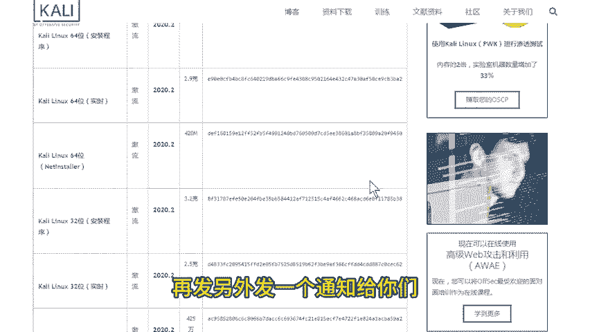

好，那么关系到我们这个操作系统的话，上哪找呢？OK可以到云盘里面找好。那么课下的话，我会把把我这个共享出来给各位同学，可以吧？O我现在给你们找一个啊，直接共享出来给你们吧，好不好？😊，啊。

你们那边有拿到这个操作系统了吗？也就是说这个2020的这个啊2019的这个点2019。3的这个。😡，啊，你们有吗？Yeah。那如果没有的话，没关系啊，我给你们共享一个出来，好不好？😡。

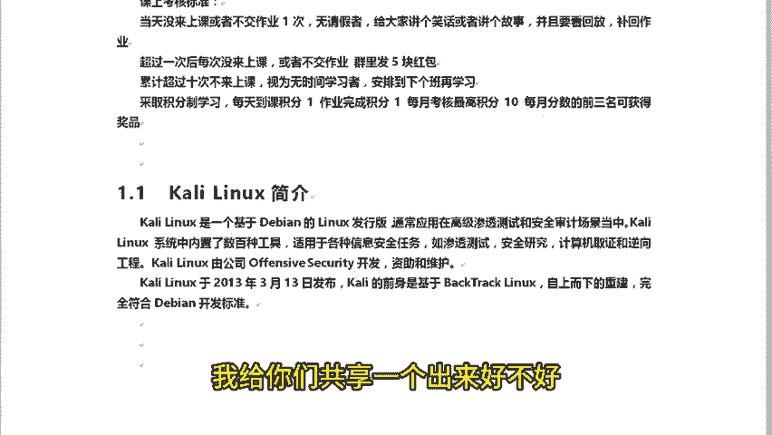

O好，那么这个是2019。3的一个啊镜像，要各位同学可以去下载。所以说这边的话我就不再带各位同学去进行下载了啊。那么下载的方法有很多种，我希望各位同学能够知道怎么去下载，好不好？O。😊。

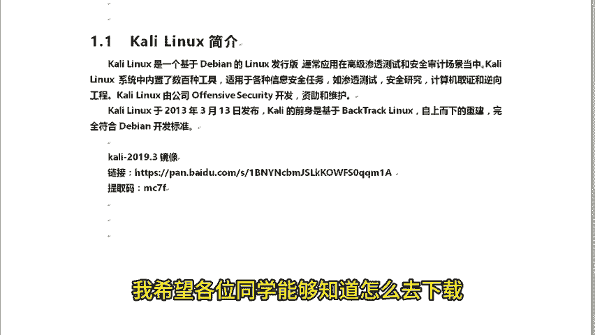

好，行，那当时的话我这个截图一是2019。3的啊，是比较早的这个版本。那现在的话是2020了啊，那希望各位同学这个会进行下载了啊。好，那么接下来的话我们再看一下这里边的这个。

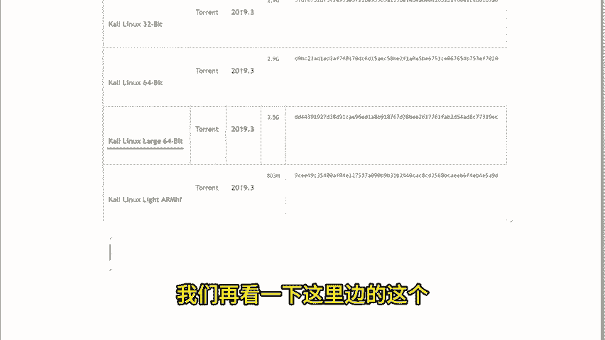

Okay。第二点好不好？啊，然后呢还有一个事儿，我稍微给你们交代一下啊，稍微给你们交代一下。😡。

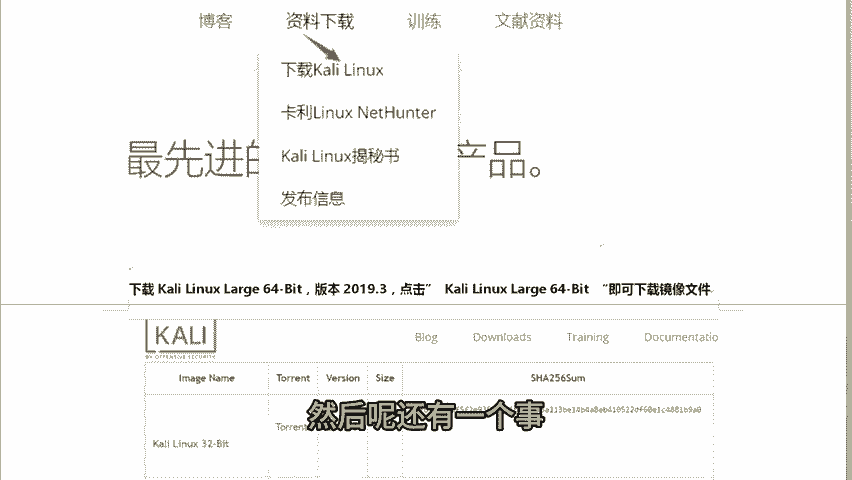

你们下载的话有有两种方法。第一，你可以点击它进行下载。第二呢，我们可以下载这个种子。

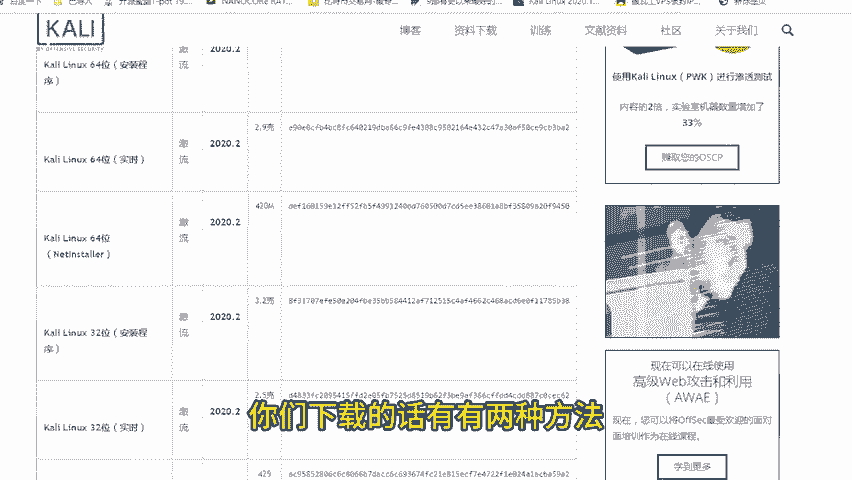

我们可以下载这个种子啊，下载这个种子，然后呢你可以再下载，然后你可以点击这个程序直接去下载啊，都可以两种方法啊，在网页里面下载就点第一个你想用种子下载的话，就点第二个就可以OK。

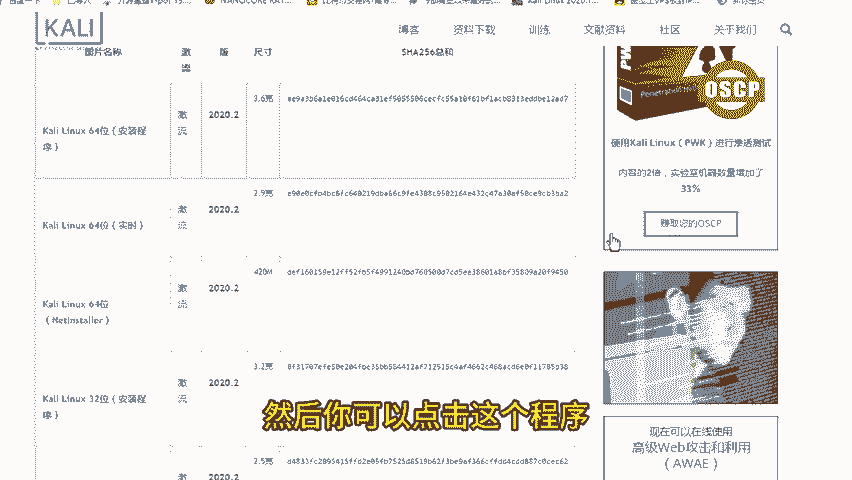

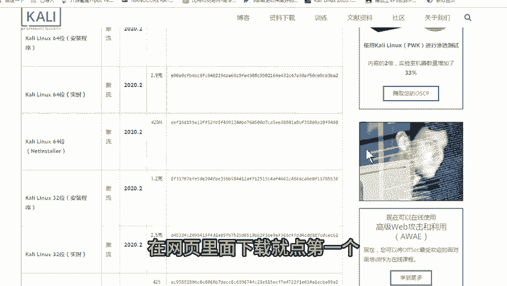

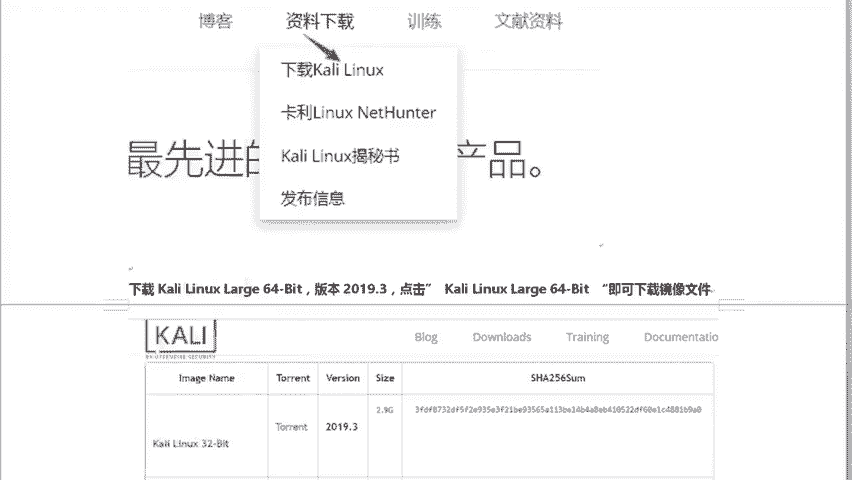

好，那么这个链接的话，我会我会给你们放到笔记里边。那么课下笔记我会发到咱这个VIP群里边，好不好？O。😊。

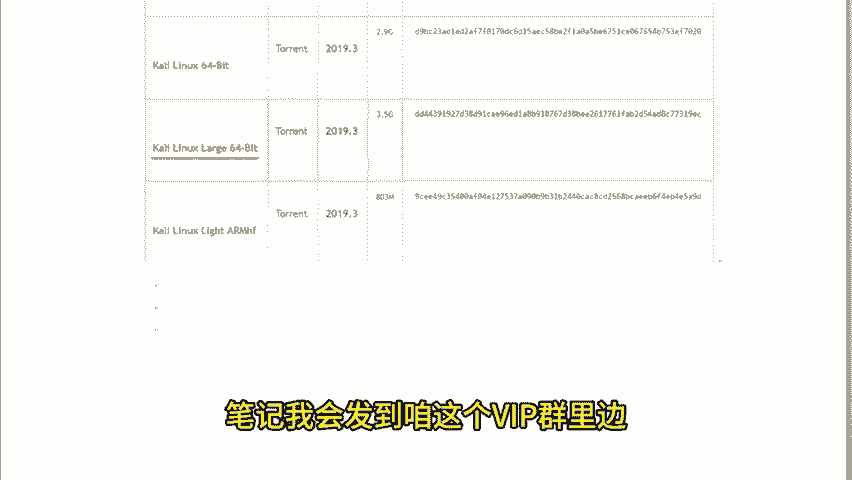