# 2024最新【网络安全／黑客】入门到精通课程教程，包括Kali Linux安装与CTF比赛教程（附安装包） - P6：04.Kali安装到VM - AI-大模型基础 - BV1SK421Y7kA

我们在上一篇中是把这个看你的这个下载这块都全部搞定了，是不是？然后在我们的上一上篇中，我们又把那个5M17最新版安装好了。所以说我们就直接打开上上篇那个环节的VM。也是这个。这个是啥玩意，先不管他。

好我们就点击这个打开之后。那么我们现在干嘛呢？现在就要把我们下载的这个can里。给大脑机的里面来安装，是这个样样这个玩意知道吗？这个的话有3。25个GP。然后我们在这里面的话写一个标题。拷贝这个标题啊。

就是看你官网的方式。第二步的话，我们就是要怎么做嘞？我就需要去安装。安装。到为M。把给调到第四个标题下。是第三个是吧。好。怎么去做嘞？这个步骤的话。很简单，我给你们学一下，直接点这个第一步。

这个的话我觉得没必要截图是吧？给你们截个图，怕什们不知道什么意思啊。😊。

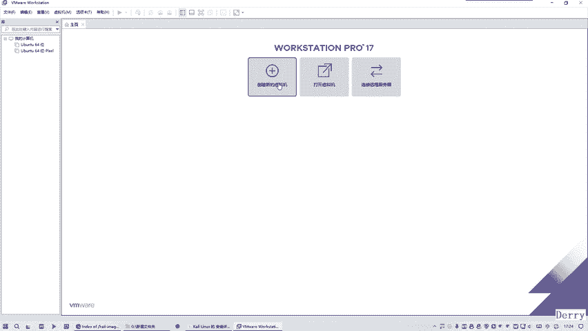

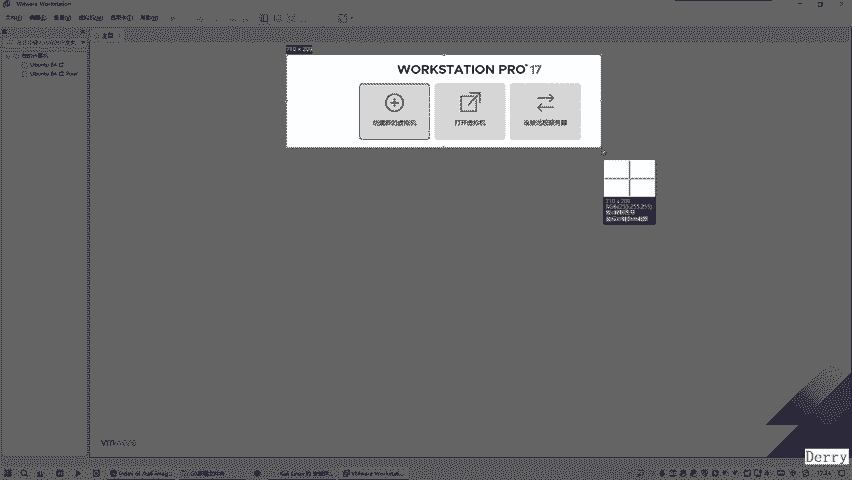

好诗第一部。创建为。好吧。好，这是第一步。然后我们把这个改一下，它是第。等下。第4个第5个。OK那么这边是第一步，那么所说你就点这个。当然的话我们在上上篇中就早就把它给破解掉了，是吧？

是永不过期的最新版本的时期，是不是啊，我们就需要点这里。好，点磁后的话，那么这边出现一个点型和一个自定义。那么我们这边更加想要一个更加灵活的可控性的话，一般是自定义啊。下一步好。

然后这边的话我默认选择这个1期的。好，那么不管它就这样最新的就行了。好吧，这都不管它，就下一步。好，然后这边的话这一个点就是我们会选择。😊，这个稍后。再去安装这个看你这个操作系统。使用是这种方式。好。

那么这个步骤的话，应该这是一个注意事项是吧？找等一下。这句话都没什么好说的吧，给你们截个图啊，话筒也不知道什么意思啊。好。这是一张图放这里好吧，然后。是这个点。😔，这个的话没什么变化就不截了，好吧。

这里面有一个点就是选择的这个稍后，这是个变化点，要截个图。好，然后再下一步。好，那么这个时候的话我们选择哪一个？就是属于这个整个看点的话，属于这个力量该式。就选择它知道吗？选择它之后的话。

它这面会选在乌帮兔。😊，这不对的，他不是说无王图，我们选择。这种形式的话就错的，我们需要来对他单独的宣妄真下。嗯。我拖到上面去啊。好，那么这里边有很多的版本，我们就。选择一个稳定的64位的。好吧。

这是一个点，要注意一下。好，所以就需要截个图。ok。然后我们回去来。点击下一步就行了。好，那么这里面的话就要取个名字，那么这面最好是不要带中文的。传播使用英文方式，好吧。

你在中文的话可能会出现一些很奇怪的问题啊。那么用英文的话就没问题了。是随便写，只要是英文的就可以。😊，好，那么这个放到哪个地方，那我就直接放到这个。😊，鸡盘。就发生你好吧。哎，就放这里的话。

那么他会不会给我创建个文件夹呢？我们也不知道，说的我最好是干嘛，最好是为了稳妥一点的话，给他创一个文件夹一下。😊，因为他可能会有很多文件，它这里面太乱了，怕我们这边就是。看你。的OS好吧。

选择跟我好好一笑。好，其是讲那个下一步，这个的话不用截图吧，这个应该是没什么变化的。只要是保证英文就行啊，但是还这几个图吧，怕大家会有些注意点要明白一下，就是全部是英文的就够了。好，我们就剪辑下一步。

那么在这个过程中，我们这面的话呃选择两个就行了好嘛？就是不管你是什么样的配置的话，想选择两个。然后我们这面的话，这个数量你选两个，就是两乘2，就是两个乘两个，就是4个，4个，看到没有？然后呢。

我们就是这个点的话还是要截一下图是吧？😊，就这是一个变化的一个环节。OK然后我们这面再去下一步。那么这边就是这个运行滤群的空间大小。那么我们这里的话，它这个默认是两个G这推荐的这个肯定不行的。

还是到4个几，好吧，4096。

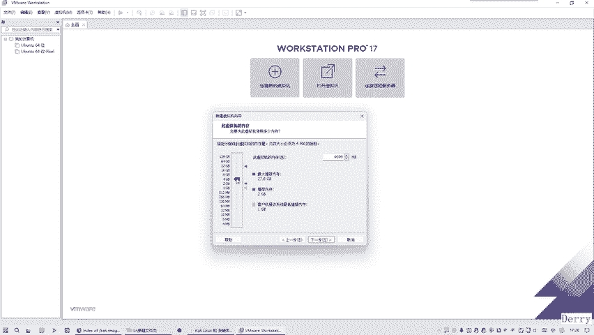

就是4个G，0个解的话太少了。

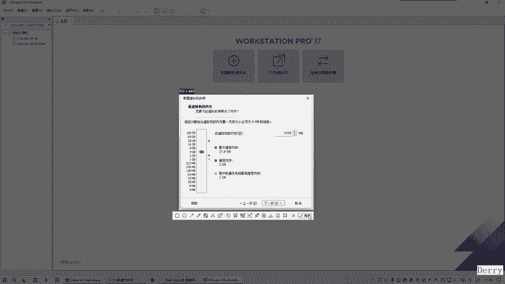

这时怕会卡顿。好，然后再往下一步。好，那么这个网络方式这里面不用管使用它这个默认的形式啊。好吧，这个不用截图吧，这个没有变化的就不用截图啊，使用默认形式。

然后这个时候我们在这个过程中使用它推荐的方式就是这个。IO控制器的类型这个环节使用它推荐的方式啊。然后下一步，因为这边的话，这个石房类型。也是使用它推荐的方式啊，这不要变他好吧。

因为是今天选择推荐的方式是最友好的。然后然后这边的话就是要创建新虚拟机的对的，有没有变化。然后这里面的话就是硬盘的大小。好，那么我这面的话，这个硬盘是很大的。你看一下这里面基本上这个硬盘有。😊。

800多G可以用，看到没有？它是1个一个T的硬盘，其实是属于啊有800多个G可以用。现在这的话我无论分多大的好没什么关系啊，搞个100G都可以是吧？他说我们这地方就搞1个50G算了，好吧。😊，5十接。

😔，基本上够用了。然后这里面一般来讲的话会将它拆分成这个多个文件，但有的同学就不想用多个文件，就是什么意思？就是我装完这个OS之后啊。它会出现很多的蚊像，或者是出现一个蚊像。就是什么意思？跟我说一下。

就打个比方，我装完之后的话，地面会出现很多蚊件。或者是一个文件选择哪一种？好，那么一个文件的话就是可能会出现一些小问题啊。但是说选择很多文件的话呢，基本上不会出现小问题啊，是它内部的机制。

因为它每个文件都是独立开来的话，就是很多文件的话就不会有这种奇怪的问题。就是独立一个文件的话，可能会出现损坏的话就麻烦了，知道吧？因为一个文件的话，这么大是吧？一个文件，比如说一个文件的话。

它打比方有5个级的话，那不是导致这一个文件很大。但是我这里面有搞个100个文件来占用这5个G，这概念又不同了。是另外一个概念是不是啊，就是更加是么更加独立一些，就是更加零散的这个配合起来会好一些。

我们一般话为了防止它出问题，还是不要搞一个这么大的一个文件，还是拆分成多个文件是一个原因，知道吗？😊，好，准备就选这种方式了。😊，这里的话就是问题更少一些，好吧，这是一个经验。

问题跟你少一下。

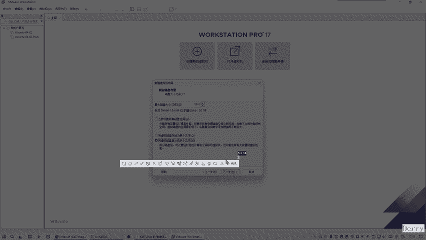

嗯。这不对。然后我们这边就把它给放到这来。好，这个意子后来，我们在这面的话再去下一步。😊，好。然后他告诉你就是会有多个磁盘文件。来去创建这个50个GB的这个虚拟磁盘。

那么这个是一个点看里的这个VM的形式的。好吧，这个要留一下就够了，这个基本上不用动。下一步。然然后这边面搞定之后呢，基本上的话，我们可以去自定义它个硬件。也可以点完成这个硬件这块的话。

基本上你要做些什么，看适看你需需不需要做一些优化的调整。但是我们有一个点要必须调整。由于我们最开始是选择什么，选择稍后安装一个操作系统的时候，你发现是不吧？我选择是这种形式。那这种形式的话就必须要。😊。

就用什么呢？就需要借助这个CD。这个光驱来安装，因为它是稍后安装的看你。有这个原因，所以说呢我们就需要什么？所以这个实机这个要调整一下。它的自动检测是检测不到了是吧？就说我们指定高诉是哪个地方啊。

我们就说我们是放到。这个盘符里面的。诶。等一下，我刚才是拷贝过来了吗？我是放到。这里面的反正里面的最好是不要给他有中文的目录，所以说这边改成英文。收的吧。好，然后呢我们这边的话就选择这里面的这个就够了。

这就是我们在上一篇所下载这个看里的镜像文件。就这个。是的吧。好，更以之后来，那么基本上的话其他的就不需要做什么优化了。好吧，我直接点啊完成就行了。那正点是这个。😊。

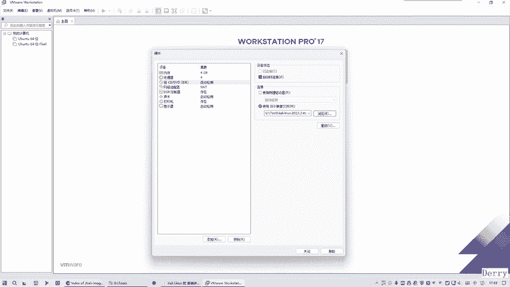

好。选择上一篇。讲解。所下载的这个。看你进像。

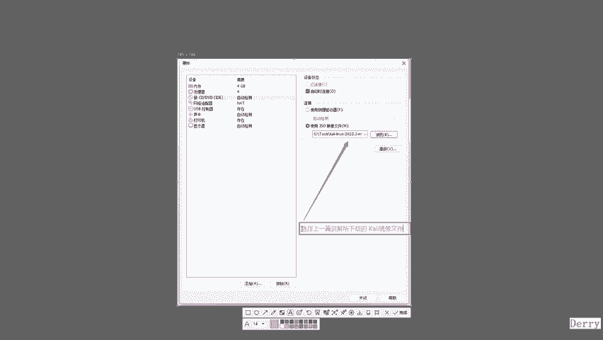

就行了。好吧，那我们就需要把这个嘞。😊，放到这里来。这有点大是吧？但是这个没关系啊，就个。😊，像这样看好吧，那么这就是我们的这个过程。基本上现在的话就可以点击关闭完成了。好吧。

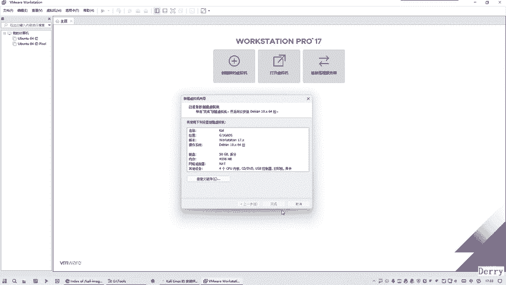

完之后的话，但是这上面那个不用管，这是我之前装乌邦兔的这些历史记录啊，不用管它，这也是我们这个就出来了，是不是？所以之后的话，你这个时西再去观看的时候。😊。

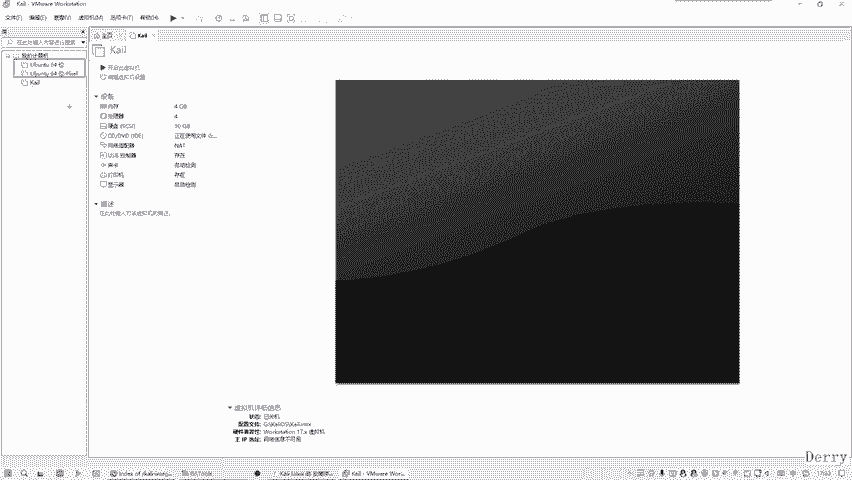

看我们这个看你OS的时候，你发现它就出现这多了是吧？因为我们选的是多个的，是不是还记得吗？留意一下，就是我们选的是多个文件的形式啊，是不是？😊，好，那么接之后，但是这个并没有进行任何的安装。

它只是一些什么初始化的配置而已。

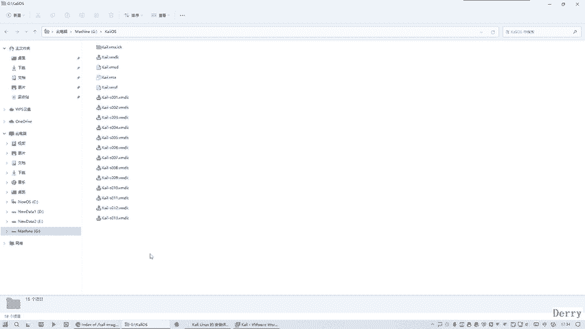

所以说我们需要干嘛进行安装，那么怎么办？就需要点击这个开机。一直要点这个。或者这个，那么就代表要干嘛要去开机的时候进行机行安装。好，这你知道吗？那么我们就需要去点它。

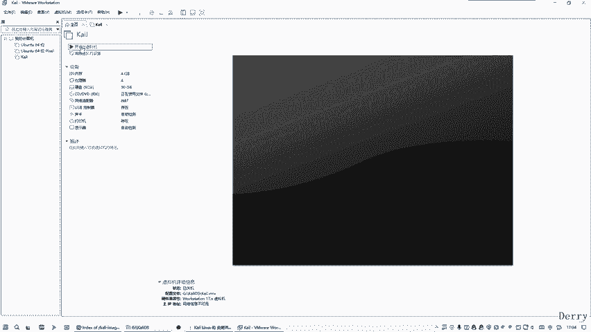

那么这面的话有个提示，一般你可以点击说点击说这个我已经安安装这个或者是不管它都可以，好吧。好，我就点它吧。那么这个过程的话可能会比较耗时，但是我们需要等待一下。这个等待过程中的话。

我给大家说一下我的电脑的配置。这个电脑是是一个台式机。

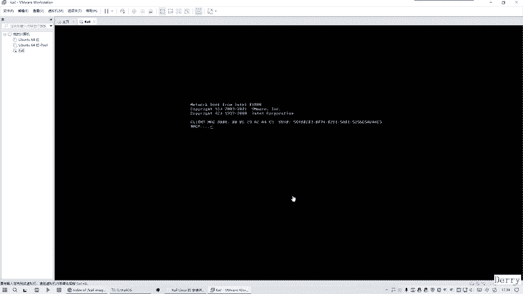

然后。这个运行内存是32G的。然后这是12代的I7，1I700。看到吗？这是英特尔的。那么一般来讲的话，整个网络安全一般都会使用英特尔的这种芯片。好吧，就是为什么呢？因为很多做编程的。

无论是angjoin IOS还是前端后端开发，基本上。都会选择英特尔的这个CPU。因为MD的话，最开始有个印象就是说发现有些软件会兼容性有问题啊，就是怕MD的兼容性有问题啊，就导致很多人就。

一次性选择了这个英特尔的芯片，知道吧？这是一个小事情了解一下。那么所以说我们这边实用的是这个英特尔的芯片。😊。

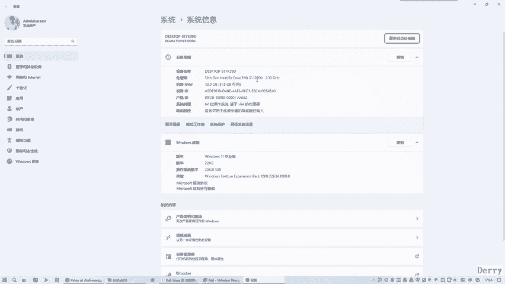

好，这是配电这个电脑的配置，然后它还正在。安装中我们就把这个视频给暂停一下，好吧。那么接着之后我们就会发现这一个，甚至你会认为这是个错误。Sing。loot find什么意思？

是说什么什么视统东西找不到，是不是？那么这边的话，如果说你一直等它的话，可能就是说没法玩了，就是一直会在这卡着里卡壳了。那我们就给它点进来看一下。整进的话，这个光闭就进去了。然后我可以按什么键出来的。

就可以按那个12345678那个一旁一左边旁边的键按一下。退出来了，知道吧？这里你看它在执行了是吧，这时这键出不来的话，你可以按一下这个ctrl键加艾键。😊，还是出来了，看到没有关没出来了。😊，好。

然后的话至少是我刚才随便按了个什么键。他就可以干嘛在执行中。3试时行中，我们再等待一下，好吧。😊，那我们在安装的过程中发现还是这个错误怎么办呢？那就没法玩了，先关掉好吗？就是把这给杀掉。

对面的话讲择关机。

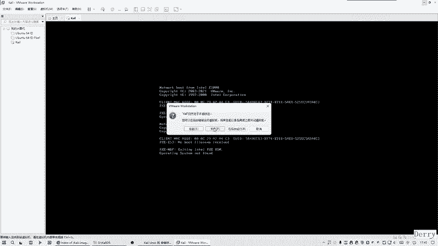

关之后呢我们再选择它，再去编辑它。😊，边界。🎼然后就是这个环节肯定是没有使用，选以它的时候。这里面是选着的你要进行使用呀。好，但是这里面不能出现任何的中文呀，我们没有中文吧。全部是英文的这一条是。对呀。

这是应该不会有问题。这样。是省良解。好，那么我们现在做的话应该没什么其他的问题。证据保存。好。我们再来试一下。

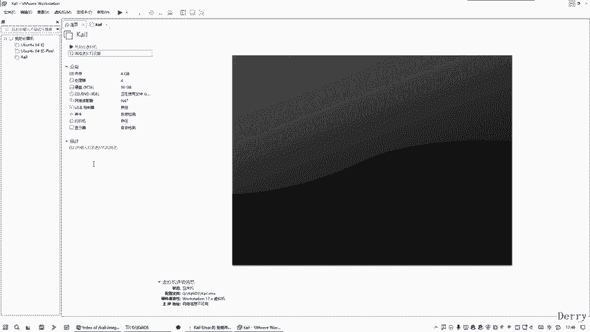

因为我现在是在开机，就是在安开机的过程中，就是寻找那个进线文件来安装，刚才找不到。感报措实找不到。帮我简查一下。那么这之还是这个错误的话，那我们就。只是把它关掉。等下。按。

那个ctrl键加艾特键才取回来。

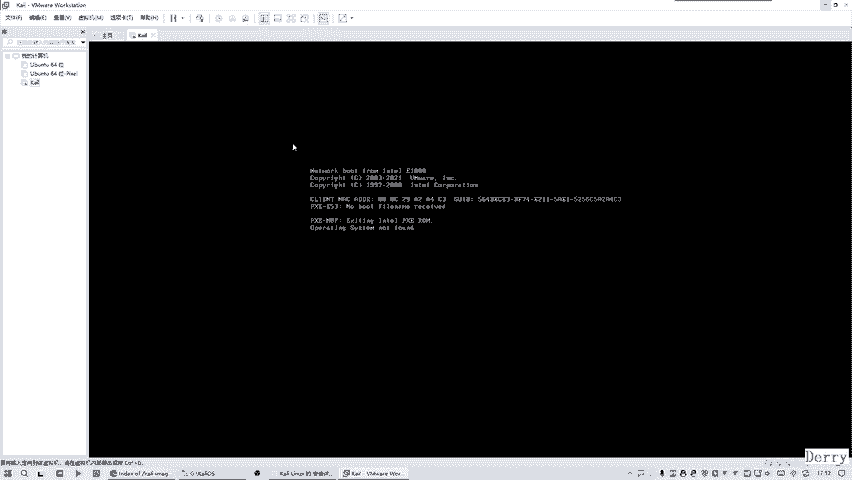

然后的话就需要点字点。这属入什么呀？就是window加R。我们是输入一个服务。🎼好，或者这样不行的话，你或者是在里面直接服。是一样的。好，那么我们就找到VM相关的。要这时话你发现。

这个V模这个是正在运行的。这个没有证进性。给启动下。我也没相关的，应该就这几个吧。重起了，现在。这个到这你位置，就这几个。正在运行要拜试一下。

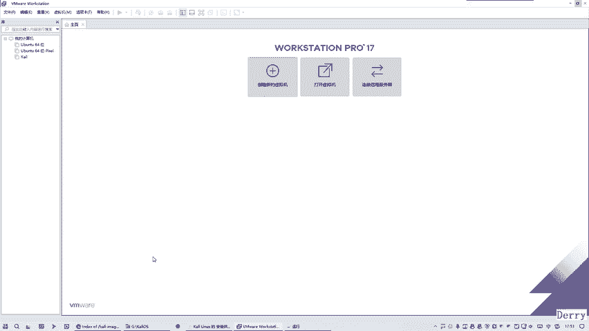

在这里。估计还是有一些问题啊，他这个。这这里的问题的话，你在网上找的话还是老是说的不对的。他老是说那个打个勾就行了，其实打个勾不行的，是吧？😊，除我刚刚打钩之外，一把扶盖成再试一下，看看可不可以。

就是有多个原因导致的，还是看下还是有问题吗？

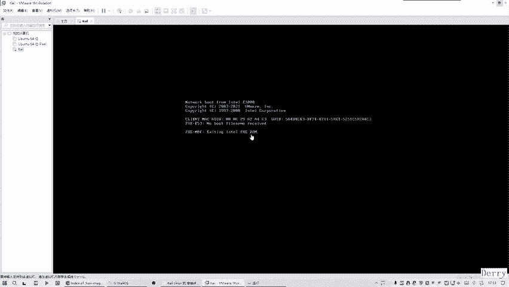

还是有问题。