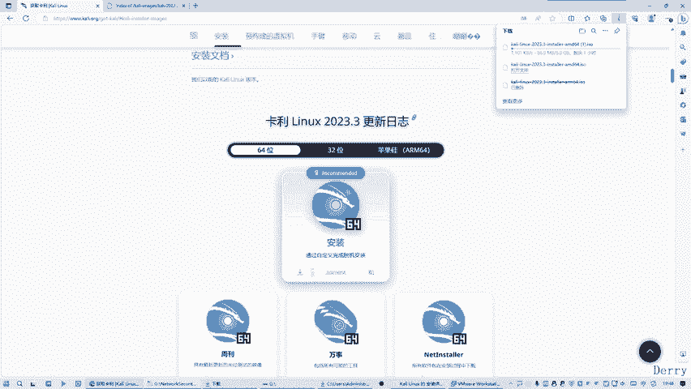
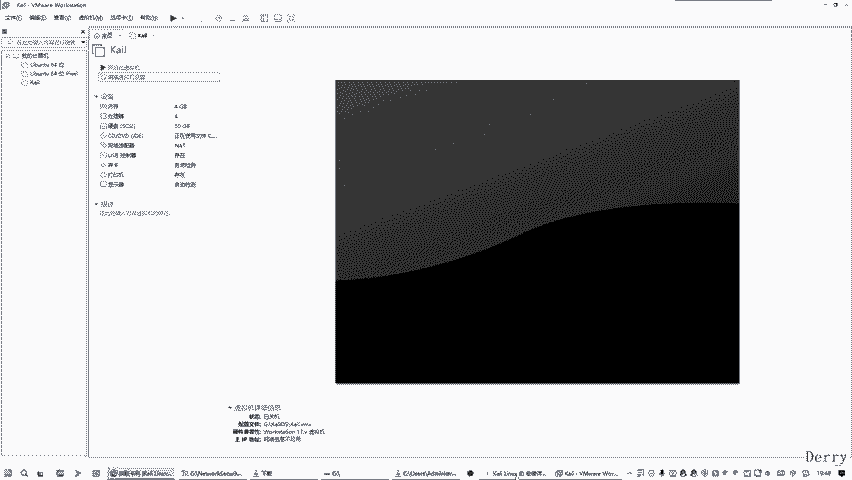
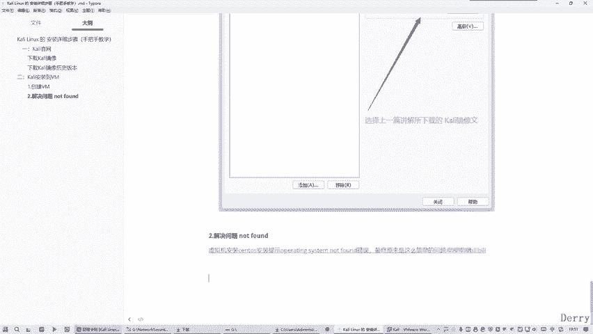
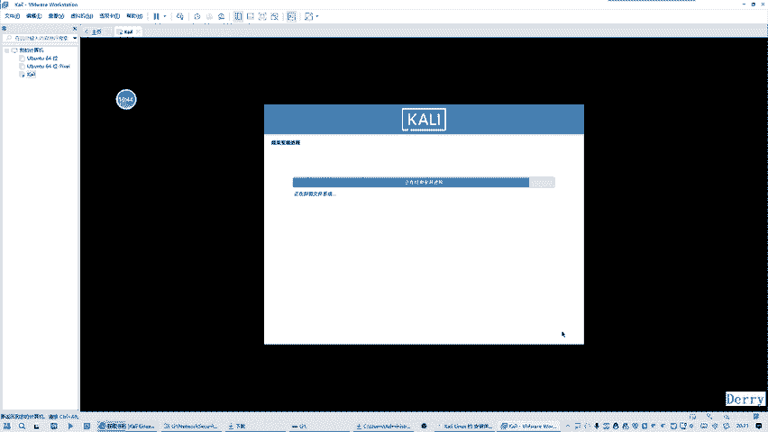
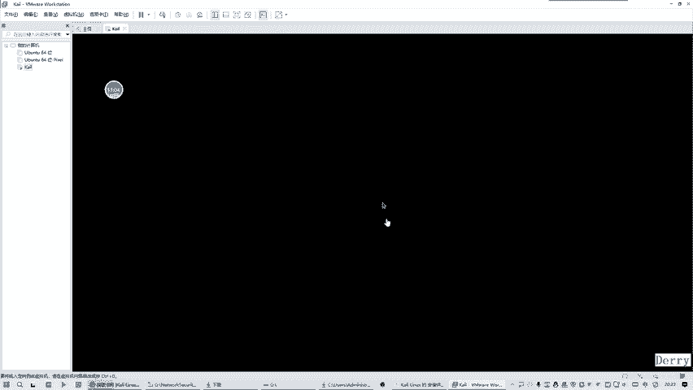

# 2024最新【网络安全／黑客】入门到精通课程教程，包括Kali Linux安装与CTF比赛教程（附安装包） - P7：05.VM运行所安装的Kali细节步骤 - AI-大模型基础 - BV1SK421Y7kA

那么这里的话我看了一下这个问题的原因，我终于找到了。网上的话说的就是不对的。他都说什么操作系统坏了，重装整个系统啊，重装VM啊，重装各种什么乱七八糟都没用，好吧。真任原因是什么？

真任原因是因为你这个包有问题损坏了。我们最开始在下载方式是有问题的。我们说一下，就是这种方式，它下载这个包是损坏的，一传方式不兼容啊。这种方式。所下的这个SO的话，它这个是缺少什么东西啊？那怎么办呢？

我可以换种方式。使证的方式。从这种方式下的话就没问题了。所以说我就这样做了下。或直接点击这里下载。我觉定下载之后呢，就下载哪一个呢？就是我讲叉。😊，那么就等于是。是这个多一个出来个名多一个出来一样的。

好，我这边这个的话是提前下载好了。是吧一样大码，3。9GB。是吧3。9GB。好，你看下啊，这就是3。9GB是不是？看关线了吗？哦，哎，我们前面省动的方向的话，有个问题它丢失了。

我们前面最开始使用的这种历史版本的下载方式。这样下的话，它是没有3。9GB，你看一下。等于多大嘞？还是3。25GB。是不是啊这明显是这个肯定是丢失什么东西了，把它干掉，坑了我这么久，是不是？😊，好。

S是把我们这个。把这个拿过来，这个3。9GB的拿过来。好吧，我就想放着点吧，就想放着点。😊，放这里。好，那么说说你看我这个时的话，给我点这里面下载。😊，它才是我们的3。9GB的。是什么？就是重复了。

然后这个是前面下载一份啊，这两个是一样的，这两个是等价的，一样的。OK那么这种方式搞定之后呢，那么我们这边需要更改。😊。

点他之后。需要编辑。编之后呢，我们需要把这里面目录录录改掉，我们选择这个下这里个这个才行，这个3。9GB的才行。😊，知道吗？所以说这面的话，我们回进来，所以说这种方式你不用采用了吧，想不采用好吧。

因为以前没问题啊，现在有点问题啊，它可能说过几天之后呢。😊。

这种方式又没有问题的。还是目前今天我录制的话有问题，是因为。它这个是缺少什么东西啊，不兼容啊，好吧，但是以后可能就没问题了，因为以前没问题啊，以后没问题啊，但是仅仅就有问题啊。但是呢这种方式我就放弃了。

我使用是这种方式。😊，去点这里面下载的这个就达到3。9GB的就没问题了。是不是？呃下面这种方式的话，它是3。25的，3。25GB的就好像对不对不上标啊老是有问题，是不是好吧？好，那我说的话。

这个为什么会找到这个原因呢？这为什么我可以知道是这个原因要，我跟你们说一下，是因为。我给大家看了一篇那个文章。好。稍等一下，我给你们打开一下。这里面专门给你们找一下这个问题啊，就这个你说这个问题啊。

他这个讲了8分钟，8点25秒，小小用久的话讲什么事情呢？就是各种网上说的是错的，什么什么重装整个系统重装VM重装各种什么东西都没用，好吧，都是乱说的，其实不是这个原因啊。

原因就是你对这个整个镜像有问题啊，知道不知道？好吧，所以这个要给你拿过来。😊，反真讲，就是我们现在的话就是。12345。哦，这是我们要讲的什么呢？解决问题。OK我们是我们是放的是吧？出问题。看开就行了。

好吧。😊，OK那么这个讲了将近8分钟，8点25秒的话，就是说这个事情的，就是各种方式尝试遍了，之后发现都都不行啊。好，所以说这里面的话这里面有一个点就是我们有一个环节。这个房式可以放弃掉。

神动方式下载就搞定了。那以之后你看怎么叫安装，现在是怎么叫安装。😊。

那么们就回到这里来的时候。这个时候的话我再点它就没问题的。好，自己叫了一声，我刚摁了个什么键嘛，难道等一下啊。也，他这个安装你会弹一个提示，要我去安装那个VM的tos，就是5M的工具的。

它现在没有提示吗？现在。上面广大的好吧，我们就安装的。😊，好，我点测第一项撤回下。好，你的慢，我按了个艾键加ctrl键准备出来一下。好，这就是属于安装中了。那么这边的话这语言的话，我们一般。

不会选择这个inlishlish西，不会选择英语，也都会选择中文，好吧。因为你这个英语好的话，可以选英文啊，他默认是选英文的。我们就说非要选择简体中文。知道吗？好，然后呢再去continue继续。好。

这边的话一般会选择中国。好，然后呢这个一般会选择我们熟悉的汉语。好，这边的话就是进入这个昂座环节了，知道吗？我需要稍等片刻。等他走完之后的话，就需要配置网络，我们需要给网络取个名字，也就是主机名。

我们学学的就是这个不改吧，就是这个命名算了好不好？就这个看你，然后再继续。然后这面搞定之后呢，它这边缺失这句话的意思是叫什么？叫设置一个密码的形式一下，就是这个域名。这个玉米的话。

我们全部保自己自算了好不好？看你全部写一样的，就是不用去记的，不用去背的，知道吧？全部写一样的。😊，好，要说说全名，我们就干脆不要背了，全部写一样的算了，好吧。看你。好，然后这边的话也是这个账户的这个。

系ney。好，那么这边的话必须要有一个密码是吧？密码也看清出，就是想就是不行就记了。这是两票。好，现在好吧，然我再继续。他在试试我们这个时钟。那么这里面搞定之后的话，就会有一个磁盘的设置啊。

我们稍等一下。那么我们一般会手拿默认的形式，就是使用整个磁盘好，一般都不会动它嘛，使整个磁盘就是这种分区的方式啊。啊，因为是这一个新系统嘛，这个看你是一个新系统。好，继续。就之后的话。

那么这个也是不用动它的，就是只有有一个选项，没得选是吧，再继续。然后这里面的话有个点就是。我们也会收到默认的推荐的新手的方式啊，就是。将所有文件放到同一个分数里面，也不是乱搞啊，不是深圳的方式单独分是。

我就直接以最简单直接的方式啊推荐的方式啊。谢谢。O。那么这个头基本上的话，你可以看一下，就是主分区。这是52根52。7，然后这里面话这个逻辑分析，这里面这个你现在不不知道围观下，就稍微了解一下好吧。

就是。我们现在再继续。好，然后这一面的时候呢，我们它是格式化，我们选择是。好，开始话好吧。😊，好，这是对这个基本操作的一个全部设置啊。好吧，基本上就结束了一快啊，在这个过程时间会有点长。

我把这个视频给暂停下。😊，好，经过一个长时间的等待，就到这个一步来了。然后的话这个基本上不用动。好吧，好，那么就是包括这个桌面这些环境相关的都不用管，他都帮你配置好了，我直接点进去就行了。

在这个过程的话，实际上也是也挺长的。我要把视频再上停一下。我暂停下40秒。好，我把这个刚才把视频给暂停录制一段时间，所以现在给恢复一下。因为经过半长时间的等待，他终于加载完了。好，那么这个例之后呢。

我们一般情况下会选择一个是。😊，9点是好吧。当当前面的话可能将近是是不是有十多分钟的这这个安装没有把它录进来，故意这样做的，不然的话时间太长了，知道吧？好，然后这边就是点试就行了。点试之后呢继续。

然后这里的话我们。我们这里面的话会选择这个注意啊，我们选择这个DEV好吧。因为之前的话，有同学选这里面是有些问题的，我选这个像那个叫好。😊，选这之后呢，那么我们点下一步继续。

我看这个要不要要不要把这个视频暂停录制一下，这个可能会有点少啊，先先先不暂停好吗？现在那路吧吧。嗯，我还是站一下吧，还是站一下，好吧，站一下。😊，好，经过我们长时间这个安装终于结束了，安装完成看到没有？

这里。好，那我们就学科嘛需要直接继续。那么基本上的话就全部结束了，重启可以进入我们这个系统了。

那么一般来讲的话，需要。这样我说说你啊，就是一般要按一个键，随便按一个键都可以，是按一下任意键，知道吧？😊，好，那么就会进入这个系统，那么就要输入你那个用户名和密码。

那么我的用户名和密码都是看你没有变过的，是不是全部写一样的？

小看你看你登录。哎，他说我这个登录有错误，看一下。我志强不是写的是看你吗？密本难道我写错了吗？等下。不可能呀，没错没错啊，那么进来了看没有进来了，那么就终于安装好我们这个看点了。

就是我们手把手的安装好了，是不是？😊，就是每一个步骤都给你们去讲完了。当然当然这个安装的细节的话，我把这个视频给暂停录制了，因为太长时间了，知道吧？但是不会影响我们的每一步的点击，每一步的点击的话。

我们都会把它录下来了，已经知道吗？好，那我这里面的话，这就是一个linux时代系统。😊，好，就是它的主打就是一个这种界面，这是回收站。还有这个文件系统是吧？还有这个主页这些。

