# 2024最新【网络安全／黑客】入门到精通课程教程，包括Kali Linux安装与CTF比赛教程（附安装包） - P8：06.绿色包Kali - AI-大模型基础 - BV1SK421Y7kA

那么在我们前面的这个安装过程中，其实你会发现是非常麻烦的，是不是？那么最开始的话我们是转了1个VM17的。然后面的话就给大家说了这个环节。那么你就发现这里面为什么会这么麻烦？

是因为我们的是拿到这个看你的镜像。自己动手一步一步一步安装的。所以这个过程的细节是全部有参与的，他是挺什么挺麻烦，步骤挺多的。那么有没有更好的方式，那么一键生成呢？也是有的。

那么今天就给大家去介绍这个绿色形式啊，什么意思啊？就是前面的时候。

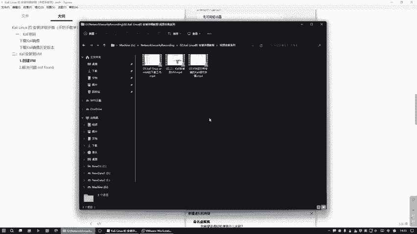

是你看是干嘛去下载，都是镜像是吧？这种方式都是下载镜像，看始点个字啊。就如果说凡式涉及到下载这种镜像的方式的话，你必须要手动参与它的每一步的安装，每一步的考量就比较麻烦。看见没有？是不是啊？

这是呢我们对面的话，其实还有一种形式就是我们说不要下载镜像，而是说下载绿色包。那么这里面的话，这这上面这些步骤全部可以省略。就是意思就是说我们可以一一是吧，一气呵成啊，就是直接。

那么第三个环节就是说我们要。绿色包。我这个看你。那么这个就是什么？就是属于点绿色包了，不是镜像了。绿绿色。好，下载。那么这个地址都是一样的，只是说我们换一个目录的下载。我们现在打开一个浏览器。😊。

直接粘进来就行了。好，这个。我们随便点哪一个都是可以的啊，这都这个无所谓的。是的吗？这里要了这之后的话。😊，之前我们是点哪个之前我们是点这个是不是？

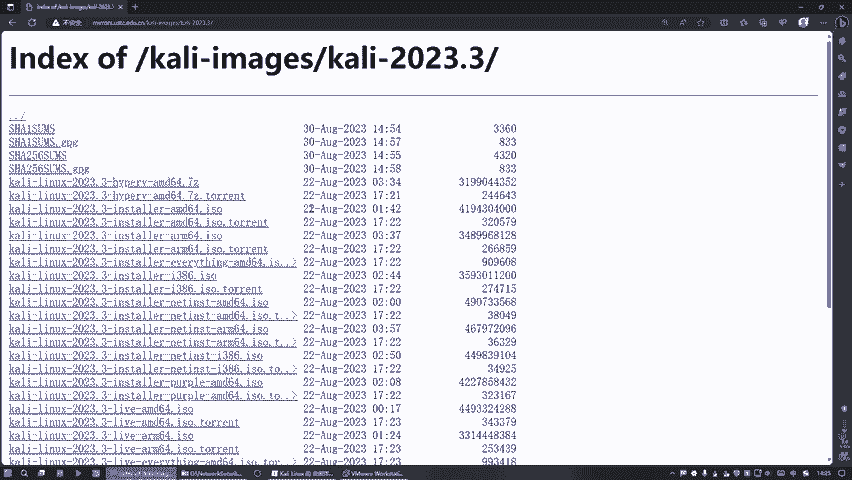

是吧然后的话唉现在的话我们说不整这个，我等一下换个整这里也可以。还，干嘛呢？还是要点这一个虚拟机的5M相关再支持它才行。😊，好，比如说你看这个一个20S3，哎我看我之前装是哪一个版，我可以看一下。

我之前装过一次了。我这里说是20232。

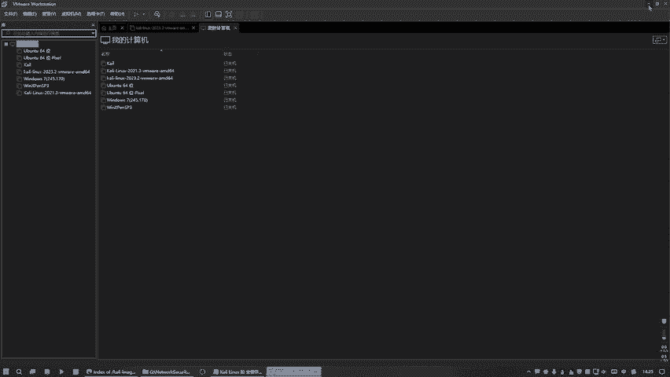

20232我这边是20233。啊，就说这个好吧，因为我之前做过测试哈，怕这是有问题啊，那么就是这个VM。😊，等下是。看没有，我也没上光的。那么为什么有个点7Z呢？就是它是一个压缩包的名字。

是一个压缩形式而已，这不用管它这节的话只是压缩形式。是吧重点是前面这几5M。M645年这个下载是吧？

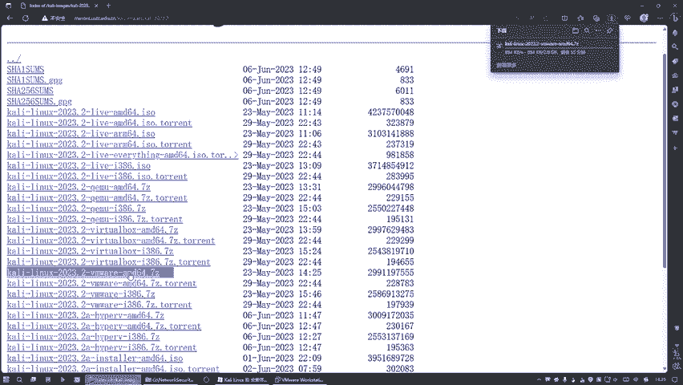

好，那么现在桌面上去的之候呢，我们到时候的话就。

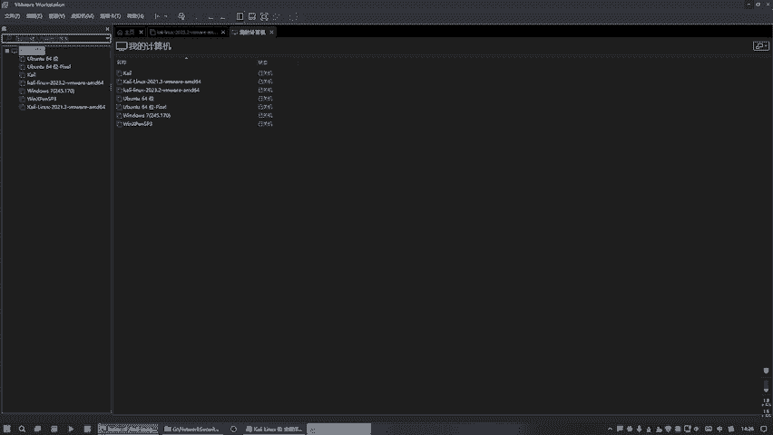

不用这个也没关系啊，就是这个不用打开都没事，你干嘛可以直接打开它，打开它，你打开看下怎么操作的，好吧。😊，那么这种方式是什么形式？这种方式就不是镜像了。像前面的时候，我们是以镜像的方式玩的是吧？

就是一个SO的形式。那么凡是SASO的话，全部是进行的方式啊。我们现这种方式的话，就是绿色包就它全部做好了，你不用去操作细节的，直接拿来用拿来用就行了。是的吧。好，所以这个环节的话，给你们截个图。

这样写好吗？好，这个就是绿色包，就这个。魔方在哪？네。怎么整加不了啊？等一下白截脱了这个。

对呀，完成呀。

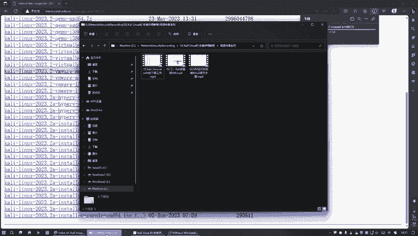

好，那么这个应该也下载完了。

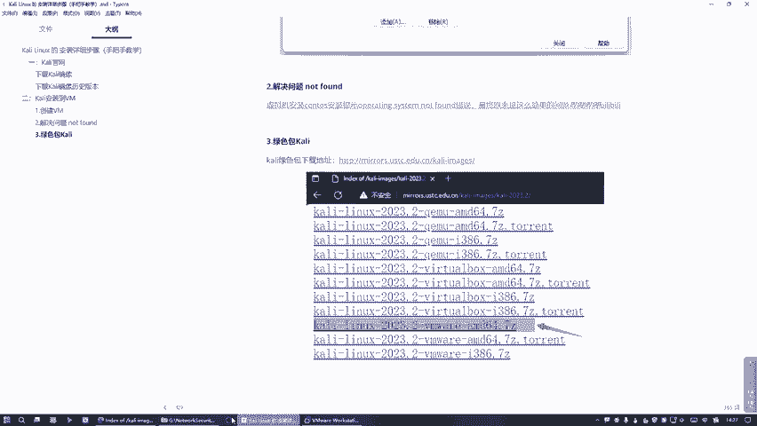

是吧快完了，我们打开它。😊，那么还在下载完，你看刷新下去还有一点点。99%人应该是。唉，怎么突然就没网络了？这个等一下他一个校卷工作。😮，把那个视频给暂停下，好吧。好，那么这边已经okK了。OK之后呢。

我们就直接。😊，去截到当前目录下就行了。

🎼那么我们的第一种方式是干嘛呢？就是直接。打开就是双击可以打开，就是你只要在前期安装了VM。那么我们只需要双击点打开，打开哪一个呢？就是这个一般是哪一个，看一下。是这种样子的，双击一下。好。

可眼演就出来了，看做一个出来是不是？😊，好，然后呢我们这面这个就是我们刚才所下载的那个绿色包的。那我们直接直接就行了，他帮我们装好了，什么都不用管了，是吧？直接这边需要点一下，敲悄回车。

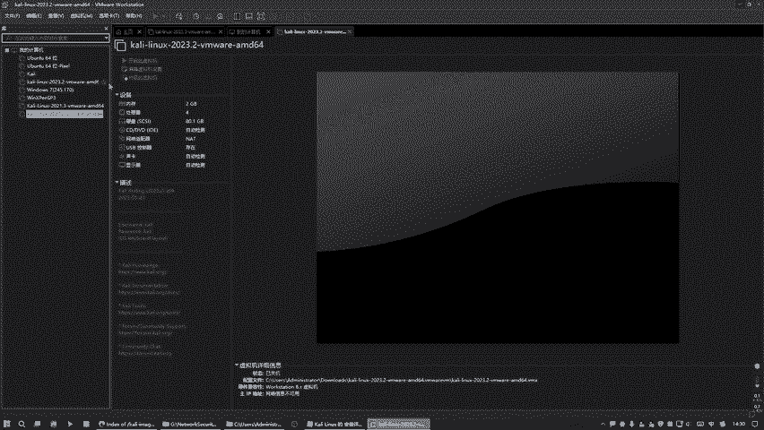

那么他也帮我们设置好密码和用户名呢，都是这个看你。那么就是这里面的话，它是。看你密码也是一样的。看你。どキ？看到吗？是不是把帮我搞定了嘛，所以说这一些所有步骤的话，你都不用管了，这叫这叫绿色的形式。

就是没有参与任何的像进线的一步一步一步的安装这个全部审略了，他帮我们做好了，知道吗？就他插在帮我们装的时候呢，是装这种默认的形式做好的，就是全部使用标准方式装好的这个细节你看不到。好。

那么这就是绿色版本。😊，国家技效这个国技效。然后。

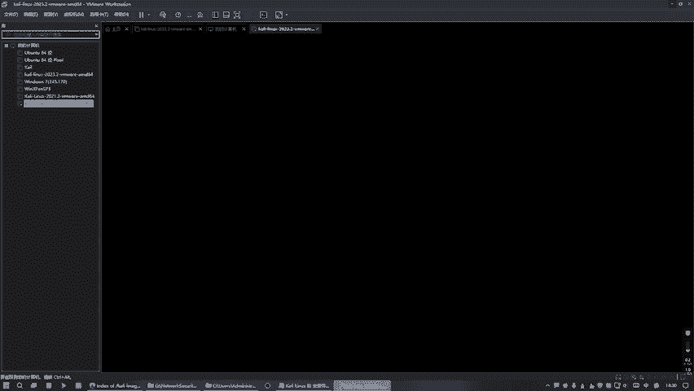

还有一种形式。就是刚才是干嘛，刚才是直接去双击这个打开，是不是啊，还有一种现在的话就是说我直接。😊，点这里打开，然后再选择下载的这个文件夹，然后呢。这样打开是果是一样的，等价的知道吗？

是两一共就两种形式啊。好，两种形式的话也也会进来，也是这个我把这给re一下去，好吗？稍等一下，这个移除掉，移除的话。😊，是否从库中移出这个这样不会从实8上的，一般是。你想是否从库中这证这，你说有时后来。

那么我们这边并不会受影响的。对你看。这个还在是不是啊？然后接种方式就做直接。😊，打开。这个是吧进来打开。

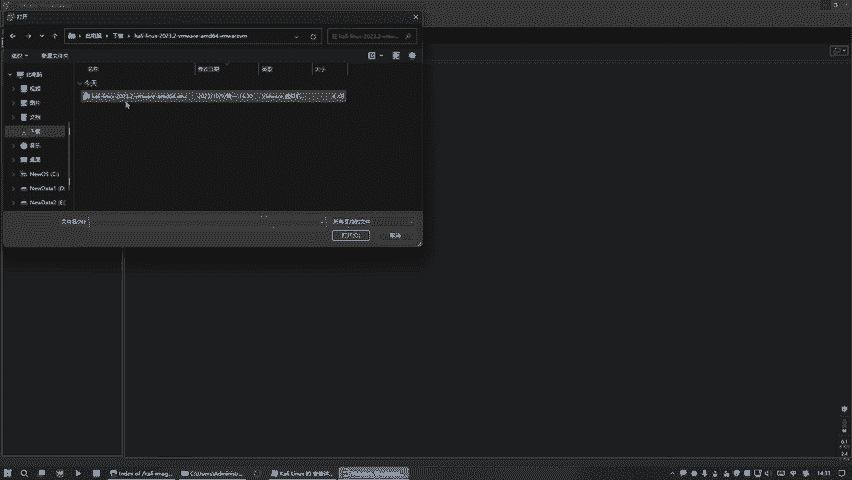

好，是一样的吧，是这样的。好，这这种话式跟前面第一种方式一模一样的效果。然后呢，它默认的情况下是被我们配了两个G的运行内存和处理器4个和80G的硬盘。😊，这些东西所有的一切的一切。

这个过程都是他帮我们做好了，所以这些细节的话，你就看不到。😊，哎，我们前面那个视频所讲的东西的话，就是每每一步步骤都是全部自己来亲身经历的过程。哎，这个的话他全部帮我们做好了，你看不到了，知道吧？

这叫什么？这叫绿色版，一气呵成的，不用管的。😊。

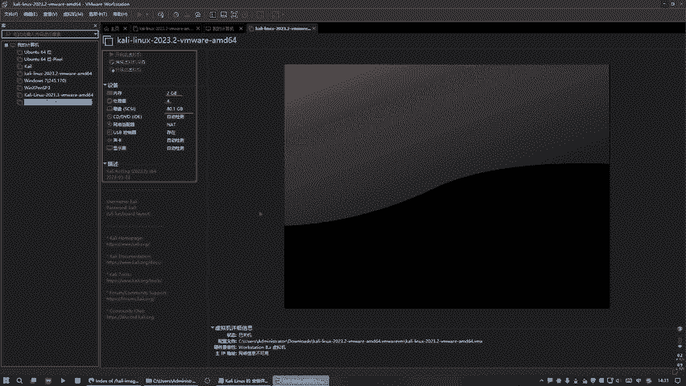

是的吗？好，只有第一次就这样做一下，后面的话我们就他就会有这个记录的就是。

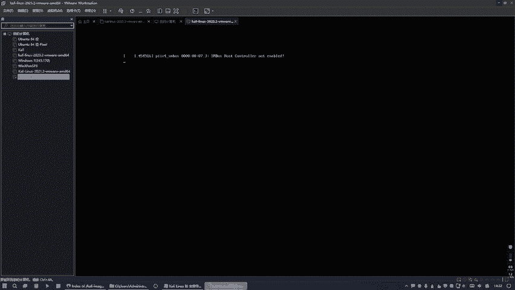

好，这个面积的话也是一样的，看你。看你进来。好，那么这就是我们的这这种形式啊。所以你会发现其实很多开发者他一直在寻求这种方式，就是干嘛，就是希望更加的省事，很多细节都不用管了。

就是呢这种方式有些细节你看不到，是不是？😊，各各的好处好，这是我们第三种方式。就是不是第这就是这种方式可以来做这个事情。第三第三步。

