# 2024最新【网络安全／黑客】入门到精通课程教程，包括Kali Linux安装与CTF比赛教程（附安装包） - P9：07.对Kali新系统的第一件事-更新软件包合集 - AI-大模型基础 - BV1SK421Y7kA

那么接之后的话，我们需要对这个counting。就是进行一个核心环境的一个工作工作安装。就相当是你装一个新系统，要给一个新系统安装些核心软件是一个道理。那么这个看你那个形式的话，我们已经做好了。

我们就使用这个。

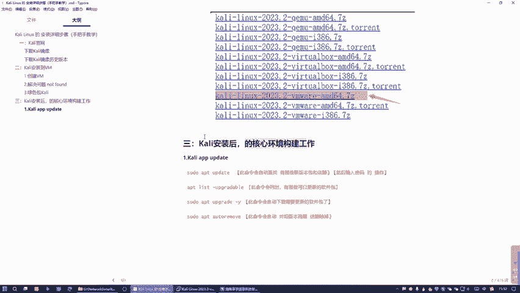

绿色版本。还记得吗？就是我们在上一篇中去下了这个卡点绿色包这个版本好吧，或者是你用这个用镜像一步一步安装的方式也是可以的，是吧？这个就是我们在上上上篇。是吧上上片用那个镜像一步一步的安装的，哎。

这个就是。哎，这就是我们上一篇下载的这个卡里的绿色包，还记不记得？

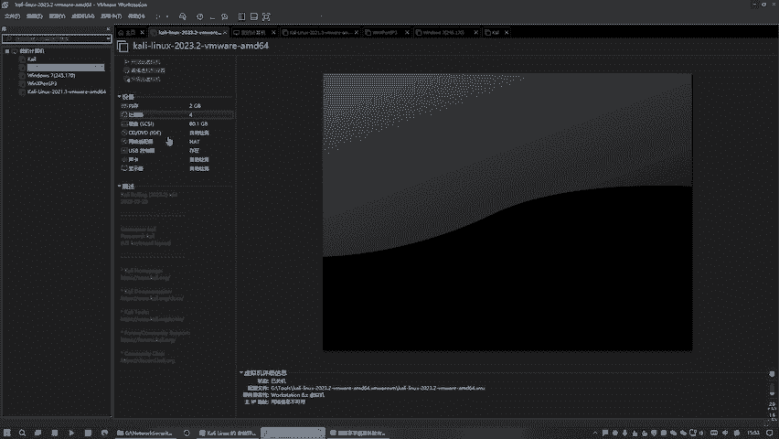

这个看你律师否。那我们就使用这个看点绿色包的形式，给这个看点的OS看点这个系统来进行什么，进行一个核心环境的工作。好吧，所以我们就打开这个看点绿色包，就这个点启动。

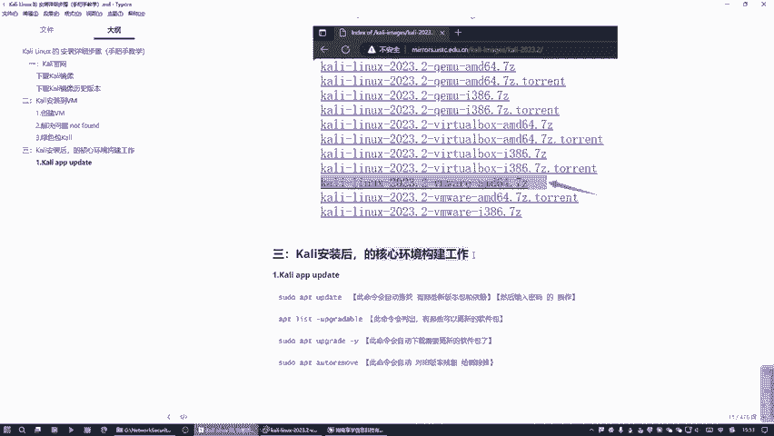

讲一下。再回车。按这个ctrl键和艾键一起按就可以让鼠标出来，看到吧？然后这边的话给以点这个它全屏。也没必要就这样吧，好吗？啊。给开一下机。那么这个。看你卫1的话，它是一个什么？是现在目前的话。

它是一个新系统，没有装任何的软件。我现在需要对这个新系统来装一些核心软件。

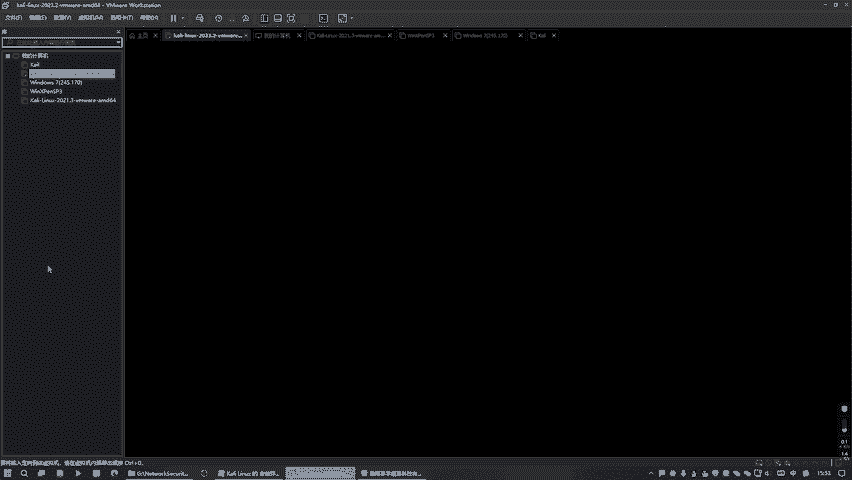

好，那我想点录这个看ning。看你。那么这面的话，我们一般情况下。怎么做呢？都是在命令行里面。我说我们对面需不需要打开这个命令窗口，知道吗？有点卡好。那么这这种方式我们怎么去打开呢？就是直接。我们是。

有点卡再打开。好，大家之后来我这里面想放大一点的话，我们这边我看这个快捷键能不能用起来。点下啊。啊，这边是放大看到没有？很到。放大。好，这大家可以看清楚一下，展开。好。

那么这边的话这个新系统我们一般情况下都是操作命令，好吧，并不是像windows一样那种方式去操作这种图形界面，而是以命令的形式来展示这个系统。那么首先第一个环节就是干嘛？我们需要执行这个。😊。

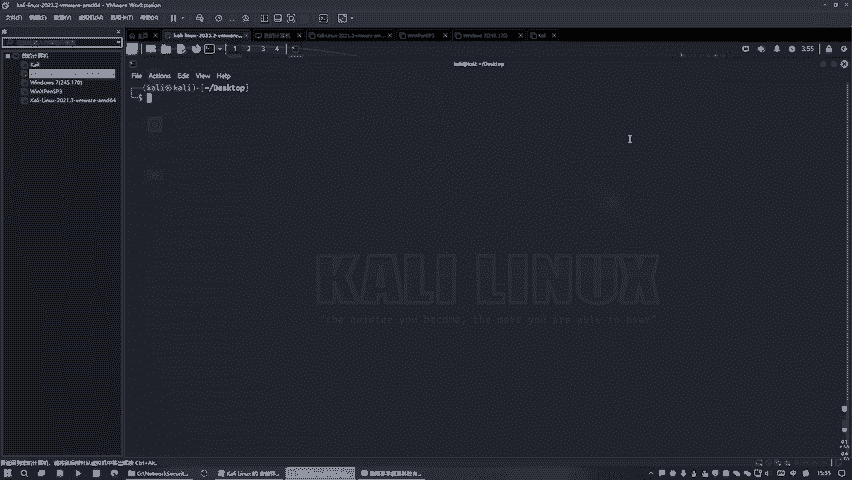

APGupate在干嘛呢？这个布置干嘛？这不置就是需要我们对我们的软件包更新啊，就是对我们那个看你的这个软件。报合期更新操作。什意思？就是你的这个这些软件包合机可能是比较老的。

我们需要给他做一个升级操作。好吧，因是太老的话可能会有问题话，后面是吧，一般要做个更新啊，就相当于是你装一个新系统，然后对这个新系统里面的软件进行更新操作是同样一的道理。

那么说以的话我们就需要执行这个命令。在这个命令的话，它会自动查找哪些新版本包的依赖。他会把一赖给下载进来，但是他并不会帮你安装，知道吗？所以我们一般情况下会执行在这个命令。😊。

这是为什么有行有时候你发现这种系统上有些很奇怪的问题。😮，好像老是报错是吧？但是我们有时候你会发现你只要执行这个命令，执行完之后啊。你再去看的话，那个问题解决了，为什么？因为它缺少是什么依赖，它会报错。

而你实接这个命的话，它会自动帮你去下载这些依赖，但是它不会帮你安装，知道吗？它只是会下载一些这个依赖进来。所是为什么说你会发现你你去查一下那个很多这种问题啊。基本上有很多网友就说你要执行这个命令。

为什么？就是这个原因，知道吧？就是帮你去，他会帮你自动去下载一些这个依赖。那么我就是来执行下。😊。

好，按到这里来就行了，知道吧？😊，当贴。好，我们就瞧下回车。那么这样需要输入密码，注意啊，这个时候输入密码它是不会不会有任何提示的，就直接写就行了哈，看你。抽一张。好，那么这就是帮你去做这个事情，好吧。

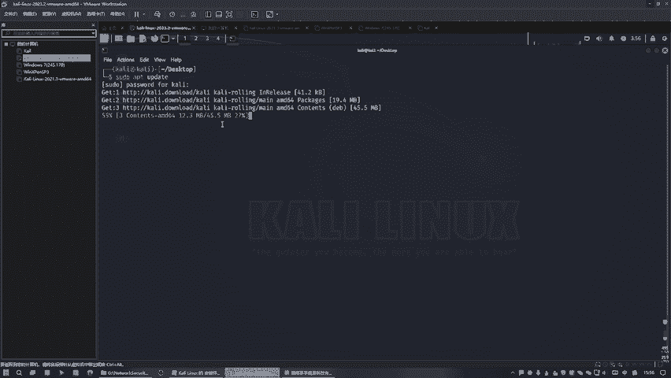

说以的话你看我们这边写的这个步骤吧是吧？就说那个要然后要输入密码的操作是吧？然后到时候这个命令的话会自动去查找。🤧这个。新版本中的这些包的依赖帮你下载下来。但是他一个问题就是他不会帮你安装。

还是下载下来，做这些依赖进来依赖下来，把这些知识给依赖下来。但是不会帮你安装，怎么办呢？这个的话就是需要列出。😊，我们可以更新哪些软件包，有哪些软件包是可以更新的，这就可以列出来了。哎。

上面的话只是做一个同步的一个准备工作。哎，这是正式工作，这也不是正式工作，考贝。

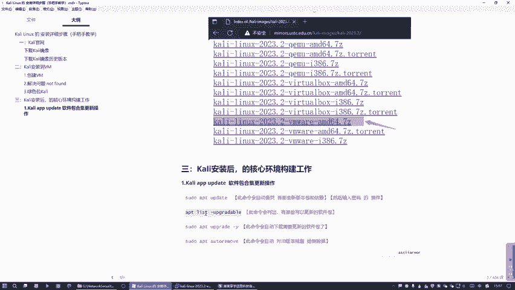

好，大家还没执行完，稍等一下。😊，等这这个的话，这个速度快与慢是取决于我们的网络。好吧，这边的话它会你的网络快的话就快。如果是你没有网络的话，管不了的。好吧。

要他会在网络上去请求些资源来去移赖到本地这里来，移赖这个系统这里面来做这个事情。所以这网络快就快。他现在的话你看是。😊，有点慢上，我把这个视频给暂停一下好不好？同学你看他这个太慢了。30KB每秒是吧？

太慢了，再点一下视频啊。或者你暂停下视频啊，那么我们等待一段时间之后呢，他就终于把这个搞定了，是吧？是不上没问题啊？就是把这些网上的这些要需要更新的依赖包给我们下载下来了，搞定了。

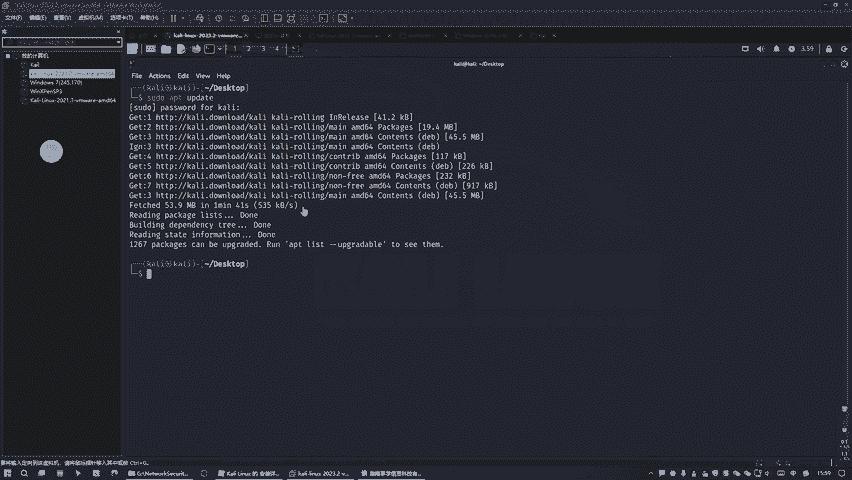

好，就是这条命令搞定了这命令搞定了。接着后呢开始进用这条命令，就是需要去列出有哪些是可以更新的软件包。😊，好。好，注意这什么？这是具体列出哪些可以更新的软件包。

这是比较明确的现在是啊像一个历史的这什么很多列出来这个集合一样，列出这个列表出来。😊。

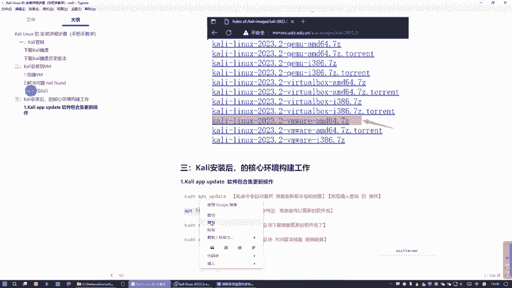

号么需要转过来。啊，全回车。哎，等一下这下。我们这里是那里写错了吗？看一下啊。

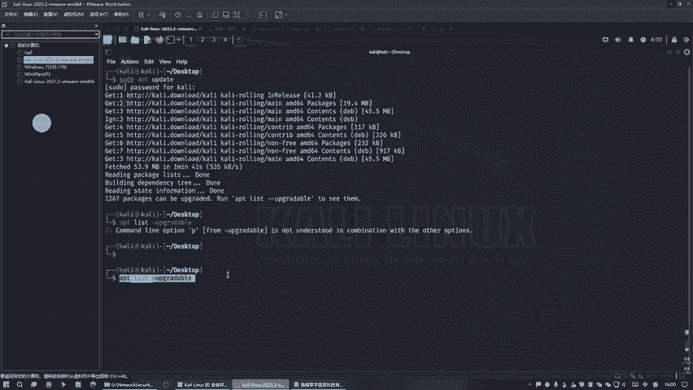

APT呀。他说我们这里写错了个单词。我这边的话使用这个手敲一下。APT。你是的。噶。对的呀。对些。😔，好。那么我们这里面的话缺少什么东西啊？好，我看一下这鸟是是什么东西，因为我这里面写错了吗？😊。

没写错吧。就这个命令。哦，这里面写错了，是两个杠嘛，不是一个杠吧。他这个提示也说了是两个啊，他这边是没说这个事情，他没说这个事情，但是两个刚才对，是不是？好，按下这个什么上下降就能去切换之前的命令。

好吧。好，两个杠。这行。那么这边的话就是能够列出我们这个系统里面。需要更新的这个软件包，那么它应共有两个版本，你看。你不要担心他这个很多是吧？这个还有多少都无所谓的。你看啊怎么去看呢？😊。

首先他说你的这个。可以去升级，我点不了，看到没有？这个可以去升级是11。5。5，但他旧把每次操到来是1。5。4，看到吗？然后呢，他说你这个的话，这个软件包可以升级到1，可以升级到5点。5。9。5。

这上的旧版本的话是5。9。4。看过视频，这是一个旧版本，一个升级的新版本。这只是说列出来在整一个系统里面的这些软件包。可以更新的软件包留这些，并且告诉你旧包每是多少。😊，这版美就这个嘛。

是不是这是这版美。是旧版本的你是吧？好，这就是新版本。😊，这是心啊。好，这是旧版杯。知道吧？OK这个之后来，那么列出来的话，它只是列出来也没有用啊，是吧？我们需要安装一下。😊，所以说需要干嘛呢？

需要引出我们的这个命令。这命令的话就是干嘛？就是此命令会自动去下载，并且安装这些软件包。那么为什么搞个杠杠歪呢？杠歪的话，就是你不要询问一切都要选择是是是是更新。如果说你不搞个歪的话。

他么他干嘛会不停的问你啊，你是不是要更新啊，你是不是更新啊，你是不是要更新，你要说这个歪说如个歪说这个歪就没必要知道了，就是很麻烦，我们就说个歪的话，就告诉他不要问，直接全部更新，好吧。这个行业啊。

那么这边的话就是。发生感粘贴。好。看到没有？从头到尾安装这么多软件包这个升级。他都没有去询问我们是不是要升级，为什么我们船了个杠歪会自动升级，不用问不用问我们，知道吧？好稍有点慢。

我把那个视频给暂停一下。我们这个等了很长时间，它还是50%，这估计。需要几十分钟。那这个太慢的话，我们就把这个视频在暂停上，把这个过去要等几十分钟，太慢了。好，那么等过经过我们长时间的等待。

这里面终于好了。好吧，我前面是把这个视频给暂停了。然后呢，我们现在的话这边搞定之后。就是意味着这块都搞定了。但是还有一个问题就是它装了新的软件包，但是不会把旧的软件包给删除。就相当是我升级1个QQ。

比如说1个QQ。QQ1。0是吧？啊，然后来这是旧版本，然后呢我就升级到QQ2。0。那么这时的话，它的190不会被删除，依就着190和200都会有它会有两份QQ。1份1。01份2。0，那肯定不行吧。

我需要把旧版本的1。0给干掉吧，只用一个新版本就行了嘛。所以需要干嘛需要。对旧版本的残留。给删除掉，只用新胞名就行了，不然保持两份，保持保存多份也没用，是不是啊把它拷贝一下。

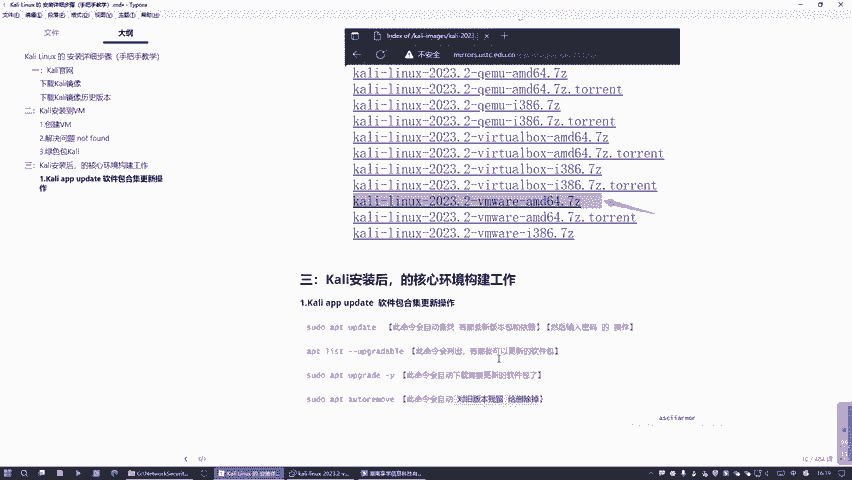

粘贴下。好，那么这个杠歪是同样个道理。😊。

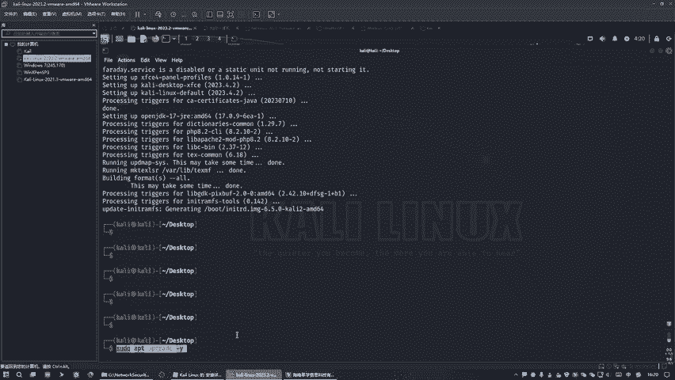

哎哎，这怎么对不对，怎么个干完都没考不起啊。哎，拷贝不没有用了吗？现在。😮，复制呀。粘贴啊。这个是没用了是吧？好。

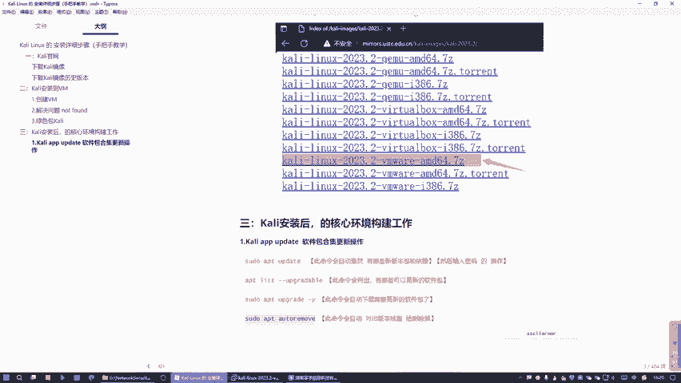

我收查下吧。好，那么这个remo autoto remove就是自动删除，好吧，小回。

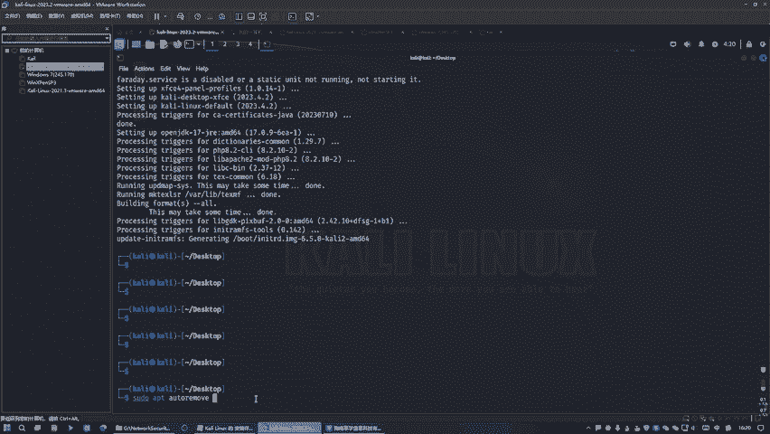

说输密码。看你。那么这是是否要上诉要上诉？他把这个要删除的这些旧的软件包它给列出来了。我说过我I就代表是yes。好，OK搞定。那么终于是把我们的这个4条主要命令给执行完了。

这样的话就可以保证我们这个count你。在这个说的转账包都是最新的状态，这样的话就不会有什么问题。好，那我们再就搞定了，这部就终于全部OK了。OK。

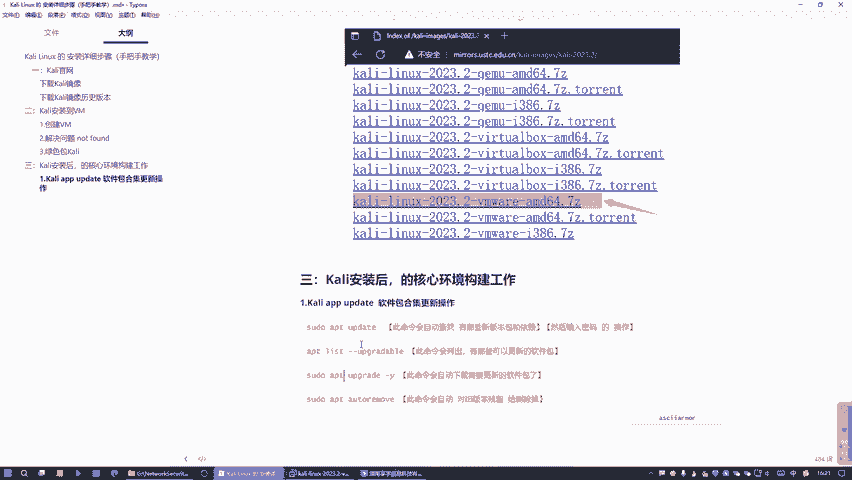