# 2024最新版AWVS分享，带安装／汉化／激活教程 - P1 - 零溢出 - BV1nz421a7qR

嗨大家好，我是林一处。那么今天分享AWVS的安装和破解。首先什么是AWVS呢？AWVS的话是一款自动化探测外b应用漏洞的程序。那接下来我们分两个平台演示，分别是windows和reux。

首先这里免责声明，资源来自网络仅供个人研究用，请勿用于商业用途，仅在下载后的24小时内删除资源来自网络，不保证纯净，最好开个虚拟机用，使用时请遵守国内相关法律，产生的一切违法后果与本人无关。好的。

那么接下来我们开始演示。首先我们这里需要准备一个安装包，它的下载链接我会分享在评论区和视频简介中。首先我们先把这个要缩包解压出来。然后我们就会得到这么一堆文件。为了绕过验证。首先我们需要修改DNS。

所以我们需要修改一下本地的host，它的位置在C盘下的windows，然后在下集目录的sst32下面的dves在下面的ETC目录。那么我们的host文件就在这里，我们需要对这个文件编辑。

我们可以右键打开方式，然后选择一个你熟悉的工具，然后把我们准备好的host文件。复制到这里，就这一段复制粘贴，然后保存。那么它会告诉你另存一个文件，这个文件好像是没有写入权限的保存。

所以它只能做另存为操作。不过不要慌。这个时候我们可以去下载另一行编辑器，叫VS code。那点击这个download，它就会自动下载。

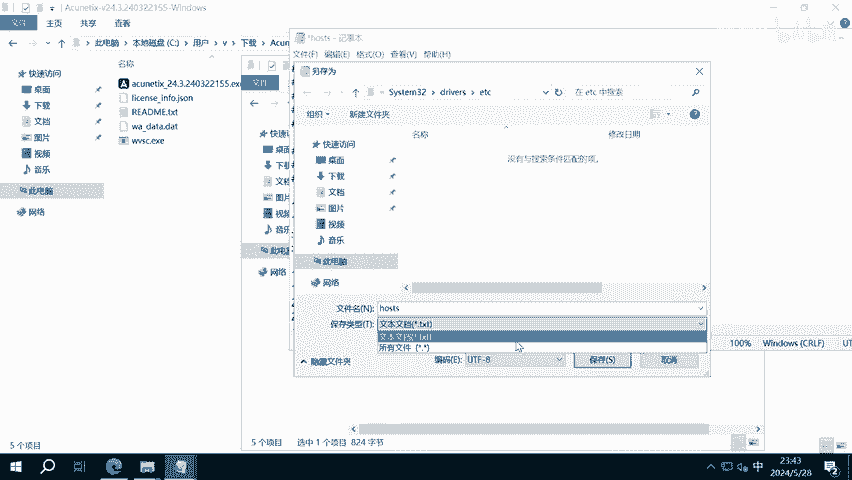

下载完之后打开并且安装。安装完成之后，不出意外，你将会在开始菜单看到VS code。如果你看不到，你也可以搜索，这里可以选择右键更多以管理员方式运行。

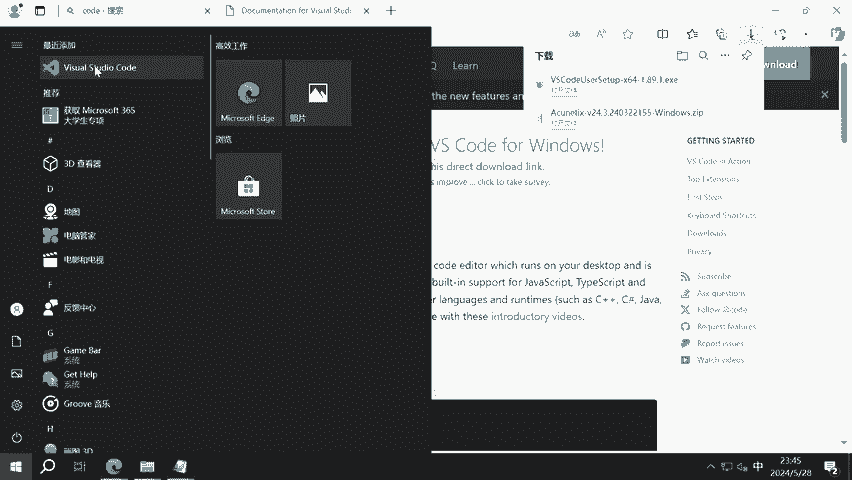

然后选择文件，打开一个文件，这个时候呢再选上我们刚刚的文件地址。回到这里，再把刚刚的地址粘贴过去，转上我们刚刚的文件。

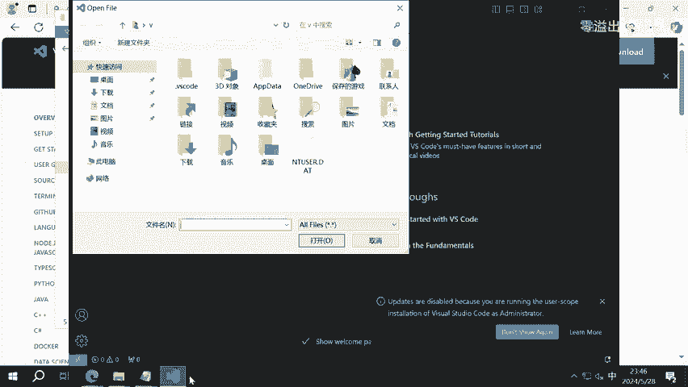

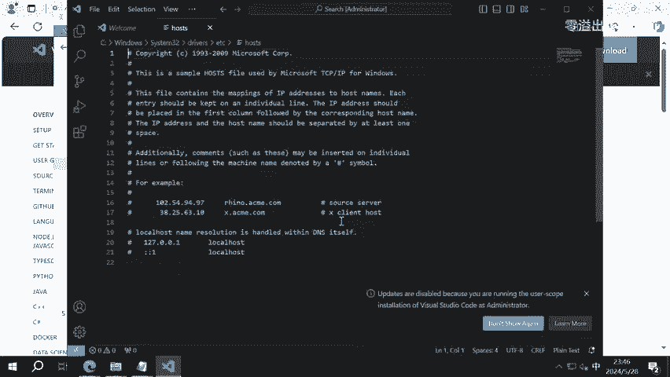

此时我们应该就能正常添辑，并且保存这个文件了。我们把我们准备好的文本复制过来，粘贴保存，这个时候应该是正常写录的。我们可以重新打开看一下。

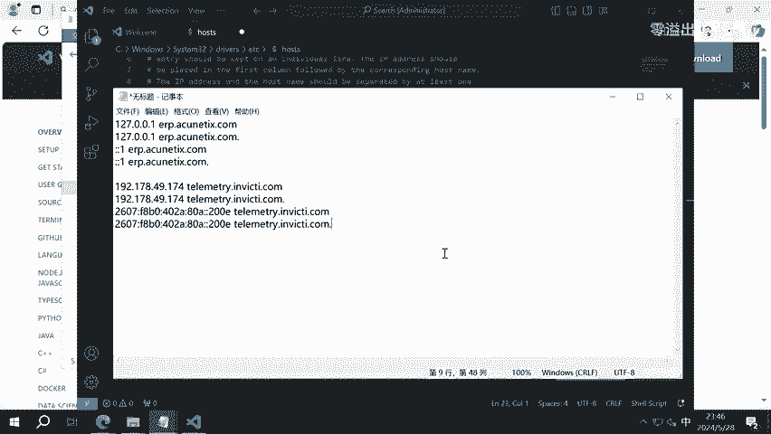

那么我们修改的内容就被保存进去了。接下来回到我们的软件目录，这个时候我们就可以打开这个安装包，直接下一步下一步一直安装过去。

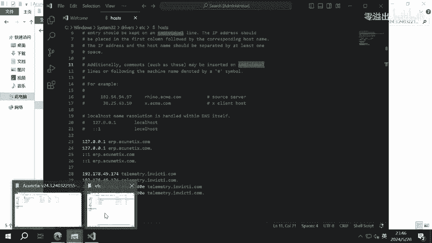

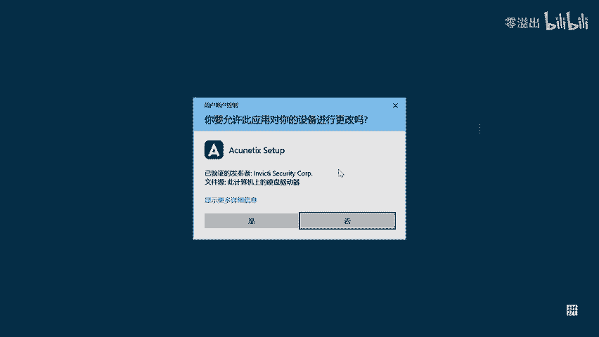

这里会问你的信息，但是其实这什么不重要。这里会有复杂度的要求，需要包含三种字符，然后密码长度要大于8位。这个时候你按照它的要求去设置一个密码就好。还是下一步默认端口，一般的话你都不用做修改。

用默认设置就好。我们在这里等他安装完毕。这里选择是。翻了熊王成。先不管，我们看到他这个服务应该是处于运行状态了。首先我们先把这个它的服务给关掉，应该就是这两个。我们先把这两个服务停止一下。

那么停止完成之后呢，你这个暂时应该就是访问不了的了。接下来我们把这个WVSC这个EXE呢复制到它的安装目录。至于它的安装目录在哪呢？你可以在这选择右键更多，然后打开文件位置，右键打开文件位置。

那么这里就是它的安装目录了。你把刚刚的那个文件张贴到这儿，选择替换，继续。

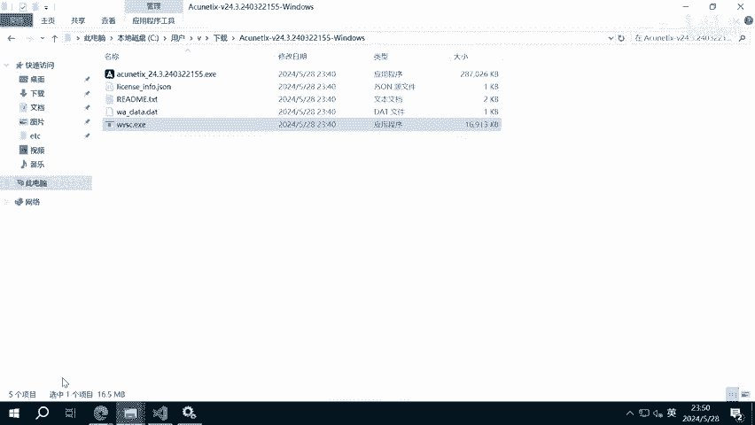

然后再把这个license跟这个WA data复制到license文件夹。它那个目录的话，在如果你在你的C盘目录下看不到这个文件夹的话，你可以在上面选择查看。然后在这里勾选隐藏的项目。

这样你就可以看到这个文件夹了。 data这里，然后是这个目录，这里有个下面的license文件夹。那记得它它的许可文件是放在这个目录的，跟安装目录还是不太一样的。接下来我们把这两个文件可以复制过来。

复制到这个目录下，它问你是否替换，你这里需要替换替换完之后呢，在右键把这两个文件的属性设成只读的。这个时候呢我们就可以去启动它的这两个服务了。首先先把这个数据库服务启动一下。然后再把这个也启动一下之后。

我们回到我们的浏览器去重新访问一下这个地址。此时我们就看到它又可以被访问了。这个时候输入我们安装的时候设置。这的邮箱和密码。登录。那么我们如何将这个页面显示为中文呢？

我们可以点击左上角的这个账号perfi这里，然后在这里选择简体中文。当然这里需要写一下last name，这是必须的。之后我们就可以保存设置，此时我们就会看到这里啊，它已经变成中文的了。我们打开设置。

然后订阅这里，我们看到这个已经获取了它的使用权限，破解成功。windows下的操作就是这样。接下来我们开始linux下的安装和激活，首先我们这里要借助docker环境。

如果你的如果你的系统上原行更好的docker，那么则可以跳过这一步。如果没有装的话，那么你可以跟着我运行一下。首先我们更新一下索引搜作APTup date卡里。

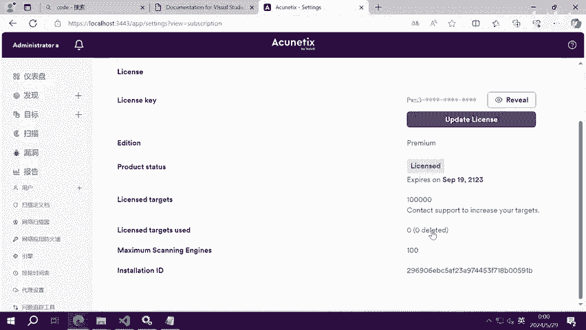

然后执行速度APT映射到docker点IO。当这部引擎执行完之后，我们就可以正式开始安装了。首先我们使用速度到壳破一个镜像下来，那么这就是我们要使用的镜像然后回车。我们在这里耐心等待他下载完成。

由于镜像源在国外的问题，所以你的下载可能会出错，也可能会比较慢。那么你可以多试几次，或者自行想办法解决。嗯，首先我们这里等待它正常下载完成就行。嗯，好的，我们看这会我们已经下载完成了啊。

那下载完成之后呢，我们就可以运行这个镜像，使用速度docker论杠ITD杠P将我们容器内的端口映射到主机上，然后使用杠杠k杠I跟上这个参数，最后再跟上我们刚刚的这个镜像名回车。当出现这串哈希的时候。

就说明执行成功了。那我们去看一下本机的端口。3443呃，注意它应该是HTTPS的协议，这里会提示这个协议不安全，不用管它高级，然后放到下面接受风险并继续啊。

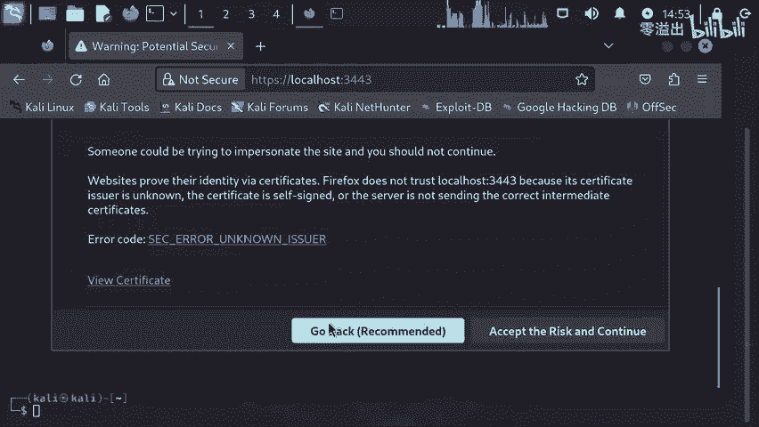

好，这里它是需要我们登录默认的邮箱是adme艾特adme点com，而默认的密码是adme123。但是这里要注意的是它的那个A是大写的，我写出来吧。然就是这样admi atadmi和admi123啊。

我们点击登录。那接下来我们还可以用同样的步骤去设置一下中文。这里的话last name不重要。

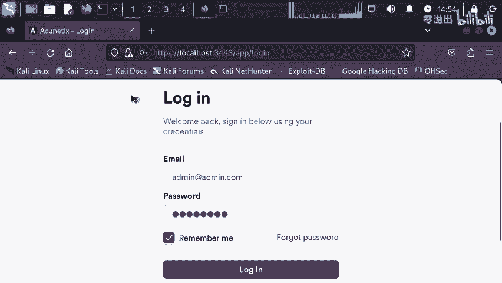

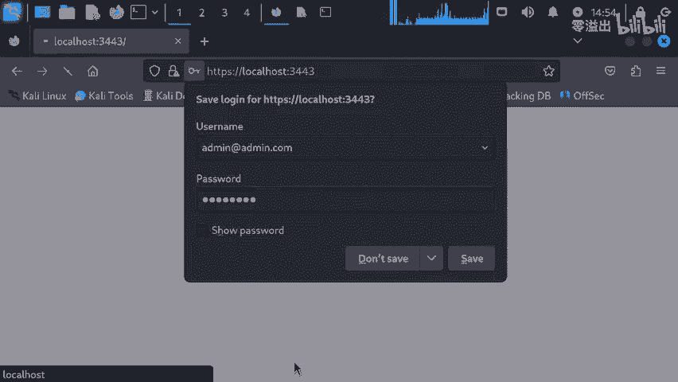

看到下面保存设置，然我们的页面就变成中文的了。然后我们再看到设置这里订阅。同样的，我们这个有效期是可以到2123年的，也就是100年之后了。啊。好的，那么今天的分享就到这里，谢谢大家。

最后关注up不迷路。你的关注和点赞就是阿更新的动力。

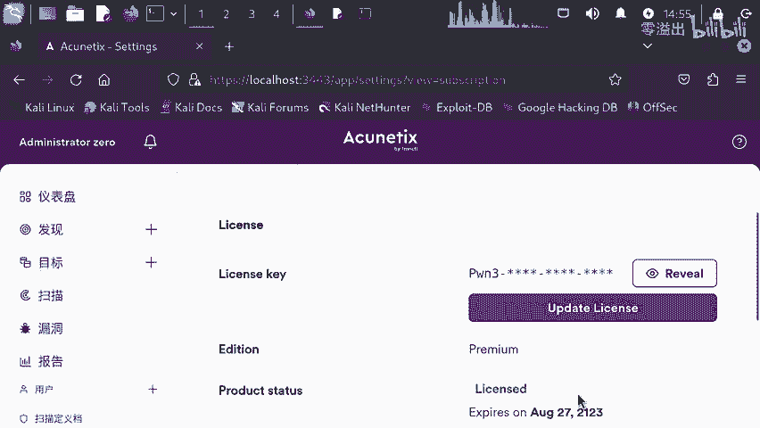