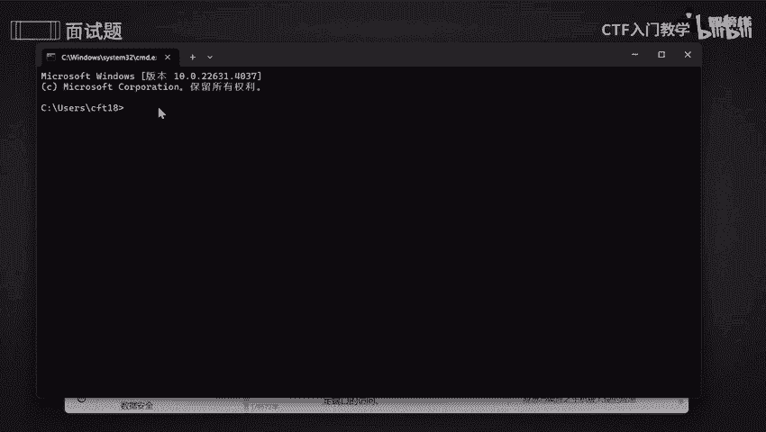
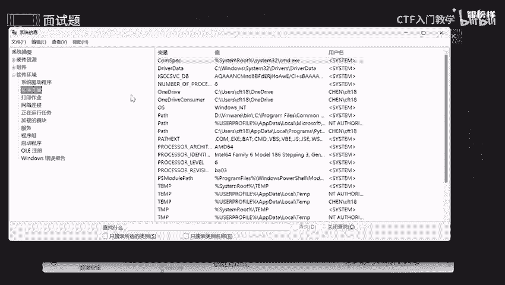
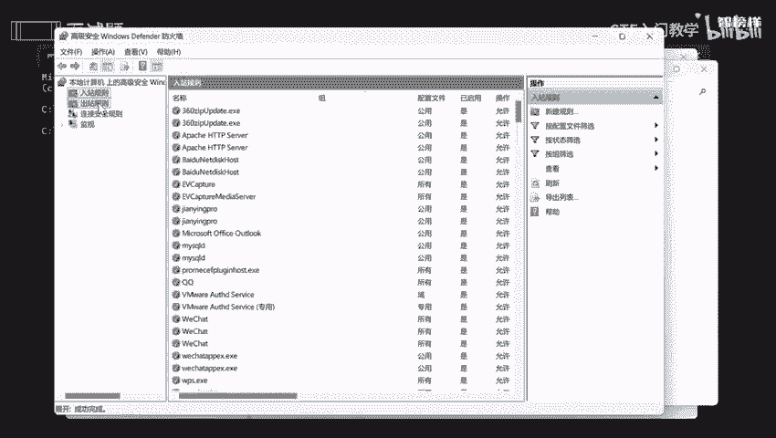

# 2024最新版网络安全秋招面试短期突击面试题【100道】我会出手带你一周上岸！（网络安全、渗透测试、web安全、安全运营、内网安全、等保测评、CTF等） - P10：面试题-应急与响应之Windows加固方法 - CTF入门教学 - BV1bcsTeXEwR

那么本节课讲的是应用和响应之windows加固方法。那为什么要去加固方法呢？其实很简单，就想知道你是怎么去实现降低安全风险，以及提高安全保障，对不对？那我将这些面试一些答案呢。

以及看一个面试题呢全部都整理到语圈文档上啊。有需要的同学的话可以在评区留言或者私信我。好，我们看第一个问题啊。修改落密码。那什么叫弱口令呢？很简单啊，弱的口令是是比较弱的一些密码命令，对吧？

就是有的时候呢，我们账户去修呃去。设置一些密码的时候会使用一些什么呢？我们常用的我们比较容易记住的那你想想你身边比较容易记住的那是不是你的一个和你有关的一些数据，比如说你的身份，你的一个身份证啊。

你的一个呃你的一些什么呢生日，对不对？还有你父母啊，或者说你的手机号啊等等等等，包括一些比较常见的，比较好容易记得，比如说ad me的123456，这些是不是非常非常容易去套出来，对不对？

所以呢我们为了啊为了去加固，所以每个账户呢都需要使用一些强密码。什么叫强密码呢？就是说这个密码呢应该包含呢大写字母，还有数字以及特殊一些字符。比如说act是不是比如说啊。啊。

与括号啊与的与字符和啊括号以及什么井号呀，比如说百分号呀等等等等，是不是？好，长度呢啊至少是一个8位数啊，还有定期啊去要求用户去更改咱们这个密码。因为更改好密码的话，你更的一个安全性数就更加高啊。

还有禁止使用一些常见的或者是之前使用过的一些密码。什么叫禁止使用常用的或者使用过的密码呢？就有的时候呢你可能会使用一些什么呢？啊123456啊，或者说一些啊。一些一个手机号码呀。

或者说你身边比较容易记住的一个顺序，对不对？字母一些顺序。那想想，如果说那个人通过一个社会工程学，然后套出你的套出你这个行为，是不是我比较容易去做的一个事情，他通过字典，然后一个个去爆破。

那你想想你的密码是不是已经唉不安全了呢？所以的话需要我们不要使用一些常用的。最好是和你一点关系都没有的。好，那我们怎么去更改啊，更改咱们这个密码呢？好，首先呢按住win加I呀。

win加I看到啊win加I在这里啊，然后呢点击账户，然后点击登录啊登录选项，然后呢自己去修改，修改咱们这个安全密钥啊。O。那么第二个对咱们这个服务密码进行排除啊，排查。

就是检查一下咱们所有的服务账号一些密码强度呀，对不对？不能用一些比较容易记住的，或者说一些什么呢？只有字母或者只只有一些数字，那是非常非常不安全的。还有对共享的一些什么的账户。

要确保密码不备多个服务共享，对吧？好，第三个呢就是说将咱们这个服务配置文件所更改，就是禁止不必要的一些服务和一些功能，减少一些潜在的一个攻击面。就是说有些服务你根本就压根就用不上，可能就是一个套娃。

对不对？那你想想我开了这个服务又开那个服务，我一个电脑，一个电脑我开了20多个服务啊，有360个功能。那你想想这个功能的话。那些黑客他通过这些功能点，我就能够去攻击你，是不是？所以啊你又不知道在哪里。

所以的话尽量啊尽量有些不必要的一些功能啊，或者说不必要的服务，尽量还是禁止掉啊禁用okK。那对于PHP服务的话，我们最好是要禁用啊危险函数啊。好，我将这个代码已经贴在这里，大家看一下就好了。

还有实行一些黑名单和白名单这方面的策略来限定对特定一些文件，或者是目录一些访问啊。黑名单，大家也知道了，我不喜欢这个人，我就把它加入黑名单。我觉得这个人很很可靠，我就把它哎标注一下，是不是。O。😊。

那具体怎么去操作呢？首先呢哎要找到咱们这个PHP啊点1。音啊点音啊啊找到这个文件，然后找到啊咱们这个指令啊，然后去添加需要禁用的一些函数。那么还有呢第四点呢，就是说对服务版本进行排查。

因为有的时候呢嗯服务太老旧啊，可能的话存在一些漏洞点，我没有及时去修补它，是不是？所以的话最好是用最新的最新的一些东西啊去。去使用好吧。还有就是要查找当前的版本是否存在已知的ND漏洞啊。

那什么叫ND漏洞呢？就是说有些呢有些漏洞是已经发布很久了，并且得到一个修补一个方式，对不对？他就将它这个漏洞呢，发布出去，公开在网上这是ND漏洞，不知道过了很久的，对不对？一个漏洞。

那么零类漏洞是什么呢？就是说我刚刚我刚刚才渗漏出来的，我刚刚才挖到这个漏洞，它是没有别人去知晓的。所以我在提交之前只有我一个人知道，对不对？这就是零类漏洞啊，知道人很少很少。OK怎么去操作呢？

一般来说啊，使用咱们这个系统工具啊啊进行操作，或者是第三方一个软件来检查系统和服务一些版本啊。好，那我们来操作一下。首先呢按住温加R温加R呢。好，输入CMD，然后点击确定。好。

可以看到已经进入咱们这个小黑窗，也就是咱们这个执行画面。我们可以在这里去写啊写一些命令行。好，我们搞把刚刚那个东西。copy下来。contrl C一下。哎，来到这里刚去V一下。好。

我们来看一下当前这个版本啊。好，可以看到当前系统所有所有信息是不是都已经出来了，包括硬件啊、软件、组件等等等等，全部都出来了啊啊，可以看到它的一些版本啊，包括一些啊时区啊，可用的一个物理物理一些内存啊。

以及安装的物理内存啊，包括它一个制造商版本啊，产产品角色啊，包括它一个什么的处理器全部都出来了啊。

O。包括这些软件啊，唉好，就这个啊环境一些变量啊，包括一些服务啊等等等等，全部都可以在这里去查找一下。

好，第五个呢我们可以使用IP table来设置用户相关的服务端口。什么叫AP table呢？它是来够管理咱们这个防火墙的，是不是管理防火墙的规则，所以我们可以通过防火墙来限制对特定一些端口进行访问。

是不是有些有些端口呢是不允许访问的。有些端口的话，只有这个呃只有这个端口是不允许访问的等等等等啊？OK怎么去操作呢？首先呢还是一样的打开我的一个控制面板，然后进入咱们这个系统和安全，然后点击防火墙啊。

然后点击高级啊设置。好，来到咱们这个控制面板啊，然后点击系统安全啊，然后可以看到有个防火墙，是不是啊，点击防火墙，然后点击高级设置。好，可以看到有个入站规则和出站这方面规则，还有一个连接安全规则。

我们都是自己可以去新建，可以新建属于自己的规则。看自己需求，好吧，去设置一个相对应的规则。好，最后呢就是安装咱们这个杀毒软件。我们可以去安装比较靠谱的一个杀毒软件啊。

并且保证它是一个最新的最最全面最新的一个最新版本啊，我们定期进行全盘的一个扫描啊。如果说你你的时间不是很够的话，可以快速啊快速扫描。最好的话是一个两三周，然后去定期进行扫描去杀毒。好吧。

最后呢我将这些面试题呢全部都整理到语圈文档上了。有需要的同学的话可以在评区留言或者私信我。那么这节课课程就到此为止啦。

