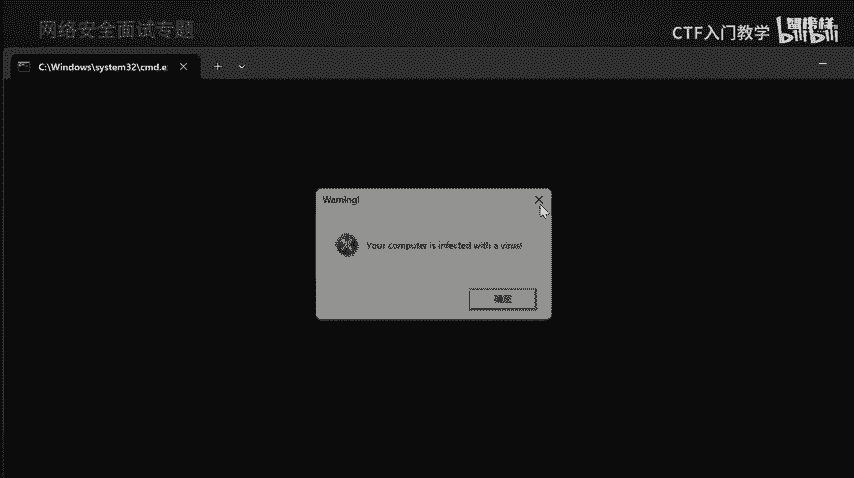
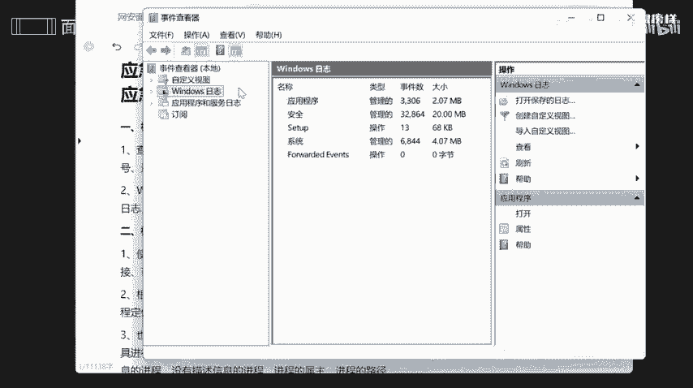
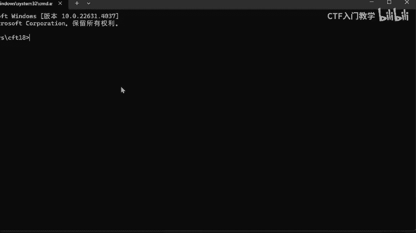
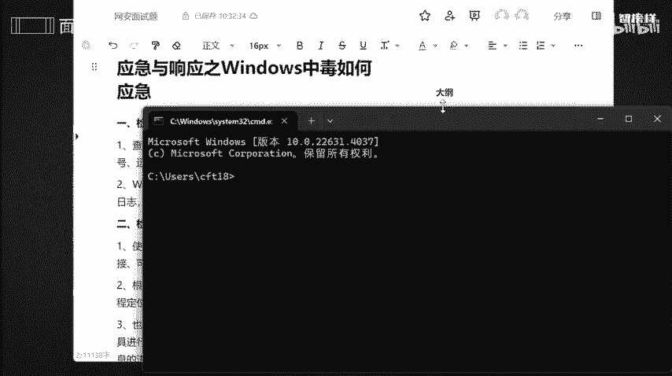
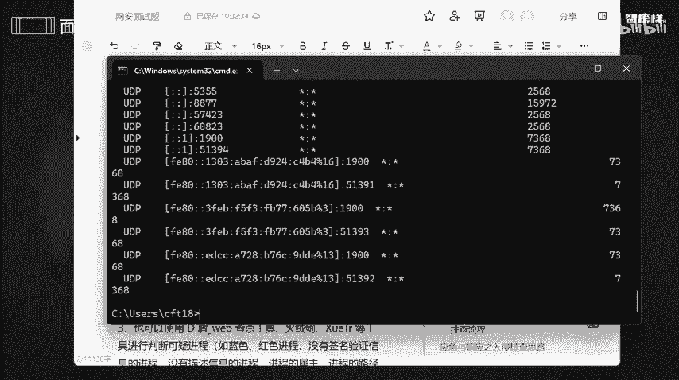
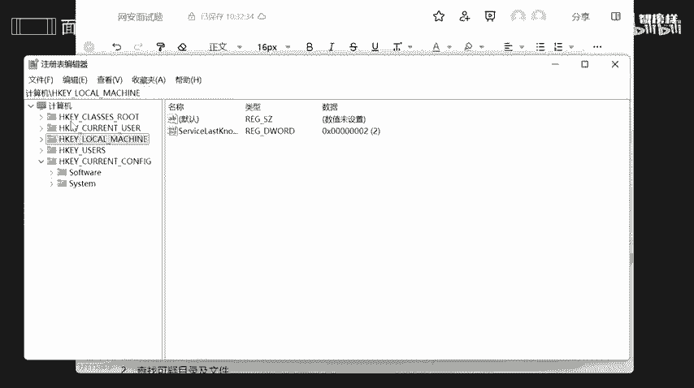

# 2024最新版网络安全秋招面试短期突击面试题【100道】我会出手带你一周上岸！（网络安全、渗透测试、web安全、安全运营、内网安全、等保测评、CTF等） - P11：面试题-应急与响应之Windows中毒如何应急 - CTF入门教学 - BV1bcsTeXEwR

本节课呢讲的是应急与响应之windows中毒，如何去应对呢？好，那如果说出现这种啊。出现这种弹窗，它会提示你说啊，你的电脑正在中毒了。好，我们先把它关掉。那如果说出现这样，出现这样情况。

警告你的电脑不小心被中毒了，然后把它关闭以后，然后它还是会给无限去弹取啊，无限去弹，那怎么办呢？好，我先把它关掉。

Yeah。哎，这两个的话其实都是一个模拟中毒的一个表现。其实有些中毒的话，它不会正大光明，告诉你，你的电脑正在中毒，要你自己去杀毒，不是这样子的，它可能会在后台偷偷摸摸去运行，是不是？那遇到这些情况。

我该怎么去应对呢？好。我将应对的步骤呢全部都放在语雀文档上了啊。那步骤一怎么去做，步骤二怎么去做，步骤三怎么去做啊，有需要同学的话可以在评区留言或者私信我，记得一键三连哟。好，我们看第一个啊。啊。

第一个是要检查咱们这个系统账号安全，是不是？第二个呢就是要检查咱们这个端口啊和进程。第三个呢就是要检查一下启动项计划任务以及服务。还有检查咱们这个系统相关的一些信息。最后呢就是自动化杀查杀和日志分析啦。

好，我们一个个来看一下。OK第一呢就是要检查咱们这个系统的安全性啊。那我怎么去检查咱们这个系统安全性呢？首先安住温加尔，然后呢输入咱们这个哎输入这一行指令，目的是为了去查看咱们一些登录一个时间呀。

包括用户名是否存在一些异常，是不是？OK这些呢就是一个啊具体一个要求啊，具体一个呈现。比如说事件日志啊事件，咱们这个日志啊，就是说有些事件的话，比如说一些管理事件啊，它里面进入什么呢？

关键的错误的或者是警告这一些事件是我们比较比较需要知道的啊。还有一些windows一方面的日志，包括一些啊应用程序和服务这方面的日志都是需要我们自己去检查分析的。

好，目的呢就是要查看是否存在一些弱口令，还有一些可疑的账号或者隐藏的一些账号，是不是？还有远程服务端口是否是断呃开放的就是一些远程服务端口的话，如果说你是开放的啊，总是开放的。你电脑一开机好。

我就给它开放，但到公网上是不是那你想想有些人就会利用啊咱们这个端口，然后去对我这个电脑实时监控。好，那么第二步呢就是要检查咱们这个异常端口或者是进程啊。那怎么去检查呢？嗯，也简单。one加R哎。

这可就不是这个了。哎，就是CMD进入小黑窗，也就是咱们这个执行框。

啊，调小一点点。

好。说我刚刚啊复制这一传指令，可以看到啊有这么这么多的一个进程啊，全部都在这里。哎，每个进程它的1个PID都是不一样。PID是什么？是进程一个标识符啊，它里面这里啊这些是不同一些状态啊。

以他这方面端口，包括协议啊，以及本地地址和外部地址全部都给大家显示出来了。我们可以通过它去查看端口的一些连接情况，是否有远程连接，还有一些可疑的一些连接。我们查看可疑的一些连接呢。

主要是看啊看这些是这个命令。这个命令代表是什么意思呢？就代表啊该进程正在参与一个活动的网络通信绘话啊。就是说他是活跃的，他正在参加一个项目啊，那这个东西是什么意思呢？哎，这个东西又是什么意思呢？

为什么要主重注注意一个正在运行中，那其他一个状态又是什么意思呢？好，一个个来。这个呢就意味着啊该进程正在端监听指定的一些端口啊，准备响应任何尝试连接到该端口一些请求，就代表他有个活动。

但是他没有哎没有得到别人允允许，所以的话他要打电话告诉那个啊举办举办方说哎，我也想参加，能不能给我一个票啊，然后他正在等准呃举办方拿咱们这个票据，他才能够进去，是不是。哎，说白了这是一个等待中。

这个就是运行中啊。好。哎，那就看其他的哎，这个clos啊，close went啊 went是什么意思呢？就是说它已经关闭了，但是这个关闭呢是因为是是一个嗯被动性关闭啊，就是说我长期没有得到你的一个回复。

所以的话我失望了，我被动了，我把它哎关闭了是吧？我被别人哎给拒了，那还有个主动关闭啊，哎，是这个这个就是主动关闭啊，就是说时间一到我就哎自动甩了你好吧，这是一个主动关闭。好，了解这些就好了。O。😊。

我们还可以啊通过咱们这个啊text lit啊，然后去干什么呢？去进行啊进程的一个定位啊。比如说我要定位咱们这个啊PID是不是？那我们就使用这个这行命令啊，我们也可以使用一些啊低低顿啊。

windows一个杀毒工具和一个火容键啊等等这些工具来判断是否存在一些可疑的一些进程，好吧。OK再看第三步啊，要检查咱们这个启动项和计划任务以及服务啊。那怎么去检查呢？好。还是win加R。好。

然后输入记行命令。8。确定。可以看到啊它有一些启动一个选项啊，正常一边选项的话都是一个正常启动，你们也可以仅诊断启动，还有有选择的启动啊点。根据你的需求去选择其中一个方式啊。好。还有这些啊服务啊。

包括引导呀，包括一些工具。这个工具呢就是帮助大家更好去解决啊。比如说我电脑遇到了什么问题，是不是我就可以去启动一下，我去查看一下我电脑出现什么样的一个问题，是不是？好。

他就会直接进入到咱们这个系统疑难解答这一方面。O。或者说我想查看咱们这个系统的一个属性，是不是？那我就启动一下。哎，它就自动给你弹出来一个系统一些处啊属性啊，它一个处理器啊，它一个基带呀。

比如说它的ID呀、产品啊，包括一个啊系统类型等等等等啊。好，再包括如果说我们想去查看咱们这个注册表编辑器这方面的，对不对？我想查看一下，哎，咱们这个里面的详细内容，我们就可以去啊这里去直接去启动。

然后直接去查看啊咱们这个注册表里面的信息，好吧。去这里去查看一下是否存在一些可疑的一些启动文件啊，主册页等等等等啊。

好，那我们还可以干什么呢？我们还可以通过啊咱们哎这个命令去查看脚本启动是否存在一些启动文件啊。好，那么第二步呢就是要检查计划任务啊，它的一个具体步骤呢，我全部都已经放在这上面了。

我们可以去查看啊计划任务的一些属性，然后去发现木马的一个文件的一个路径。那么第三步呢，就是说要去检查一下服务一些字启动，是不是我们呢。我们要确保有些没有必要的一些服务的话，可以不开机自己。

甚至是禁止掉啊。好，我们来看一下。啊，这些都是一个服务啊，可以看到有些是手动的，有些是自动的，有些没有必要的话，我们可以干什么呢？我们可以啊变成手动的或者是静止啊。最好不要这么多一个禁用啊，禁止啊。

也最好不要用这么多一个自动，哎，因为可能会有一些风险，有些服务没有必要的一些服务的话，可以啊关机啊，可以把它禁止掉。好。OK那么来到第四步啊，检查咱们这个系统相关的信息。

为什么要检查啊咱们这个系统相关信息啊？我们要实时更新，对不对？有的时候呢系统太啊版本太低了，他呢漏洞没有及时哎修补。所以的话有些黑客呢他都会通过啊通过咱们这个系统漏洞，然后去攻击我的。

所以我们要去查查看咱们这个系统一些版本以及补丁的这方面的一个信息啊。OK那么第二步呢就是要去啊查看可疑的目录和以及文件。因为呢有些黑客呢他会偷偷摸摸在你不知情的情况下去新建一个账号，可能是管理员账号。

可能是同级账号。所以呢我们要去查看用户这个目录，看一下有没有新建的一些账号会出现在一个目录下，好吧。或者呢我们还可以分析最近打开的一个可疑文件。

以及要在服务器各个啊目录上去根据咱们这个列表时间列表来进行排序，然后去排查可疑的一些文件。好。第五步呢就是要自动化筛茶。第五步呢就是自动化查杀，我们可以使用360啊啊这些啊病毒查杀工具，然后去查杀。

我们还可以去使用咱们这个啊低段啊或者说河马工具，然后去查杀咱们这个windows需这个后门啊。第六步呢就是要进行日志分析。因为日志的话是存储一些事件，是不是活动啊？

那我们就要通过啊咱们这个比如说我要通过360新图，然后去分析一下这方面的日志啊，是否存在一些攻击痕迹啊？好，反正呢我将这几个步骤呢，全部都整合在语圈文档上啊，有需要的同学的话可以在评区留言或者私信我啊。

最后做一个小小的一个啊总结本节课呢讲了咱们这个遇到windows中毒，我们改怎么去做，是不是？第一呢就是要检查账号啊，检查端口检查启动项服务啊，计划任务和系统一些相关的信息以及。

自动化去查杀以及日志的一些分析。好，那么本节的课程就到此为止啦。