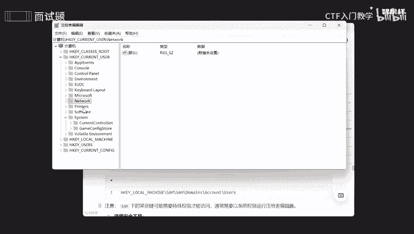
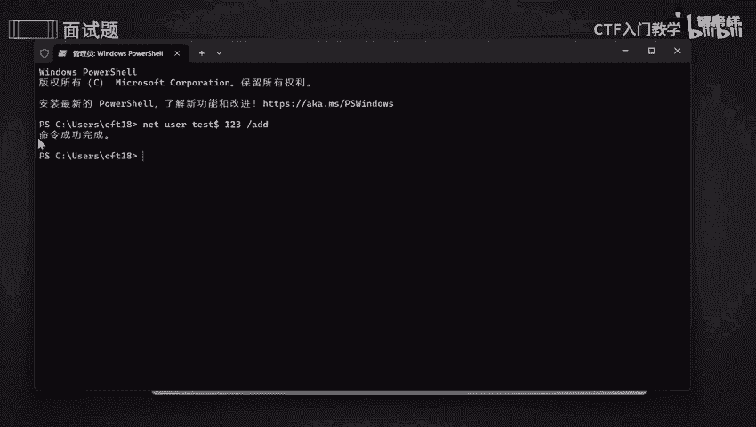
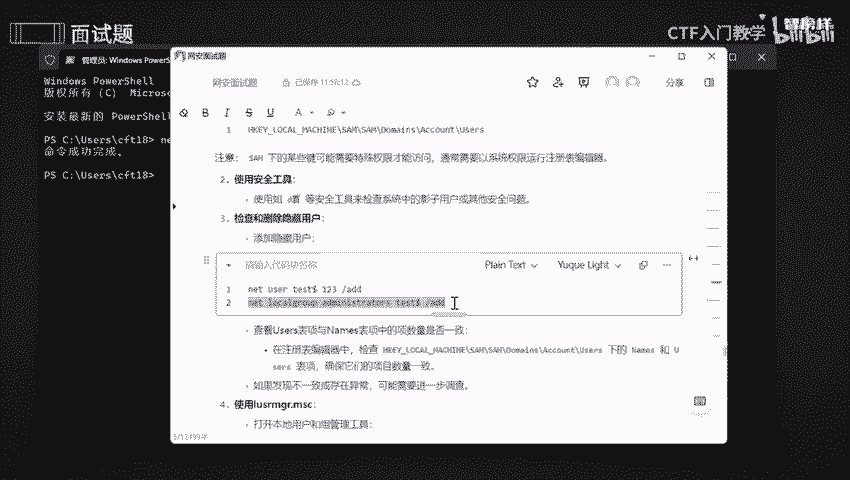
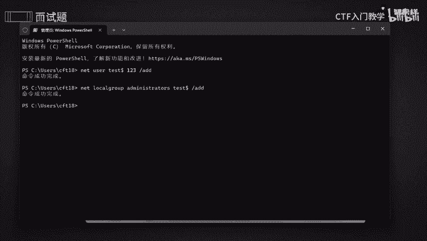
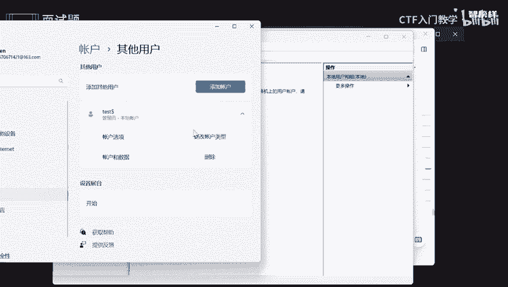
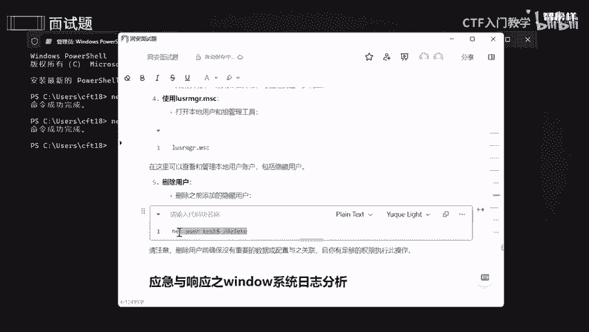
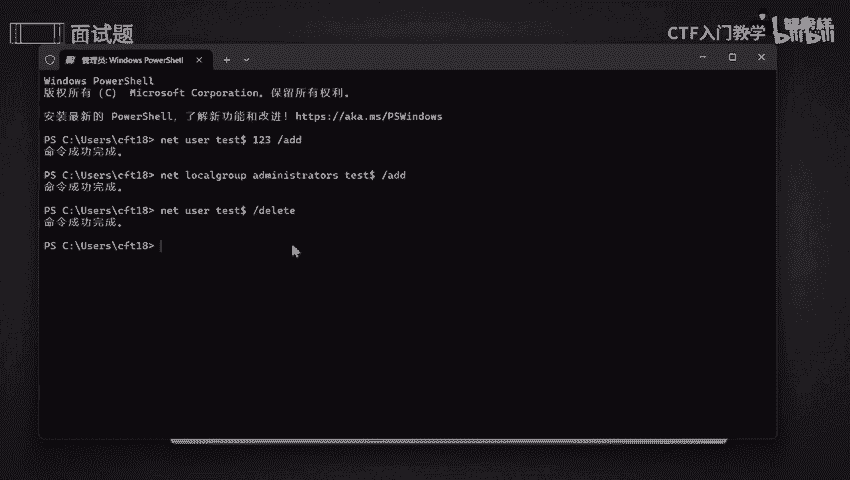

# 2024最新版网络安全秋招面试短期突击面试题【100道】我会出手带你一周上岸！（网络安全、渗透测试、web安全、安全运营、内网安全、等保测评、CTF等） - P13：面试题-应急与响应之主机被入侵的应急 - CTF入门教学 - BV1bcsTeXEwR

本节课呢讲的是应急与响应之主机被入侵呢？怎么去应急呢？我分为两个部分，两个主机啊，一个是windows的，一个是news。我将这以下的步骤呢全部都整理到语圈文档上了。

有需要的同学的话可以在评区留言或者私信我，记得一键三连哟。好，我们看。看第一个mux版一个主机，我们怎么去做？首先呢应该优先提取容易消失的一个数据，是不是要检查一下网卡呀啊监控一下宽带宽呀。

还有去检查一下日志啊，最后使用咱们这杀毒软件重新杀一遍，是不是OK那我们来操作一下，来跟着这一些操作一下。好，优先提取容易消失的数据呢，哎，我们可以去查看一下内存这方面的信息啊。因为我们有什么命令呢？

我们可以啊用这个也可以用啊fi，也可以用top啊这个命令去查看内存使用一个状况。好，那我们copy一下，来看一下。啊，有点慢啊。好。肚子。没有 copypy上吗？那我再 copypy一下。啊，复制一下。

好，可以看到啊，这些就是咱们这个内存一个占用情况。好。再从第二个部分系统进程，然后去查看一下咱们这个系统进程啊，哎还是一样的，copy一下。哎，可以看到有这么这么多一个进程啊。

可以看到有这么多的一个进程。我们就可以通过这几个方面去查找，还有最后一个方面去查看一下路由啊。诶。还是用这个吧。好，可以看到这几个路由呢全部都已经展示出来了。通过这几个方面。

我们可以去啊去筛选比较容易去哎丢失的一些信息。好，第二步呢就是要检查网卡的流量啊。我们要去查看一下咱们唉数据发生数据包呀，或者说接收数据包这个情况。网卡是非常非常重要的啊。

我们可以通过IP conif confi和IP alert assure，然后去查看一下后面接着呢是一个网卡的名称。好好，那么第三步呢？我们要实时监控一下带宽占用的一个状况啊。通过什么工具呢？哎。

通过这个netho这个工具，然后去监控一下每个进程或者是应用程序所占用的一个带宽。好，来到。啊，我去下载一下。好，可以了。哎，可以看到这就是一个带宽一个具体的情况啊。好，把它扣。OK第四步呢。

我们就是要检查一下mi系统这方面的日志啊，因为日志是非常的重要的嘛。好，我们是通过loger这个目录去检查一下这方面的日志，然后来获取啊咱们这个系统活动这方面的记录。好吧，你们可以通过cat啊。

或者说t啊摩耳都能够去查看日志一个活动。好吧。那么第五步呢就是要使用杀毒软件啊，我们可以使用咱们这个IV啊，然后经杀毒或者是恶意软件这方面的扫描啊。首先呢我们是要去安装啊，安装咱们这个杀毒软件。

第二呢就是要更新咱们这个病毒库，确保它是一个什么呢？最新最全的，是不是？好，最后呢就是要扫描你要去指定这个目录。好吧，比如说我要指定咱们这个加目录，我去指定咱们哎这个路径呢就是一个加目录，好吧。

请注意啊，在进行这些操作的时候啊，在提取这个呃文件数据的时候，尽量使用一些只读啊，就避免啊我们做一些不必要的一些修改。好吧，你自己都不知道OK那么还有就是在执行这些任务的时候啊。

都是要确保有足够的一个权限。OK如果说你像我我之前的话都是一个root啊，root权限。如果说你是其他用户的话，前面要加个to do啊。还有记录啊记录所有一些操作的一些发现啊。好吧，包括日志啊。

包括日志里面的一些记录啊，我们是不是把它全部都已经copy上来，好吧。okK那我们接下来看一下windows啊，我们怎么去操作。第一步呢，我们是要去查看咱们这个用户这方面的数据。好吧。

首先呢要打开注册表编辑器啊。O。好，按住win加R，然后呢哎copy一下，然后点击确定。好，这些呢是所有啊环境啊，或者说啊咱们这个网络啊，它一些注册表这方面的一个问题啊，一个记录，好吧。

如果说你要去导航的话，你把这个路径给抠下来，然后放在上面就好啦OK。好，那既然知道了咱们这个注册表，查看了咱们这用户先信息的话，我们要使用啊安全工具啊去查看一下是否一些啊有存在一些影子用户啊。

或者说其他一些安全问题啊。OK那么第三步呢就是要检查或者删除隐藏的一些用户。就是说如果你查找出来存在一些异常用户，是不是隐子用户，还有一些隐藏用户的话，我们是不是说要去删除好啊，要是删除好。OK啊。

由于呢老师这一台没有隐藏用户，所以的话我只能添加啊，自己给自己添加，那怎么去添加呢？好，先复制这一方面，比如说我要去添加一个啊。123这个。好，添加一个用户为这个test啊，密码是123。好，我们开始。

首先呢。嗯，这样子吧。来到这里，为了确保他一个权限不足呢，所以的话我直接搞了个管理员的啊，就不是普通用户了。好，把刚刚那个copy一下，net一下。好，命令完成呢。好，那我们开始下一步。

哎，将它 copy一下。把它放在本地的一个andimate。

添加成功之后呢，你可以去检查一下是否有没有成功啊。你可以检查一下咱们这个user表和那表，它的一个啊像数量是否是一致的。好吧，如果不一致的话，就需要进一步去调查，好吧。

OK那么第四步呢就是说要去打开本地的一个用户和组管理工具啊，我们可以去查看啊，查看它是否存在一些本地账户或者说隐藏用户okK。把到copy下来。温家豪。好，输入我刚刚。哎，这个然后点击确定。嗯。

这里说了，我的这个管理端员不适合这个版本的啊。你们可以根据你自己版本，我看一下我的版本是什么样的一个版本啊。啊，温加I。看一下。好，我看到了啊，我的是一个家庭中文版的。

所以的话他不给我提供这方面的一个功能啊。没关系，我们可以去哪里，去账号这里去看一下，好吧。哎，我的账号，然后点击其他用户，我们看一下是不是已经添加成功了呀啊，添加已经成功了。

O。问题不大。那我们来添加好隐藏用户，我们可以自己去删除一下，我们把这个删除一下。

来在这里执行这个命令。好，命令已经成功了。我们再去看一下是否有删除成功呢。

来到咱们这个账号。好，找到咱们这个账号。好，可以看到是不是哎其他用户哎也被我删除掉了呢？

好的。😊，OK那好，那今天呢咱们这个面试题呢已经讲好了，我将这些步骤呢全部都整理到语圈文档上了。有需要同学的话可以在评区留言或者私信我。OK那么今天。的课程就到此为止啦，拜拜哦。

