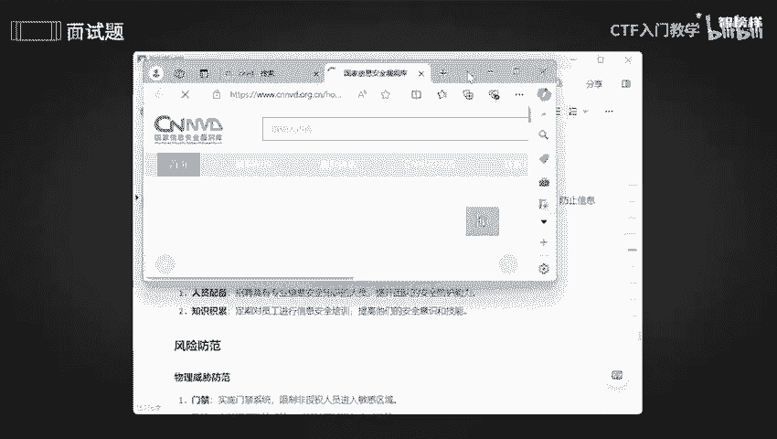
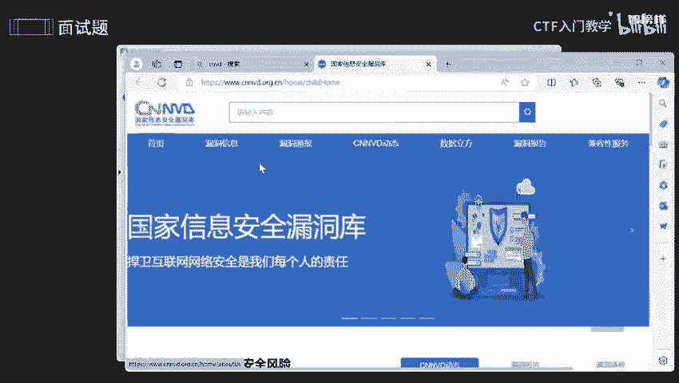
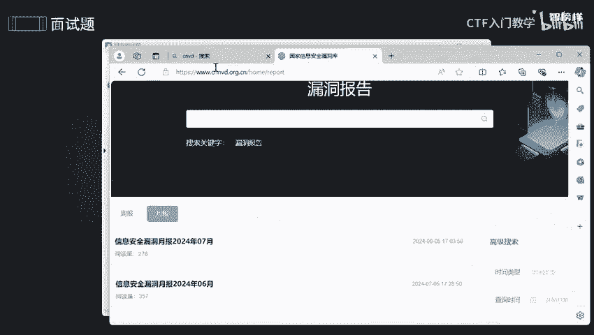
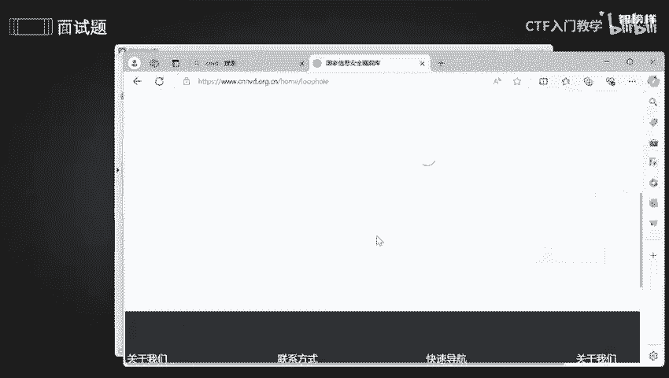
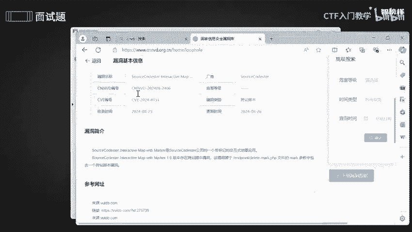
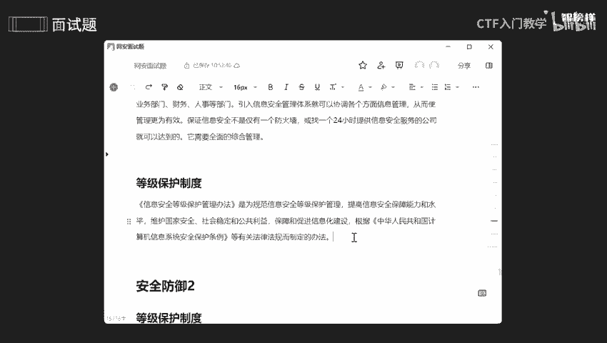

# 2024最新版网络安全秋招面试短期突击面试题【100道】我会出手带你一周上岸！（网络安全、渗透测试、web安全、安全运营、内网安全、等保测评、CTF等） - P14：面试题-安全防御1 - CTF入门教学 - BV1bcsTeXEwR

本节课呢讲是内试题中的一个安全防御，目的就是为了去哎评估你的一个安全意识。好，我将这几个安全意识呢全部都放在语雀文档上了。有需要同学的话可以在评区留言或者私信我。OK那我们看第一个。

第一呢就是体验内部这方面的安全。第一呢就是制度和流程啊，人员分配啊啊，这是一个积累啊，包括风险评估啊，以及等保啊等保的一个。制度好，了解这一些的话，我们一个个来看。

首先呢我们为了去确保咱们这个企业内部一个安全防止内鬼，是不是内鬼来到啊咱们这个哎活动终旨，对不对？所以的话我们要提前防御，对不对？所以呢第一个就是制度与流程，就是我们为了去防止员工。

他可能就是第一次来不懂咱们这个公司，所以的话就会进行一个培训，不知道你们有没有过，就是第一天去上班的话，不是真的是上班，而是说要去了解企业文化，什么企业文化公司的企业文化，公司的一些发展史啊。

他一个啊怎么一个历程啊，以及他一个哎终旨是什么东西，咱们这些文化都要去了解的，所以就会做一些培训。那么我我们网络安全公师呢也会做一些培训，他不包括啊他并不是只仅仅只是包含咱们这个公司内部的一个企业文化。

还有什么呢？还有咱。们这个岗位的一个安全信息一个培训。就是我们的话比较的特殊。我们呢不能有自己一个电脑，就是说在公司的话，你不能拿自己电脑去办公，一切和公司有关的数据，你根本就带不走。

而且他还会做一些什么。啊，规避什么规避呢？风险规避啊，它会防止你哎可能盗取公司一些信息，或者说对公司造成什么商户跑路这些信息。所以的话他就会和你哎把一些东西权限给限制掉，你是无法去访问的。OK那好。

那第一个呢就是说员工入职一个流程啊。我们入职之前呢会接受咱们这个信息安全培训，就目的呢就是确保数据一个安全性，是不是？好，并且我们离职之后，也会收取咱们这个权限和一些设备，什么设备呢。

咱们这个电脑主机呀，还有服务器等等权限呢，就是说有些文件数据，它不能让你访问了。你没有这个权限呢，对不对？目的就是还是一句话，防止咱们这个公司内部一些信息被泄露啊，这是一个非常非常重要的。

不管你是做开发也好，还要做软件测试也好，还要做咱们这个网络安全也好，只要涉及到公司内部的一些数据，你根本就带不走。OK那么第二的话就是权限的一个升级。刚刚是说了收回权限，是不是？那我们刚入职哪来的权限。

所以就需要自己去申请一下。那我要去建立一个什么呢？建立一个权限审批流程啊，就是确保咱们这个员工根据职啊职责最小的一个原则来获取一个必要的一个权限。什么意思呢？就是说你该是什么权限，就是什么权限。

你不能过多，也不能过小，是不是过小了影响到我的一个正常工作过大的话，可能就是防止一些权限滥用，对不对。还能啊好，那这些制度和流程都知道了。

那就是人员的一个呃配备的以及知识一些积累了那第一人员配配备呢就是说我们要去招取有专业知识，一个信息安全啊知识的一个人员，那是什么叫信息安全知识人员啊，就是说你能够去挖洞，你懂这方面的。

如果说后面啊要去参加CTF比赛，或者说参加互网，就会公司去派你们去参加这些东西。好，那还有知识积累。因为这个东西啊网络安全，它并不是说我现在掌掌握当下的就够了。我还要去干什么呢？

还有进行机自己的一个知识积累，有一个最新一些漏洞啊，你都要去看一下，所以我们去哪里看呢？去国家的一个信息安全工呃漏洞库去看。好，我们可以是嗯它的一个简写就是CNVD啊，国家信息安全漏洞共享平台。好。

我们来看一下。好，搜索一下啊。CNVD。O。有点慢啦。

先调大一点吧。啊，这里面的话有很多很多漏洞的信息呀啊漏洞一些报告呀，分为周期的，可以跟月报的。你想看周的话，就周啊，想看月的话就是月啊。

都在这里啊，以及我们可以看一些漏洞这方面的一个信息啊。

好，比如说这个搜狗注入呢，比如说咱们这个跨站脚本呢都是可以去看的。好，这些就是一个快卷脚本，以及它的一个编号啊。它的编号呢就是说它是以发现的啊，发现的时间来命名的。比如说它是2014年去发现的。

可以看到啊，2014年去发现的。所以的话它就会以这样子一个编号去命名。

O。好，那么第三个呢就是要进行风险的防范。这是我们的话有什么呢？物理这方面防范和一些网络这方面的防范。像物理防范的话，就是一个门禁啊，监控啊，或者说禁止USB这个设备去插入。

还有封闭咱们这个PC已及定期的去巡查USB是什么呢？它就是一个U盘可以吧？U盘硬盘这些的话都不能去插入啊，包括你充电也不行。第一方面呢就是说防止别人去拷贝我的一些数据，对不对？

不管你的初衷是好的还是坏的，只要你想拷贝我的这个数据，你都不行，如果你工作没完成，那不好意思了，你就要加班了。那如果说你工作完成了，你想把它拷贝出去，你要你要干什么？你要呃巩固一下，那不好意思，你不行。

你要巩固的话，你只能在工司，或者是或者说你自己去找啊。那么第二个原因呢？就是说为了防止USB里面会有内。啊，病毒啊会有病毒。因为有些呢它会在一个硬件里面啊去植入一些病毒，就形成一个突破点。

所以为了去防止这些方面的一个问题，所以的话他就严禁禁止啊，USB去接入啊？好，还有呢就是要确保公司办公的一个电脑不能够随意去搬动啊。就第一呢，哎这个公司的一个电脑是公司一个财产，是不是？

如果你随意去搬的话，你公维一变的话，他就找不到你了。所以的话你要如果你要搬的话，要进过申请，你可以找人事，你说你这个位置不行，或者说你连不上网等等等等，就去找人事，还有不能够去带出公司啊，就公司的财产。

第一呢，公司的财产不允许带出。那么第二的话，你带出之后，我怎么知道你用里面的数据去干什么？因为我们的数据是存储到什么磁盘里面，是不是？那么磁盘里面的话，你把这个电脑搬走了。那我的这个哎数据。

的话我也不不在我的掌控之内啊。好。以及最后呢就是定期一个巡逻。好，那像网络这些威胁防范的话，就是说第一呢我们要去部署啊部署一个设备，就是我们可以使用防火墙，还可以使用什么啊入侵检测这些设备去监控啊。

咱们这个网络这方面的行为。那么第二的话就是要去啊使用一些可靠的一个网络结构。那么第三就是说哎绑定IP和哎MIC这个地址。MIC呢其实就是网卡地址，网卡地址和IP地址。

IP的话只有一个是不是是我们所分配的。那么网卡的话，它能够去确保数据包的一个传输啊。好，那么第四呢就是进行分组啊。第五的话就是要限制不必要的一些软件或者是通信协议。

有的时候呢在公司你是根本就访问不了QQ的啊，以及一些微信的。就是为了去防止你去登录啊。好，那么第六的话就是要定期审核了，审核咱们这个日志。因为日志里面存放的是一个哎行为，是不是？

所以我们要去看一下有没有人去搞鬼，或者说有没有人呃外部人员去攻击我们内部的一个服务器，或者说我们内部的一些系统啊，这是非常非常重要的。当然，如果有些小公司的话，他是没有这些的啊。嗯，好，再看这个啊。

这们咱们这个信息安全管理体系啊，ISO2027000啊，它的话是什么呢？它是一个体系，这个适用于咱们这个整个企业，就是目的其实就是以管理，对不对？综合管理全方面的去管理我。

但是我们要使用咱们这个信息安全管理体制的话，第一的话是要去熟练啊熟悉咱们这个公司的一个呃基础的一些架构以及设计思思路。还有呢就是说要去了解了解咱们这个数据保护法律以及合规的一个要求啊。

那这套体系呢主要任务还是是风险评估和一个呃资源评估啊。就是说我们要去评估现有一些资源，包括技术啊、人员啊、管理这方面的，还要去评估咱们这个所面面临的一个信息安全风险，这就是风险评估啊。

对未知的一个数据进行评评估。好，最后一个呢就是等等级保护制度啊。等级保护制度呢其实就是为了去呃规范我们一个信息安全等级这方面的一个管理啊。说白了吧，就是公司怕你商库跑路这些现象。

所以的话他会啊制定一系列一个管理制度，让你不要这么多权限，是不是没有这么多最大的权限能够去乱搞好。那我将这几个点呢其示已经放在咱们这个笔记上了，有需要同学的话可以在评区留言或者私信我。

那么本节课课程就到此为止啦。

