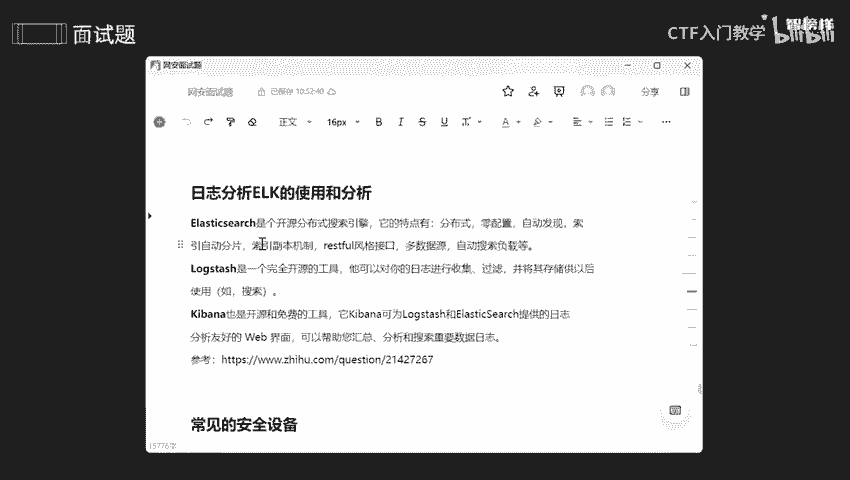
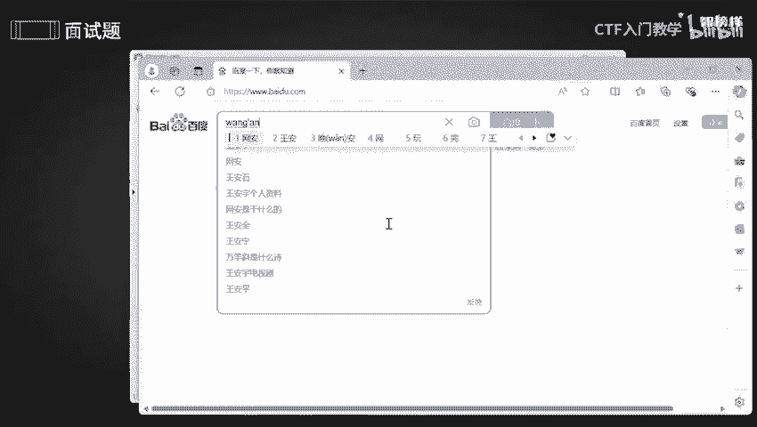

# 2024最新版网络安全秋招面试短期突击面试题【100道】我会出手带你一周上岸！（网络安全、渗透测试、web安全、安全运营、内网安全、等保测评、CTF等） - P15：面试题-安全防御2 - CTF入门教学 - BV1bcsTeXEwR

本节课呢是继续讲解咱们这个安全防略。因为这一关非常非常重要的，是咱们这个公司比较嗯在意的一个点。好，我反正将这些呢全部都整理到语圈文档上了。有需要同学的话可以在评区留言或者私信我。好，我们看第一个啊。

首先呢就是等保制度啊，等保制度，这个东西是非常非常重要的。因为它关系的是什么呢？我们的一个数据安全性啊，所以的话再次强调一下，这个是非常重要的。那么第二的话就是日志分析啊和分析咱们这个。

ELK的一个使用啊。那么第三个呢就是常见的一个安全设备。好，那我们一个个来看一下啊，等保呃等级保护呢，这个在上节课其实已经讲过了啊。

只是现在给你们强调一下这一方面的一个主要是提高咱们这个信息安全保障的一个能力。okK那么第二个呢就是日志分析啊，日志分析谁呢？哎，咱们这个ELK的一个使用啊，ELK呢其实就是一个缩写。

它分别是谁的缩写呢？啊，ellect和咱们这个log，还有咱们这个这三个一个缩写可以看到EL还有K这三个缩写啊。那elect search呢，它是一个开源分布式一个搜索引擎啊。

它的一个特点呢就是一个分布式哈一个自动发现啊，还有一个搜索自动啊分片等等等等。什么意思呢？好，就像百度一样，百度的话它是能够去搜索，是不是？

那我们先打开一个百度。啊，3W。点百度点com。好，这是百度，是不是？如果说我在这里去搜索一个，比如说我搜索一个哎晚安，对吧？

它就会给我出现什么呢？网安相关的，是不是包括这个字啊啊，有可能还会进行一些模糊查询。你可以看到啊，只要是啊包含网安。对不对？它都会出来，对不对？只要携带咱们这个网和安这个词，它都会出来。

比如说这些网络安全等级保护网络是不是我没有去写啊，对不对？没有写这么全，但是它还是给我显示出来啊，这个就是使用咱们这个搜索引擎，更加快速的更加。呃，范围广的去给我搜索，不可能我我打什么他就出来什么什么。

那这样子会影响到用户一个体验感，对吧？还会干什么呢？他会将这些什么关联词给联系起来。就是说如果我后期不知道怎么去形容的话，他自己会给我啊把这些相关一些词汇全部都显示出来，对不对啊。

包括什么啊探争啊、证书啊、专业啊，公司一些排名啊，某络安全是干什么呢，将这些几个比较常见的一些问题全部都展示出来了。好，这就是所谓的一个名词联想啊。就是使用咱们这个引擎啊，搜索引擎。

更加快速高效的找到我想要的一个东西啊。那么咱们这个lock star是实是什么呢？它其实就是一个呃收收集工具啊，它也是开源的，它可以收集来自不同源的数据啊，并将这些呢数据存储到用户选择一个目标位置中啊。

它最初的话其实就是说推动日志一些更新嘛，推动它一个收集嘛。就是说你如果有日志的话，我就不需要一个去收集一个去查看，是不是？所以通过咱们这个lock star，它就能够自动去收集，自动去过滤啊。

就方便我后续的一个搜索以及查找啊。那Kban呢它其实也是一个开源的，主要是啊他们三个相结合，一起去共创什么呢？共创我的一个认志分析啊，就是能够帮助我更快速的去分析搜索以及汇总啊。就怎么说呢？

就是说哎这些呢是一个认志管理和分析的一个工具，它能够去用于收集啊，什么存储啊、查询啊，或者说展示这方面的数据更加快速高效，让我好看得懂。好，不管是一些文件啊，或者说是一些呃哎脚本啊。

或者说是reads啊，这些的话，我都能够通通去采集啊啊，然后加一是进行格式化、匿名化这些去操作啊。反正最最终啊通过咱们这个lost star，然后处理出来的数据，能够存储到指定一个存储以及库里面。哎。

也就是说咱们这个引擎。啊，就是说一些工作上一些什么数据呢，它通过咱们这个loggo，然后去搜集，是不是搜集过滤，然后去分析，对不对？将这些数据呢然后发送到e里面，也就是咱们这个开源啊搜索引擎里面。

然后它呢就是说能够帮助它对咱们这个数据进行什么全全文的搜索啊，或者说是些分析啊，然后将这些东西呢。通过啊啊咱们这个key banner更加去什么呢？展示一个可视化的web平台。

能够直观的去感受到数据一个可视化。如果说还看不懂的话，听不懂的话，没关系，我们去参考一下这个。好。这个呢就是一些搜索引擎搜索日志啊，它将是实使用一个啊咱们这个搜索出来一个系统日志。

怎么去分析一个过程都放在这上面了。你们可以去参考一下咱们这个这篇知付啊。好，再看下一个常用的一个安全设备啊，常用一些安全设备呢无非就是防火墙啊，对不对？还有杀毒软件等等等等啊。

那防火墙呢其实就是说呃是一网络安全的第一道防线，就是去按照防火墙的这些规则去阻阻碍一些流量，或者说允许一些流量，是不是？比如说一些IP地址，它去恶意攻击我，那我就通过防火墙规则去限制这些IP地址。

那么UUTM呢，它就是说是一个一体化的一个安全解决方案。什么叫一体化呢？就是说我使用这个设备呢，我就能够去干什么，一方面我能够去防病毒，另一方面的话，我能够去检测啊检测咱们这个入境记录啊。

还有呢我还可以去过滤等等等等啊。OK负载均衡又是什么呢？负载均衡呢？其实就是说它为了防止一些服务器崩溃，对不对？所以呢它会将一些流量啊，然后均衡化，就是你这边分配一点，你这边分配一点，不要把你些压力啊。

工作全部都堆到我一个人身上，堆在我一个人身上，我又不是铁，对不对？所以的话24个小时工作，我根本就不行，哎，为了防止这些情况，所以哎要负载均衡一下，你这边分一点，你那边分一点，对不对？

让我的工作轻松很多，是不是保证啊保证咱们这个系统能够正常运行，对不对？我人要是垮了的话，我怎么去工作啊，为了长远啊看啊，那么IBS和D呃IDS呢其实就是1个IPSS呢，就是主动去阻断一些恶意流量啊。

IDS呢就是去监控啊，监控去检测一些恶意活动啊。O。那堡垒机是什么呢？它其实就是说提供对内部啊内部网络一个访问控制啊，比较常用于一个网呃远程一个管理啊。蜜罐呢它就是啊一个陷阱，它能够去诱导啊。

诱惑一些什么呢？一些黑客他去攻击我，那他以为攻击上了，其实不是他只步入了我的陷阱里面，就像钓鱼网址钓鱼啊钓鱼执法一样，对不对？让他先哎咬上咱们这个鱼钩，对不对？咬上咱们这个诱饵，然后去进一步去抓取它。

然后去登过IP溯源啊等等啊。那么网闸呢其实就是说通过咱们这个物理隔离这些方式来确保两个或者多个网络之间没有直接的一个数据连接，就是为了去提高咱们这个安全性。那么。WAF呢是一个比较常见的。

主要是为了去保护啊保护咱们这个weable啊web应用程序免受一些攻击啊。比如说我们常见的一些经典漏洞啊，搜er注入啊啊夸张脚本啊这些等等等等都是啊。它和咱们这个web啊是息息相关的啊。

那么扫描器是什么呢？扫描器呢就是说去检测咱们这个系统中一些漏洞啊和一些弱点。比如说咱们这个nense，比如说n map，它都是一个扫描器啊。

最后呢就是咱们这个SOCSOC呢主要是为了去监控啊和分析咱们这些安全事件，能够去提供一些危险检测呀，或者说危险分析呀以及响应等等等等啊，它就是一个常用的一些工具啊。这些工具的话我们有的时候会用到。

有的时候不会用到的。所以的话我们需要了解一下。需要自己去了解一下，好吧。那反正我将这些一些功能啊，包括它特点全部都放在语圈文档上了。有需要的同学的话可以在评区留言或者私信我。那么今天的课程就到此为止啦。

