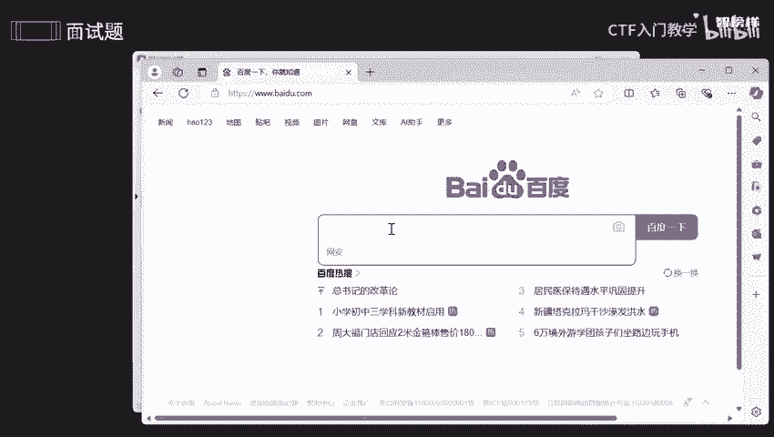

# 2024最新版网络安全秋招面试短期突击面试题【100道】我会出手带你一周上岸！（网络安全、渗透测试、web安全、安全运营、内网安全、等保测评、CTF等） - P16：面试题-框架与中间件之iis篇 - CTF入门教学 - BV1bcsTeXEwR

本节课呢讲的是IIS是什么？以及IIS的一些保护措施。我将这些呢全部都存储到语雀认文档上了。有需要的同学的话，可以在评区留言或者私信我。那我们先看一下今天要讲的内容吧。首先呢讲的是IIS常见的一些漏洞。

你想想，只要是系统只要是服务器，只要是中间键就会存在一些漏洞，是不是不管你怎么去升级还是会存在。所以的话给你讲的是1个6。0啊，7。0，包括8。0到10。0之间的一个漏洞啊。那怎么去防护，对不对？

那如果说它漏洞的话是我不能够去控制的那我怎么去把这个缩小一下，是不是安全性提高一下。所以的话咱们这些做哪些防保护措施啊，好，我们一个来看一下。好，首先呢给大家讲一下IIS是什么。

它其实就是一个微软所提供的一个呃用于windows系系统的一个基本服务啊，就是用于一些网络浏览啊，文件传输啊、新闻服务啊，或者说邮件发送等等等等啊，这些方面的话是比较好用的。

I呢其实就是一个网络信息交流中的一个交通枢纽啊，它呢就是负责接收啊、处理啊，以及发送各种各样的一些信息啊。就假设啊你去访问一些网址，对不对？好，就比如说我要去访问咱们这个百度。啊，百度点com。对不对？

我在这里输入什么？哎关键词，比如说就比如说我想搜啊搜周周杰伦好吧，我比较喜欢周杰伦。

啊，就比如说我搜周杰伦，那这个我搜索这个过程是不是一个请求，他接收到我的请求，是不是？所以要去处理这些请求。然后这这些请求呢转发到相对应个服务器。然后服务器呢就是要去找什么数据库里面一些信息。

是不是他就给我唉显示出来了。关于周杰伦的一切一切，包括他一些音乐啊，他一些关系啊，电影呀，以及相关的一些视频全部都出来了，是不是？所以的话这些画面呢是谁去处处理的呢？是咱们这个AIS去处理的。诶。

那不仅如此啊，在这个过程中的话，我不可能一搜的话，全是一些弹窗呀，全是一些密毒，是不是？所以IS呢还能够去提供一个安全的一些环境，帮助我更加高效的快速的安全的找到一些相对应的信息啊。那可能有人说了。

这么强大的1个IS，咱们这个中间键还有存在一些漏洞，那这个漏洞会不会危害到我们呢？放心，这个漏洞的话有可能啊有可能现在已经修复了，这就是什么呢？我们要定期去检测，定期要去管理的一个意义，对不对？好。

那我们看一下IS常见的一个漏洞啊。像现在的话一个6啊，它一个六版本IS6版本的话，我会出现什么呢？文件解析这方面的一个漏洞啊。这是可能会错误的去解析到一个文件扩展名。

是不是导致攻击者可以执行任意一个代码。那你想想他都能够去携带任意一些代码，任意代码，那你想想是不是非常非常危险，对不对？他还能够去干什么呢？哎，weber啊weber这个漏洞的话，能够去远程啊。

远程让攻击者去执行任意一个命令。那你想想就相当于我把这个家门口已经告诉他了，你你尽管来快点来偷我的家，是不是他就能够远程了。OK那那后面知道这些漏洞的话，我是不是修补了，那修补之后的话。

是不是七的一个版本，但是七的版本哈还会出现一个新的漏洞，这就是网络安全这方面的一个重要的意义，对不对？因为你修补之后的话，你不确定你不确定还有没有存在另一些漏洞，对不对？原先漏洞可能是修补了。

但是还有存在一些未知的啊。哎，比如说这个no no一个漏洞，空的，对不对？空的字符来断绝，它就可以去绕过用这个东西去绕过某些安全的一个限制。好，以及咱们这个模块解析这方面的漏洞啊。

那后面的话我们升级到八的一个版本，或者说十的这个版本，但是还是会存在一些漏洞就是。不光是AS本身的漏洞，还会存在他们携带的。有的时候AS要和一些框架相对应的，是不是？

如果说我在这个产品上没有去找到相对应的漏洞，我还可以去干什么？我要发散一下，我去唉咱们这个产品提供员提供商里面去找问题，是不是它的话就会存在一些漏洞，从而影响到咱们这个A服务的一个正常使用啊，对不对啊。

就相当于说什么呢？既然你没有什么问题。好，那我去你的老师里面去存寻呃，就是去找一些问题，或者说我去你家长里面去呃找一些问题，是不是总能够找出来，然后从而影响到你自己。那既然如此，这个漏洞。

我不能够去百分百去控制它，那我怎么去做呢？我怎么去缩小咱们这个啊危害性，怎么去提高咱们这个安全性。所以呢要做一些保护措施啊？首先呢我们要去保持windows一个升级啊，我们要对啊咱们这个操。

操作系统或者说I都要去定期的去更新。只要更新到最新一的版本的话，它的一些小的一些漏洞啊，或者说大的一些漏洞，严重的低V的中微的这些漏洞的话，都会随而随着它更新而去修复，对不对？

那么还有呢就要使用咱们这个防范工具啊去优化它是不是？还有呢就是要去移除一些web站点。就有些web站点的话，我们可以去删除它没关系的啊。主要是要去缩短咱们这个风险，对不对？

或者说如果你不需要FTP和咱们这个MSTP的话，那么我们就把它卸载掉，什么叫FTP呢？FTP的话就是一个文件传输这方面的协议啊，它它们两个都是协议，FMTP的话，它就是一个邮箱啊。

它是邮箱这方面的一个协议啊。如果说我们不需要文件传输或者或者是一个邮箱。那我们哎删除它就可以了。没有什么过多的一些影响啊，还有呢就是要有规则的去检查咱们这个管理员组啊和一些服务，就是要定期去审查。

要审计一下。因为有的时候啊，咱们是在公司公司的话是一个团队协作，是不是不可能是你一个人。所以的话我们要检查一下，检查一下是否有存在一个你不知道的一个组啊，就是说你不知道一个员工的话会导致你什么呢？

你的一些数据啊，可能啊被一些被一些不法分子啊，横向啊渗透等等等等啊。还有去去严格去控制咱们这个服务器一个啊写访问的一个权限。还有呢就是要去设置啊咱们这个复杂密码。有戏密码呢，它会通过社工啊社工。

然后去猜到你这个密码。所以呢为了去防止这些问题的话，我们最好是用一个强啊强弱令啊抢口令啊。然后不要使用一些弱口令，不然的话你的密码的话就相当于一个摆设啊，失去了一个原来的一个功能。

还有呢就是要去排查咱们这些共享问题。因为共享啊它的话会给到一个端口，是不是你它可以通过共享端口去合理的进一步的去哎控制你这个电脑。所以的话有些共享的话，能不要就不要，是不是？如果你真的想要的话。

你先把它静止掉。等你想要的时候，你再把它打开，手动打开就好了。还有呢就是禁用啊咱们这个TCPIP协议中的一个net啊。这个net呢？哎，这个net呢与咱们这个SMB协同工作的时候。

会为用户啊提供一个呃文件共享和一个设备发现的这方面功能。那如果说你们想想文件共享的话，会导致什么呢？别人有机可乘啊，别让别人去有机可乘。所以的话我们最好啊。需要同学需要的时候就去开启，不需要的时候。

我们把它禁用掉啊，不要它是不是没有什么过大的一个影响，是不是？我们要共享什么呢？还有啊我们要使用TCP端口去阻塞啊，阻塞的话我们用防火墙去配置一下就好了。

最主要的是还要仔细检查一下啊better和ESE啊，这个ESE是什么呢？它是一个可执行文件。就我们啊在官网上下载了一个什么安装包啊，它的话解压之后，我们都要去找到ESE是不是然后执行，然后才能够去安装。

对不对？那这个可执行文件的话是非常非常大的一个危害。如果说有些人通过这些可执行文件，然后伪装让你的哎在我的电脑上去植入，对不对？那你想想它就会通过咱们这个可执行文件，哎，进一步去监控你这个电脑好。

那better呢它是一个拼除你一个文件，里面的一些密码啊命令啊都是可以去执行的啊，好，以及呢我们哈还要去管理啊，咱们这个目录安全啊，有些东西呢是一个非常非常重要的一个东西，它可能是一些配置文件啊。

可能是一个数据。文件啊或者说一个备份文件，对不对？那这些数据是不是非常非常敏感，非常非常重要？所以呢不没有我的权限，它是不能够去访问的，是不是？如果说啊你的一个公司，然后你和你的组员一起去啊，你去改。

一起盖咱们这个A对不对？这个目录的话，就不是你一个人去可见呢？我们每个人都去修改，那你怎么去确保那个人没有去修改你这个目录呢，对不对？没有修改里面的文件呢？哎，没有口碑呢？好吧，没有移动呢？

所以的话我们要确保啊，只有我只有我本人来了，我才能够去动，我才能够去访问其他人只能够哎。你放一边去，对吧？还有啊我们要使用咱们这个安全性啊，就是我们可以通过它啊。

通过它这个权限来去控制对文件和目录这些方面的一个访问啊。那NTFS呢其实就是是用于啊一个硬盘上的一个存储和取回啊。就比如说吧假设啊突然间断电了，是不是在复责啊复制咱们这个文件的过程中，突然间断电了。

那么设置日志不会记录已经完成，对不对？咱们这个协议呢哎就能够去啊在来电后重新完成刚前刚刚的一个事件啊，能够去数据一些分恢复，以及对咱们这个数据保护啊，就是做这一方面的一个功能。好。

那么还要去啊管理咱们这个用户和账户啊，就是用户账户的话，我们最好是实施实施最小权限设置啊，就是防止别人利用一个权限以权蒙私，懂吧？还有呢最后一点呢，就是要去审计咱们这个web服务器啊。

还是要定期去安全审计安全检查，以及要去排查咱们日志里的一些异常行为，对不对？最后要去采取相对应的措施，这样子呢就能够去避免一些安全事件啊，好，那反正我将这些。的一个步骤啊，包括一些怎么去排查。

全部都放在语圈文档上了。有需要同学的话可以在评区留言或者私信我。那么今天的课程就到此为止啦。