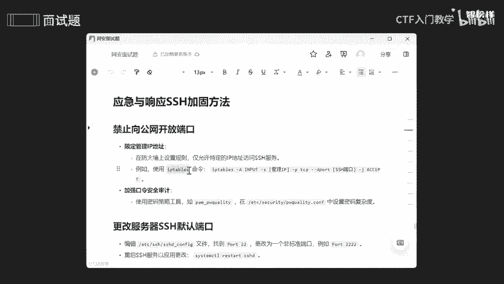
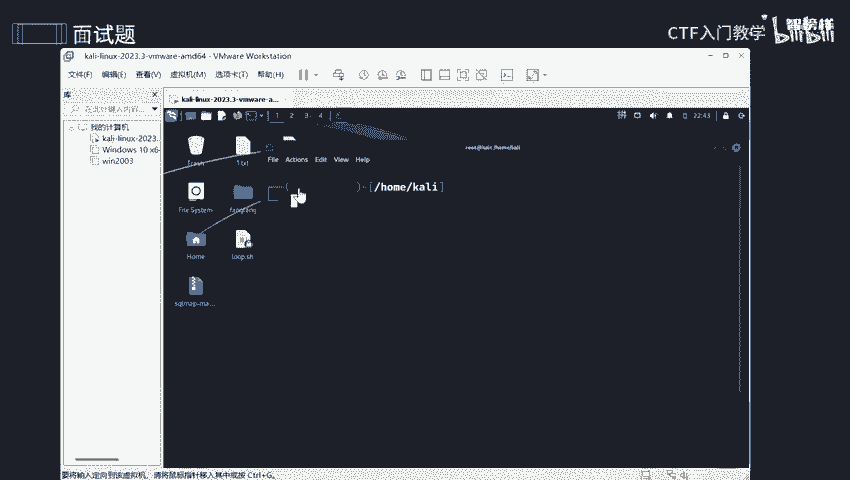
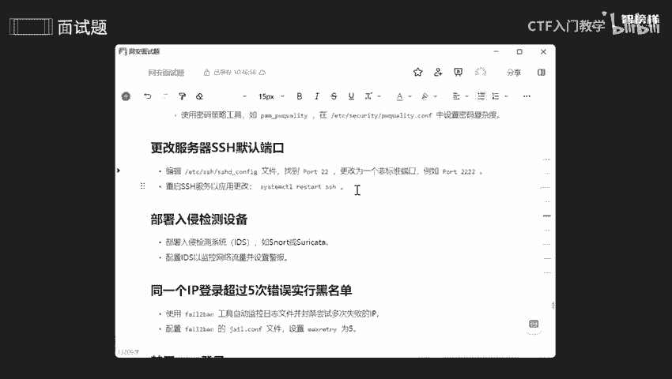

# 2024最新版网络安全秋招面试短期突击面试题【100道】我会出手带你一周上岸！（网络安全、渗透测试、web安全、安全运营、内网安全、等保测评、CTF等） - P19：面试题-应急与响应SSH加固方法 - CTF入门教学 - BV1bcsTeXEwR

本节课呢讲是SSH怎么去加固。哎，我将这些加固的一些方法呢全部都整理到雨雀文档上了。有需要同学的话可以在评论区留言或者私信我，记得一键三年哟。okK那我们看第一个步骤啊，首先呢方法一。

禁止向公网开放咱们这个端口啊。什么叫沟网呢？我们可以理解为是对外开放的啊，就是说全球范围任何人都能够去访问咱们这个计算机的网络，它是由多个网络和一个互联啊互联网的一个服务提供的一个东西。

庞大的一个网络结构吧。就功网呢也可以称为为外网，以子对应的话就是我们的内网了。内网的话就是比范围稍微要小一点，只有在这个局域网同一个局域网下才能够去访问。那为什么要禁止对公网去开放咱们这个端口？

你想想我这个这个范围放数更大的话，那就是让更多人能够去进一步去控制我这个电脑，或者说来攻击我这个电脑，对不对？所以我要避免这个情况将范围缩小一点。那怎么去做呢？首先要限定管理的1个IP地址。

我们可以去防火墙上去设置咱们这个规则，因为防子墙是有规则的，是不是我们可以自己去自定义去自己去添加一个，是不是就是仅允许特定一些IP地址，能够去访问咱们这些服务啊，那怎么去查看呢？

一般都是啊使用咱们这个IP table啊，或者说fifa word也可以。

它是两个不同的。

嗯。好。这个呢就是咱们这个防火墙的一个具体规则，可以看到没有设定任何任何一个东西啊，这个是input output output is forward。这里一些入入站的规则和出站规则全部都放在这上面了。

我们可以自己去添印。如果说我们去添加的话，就是一个IP type杠A呀。哎，到A呀，我们可以自己添加一个入站规则或者是出站规则，可以指定1个APP地址，也可以指定所谓的一些端口啊。

OK最后呢这些是一个策略啊，这个是一个同一策略，还有什么呢？还有拒绝策略，拒策位就是这啊这。哎，这个。好，那我们限制好啊咱们这个AB地址之后呢，还要加强咱们这个口令啊。口令呢就是咱们这个密码，对不对？

我们可以使用密码刺略这个工具来去加强，就是一般来说的话，有人设规则的话，可能就是纯的数字，方便好记，对不对？有可能就是密码加数字。那我们怎么去加固呢？首先呢它是不低于12位的，不低于12位的一个密码。

还有呢它是包含什么呢？哎，咱们这个特殊字符，比如说下划线，比如说咱们这个星号百分号艾特是不是这些都是一个特殊字符。我们还要设定自己一个什么呢？数字，以及。哎，字母这几个三样加起来去设置咱们这个复杂度啊。

加强咱们这个复杂度。好，那我们咱们这个公网已经ok了，我们还要干什么呢？还要去更改咱们这个服务啊。哎，这个端口一定要去更改啊，就是说如果你不想被别人进一步的去利用这个默认端口去做的话。

所以我们只能啊自己去定义一个，不被别人去占用这个啊端口。比如说啊2不常用，对不对？比如说444，比如说666都不常用，那我就使用它，对不对？okK那怎么去看呢？一般来说我们都是要去配置软件里面去更改啊。

好，我们去配置文件里面去看一下。哎。诶。好，这些就是咱们这个SSH服务的一个配置文件啊。啊，我找到我的端口看一看啊。啊，在这里啊可以看到我的端口默认是什么呢？是22，对不对？我们可以把它修改成什么呢？

222啊，对不对？哎，进入咱们这个编译模式，可以看到啊，这里insert是什么呢？插入模式对不对？所以的话我们可以随意去修改。好，修改完成之后，我们就点击什么呢？哎艾。哎，对不对？

然后你可以看到这些什么呢？这已经进入咱们这个命令模式，然后我们点击什么呢？哎，这是什么保存并退出啊，WQ保存并退退出啊。好，可以了，我们已经成功了。那我们能。嗯，最后就是重启咱们这个SSH服务了。

因为我们要重启一下，重开一下才能够去生效，是不是？所以一定要重启一下。哎。嗯。好，已经重启成功了，这里密码可能有点错误啊。没事，把它变一下好了。我们还能还要干什么呢？我们还部署入侵检测一个设备啊。

这是我们要部署它是为什么呢？就是方便有些人去入侵我的话，能够第一时间能够去入侵查到啊。哎。我们要配置IDS，然后去监控网络流量，并且设置警报，对不对？因为不设置警报的话，它监控出来的话。

我又不能实时去攻呃监控咱们这个就是实时去查看咱们这个电脑，对不对？所以的话要设置咱们这个警报。一旦哎有人入侵的话，就唉拉响警门，对不对？就相当于什么有人去偷银行，是不是去抢银行拉响警报，它的话。

哎它的一些行为第一时间就被人发现了，是不是那我们还能够去干什么呢？我们可以将一些I加入一些黑名单。因为你们知道那个AP的话不是我的，并且他不断去尝试去攻击我这个电脑，那我怎么能让他呃继续能攻击呢。

所以我直接把它加入黑名单，不让他去访问不就好了吗？是不是？所以的话我们可以使用工具啊，尔，然后去自动去监控咱们这个日志，并且封禁尝试多次1个I对不对。因为有些IP呢就是说它会通过字典去爆破，是不是？

所以呢这个尝试是一个必不可少这个过程啊。好，那么还能够去个还要去配置，还要去配置咱们这个配置文件啊，将它设置于5个是什么意思呢？就是说它超过5次的话，我就将它封禁了，我就不让它去访问了。

如果说你觉得这个次数太太多了，对不对？我们还可以调少一点，我们可以调成二呀，调成一呀等等等等。但五次是最好啊。哎，最后呢还要进用咱们这个root啊，进入咱们这个root登录啊，进入root登录的话。

就是在咱们这个配置文件去设置。好吧，最后还是要重启一下，这个就不和大家一一去那个了。为什么要禁用咱们这root用户啊？啊，首先主要原因呢就是最小权限原则啊，就什么叫最小权限原则呢？

就是说如果攻击者能够通过SSH以root身份去登录，是不是？那么他们能够完全控制咱们这个服务器，是不是？所以即止它是一个减少这种情况一些风险。那么还那么还能够去提高咱们这个审计和追踪的一些能力，对不对？

因为有些呢唉有些root被呃root登录被封禁之后呢，管理员需要使用一些普通用户这个账号来登录，是不是？所以就会通过sho do或者说其他机术来提高咱们这个权限。哎，那这个行为就将就被记录了，对不对？

被谁记录了，被系统日志所记录，是不是？就方便咱们这个审计和追踪啊，这呢还能降低内部的一些威胁啊。就是即便是内部人员，也不应该啊就不受受制，不受权限的一个受制，然后通过root啊去访问我，对不对？

减少他们去滥用咱们这个权限的一些风险。好。那还有呢还有我们可以去禁用啊禁用空的一些密码。就说我们可以去这里啊这个文件里面去查看一下有没有用户啊，账号呀，它的一个密码是一个字段是空的，是不是？

因为字段是空的话，很容易去受到攻击，是不是OK或者我们还可以去配置文件里面啊去将这个为空的一个密码设置为no，对不对？这是禁用的意思。好，那么还能够去更改啊，咱们这个密钥登录啊。

这是我们可以生成SSH1个密钥对啊。通过这个指令啊，还有将公钥复制到一个服务器的一个文件上。好吧，咱们这个文件上是非常非常重要的啊，最后呢就在咱们这个啊里面设着弄这个之前的话都是已经交给大家去设置了。

只是在这里说明一下，就是改为密钥登录。增强咱们这个啊安全性。好。最后呢就是基于啊受信任的一个主机，无密码一些登录。这个呢就是要方便咱们这个专实的一个主机一个登录，对不对？如果说总是要去哎使用密码的话。

也是很烦的。所以呢我们可以去配置文件里面去设置啊具体步骤呢已经放在这上面了。有需要的同学的话，可以在评论区留言或者私信我啊。好，那最后做个小小的总结啊。本节课呢是讲了SSH怎么去加固。

上节课呢其实讲了SSH被曝过了怎么办？所以呢。SSH它是非常非常关键的啊，就是如果你使用不当，你配置不当的话，很有可能被一些不法分子去利用，对不对？所以我们要去加固啊。

但是这些的话基本上有些东西是用不上的。我们挑选几个去加固啊。好，这些方式方法呢全部都放在上面了。那么本节的课程就到此为止啦。

