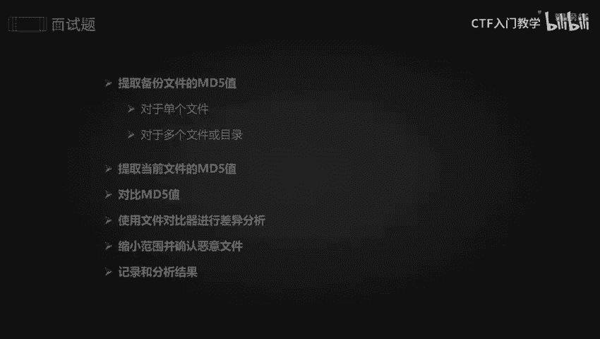
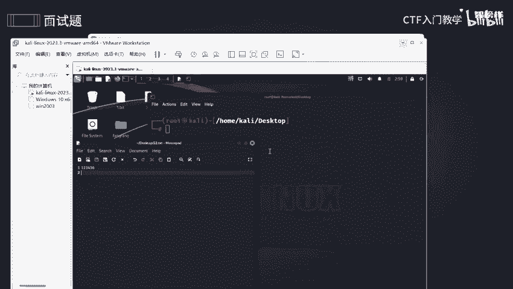
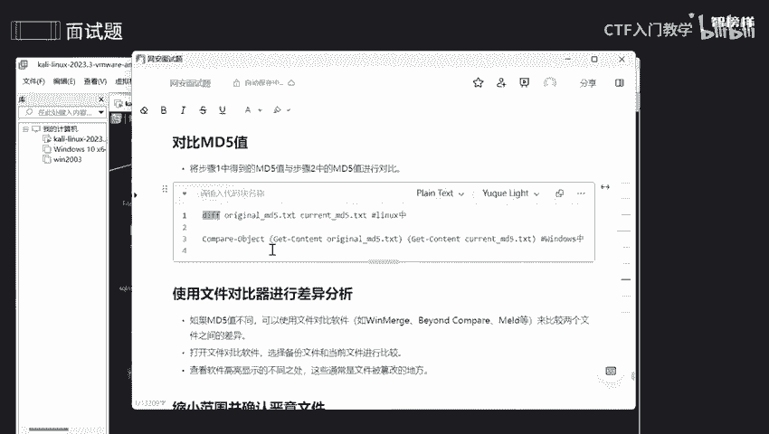
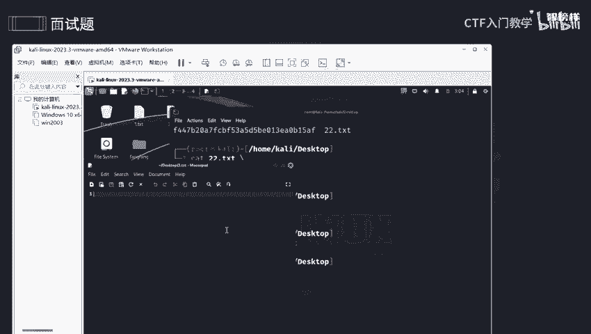
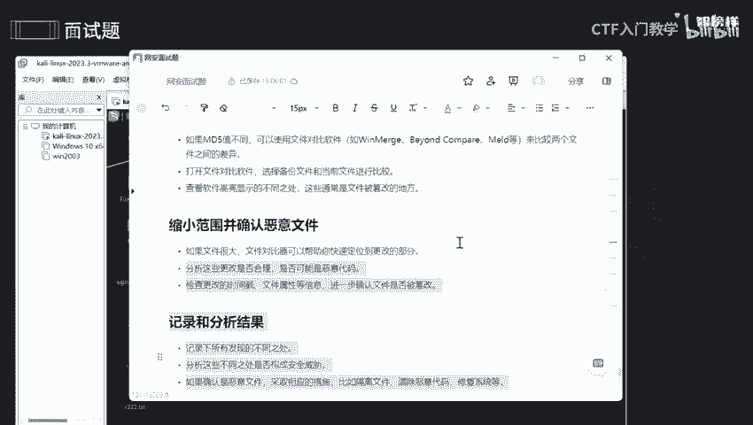

# 2024最新版网络安全秋招面试短期突击面试题【100道】我会出手带你一周上岸！（网络安全、渗透测试、web安全、安全运营、内网安全、等保测评、CTF等） - P20：面试题-应急与响应被上传一句话(日志被清除、 已经免杀) - CTF入门教学 - BV1bcsTeXEwR

本节课呢讲的是面试题中会问到的，如果被黑客所攻击了，并且上传了一句话啊，那日志被清除了，而且做了秒杀，我该怎么去做呢？好，我将这些步骤呢全部都整理到语雀文档上了。

有需要同学的话可以在评区留言或者私信我啊，记得一键三连。OK第一步呢就是要提取备份的MD5值。什么叫MD5值啊？它呢就是因为文件它本身还有一些攻击的一些有用信息。

是不是我要去提取MD5值才能够去发现发现检查它的一个重复性啊，检查它一个什么完整性等等等等。我要通过MD5值能够去追踪恶意的一个活动来源啊，尤其是如果该恶意软件啊，以前被识别过和分析过的话。

那我的查找速度就会更快，更加容易珍珠到O那什么叫MD5值呢啊，我就以mysl为例啊。

哎，在这里啊，就你们可以看到啊SID和S啊pass这这两个是什么呢？ID呢是一个ID名称，是不是是一个编号。那pass呢就是一个密码。你们你们注册号的一个账号和密码的话。

你的密码不是会常常啊就是说把它正道光明的给显示出来，而是通过加密的那这个加密呢就是MD5加密，它加密过之后的话，你就哎不认识了，你就不知道这是什么东西了啊。这就是MD5。有点抽象，我把它我先把它弄掉啊。

我给大家准备了一个东西啊，这个网址呢是能够去啊加密的，就是加密加解密。好，比如说我在这里输入1个123456789啊。那我把它加密一下，可以看到加密号啊，这个东西就是啊就是咱们这个加密号的一个语言。

加密号的一个乱码，对不对？我通过它去存储到。如果说我想解密的话，哎，我就是复制一下，然后把这段话给copy下来，然后查询一下，可以看到他就给我解密的，我存储的就是1234567。

那可能想哎那有这个工具的话，那这个密码是不是不安全呢？那你想想我可以加颜啊，我可以加颜，什么叫加盐呢，就是说我给他一个颜值啊，我给他一个颜值，这个颜值是我所给他的，是一个开发者，他们自己去定义的啊。

自己去定义的，只有我才能知道其他人不知道这个颜值的话可以是字母，也可以是数字也可以是任何一个东西，我可以是两位数也可以是四位数等等等等啊。都是我自己去随心所欲去定义的。

他就不知道所以我的密码就能够去更好的去保障那些。小黑子啊，他去拿取我的一个数据库，你可以发现他数据库的话是他那密码是一个加密过后的。所以需要按颜值，包括这个东西MD5去算法，好吧。O。

而且这个MD5呢还能够去帮助我们缩小啊调查一些范围。可可以去确定啊该文件是否与恶意的一些软件量式所匹配啊，就是对这个恶意软件进行分析，哎，包括其功能啊，全播方式啊，可能是啊一些危害，对不对？

还能够通过它去追踪，对不对？O。那我们怎么去提取呢？我们怎么去玩呢？哎，来到这里提取备份呢就在咱们这个MD5扫码这个东西指令去提取就好了。啊。

我把它的一个linkux版本的和一个windows版本的一个指令全部啊放在这上面了。好，我们来玩一玩，好吧。

啊打开。O。先创建一个吧。就阿里test吧。然后在这里写一个。123456。23456吧。好。

好，我们把它加密一下。啊啊 they test。OK它已经加密过了，可以看到啊。如果说哎如果说你还想把它保存，那我们就是要干什么呢？要把它稍微定义一下。比如说我想把它放在哪里呢？嗯，放在。新建一个吧。

那好吧。好吧，放到这上面。好，可以看到他已经给我建出来了啊。OK我们可以看里面的一个内容。好。就是这样子，和我刚刚那个是一模一样的。因为它呢就是说如果你只只是只是说把它MD5的话，这个数值的话。

它只能显示在我的一个终端，不能够去直接显示到我的一个不能保存到我的1个22里1的test。好吧，比如说我看一下。哎呀，不好意思。好，可以看到它是什么都没变啊。

所以的话我们可以啊自己定义啊定义到咱们这个另一个文件。O。OK回到这个问题啊，因为他的日志已经被清除，是不是？所以的话我不能够去查看他的日志一些入侵啊记录，对不对？所以我要去提取备份的一个文件。

这是我们一些数据的话，会近期呃定期的进行备份。我们可以去搞个定期任务，然后去备份咱们这个数据，对不对？所以的话我们提取备份文件啊，就用咱们这个MD54码去提取。然后这是对于单个的，对于多个的话。

就是通过脚本去变历啊去编历一下。O提取备份之后，我还要提取当前的当前的文件啊，就是说我要形成一个对比，没有攻击之前和一个备已经被攻击之后，我要把这两个的东西都提取出来做一个对比，对不对？

所以我要提取当前的一个文件。OK提取的话和它是一样的啊，一模一样，我们就不单不和大家啊去操作一下啊。最后呢还要对比，是不是两两者都提取来了，一个人前人后都提取出来的话，我们是不是要去判断啊，对不对？

通过什么去判断呢？通过咱们这个文件对比器去进行判断去分析一下。我们要对比MD5值啊，我要确保一下它攻击之后的话，MD5值有没有变化呀。啊，就咱们这地方。用它去变啊。OK。

嗯，这里木有。这样子吧，我把它稍微。嗯。嗯，这个吧啊啊啊吧。啊啊，好吧。这是一个啊，然后我再去弄一个不同的。呃，创建一个新的。好。然后在你这里写个一一吧。

哎，然后再加这个MD5啊。三点test。3三点test吧。好，已经出来了，然后我们进行对比一下。首先呢我们对比一个。嗯。22吧，对比22得太小，然后和33好吧。哎，可以看到他给我哎显示什么呢？

是不是显示哎不同啊，它们之间是不同的。如果相同会怎么去显示呢？哎，我把它弄出来刚刚。刚刚新建了一个相同的是22。哎，可以看到相同的话，它就不会给我显示任何东西，证明这两个文件是一模一样的，对不对？

就可以去分析，可以对比一下。我觉得这些太麻烦的话，我们可以用文件对比器去对比一下。就是哎首先需要打开咱们这个文件对比的一个软件啊，然后去选择备份的和当前的进行对比。然后查看软件一些高啊高亮一些显示不同。

然后通常这些的话都是一个呃文件被篡改的一些地方啊。我好像也弄了，在这里。打开一下。哎，这个就是其中一个文件对比器啊，哎，你们可以自己去对比，它可以对比什么呢？哎，它可以对比文件啊。

也可以对比咱们这个文件夹啊等等等等啊，包括啊excel表啊等等等等，这些都是可以对比的啊，音频啊、图片呀等等啊。你们可以去玩一玩啊。好，那我为什么去对比呢？

首先呢我是要去缩小咱们这个范围来确定一下是不是一个恶意恶意软件，对不对？恶意文件，对不对？如果文件很大的话，我们可以通过文件对比器啊去选择。如果文件很少的话，那我们就唉使用inux就可以搞定了。

还要分析一下这个更改是不是合理的，其实就是判断一下这个东西是不是你更改的，或者说是你同事更改的。如果说这个东西只只是为了测试，那可能是一个不法分子，他去测试你这个文件，对不对。

还有最主要的是我们要去看一下它的一个时间戳以及属性啊。就我要确保确保一下这个文件是否是真的被篡购了，而不是说是被我自己所哎所使用的，对不对？我还可以干什么呢？我还可以去查看一下这个文件，哎。

是否被篡改以及损坏啊。就我可以通过MD5值和预案市值相匹配。如果说不匹配的话，它可能就被篡改过了，或者说被哎损坏了。好，最后呢就是要记录啊，记录咱们这个东西不同不同之处。好，如果确定啊是恶意文件的话。

我们就要采取隔离或者说清除以及修复了。好吧。好，我将这些指令呢以及这些步骤呢全部都放在语圈文档上了。有需要的同学的话可以在评区留言或者私信我。那么今天的课程就到此为止啦，拜。

