# 2024最新版网络安全秋招面试短期突击面试题【100道】我会出手带你一周上岸！（网络安全、渗透测试、web安全、安全运营、内网安全、等保测评、CTF等） - P21：面试题-应急与响应之window系统日志分析 - CTF入门教学 - BV1bcsTeXEwR

本节课呢讲师面试题中会问到的应急预响应知windows系统日志分析。我将这些日志分析的步骤呢全部都整理到语雀文的上了。有需要同学的话可以在评区留言或者私信我。记得一键三连哟。好，那我们来看一看。

日志分析呢，首先你要确保一下日志它保存的这个位置是什么地方。如果说我连这个日志它存放的一些位置啊，日志是干什么的，我都不知道的话，我怎么进行分析呢？哎，好，那前提知道了，那我怎么去分析这个步骤呢？

我已经放在这面了。第一步呢就是通过啊啊，通过一个ID然后去筛选咱们这个需要的日志。第二步呢就是说对它进行排查，对不对？我们要查看查看开启的一些服务，以及啊服务所对应的一些端口。

或者我要可以使用一些工具来进行查看进程等等等等。好。那我们看第一个啊。第一，日志它存储这个位置是什么呢？哎，一般存储中末的位置就是这个啊。在CTM332啊，在这log里面啊。好，我们来看一看好不好？

首先呢按住弯加R。

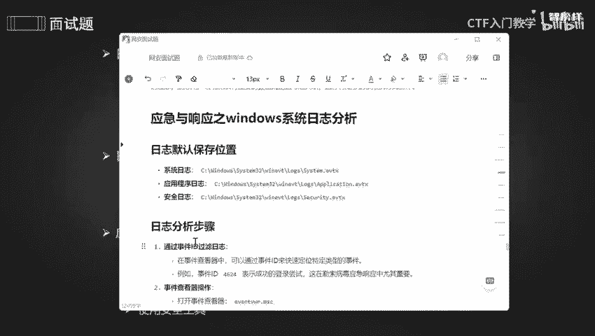

好，输入CMD，然后点击确定。好，来到咱们这个小黑窗，我们来看一看日志。

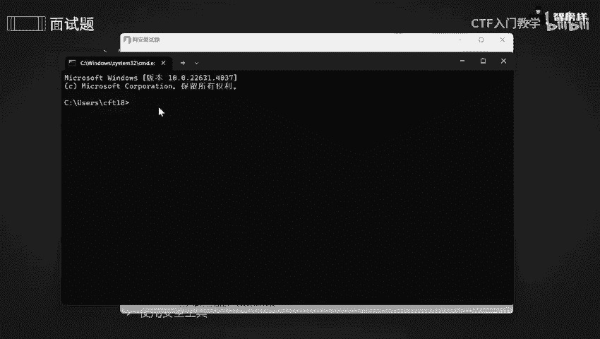

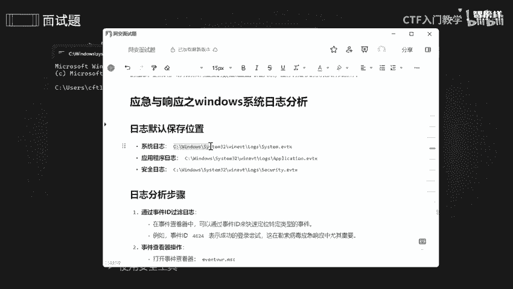

哎，来到这个日志，根志这个目录下。吓声啲。拒绝访问是什么意思呢？我想想啊，他呢可能是权限不够。好，刚刚拒绝访问了，是不是我们提全一下，然后点击这一个开始啊，然后右键。

然后你们可以看到有个终端和终端管理器啊是不一样的。终端的话它的话你只是一个普通用户就相当于car里一样。那么管理员的话就是说我通过呃root就相当于root一样，有root一个权限。

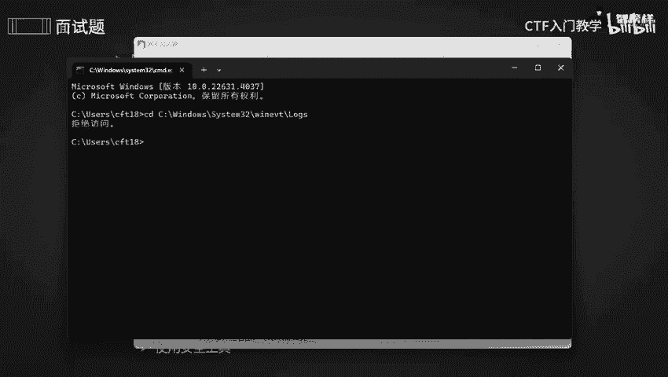

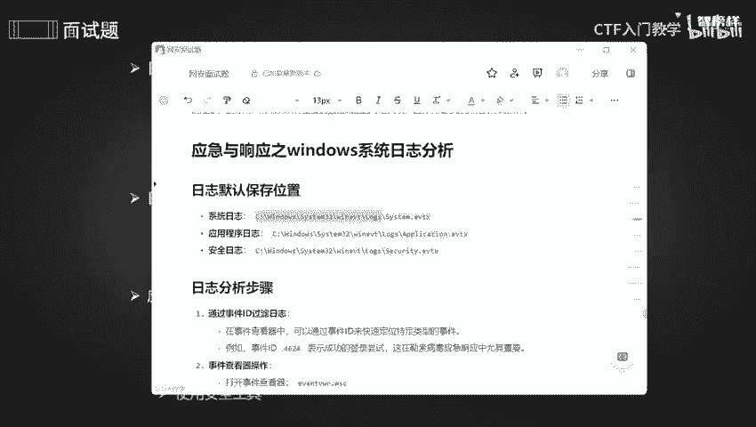

好，可以看到我现在已经用管理员的方式进入了。那我现在去哎CD一下。哎，你们可以看到这个CD都已经变了啊，变成金色了，金色传说啊。好，那我们。这个是什么意思呢？这个的意思呢就是说我将这里面logo啊。

这个目录下所有一些文件啊啊全部都显示出来。

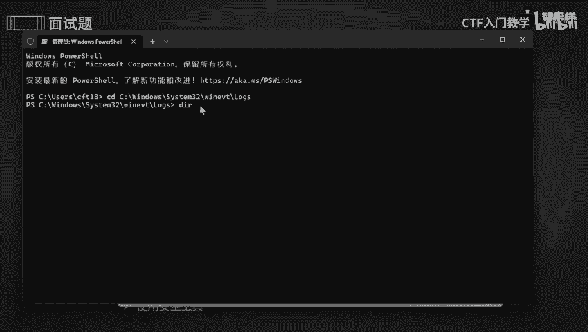

哎，可以看到有这么这么多的一个文件，但是有些东西我们可以不用上，对不对？日志的话不是让你一个一个去查，费时又费力。我们只要选择我所需要一些日志就好了。OK比如说这个是一个应用程序日志，对不对？

我们可以去查看，是不是我们还需要什么呢？系统一个程啊，我们的一个系统啊，系统一个日志，对不对？还有安全日志，我们找到它就可以了。

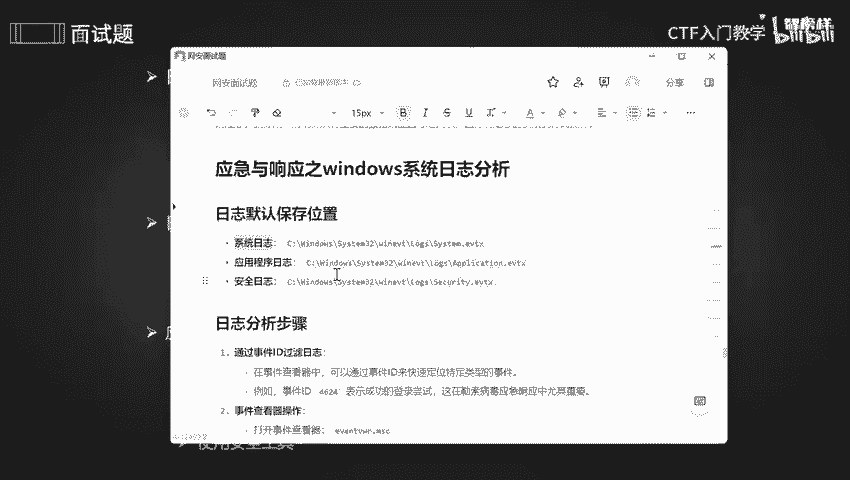

啊，它是以A到Z这样子一个字母去排序的。S的话应该是在后面啊。好，可以看到啊安全日志是不是在这里，我的一个系统日志是不是在这里，我们可以去查看一下，查看不再是cat啊。一般的话是是不是cat。

但是我们不是啊，我们是什么呢？哎，是一个t。这个东西去查看，比如说我想查看啊这个吧，安全认志好吧。ctrl C一下，contl V一下。来，终止一下，好吧。这么这么多乱码哦，它是什么呢？

它这边的话是一个什么呢？是一个中文格式。由于它的一个什么呢？编码格式不兼容啊。所以的话会出现一些乱码。没事，不影响，我们可以稍微调一下。这个时间有限，我就不给大家调啊，这个不是重点。

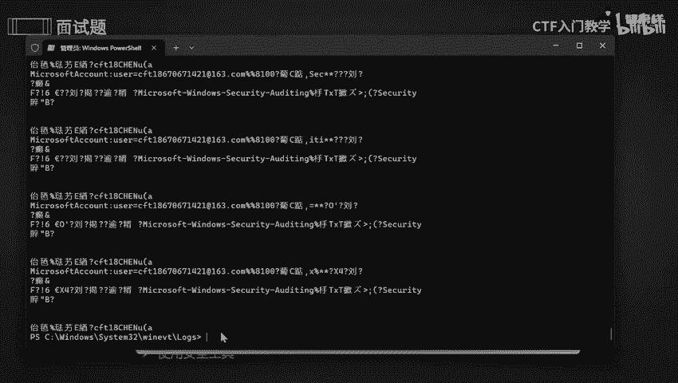

OK了解这么多。那我们了解了日志保默认保存这个位置。那我们开始啊日志分析这方面的步骤。步骤一呢就是通过啊事件，然后去过滤咱们这个日志。OK通过它的ID啊去快速定位咱们这个特定的一个类型的啊事件啊。

例如呢像这个事件ID啊，4624呢，它代表是成功登录啊成功登录。这个在咱们这个勒索呃病毒中一个响应啊是非常非常重要的。O。😊，那我们怎么去查看日志呢？哎，查看咱们这个事件呢。好。control C一下。

然后呢。温家尔。好，再将我刚刚copy的确定。可以看到事件查看器啊全部都出来了，这是它的一个锁啊，有的这个是自定义一个视角。它的的话名称叫管理事件啊，它的话里面有些一些关键的。

错误的或者警告事件全部都是在这里的啊，我们都是可以去自己去打开的。比如说我想打开。点击打开就可以了。哎一些警告啊错误啊，是不是都在这里啊，把它稍微好，可以看到它一个级别是不是都给我哎定出来了。

这个就是在我电脑上所发生的一个错误警告这方面的一个唉事件全部都记录下来了。或者我们可以去看一下安啊，咱们这个windows的，这个是我们的重点，是不是本节课就是说windows一个分析，是不是？

那我们看一看呢啊，点击安全，然后再点击打开。哎，可以看到有这么这么多。哎，比如说我为什么要定位到安全呢？就是说我想使用这个过滤器去查找一下，成功登录啊，成功登录一些事件，是不是？

OK我们把646424给copy下来。

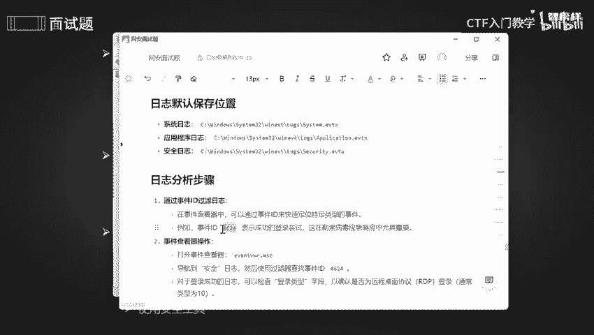

okK然后怎么去筛选呢？可以看到啊，这里有个筛选当前日志。点击这里，然后呢可以看到我复制是不是ID呀。ID4624呢，它代表就是说安全登录的一些日键，是不是？那我把它哎copy到上面，然后干什么呢？

点击确定，可以看到这些都是一个安全的啊，可以看到哎都是一个已成功登录账户这方面的哎，还有一些详细的一个内容啊，全部都在这里。OK包括一些登录一个类型啊，还有什么登录1个ID呀啊等等等等啊。

那些信息全部都是在这里啊，它的事件是不是1个4624啊？把它稍微哎搞过来一点，可以看到啊它一个任务级别，它的事件，它的来源，包括啊日期以及它的时间、关键词审核啊，这些都在啊。所以说啊只要他是审核成功的。

我都能够去查到的，是不是都能够通过咱们这个ID去查到。好。可以看到这些都是审核成功的。O。😊，啊，那么。来到第三阶段，如何呃在windows中去排查，对不对？我们怎么去排查呢？

首先呢是要去查看咱们这个服务是不是以及它所对应的端口。我们必须要看一下服务。呃，在我电脑上有哪些服务是已经开放的是吧？那怎么去查看呢？我们可以这样子。啊，比如说我想去查看。开放的一个端口啊。

就是用咱们这个net star。好，右键点击终端。哎，在这。

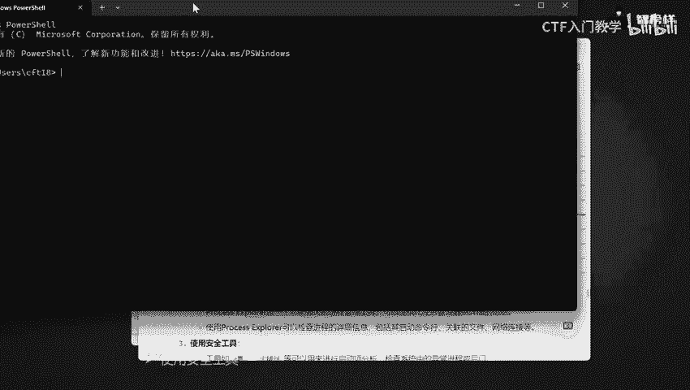

可以看到这里是没有管理员的一个状态哦。我点击是终端，是普通用户登录的。好，金色传说开启。可以看到他的一些协议呀，本地呀、地址啊、外部地址啊、状态呀，包括他的一个啊PID全部都展示出来了，是不是？

OK全部都是在这里。包括它一个协议是1个TCP协议呢，是一个安全连接呢，还是UDP呢？是一个啊无安全的不安全的，无连接的呢？全部都在这里啊，这个都是一个本地的1个IP啊。

本地的IP和1个外部的IP以及它的一个状态啊，这些都是它的一些状态。啊，这些都是关闭的，不用看他们啊，这些是一个等待一个状态。不用看他们。我们主要看的是什么呢？是这些啊，这些是什么呢？是一个活动中啊。

它正在运行啊正在运行这个。啊，这后面一串一串的一个字符呢，哎一串的数字呢。它是PID啊PID。OK了解这么多。那如果说我想去查看某一个某一个进程，哎，那我怎么去做呢？你看这么这么多，我怎么去筛选。

是不是？那简单就把这个copy下来。8。contrl sing一下。来到这里。count滴一下，然后。嗯，输入什么呢？哎，输入这个好吧。我随随便便。随随便便来一个，他离我最近。

OK可以看到它是不是将咱们这个PID是7368的这个东西全部都给你展示出来了，是不是？只有这两个进程啊，这个是一个什么呢？是进城的名称啊，进城的名称可以看到我是一个谷歌，对不对？这个是一个谷歌啊。

进城的名称O。

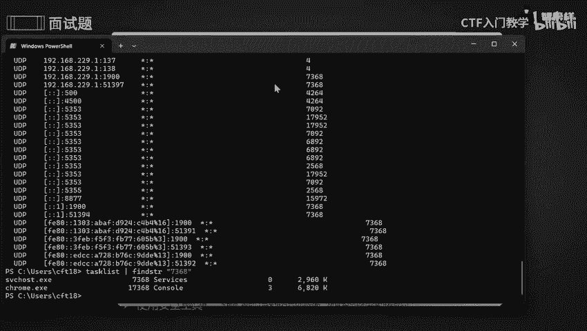

把它关掉啦。那我们还可以干什么呢？如果说你不喜欢小黑窗，你觉得小黑窗就特别特别的丑，是不是那我怎么去做呢？我可以使用啊使用咱们这个工具来去查看当前的一个进程。

因为这个工具呢是一个非常强大的一个进程管理器。它是和一个结合了一个文件监视器和一个注册表监视器这两个功能。所以呢它比任务管理器更加详细。比咱们这个小黑屋也更加详细，它是一个可视图啊。好。

他不他可以去查看进程一些详细情况。比如说启动项啊，关联的一些文件，网络一些连接等等CPU啊等等等等啊。那我们来看一下。嗯。找到了是这个可以看到我已经把它下载下来了。

以经是在我这里我的地盘上啊可以看到我任何去安装一些工具啊，都没有涉及到一个中文的，可以看到我的路径全部都是无中文的，最好啊为了防止出错，最好是没有中文的。好。好，有3个，我们点击是第一个。

它是一个主的啊，他是老大，我们点击老大一家之主就好啦。哎，可以看到跳出来了，是这个可以看到我一些进程啊，全部都出来了，这些全部都是1个CPU啊，包括一些字节啊啊，是不是这些全部都展示出来。

包括它是什么东西，他都给你说出来了，可以看到。哎，以及他所所属于一些公司，哎，computer啊。可以看到这么这么多，是不是还花里胡哨的哈。那我还可以干什么？我觉得这些东西还不是很多，是不是我想更花。

那怎么去做呢？哎，点击这个这个是什么呢？选择字段啊，选择字段你你们可以看到啊这个描述和它所在的一个公司名称是不是在我这里就可以显示了，那我还可以显示什么呢？比如说我想显示这个进程所在一个环境，对不对？

它一个环境，包括它一些版本，是不是包括它一个什么呢？啊，包的一个名字，哎，也把它展示出来，可以看到有这么多的这么多的，把它稍微。搞长一点。好，可以看到我刚刚刚添加的东西是不是来了呀？唉。

拒绝访问也出来了。是不是全部都出来了哎。所以它相对来说是比较的美观的啊。那这些是什么啊？给你们提个唉这些。哎，这些呢是一个树状图啊，它是以树状图去显示的，它是分为呃负的负进程和子进程啊。

OK刚刚点了一下这个东西，可以看到它是分为负进程和景次进程。你可以看到这里面啊。一个父亲对一个儿子是不是他比较的纯重虐待，单亲啊都香火是哎比较的嗯稀缺吧。嗯好。啊，其他的稍微多一丢丢啊多一丢丢。没事。

就这。你们怎么去下载吗？怎么去下载的话，可以。我点击微软，因为这个是微软所自带的。哎，点击微软，然后干什么呢？哎，来到咱们这语雀文档，将这个东西给copy下来。哎，来着你去查找一下。哎。

可以看到第一个就是微软公司啊，所以我们点击微软，点击它官网，我不管是去下了什么一个工具，我都是要去翻译吧，我都是要去啊官网上去下载。

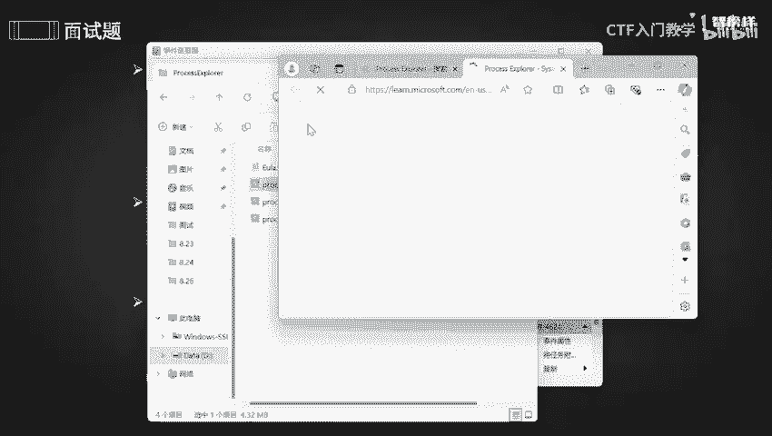

O。可以看到有这么多啊，这些看到啊，就是2024年，也就是说您是最新的一个版本，点击直接去下载就OK了。这里就有。然后如果说你觉得这个版本不行，我想去下载一个更加低的那就是这些版本啊，都可以去下载。啊。

下载之后直接解压，解压完之后就可以哎像我一样直接去运行一下就好了。O。😊，然后再来看啊，我们第三个呢也是可以使用安全工具的。比如说地段火龙键这些都是能够去啊来进行启动下的一些分析。

能够去检查系统中一些异常进程或者是后能啊。ok这个就不给大家演示啦。那本节课的一些流程啊，包括工具啊，我全部都整理到语圈文档上了。有需要同学的话可以在评论区留言或者私信我。啊，最后做个小小的总结。

本节课呢讲了一个日志所保存的一些位置。日志分析的一些步骤，包括怎么去排查这这方面的流程，怎么去使用咱们这个工具，对不对？好，那么本节课课程就到此为止啦，拜拜。

