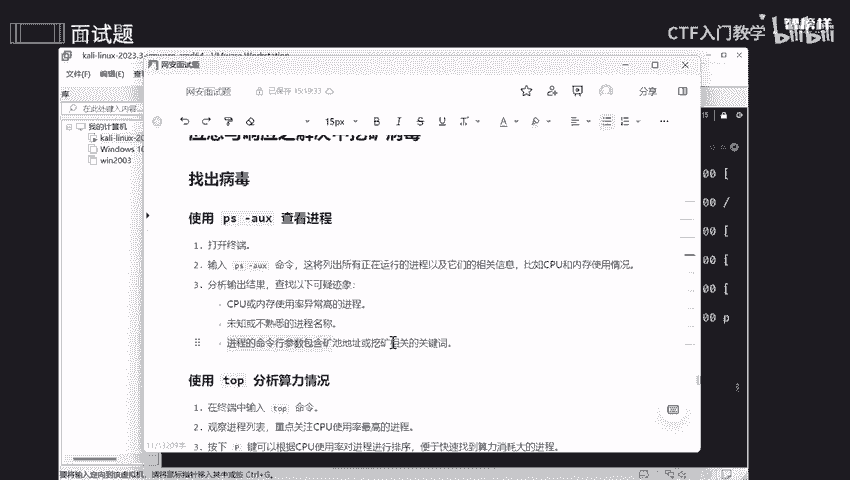
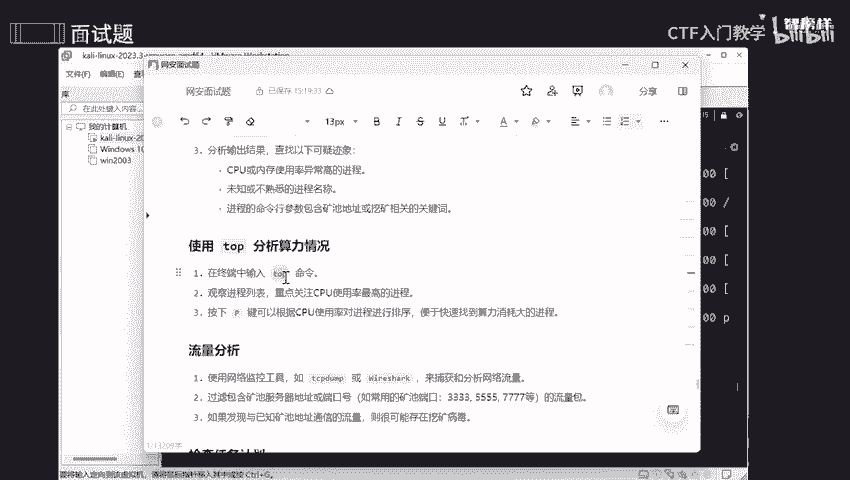

# 2024最新版网络安全秋招面试短期突击面试题【100道】我会出手带你一周上岸！（网络安全、渗透测试、web安全、安全运营、内网安全、等保测评、CTF等） - P22：面试题-应急与响应之解决中挖矿病毒 - CTF入门教学 - BV1bcsTeXEwR

本节课呢讲的是中了挖矿病毒，怎么去解决呢？我将这些解决的步骤呢全部都整理到语雀文档上了。需要的同学的话可以在评区留言或者私信我啊。好，那我们在讲之前呢，我们要确定一下什么叫挖矿病毒。

是不是挖矿病毒呢就相当于有一台打印机非常非常的神奇。它能自动打印出钞票。但是呢这台打印机工作的时候是需要大量的纸张呀，还有墨水，就相当于什么呢？计算机中的一个电力和计算能力。那有一天。

这个有人呢悄悄的将这台打印机搬到你家里，但是你不知道在你不知道的这个情况下，他开始工作了，这台打印机不断去打印出钞票，但是打印出来的钞票都被那个人去拿走了，而你干什么呢？你需要承担纸张和墨水，这个费用。

懂吗？就相当于他在家里拿你家的一个墨水，拿你家里的纸张，但是呢打印出了一个劳动成果是归那个人所有，是不是？O。😊，那我们怎么去做呢？首先啊我们要去找到病毒啊，哎找到病毒，并且移除它。

是不是这才是我们要做的东西。那我不让这个挖矿病毒隐藏，那不就好了吗？是不是？那既然如此的话，我们是不是要去找出好，那怎么去找出呢？首先呢我们可以使用啊使用PS去查看当前的一个进程。通过top。

我能够去分析当前的一个呃咱们这个内存啊，还有咱们这个哎CPU它一个占比情况好，最后要流量分析，最后呢就是检查一下有没有存在一些任务啊，任务计划，就是说有些呢它会偷偷的在你电脑上去执行一个任务。

那个任务呢可能是周期性用任务，也可能是一次性任务。但是在特定一个点到那个时间段的话，它就会发动啊，就会实执行咱们这个任务。OK那第一个呢，是不是说要去通过PC去查看咱们这个当前的进程。

以及它所占比的一个情况，是不是？好，那我们把它copy下来。啊，打开咱们这个终端啊，然后呢。Sa country， same country， V。好，点击查看。

这些呢全部都是正在使用这方面的一个进程啊。哎，我们直接拉到拉到最上面，可以看到它这里呢是显示进程的一个名称，对不对？包括它1个PID呀，包括它1个CPU啊，占比情况，以及咱们这个内存所占比的这个情况。

是不是？后面的话可以不看。那对我们现在没说来说没有什么太大的一个作用啊。我们主要看的是1个CPU和咱们这个内存。因为我们挖矿的话是需要大量的计算能力，是不是就相当于一个纸张和墨水，对不对？

那你想想我在挖矿这个途中呢，我这个CPU可能会很高，对不对？那就会导致什么呢？导致咱们这个计算机运行速度非常非常缓缓慢，以及不断去发咱们这个热量以及电费一个上升啊，这样子一个情况，O。😊。

所以呢哎通过它就能够去查呃啊查看是不是哎，查看咱们这个CPU和内存使用率比较高的一个进程，还有查看一些未知或者是不熟悉的。因为有些进程的话，不是不是你自己的啊，不是你自己去主动的而是被被动的。

就是说携带出来的对吧？所以我们要去看一下，有些进程可能不是你的，是别人所植入到你这个电脑上的。还有啊进程的一个命令行，有可能会包含啊咱们这个啊矿石地址和一个挖矿这方面的一个相关的关键词啊。

OK那么第二个呢就使用咱们这个top去分析算力情况。好，我们把这个topcountt C一下。

再来。哦。好，top一下，可以看到啊这些呢是一个动态这个画面啊是一个动态这个画面。它会根据什么呢？它会根据咱们这个CPU，包括咱们这内存所占比最高的来排序的。可以看到啊，最高的也就是它了啊。哎。

这是我自己的啊，这是我自己的。OK可以看到它是一个动态的啊，动态的，你你们可以看到咱们这个任务是不是有这么多个，总没有这么多个，一个在运行中，其他都是在休息中，有一个是在哎s了，已经停止了，是不是？

这个就相当于是什么呢？相当于啊我们真实主机哎，真实主机一个任务管理器啊，是一样的。可以看到这和任务管理器是一样的，它也是在不停的一个动态，不停的去变换，是不是？好。我们呢还可以根据P啊A。

P这样子去什么呢？去跟他进行一个排序啊，不同一个排序好吧。O。最后呢就是流量这方面的一个分析啊，我们可以使用一些网络控制工具。比如说啊TCP drop啊，这个东西能够去捕获和分析咱们这个网络哎。

网络流量好吧，那么还能够去干什么呢？我们可以去过滤矿池服务器地址和端口号啊。像矿石地址的话，基本上比较常见的就是什么呢？啊，咱们这个鱼池啊、蚂蚁池矿啊，还有什么冰矿池啊，以及火币矿池等等等等啊。

这些矿池。常用的一些端口呢，也就是这些333啊，4个34个54个7等等。还有个啊8333啊，这些的一个矿齿是比较常见的。OK如果说我们发现已知一些矿制地址的一些通信能量的话。

那么可能就会存在咱们这个病毒啊。OK第四步呢就是要检查啊检查咱们这个任务计划。之前和大家说过，任务计划是什么呢？就是我自自己所规定的一个计划，是不是？那你想想不是我所规定的。

他有人偷偷搞个用我的电脑自己去哎搞个周期的，或者说搞个一次性的那你想想我是不是哎是个冤大头，让他去跟着我的电脑使用我电脑的一些东西，然后去挖它自己一个东西是吧？挖矿哎收音又不是我的那我为什么要去做呢？

所以呢我们要去检查一下啊，检查的话，像这个就是一个周期性应用任务啊，周期性周期性任务。哎，来到。我中指一下下。一般来说呢哎。偷偷摸摸的更想是搞周期性的啊，可以看到这个就是一个周期性任务啊。

但是这是我自己去创建的，不是不是别人搞的鬼啊，不是那些嗨客啊。O。我们可以自己去查看这些目录也是可以查看的，或者我们还可以去查看一次性的任务啊。一次性任务是这个。ATQ啊这个AT呢是创建一次性任务。

那加后面加个Q呢，就是查看一次性任务，可以看到什么都没有，证明我没有一次性任务啊。好的。哎，把它关了。那我们如果说你查看出来，你知道你这个电脑上可能存在挖矿病毒，我发现了这个东西，我怎么去移除它呢？好。

那么移除的第一步呢，就是说我们可以去直接停止该进程。这个进程啊，不没有这么想象的这么复杂。有些同学呢可能觉得我把这个进程移除移除了，我就会得对我咱们这个电脑有很大的一个影响。不是的啊，一个进程呢。

就相当于我一个活动，我把这个活动给停止了，不会对我另一个活动产生一一定的影响。好吧，所以呢我们发现了这个病毒，我们就及时把它关闭啊，关闭掉。那怎么去关闭啊？kiki是什么意思呢？是杀死的意思。

是不是杀死他。然后邓九是什么意思呢？就是说我不管你同不同意，不管你有你有没有占用我的资源，反正我就要把你停止，对不对？不管你是在运行中呢，还是在等待中呢，还是说你已经停止了。我反正我执行这个任务。

就相当于哎该进程同不同意，都是我来说，好吧，比较强制性的杠九哎吧，再加一个进程名字，然后这样子就直接强制终止了。O那么第二步呢就是要找到病毒文件所在一个路径啊，哎，使用RM啊。

然后去删除咱们这个病毒程序。就是更加更进一步的哎将我的电脑摘除干净，把这个病毒摘除干净。好，第三步呢就是说我把这个进程哎阻止掉了，把它杀掉了，再把病毒这个所在的一个路径给去掉了。那我还要检查一下。

会不会再清理这个病毒上可能会留下什么样的痕迹呢？是不是包括一些启动一个脚本或者说配置文件我都要去检查一下啊，OK如果说我遇到什么呢？无法删除，对不对？有可能呢我们在这个文件删除这个文件的时候。

他说哎无法去删除。那我们要第一步要检查文件是否正在使用中或者是权限啊，权限不足，可能会导致这方面的一个问题。如果说是文件正在使用中的话，那我们把它结束不就好了吗？对不对？把它结束就好了，找到它结束它。

ok如果是权限不足的话，我们可以用sho do啊。sho do的话，就是说确保你在执行这个命令的时候有足够多的足够高的一个权限。好吧。啊，如果说你是一个windows的话。

我们就是以管理员的这个身份去命啊去运行。好吧，运行的话就是哎这个用这个终端管理员去运行，好吧。如果说你还是解决不了，那怎么办呢？只能够直接去赚降权了，降低咱们这个权限。

是不是我们使用了咱们这个CH mode，然后杠X是什么呢？哎，更XX是可执行这个权限，是不是我让他的一个什么读和写？哎，都没有这个权限，我只让他有执行的权限，是不是？然后后面我就能够直接去删除他了啊。

OK反正我将这些的一个步骤呢全部都整理到语圈文档上了。如果说你遇到这些问题的话，可以按照语雀文档的一个步骤来进行一一去对比，一一去使用，好吧。那如果需要同学的话，可以在评区留言或者私信我啊。

那本节课课程就到此为止啦，拜拜哦。