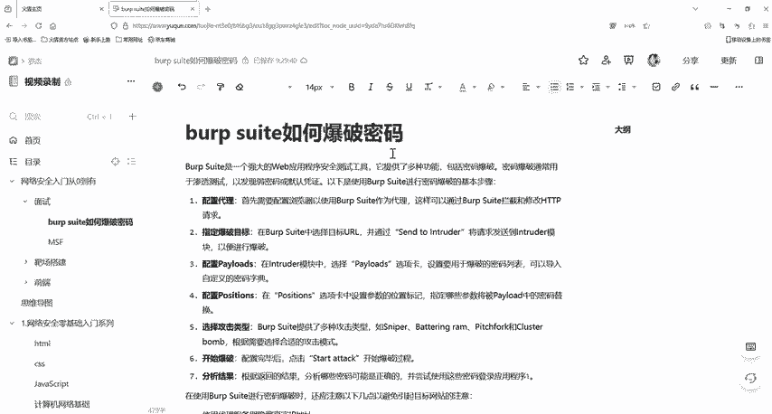

# 2024最新版网络安全秋招面试短期突击面试题【100道】我会出手带你一周上岸！（网络安全、渗透测试、web安全、安全运营、内网安全、等保测评、CTF等） - P24：burpsuite如何爆破密码 - CTF入门教学 - BV1bcsTeXEwR

hello，大家好，我是嘎嘎老师。那么今天我们就来看一下这道面试题。URP suit工具它是如何爆破密码的。8呢其实非常的简单。相信很多朋友都已经使用过这个工具。那他的这一个工作原理是怎么样的呢。

我们就简单的来了解一下BP啊，它其实是一款就是功能非常强大的渗透测试工具，提供了很多功能来帮助安全研究人员和一些黑客。对我们web应用程序的。方面去进行一些测试，看一下它的安全性。那么我们需要BRP。

我们这个BP啊去做一个抓包，它是一个插件。这个插件都已经放到评论区了，有需要的小伙伴评论私信我就可以了。那么它的工作原理其实是在原始的网络数据包当中利用不同的变量值对请求参数进行一个替换。

那么这个不同的变量值，其实也就是我们所说的那个字典去爆破的字典。通过字典里面的值对这样的一个请求参数去进行一个替换。一替换，然后模拟请求获取不同的响应结果，以此来到达一个爆破的目的。

这个就是他一整个的一个工作流过程。那么我们平常会遇到就是各种各样的一个阻碍。像我们这个验证，它是也比较常见的。那么前端验证其实也就是把验证码放在了GS当中，不会经过后台的验证，只是在前端进行一个验证。

GS它不会经过后台验证。那么只在前面进行前端进行一个校验，所以它是非常好绕过的。因为它存放在前端的1个GS代码当中，我们可以通过右键查看源代码，可能能够直接看看得到。那么我们BP他去做这个原理。

其实也就是将验证码放在前端。但这个验证码它是通过浏览器渲染出来的BP它就是运行在我们浏览器和目标服务器之间的代理。所以你一一旦你的BP抓到了一个这样的包，那么它就可以绕过这个浏览器，直接发送请求给后台。

给服务端，所以可以直接绕过验证码，将我们账号密码发送给后台进行一个验证。那么后台这时候呢，他就不会再去进行这一个验证码的一个校验了。因为他的验证码校验是在前端。所以你通过BP发包之后呢，它就会经过后台。

那么后台它就不需要再去校验这个验证码了，所以就可以实现这个前端的一个绕过。那么还有一个东西就是后端验证码，后端验证码其实跟前端它就相反了，后端验证码，它就是将用户输入的验证码拿到。拿来到后台做一个校验。

那么如果确认一下它是正确的，就允许你发包。那么不正确的话，那么就提示你验证码错误。它这个实现的过程其实就是向后后端的代码中写入一个生成的这个验证码的代码。那么后端验证码它是在后端的，所以呢它需要一定。

复发条件才能进行一个更新验证码刷新存放到另一个文件当中，它的一个生成验证码的文件，你需要加载到这里，它才能够进行一个刷新。像我们平常它可能就是点击登录，你等点击登录之后呢，它这个验证码就进行了一次刷新。

或者你点一下这个刷新验证码，它就进行了一次刷新，才能够执行验证码刷新的一个操作。那么BP抓包之后呢，对网站登录的请求数据包进行抓取，从而只执行登录页面的数据包，并不会去点击登录按钮。抓包之后呢。

不需要再点击登录按钮，它就不会去触发这个验证码的刷新，于是一直运用到一个正确的验证码进行，所以它就能进行一个爆破了。我们的1个BP你在抓包之后呢，你的拦截开关是不能够关闭的。

一旦你把这个拦截开关给关闭了的话，那么你这个抓取的数据包它放掉之后呢，这个验证这个页面的验证码它就会进行一个刷新。你去爆破这个验证码，它就不正确了。所以这个也是要注意的一个地方。好。

那么我们还有一个就是前端的talking验证。这个什么是talking呢？talking其实是一个我们身份验证机制，也就相当于呃我们去看电影，就那个你有电影票，然后是才能进场的那种凭据。

ookie它是用户通过用户名和密码发送请求程序进行一个验证。它这个程序呢会返回一个签名的tken给我们客户端，也就是给浏览器。那么客户端呢，它就会存取这样的一个talking。用于每一次发送请求。

那你在发送请求的时候呢，服务端它就会验证这个。如果正确的话，他就会给你返回数据。不正确的话，他这个请求就有问题。也就是我们前面所说的，你要去看电影。那你如果没有电影票的话，或者是你电影票的时间。

然后他的一个电影播放的这个次序它是不对的话，那么那个工作人员也是不准你入场的，对不对？如果你正确的话，他才能让你入场，然后你做到一个正确的位置。所以我们token正确的话，它就会给你返回数据。

不正确的话，你这个请求就是有问题的。所以每一次请求都是要带上我们这个token的。那么这样的话我们去抓包，你不可能说每一次你抓包自己都去那这个是没有意义的了。呃。

所以我们可以通过BP里面的也是可以实现token验证码的。这个token验证呢，它是放在前端的，所以可以运用正则表达式对token数据进行一个抓取。然后我们的爆破线程设置为一，把这个爆破线程设置为一呢。

这个BP它就会帮我们进行一个刷新。然后再去抓取这个token抓到token之后呢，他会进行一个进行一个验证。这样就可以。去爆破了。所以呢你就要注意的是披漏的类型，这个要选择正则正则那个表达式那个。

然后爆破线程必须设为一，这样才能去实现绕过它的一个token，它会自动帮我们抓取这样的一个token。那么这就是我们这道面试题给大家讲的一些内容。

我们需要用的资料都已经给大家准备好了，大家在评论区私信我就可以了。那么我们下一节课再见。

