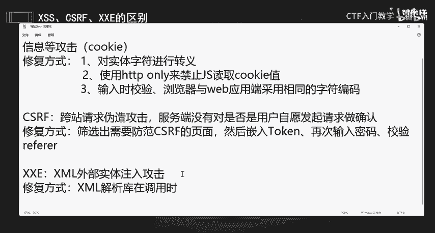
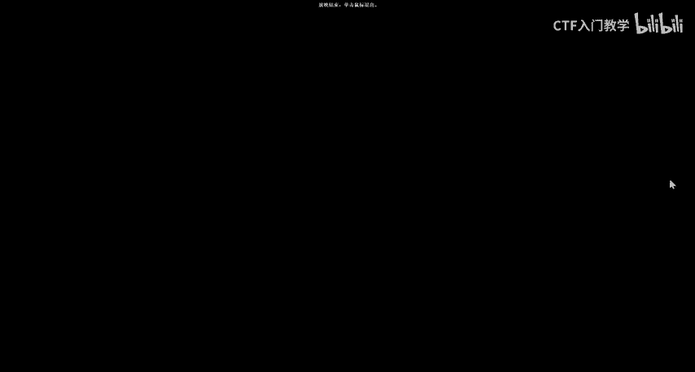

# 2024最新版网络安全秋招面试短期突击面试题【100道】我会出手带你一周上岸！（网络安全、渗透测试、web安全、安全运营、内网安全、等保测评、CTF等） - P25：CSRF、XXE和XSS的区别 - CTF入门教学 - BV1bcsTeXEwR

hello，大家好，我是嘎嘎老师。今天给大家带来的面试题呢是我们这个CSRF和叉叉E和叉SS它的一个区别。以及它的一个修复方式是什么？那么这分别是三个漏洞，对不对？首先呢我们来看一下叉SS它是什么啊。

它SS呢它的一个全称啊，它叫做什么画匠脚本攻击，对不对？嗯。它是我们一个用户在提交数据的时候，可以构造代码来进行一个执行，从而可以实现窃取用户信息等等。Yeah。那这样的一些攻击是什么呢？

致用户他提交的数据中可以构造恶意代码并执行。用户啊，他去他提交的数据对不对？可以。构造。恶意的。Yeah。并且呢他构造二代码后呢，他并且可以去执行。从而呢。从而得到一个实现什么样的一个结果。从而实现。

窃取。用户。信息呃。的一个攻击一个结果，对不对？好，我们这里自动换好啊。获取用户什么信息呢？像获取我们的一个cookie呀，对不对？这个cookie啊cookie就是由我们这个叉SS它获取的。

那么它的一个修复方式。有什么呢？他的一个修复方式啊。他的一个修复方式首先第一个当然是我们的对。实体字符啊。进行一个转移，对不对？因为它有一些实体字符，我们进行一些转移的话。

就可以防止我们这个接我们这个叉SS对我们服务器进行一个攻击。Yeah。You。好，那么除了这一个还有什么方法呢？第二个我们其实是可以使用什么？像我们使用一些。HTTPon对不对？Yeah。去干嘛来禁止。

禁止谁JS。读取cookie值。因为我们这个叉SS，它最主要的就是去拿这一个cookie，对不对？好。那么第三个啊。第三个题是什么？Yeah。Yeah。第三个，我们可以输入时呢。

然后可以进行一个什么校验，对不对？浏览器。与。我们的web。并用。端。采用。相同的一个字符。点马。这个呢是我们一个叉SS，其实也就是去防止恶意通过我们的这个提交数据去去构去构造恶意的代码，并且执行。

对不对？以防它窃取我们用户的一些信息啊？那么什么是我们的这个CSIF呢？CSRF它叫做什么？它叫做华站。请求伪造。7。公子。那么我们的这个叉SS是实现CSRF诸多手段中的一种。

可以利用叉SS实现我们这个CSRF的一个攻击。那么它是由于啊。它是由于在关键操作执行的时候，服务端没有对这个是否是用户发起的，自愿发起的做一个确定啊，所以它叫做跨站请求伪造啊。

服务端没有对是否是用户发起的请求做一个确认。所以这个叫做画站请求伪造攻击啊。那它的一个修复方式啊是什么呢？Time。好，它的一个收入方式啊是干嘛筛选。H。筛选出。需要。防范。CsRF的。页面。然后呢。

Okay。嵌入。😔，我们的talking。嗯。Yeah。在。似乎。我密码。校验。校验什么我们的一个referring，就它的一个来源，对不对？嗯。OK那么这个就是我们的1个CSRF的一个修复方式啊。好。

那么什么是我们的这个叉叉E呢？叉叉E它的一个它叫做什么？它是叉ML。外普。实体。输入对不对？步入攻击。那么叉叉E呢，它可以。就是从插妙中通过啊从插庙中通过一些调用实体来请求本地或者是远程的一个内容。

那么它这个就像我们的一个远程文件保护，类似会引发相关的一些安全问题，像我们的一些什么敏感文件读取，是吧？还有一些问题。那么它的一个修复方式是什么呢？嗯。好，它的一个修复方式啊是我们这个叉妙。

因为它是借助我们叉妙，对不对？叉缪解析。F。在干嘛的时候。在调用。调用时啊，我们就需要严谨一下了。

严格禁止。对外部实体的解析。那么这一个面试题啊，大家可以记一下啊，那如何去理解它呢？那么我们就需要记住它的一个它叫做什么啊，这些比如说人家说叉SS啊，或者CSRF啊叉叉E啊，你就都要知道都要知道啊。

它的一个全称叫做什么啊。那么简单的来说啊，CSRF我们这个叉SS和叉叉E啊。首先啊叉SS就像是你在网页上。就像别人啊在你的网页上放了病毒病毒代码害别人的。那么我们CSRF啊，它就是偷偷利用你的登录状态。

偷偷利用你的登录状态去做一些坏事。那么叉叉E呢，它就是通过你的网页去偷看别人的文件。那么我们叉SSCSIF和叉叉E的一个区别就给大家分享到这里啊。

我们面试题的一些资料都已经给大家准备好了，有需要的小伙伴在评论区私信我就可以了，我们下一节课再见。