# 2024最新版网络安全秋招面试短期突击面试题【100道】我会出手带你一周上岸！（网络安全、渗透测试、web安全、安全运营、内网安全、等保测评、CTF等） - P26：GET和POST方式的区别 - CTF入门教学 - BV1bcsTeXEwR

hello，大家好，我是嘎嘎老师。本节课给大家分享的一个面试题呢，是我们这一个get和post的方式啊，它有什么区别。那么这一个呢是我们经常会碰会遇到的一个面试题啊。也就是我们gatet。

和host这两个数据提交的方式啊有什么区别？Yeah。那么最基础的就是第一个。大家应该都知道，我们get请求它是放在。URL上的对对。他讲他是会把我们的请求数据放在URL上。然后乙。Yeah。

以我们这个问号分割URL。和传输的数据。那么它的一个参数啊。参数之间呢。是以。and符号。也就是我们这个麻花相连。所以呢。所以啊我们get它去进行一个数据传输，它安不安全，不太安全。因为它是光明正大的。

直接在URL上直接传输，对不对？它get它是。嗯。它是把请求的数据放在URL上，以我们这个问号啊分割URL和传输的数据参数之间呢是以end符号相连。所以啊get传输数据它是不太安全的啊。get方式。

Yeah。不太安全。来，我们一起来看一下啊。好，我们这里啊有一个靶场，是我们这一个。

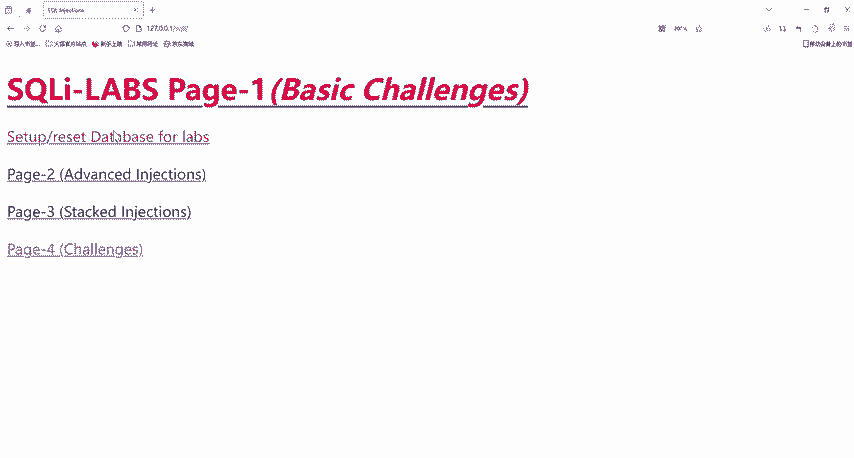

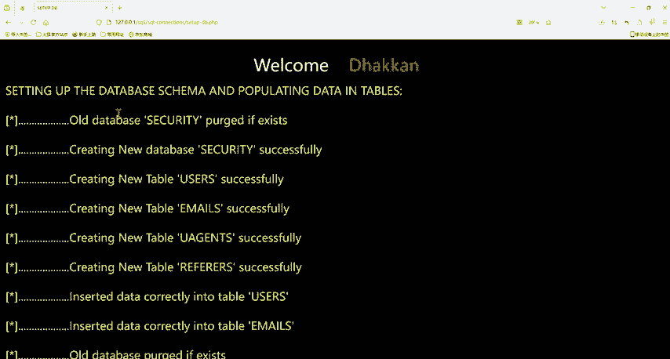

。哦，点错了啊，是我们这个soI这个靶场啊。好，来，我们来到第一关啊。我们来看一下get方式传输数据是怎么样的。你看请用ID啊去做一些它这个ID是它的一个参数，对不对？

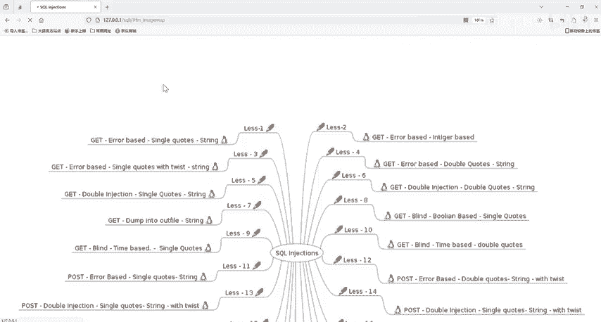

好，你看我ID等于一后，它这里啊就有的他登录的名字和你使用的一个密码，对不对？然后你看这个就是我们get方式传输数据啊，它是以问号去进行一个传输啊。以问号分割我们的URL，这个是这一坨啊。

这一坨是URL后面的就是数据，它这个键值啊。那么如果你还有更多的数据的话，它就是以end符号进行一个相连。所以你看我们get方式就直接在我们URL上。我们直接用户都能看到，对不对？所以他就不太安全。

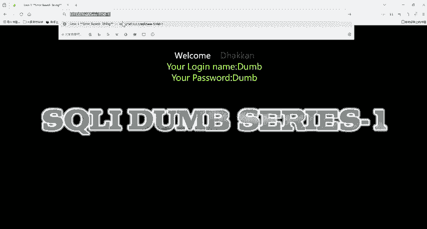

那么相反的啊，我们post啊。Hot。他是以什么方式传输数据啊？它就不是把数据请求的数据放在URL上，而是它会把数据。放在HHTTP数据包中。Yeah。数据。哦。里面啊。

他会把我们的数据放在HTP数据包里面进行一个传输，也就是我们的一个request requestquest。fing里面好，我们也可以一起来看一下啊。来刚刚看到我们的那一个靶场。

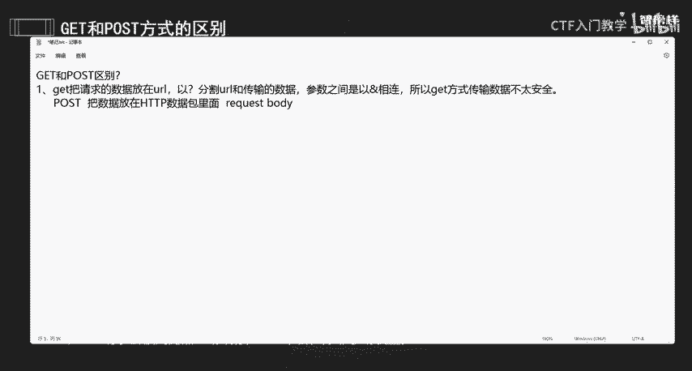

然后我们就。可以看到我们这里有一个post啊。postst，你看。postt提交方式一般是以表单啊和表单结合啊，一般都是以posts方式提交啊。好，你看我这里输入一个嘎嘎，然后随便输入一个密码。

然后回车。好回之后，它一直在转，对不对？但是你看他的URL上有我们的这些数据吗？没有，对不对？好，那么我们现在来进行一个抓包啊。OK一起来看一下啊，就比如说我们这一个刚刚用的就是这个post，对不对？

好，post，然后我们啊。

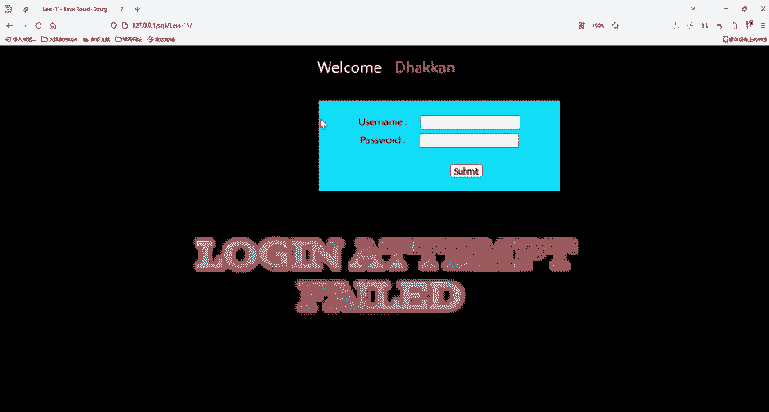

打开我们这个BP啊BP这个软件，然后啊我们把这一个开起来，这里啊我们也要开我们这个代理浏览器代理开起来后我们嘎嘎，然后输入一下我们这个密码。

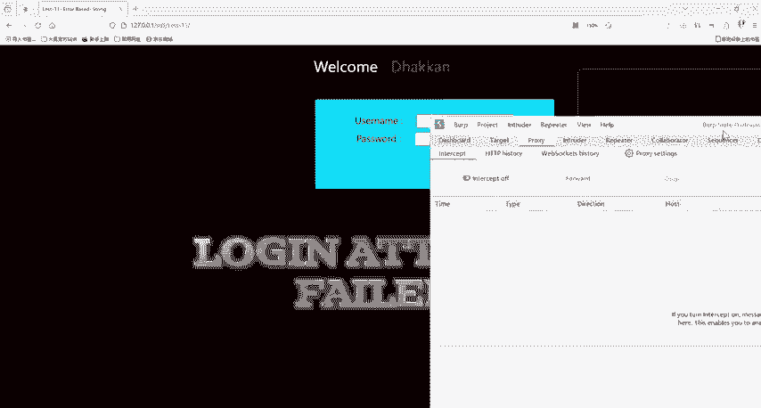

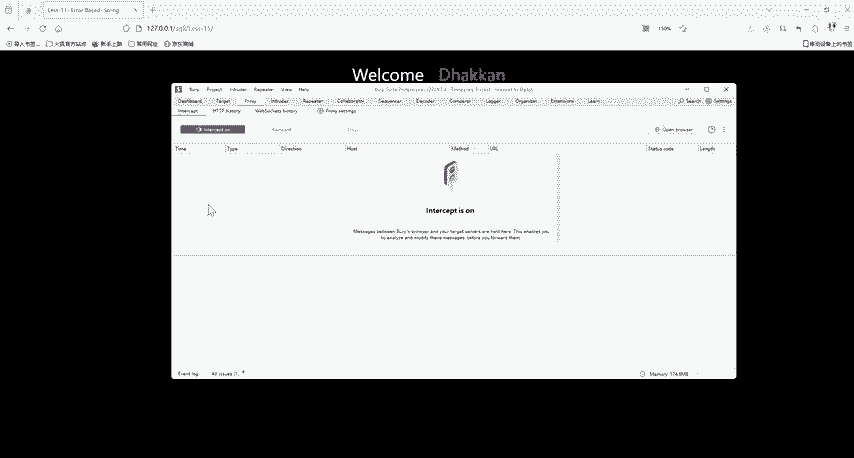

好，然后我们点击提交。好，点击提交后呢，我们再来看。

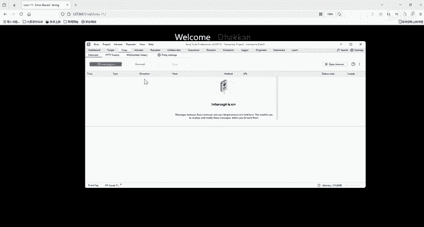

咦，我刚刚把这个关了吗？好，我们开啊，先开开开起来啊。好，开起来后啊，我们这里是开的一个状态啊，也就去截流啊。然后我们嘎嘎输入嘎嘎，然后这里啊我们也输入一个密码，然后我们点击回车。

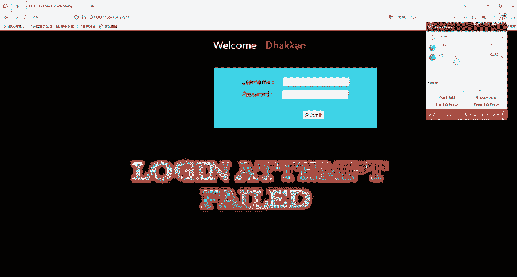

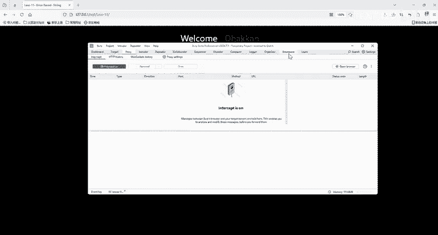

好，点击回之后，我们这里就抓到了一个包啊。来，我们来看一下这个包来。

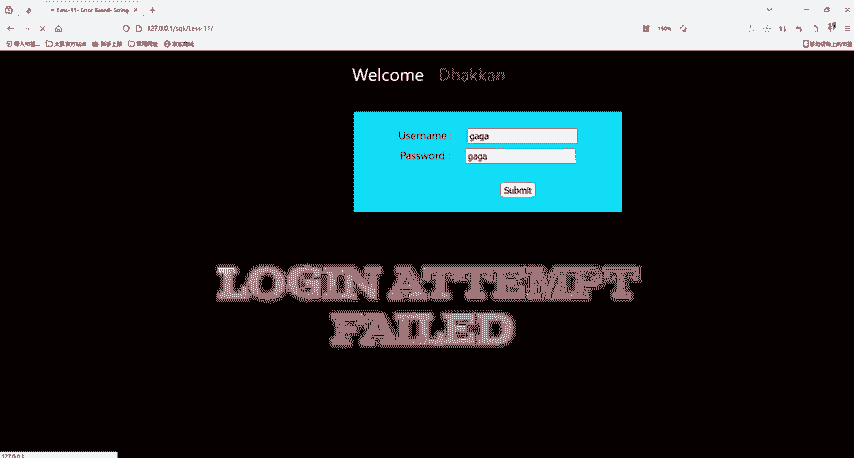

它的一个数据提交的一个方式啊，是我们pos的方式。然后你看它的一个数据在哪里啊？这个就是我们这个数据啊，它是在我们请求主体里面啊，你看它的you name嘎嘎，然后pass word嘎嘎。

然后还有一个键，对不对？你看也是以每一个值啊都是以我们and符号拼接的啊，连接起来。所以啊它是不会在我们URL上进行一个显示的啊，那它就相对于来说posts方式啊，提交数据，相对于说安全一点。

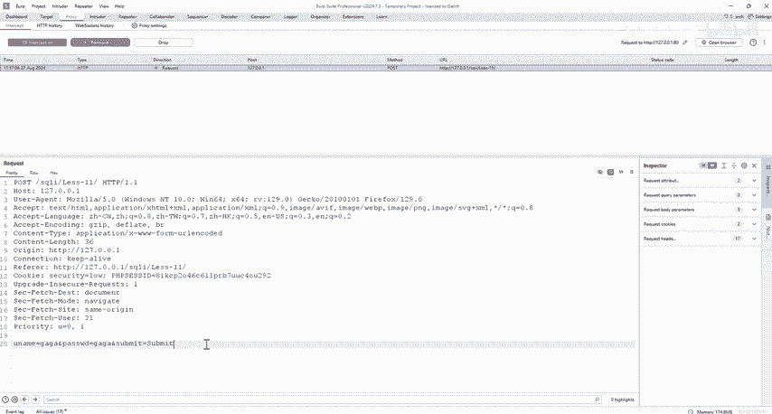

那么这两个东西是我们最主要的一个区别，大家也是最可能知道的一个区别。那么除了这一个之外呢，它还有哪些区别呢？就比如说啊第二点。我们get啊。他是。去获取是获取数据的。那么我们这个post呢。

它其实是是修改数据的。Yeah。一般情况下是这样子的啊。好，那么第三点啊，第三个区别呢就是我们get啊，它提交的数据，他们俩提交的数据大小也不一样啊。提交的数据最大。是2K。那么这个是有一个前提啊。

实际是取决于啊实际的限制。徐姐宇。浏览器啊。那么各个浏览器它的不同呢，它实际我们get实际上它传输的提到的数据的大小也是可能不一样的。那么我们post它实际上。host呢它理论上。是没有限制的。

它的大小啊数提交数据的大小是没有限制的。Yeah。好，那么第四点啊第四点也就是gatet。第四点就比较底层了，bet它会产生。一个数据包。嗯。一个什么数据包呢？一个TCP数据包啊。浏览器呢。会把。

HTTP。黑的。和data。一并发出。那么服务器呢它会响应啊200。200也就是会去返回啊，返回数据。而post啊post它就不一样了。他会。产生。两个。TCP数据报。Yeah。那么浏览器啊。

浏览器先会发出。发送我们这个黑的。服务器响应。100也就是continue啊，继续服务器就是继续啊。那么浏览器。再发。再去发。发送我们的这个data。然后服务器再响应200。也就是返回数据。

这个是他们俩的一个不太大家可能不太知道的一个区别啊。那么我们第五点啊，最后一个。也就是gatet。请求啊，他会。会被浏览器。主动。缓存。但是呢。我们的post。他不会。除非什么呢？除非手动设置啊。对。

好，我们可以来看一下啊，这个方式啊，它是会主动浏览器会被主动缓存，这个什么意思啊？还是来到我们这一个刚刚。

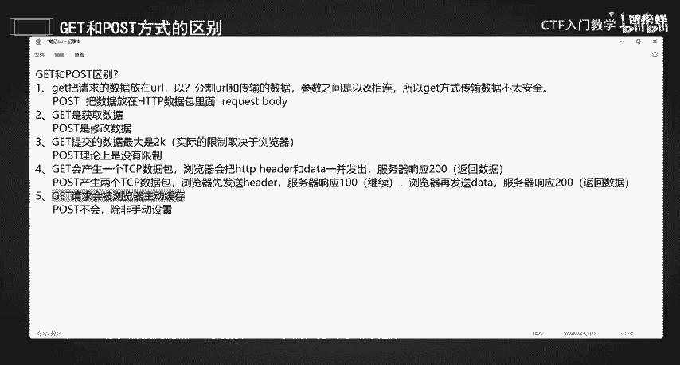

的那一个靶场。好，我们之前用这个我们这个靶场，然后第一关这个是get方式，对不对？第一关的时候，我们看我们打一个问号，你看打一个问号，它后面就直接给我们出了我们第一次输入的ID等于一这一个，对不对？

那么我们gatet请求啊，它是会被浏览器主动缓存的啊，这个就是他们第五点的一个区别。那么我们今天这个面试题啊，get和post请求啊，提交方式它有什么区别，就给大家介绍到这里啊。

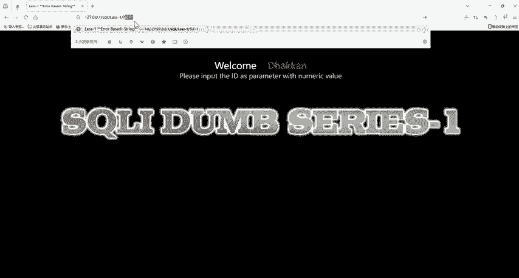

我们给大家准备的所有的一个面试题的资料都已经给大家准备好了。有需要的小伙伴评论区私信我就可以了，我们下一节课再见。

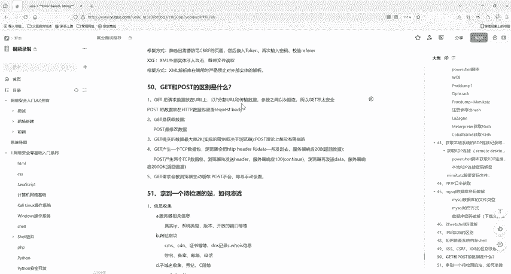