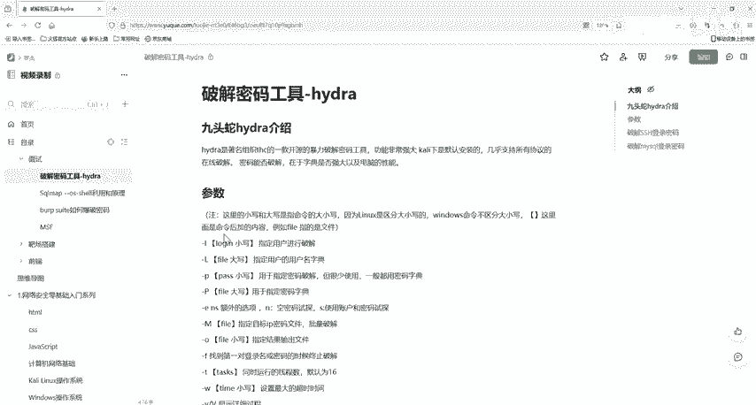
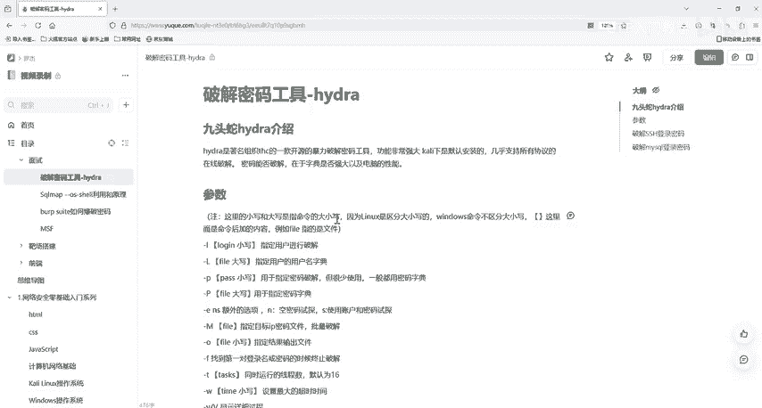
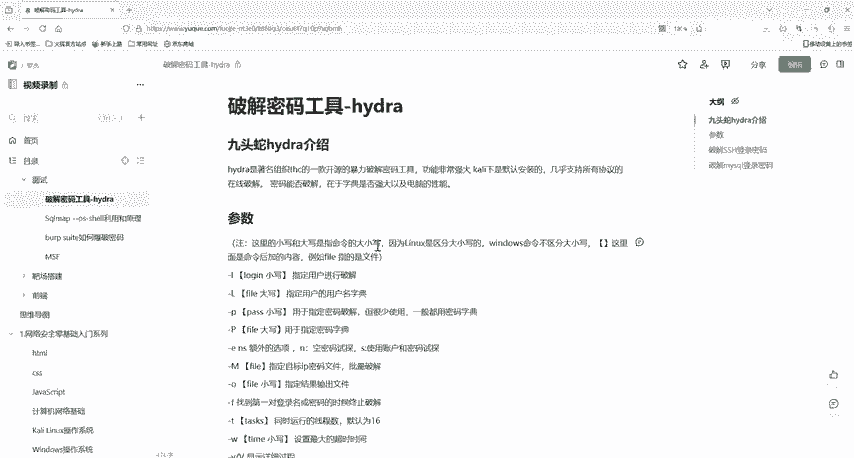

# 2024最新版网络安全秋招面试短期突击面试题【100道】我会出手带你一周上岸！（网络安全、渗透测试、web安全、安全运营、内网安全、等保测评、CTF等） - P27：1密码爆破工具-hydra介绍 - CTF入门教学 - BV1bcsTeXEwR

hello，大家好，我是嘎嘎老师。那么今天呢我将带着大家进入一个神秘而强大的领域密码破解。在这里呢我们将一起探究一个名为hra的一个开源工具，它被誉为是密码爆破的瑞士军刀。那么想象一下，你是一位。

经验丰富的侦探，面对一扇扇上了锁的门，你的任务是找出隐秘在背后的真相。那么hja正如你手中的万能钥匙，能够帮助我们解锁那些看似兼不可过的防御。那么本节课呢，我们就。深入了解一下它的一个起源。

它所支持的多种协议，以及利用它来进行一个有效的密码破解。我们本次会进行一个SSH和一个my circler的一个密码破解。那么无论你是网络安全的新手，还是去追求提高技能的资深人士。

我相信你在今天呢我们都可以获得宝贵的知识和启发。OK那么hija这一个工具，它有个中文名叫做九头蛇。它是一款由著名的黑客组织啊，这个THC开发的一款开源的密码破解工具，它的功能非常的强大。

可以支持多种协议的在线破解，像那些SSH呀、FTP啊，还有我们的HTP啊等等等等。它特别适合在智能测试中对网络服务进行密码猜测，因为它支持多种认证方式，并且可以进行去处理多个登录尝试。

从而加快破解的一个速度啊。那么我们需要哪些环境呢？其实我们是嗯哈里里面是自带了这一个。工具。所以呢我们是需要一个虚拟机，然后去安装卡里系统。然后我们直接在卡里上去。使用就行了。我们直接开箱使用。那么。

我们的这两个软件都已经放到评论区了，有需要的小伙伴评论私信我就可以了。OK既然它的这个工具是一个密码破解的一个工具，它的功能非常强大，那么我们就来看一下这个工具它是如何去使用的。

首先呢我们来看一下它的一个参数啊，来这里我们有啊。来，这里要注意啊，这里的大写和小写是命令。的大小写。因为linux它是区分大小写的，但是windows下的命令它是不区分大小写的。好的。

那么我们首先我们就来看一下啊。首先看一下这几个参数。第一个我们是杠小L。杠小L的话，这个L是指定用户进行破解。也就是你这个L是你特定的那一个用户名。好，我们再来看一下杠大L。

杠大L是指定用户的用户名字点。好，那么杠小L后面呢就要你加一个特定的用户名了。比如说我我的一个你要破解的某一个把机，它是一个od me的一个用户名，所以你就填我的 me就行了。这是一个特定的啊。

然后杠大L。杠大L这个是要有一个用户名字典，后面加的是用户名字典，字典是什么？好，字典不是我们平时就是查单词呀，或者查我们词语的那个厚厚的那一些。本子而我们这里的字典啊，它是一个特殊的一个文件。

里面装满了。这个里面装满了厚厚的密码组合。那么这个这个字典呢，这个文件可能就像是一堆钥匙一样，然后用来尝试打开被锁上的门。一般呢我们这个字典文件它是包括了很多行，那么每一行都是一个密码。

那么这些密码可能是一些简单的数字呀，12345或者一些单词呀，常常见的这些短语啊，都是有可能的，也有可能就是特定的一个情况，它会生成特定的一些复杂的密码。

OK那么我们再去使用其实使用这个字典或是使用我们这个爆破工具的时候，大家都要是合法授权的那如果是没有得到允许随便破解别人的密码，这个是违法的，也是违反了道德法规的。所以我们不能乱来啊。

所以啊我们这一个字典，用户名字典也就是一个文件里面放了很多的一个密码。好，那么除了杠杠L。还有啊我们的杠P啊，杠P后面加的就是密码了。如果是小P的话，这个是特定的一个密码。那么如果是大P的话。

就是一个密码的一个字典。好，如果是杠大批啊，这个是我们的一个。指定密码字典。这个是指定的一个用户名字点啊。好。那么我们还有一个参数是杠1，然后NS啊，这个是额外的一个选项。那么这个N是什么意思呢？

N是一个空密码去试探，然后S是使用用户名，就是账号和密码一起去试探OK那么我们了解了这些参数，我们来看一下后面的一些参数啊。好，来上M。我们这一个杠大M，这个是什么呢？这个是目标ID的密码文件啊。

目标IP的密码文件。他是批量去破解的啊。然后我们还有个杠。哦笑哦啊小息的哦。这个后面啊我们加的是一个文件啊，是指定。结果输出到哪个文件中。指定结果输出文件。好，然后我们还有杠小F。

这个是找到第一对的用户名或密码，就终止破解了。就是你那个密码或者是我们的用户名字点，他只要hija找到了一个对的用户名和密码，它就终止破解了，他就不再进行一个破解了，就停止了。OK然后我们的杠T啊。

T这个是线，这个是线程数。如果你不设置的话，它默认默认就是16的一个线程。OK然后我们的杠W小W，这个是设置最大的超时时间。因为有时候它字典太大了，你就可能会很长的一大一个时间。

然后你就去设置一个最大的一个超时时间。好，然后我们这个杠V啊或者大V都是一样的，这个是显示它的一个详细过程，它就是把它拍转破解的一个整一个整个过程，就给你显示在我们的终端上。好，我们还有个啊。

杠RR杠达是恢复破解，就如果破解中断了的话，就执行执行一下哈 drive杠R。然后我们的一个有一个文件啊是。这是这一个啊有一个文件。好。是pa下面的to。下面的hja。Yeah。嗯。

liststore这一个文件啊，你去执行它的话，杠R，然后执行它的话就可以继续我们的任务了。然后杠小X啊，这个是自定义的一个密码。OK那么其实hija除了这些参数，它还有更多的一些参数。

那么大家都可以自己在carly上或者去下载一个我们的haja，然后在windows上自己去操作一下。那么更多的参数我们都已经放到评论区了，有需要的小伙伴评论私信我就可以了。

好，那么我们下一节课就给大家去介绍我们hija，它如何去包括我们SSH的一个登录的密码。Yeah。下一节课我们就进行一个实操了。

好的，那么我们下一节课再见。

