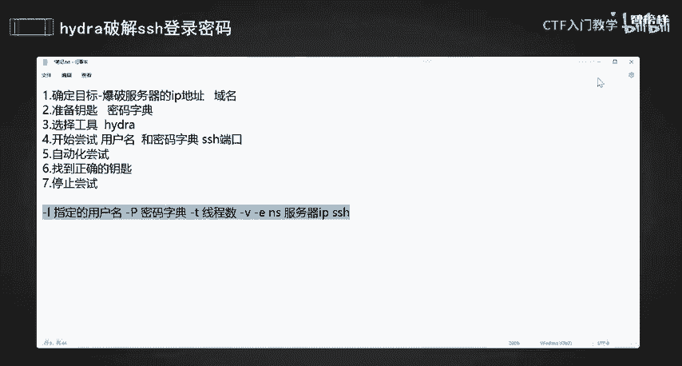
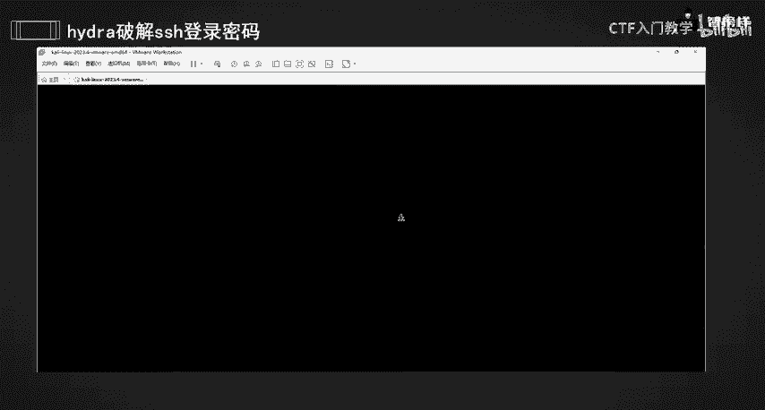
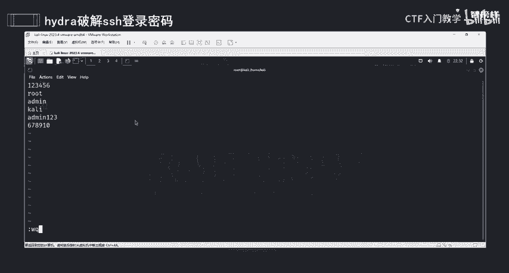
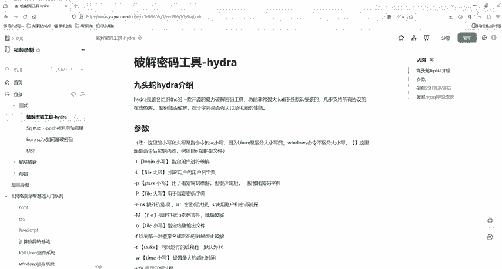

# 2024最新版网络安全秋招面试短期突击面试题【100道】我会出手带你一周上岸！（网络安全、渗透测试、web安全、安全运营、内网安全、等保测评、CTF等） - P28：2hydra爆破ssh用户名密码 - CTF入门教学 - BV1bcsTeXEwR

hello，大家好，我是嘎嘎老师。那么今天呢我们就用hja工具啊，密码爆破工具去爆破SSH登录密码。那么其实啊我们去用这个工具去爆破SSH这一个登录密码，它就像去用一堆钥匙去试锁。

直到找到能够开锁的那一把钥匙。首先第一步呢，其实也就是我们要去确定。一个目标。因为你是拿一堆钥匙去开一把锁，对不对？那你的目标是什么呢？也就是我们要知道锁的位置在哪，也就是SSH服务。我们要。

我们要知道他这个爆破。爆破我们服务器的1个IP。IP地址，也就是他的或者他的域名也是可以的。这个呢我们要准备钥匙。好，准备钥匙也就是我们得要有密码，对不对？得要有密码去尝试去开才可以。

所以我们可能要有一个或者是多个可能的密码列表，也就是我们所谓的密码字典。好，那么这个密码列表里面呢，可能是常见的一些密码，也可能是根据我们这个目标用户使用的密码习惯生成的密码。好，那么第三步呢。

我们就需要选择工具了啊，选择工具。那么我们这里当然是选择我们功能非常强大的hdja这一个。他就像是我们的手，他去帮助我们去试每一个密码。那么第四步啊就是开始开始去尝试了。

尝试我就去告诉hija用哪一个用户名。和密码字典。去依次的去尝试哪一个。SSH的一个端口。嗯。这样的话就像是我站在锁面前，然后拿了一大一大串的钥匙，然后开始每一个每一个的去试，一个接着一个的去试。

因为我们这个hd它是一个自动化的尝试啊。当他尝试的密码正确的时候，他就会停下来告诉你啊，就像你终于找到的能开锁的那一把钥匙。所以我们最后。最后我们就是停止尝试啊。自动化搞完后，我们就是找到了。

找到正确的。好，然后找到了后，我们是不是就是停止了，对不对？停止尝试吧。停止尝试是为了节省我们的时间和资源，对不对？OK那么我们现在就来做一下这一个操作啊，我们需要虚拟机。

然后虚拟机上面需要安装咖里系统。那么如果有小伙伴没有这些软件的话，那我已经这些软件放到评论区了，有需要的小伙伴评论私信我就可以了。好，还记得我们需要用哪一些参数去做这些的动作吗？

首先我们是不是要知道这一个我们的一个密码字典，对不对？还要知道他的用户名，对不对？用户名，如果你知道了一个指定的话，你是不是就可以用大小L，然后一个指定的指定的一个用户名，对不对？好，用户名知道后。

我们是不是要知道密码密码，如果你知道特定的话，他还需要去这种依次去尝试吗？你就只有一把锁，是不是就直接开就行了，就不需要去爆破了，对不对？所以当然我们用的是一个密码的一个字典，对不对？好。

OK那么知道密码字典密码字典，这是一个什么文件，所以你需要有放一个文件啊，文本文件啊，或者是别的文件都可以啊。来，你也可以设置一个杠T杠T是什么来着？还记得吗？它是一个现程数。现程数。

也就是你同时尝试去用几个钥匙去拍这个我们这个锁，而不是一个一个的慢慢来。那么你设置线程的话，它可以大大的提高效率。但是你这个线程数不要设置太高啊，不然的话，你把别人的。服气就给跑挂了。

这里还是要提醒大家一句啊，就是我们必须要有授权的一个。情况下再去做这些操作啊，我们要确保自己的行为，它是合法合规的啊。好，你也可以杠V啊，杠V是干嘛？是去看他的一个显示他的一整个爆破的一个过程，对不对？

然后啊我们要干嘛？我们可以。再设一个杠1，然后NS这个是干嘛，这是额外的一个。一个选项啊，它是可以去用去试探他的一个用户名和密码，对不对？好，接下来就是我们的服务器的1个IP了。然后再写你的一个服务。

因为我们是要去做一个爆破SSH的一个服务，对不对？它的一个密码或者它的密码和它的对应的一个用户名。OK现在打开我们的卡里啊。

好。打开我们这一个虚拟机，然后登录我们的卡里。

好，我把这个清除一下啊。肯定样就可以清除。然后来到我们这一个root的一个权限。OK我们要去做操作了，我们去爆破谁呢？如果大家有。有目标靶机，然后他也开了我们的SSH服务企啊。

你们是在同意我们的一个网段中的，你就可以去爆破。那么这里呢我就来爆破我自己的这一台电脑，也就是我他里的这一个自己的这一台电脑。好，首先呢我是不是要知道我的IP。好。

IF config看一下我的这个IP是多少，我是192168110，然后点12啊。这个IP好，那么我是不是卡里是自带hd的。好，我首先hdja杠H可以看一下它的一些参数啊，来。

你看一下这个就是它的一个帮助文档啊。他有一些参数，你看options，这个是它的一些参数，这个语法也给我们介绍了。然后这里也给他介绍了我们的这个haja的一个版本。好ja怎么用呢？

ja然后一个参数什么什么参数，你看杠L杠P啊，杠C啊，杠O啊，杠M呀，这些都是可以的。大家可以在这里去试一下，看一下我们ja是怎么用的。好。那么这里也有例子啊，hydra杠L。

然后users users user这个就是他的一个用户名，特定的一个用户名，这个是他的一个用户名的一个字典，对不对？然后这个是密码的一个字典，然后这也是啊。你看这个是一杠小批，对不对？

他是已经知道他的一个指定的一个密码了。OK然后这个是他要去爆破。这一个啊。O。来，接下来我们就去试一下啊，我们也是hja，然后杠L我们我已经知道我这1个SSH它的一个用户名是什么了。我的一个用户名。

他是卡里。好，然后啊我要指定一个字典，但是我现在是不是没有字典，没有字典，我是不是要去做一个字典，对不对？好，来touch。来touch什么呢？我就写一个pass word吧。其实我这里有字典。

你们可以自己去写字典，也可以自己去去网上找一些字典过来都是可以的啊。好，然后啊我要VI去写一些内容呢。好，这个是我之前已经写过的一个内容，你们就可以在如果你有的话，你就可以自己写一下啊。来。

我这里就给大家演示一下，我这第一行写的123456，然后root me咖里 me123678九十，这个就是我做的一个字典啊。大家可以按I，然后去插入啊。插入完了后呢，你就按E，然后冒号WQ保存退出。

保存退出后，我们是不是在我们的LS看一下啊，在我们的home它里下有个pass word点test这个文件，对不对？这个文件是不是我们做的一个密码字典，是不是好，这样我们有了密码字典后。

我们就可以用工具去去干嘛？

去进行一个密码的一个报破，对不对？我之前说了，我知道我的SSH服务他的一个用户名是卡里好杠T2，注意这个P是大P啊，paword。点test这一个啊，然后我刚刚的一个。IP地址是多少，是不是192。

168，然后点110。12，对不对？好，如果说你想要看它的一个过程的话，你就可以杠大杠小V大V啊，也可以当杠大V都可以啊。然后我们是要干嘛？是不是去包破我们SSH这个服务，对不对？好。

这里啊前面我们是不是还可以写个杠？我们的这一个一，然后NANS对不对？去尝试我们的密码和我们的用户名好回车。好，回车你看。哦，回车了，你看。这里是不是？不能够去连接我们这1个SCC这一个。服务。

这个IP地址的SSH这一个端口对不对？好，那既然连接失败了，为什么呢？因为我是不是爆破我自己本地的。那我首先你看可以用service sH，然后我们的tus看一下它开了没没开，对不对？没开这个服务。

它怎么能够连上呢？是不是？所以我们得把它start给它打开啊。好，hello后呢，我们再看一下它的一个状态。states它是不是runningrunning后啊，然后我们再重新去爆破一下。

OK已经结束了啊。来，你看他进行了，他去用我们这个特定的一个用户名去尝试这个密码啊，我们这个密码字典，然后目标主机要是他。然后我要显示他一整个爆破的过程去爆破谁呢？SSH的用户名和密码。好。

你看他的一整个过程。第一次啊我用户名，然后去试我这个密码，卡里这个密码。好，没对没对没对好，这个都是他的一整个过程。然后你看。2222是不是SSSSH的一个端口，然后主接是谁？是不是我们110。

12自己是不是好，用户名是什么loin卡里密码是什么？卡里对不对？好，这个绿色就是我们爆破成功的一个用户名和密码。那我这个SSH服务，它的一个登录的用户名和密码，就是卡里和卡里OK那么我们这一个SSH。

去爆破SSH登录和密码，登录的用户名和密码就给大家演示到这里。那么我们下一节课就给大家演示SS我们这个ha如何去爆破my circle的一个登录和密码。OK我们的资料都已经给大家准备好了。

大家感兴趣的话，在评论区私信我就可以了。那么我们下一节课再见。

