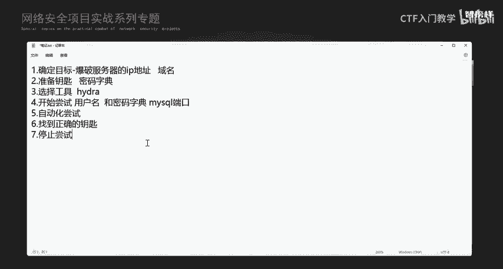
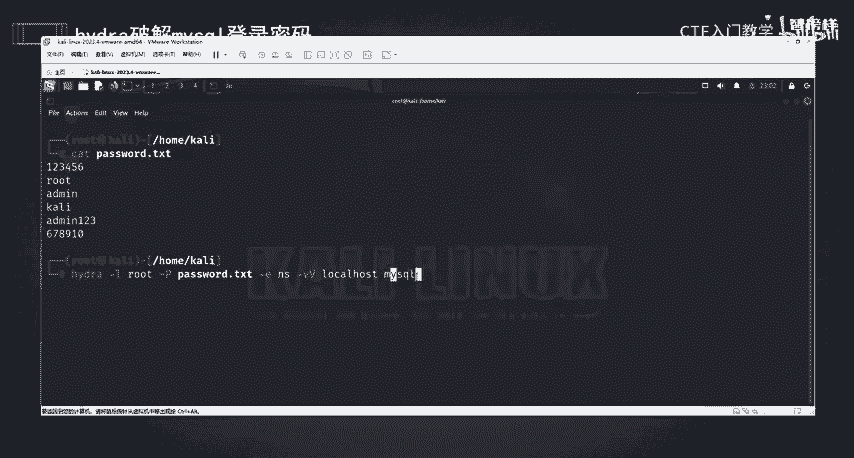
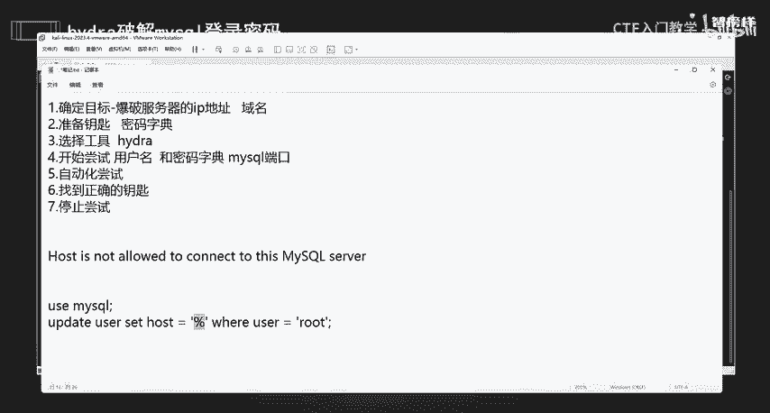
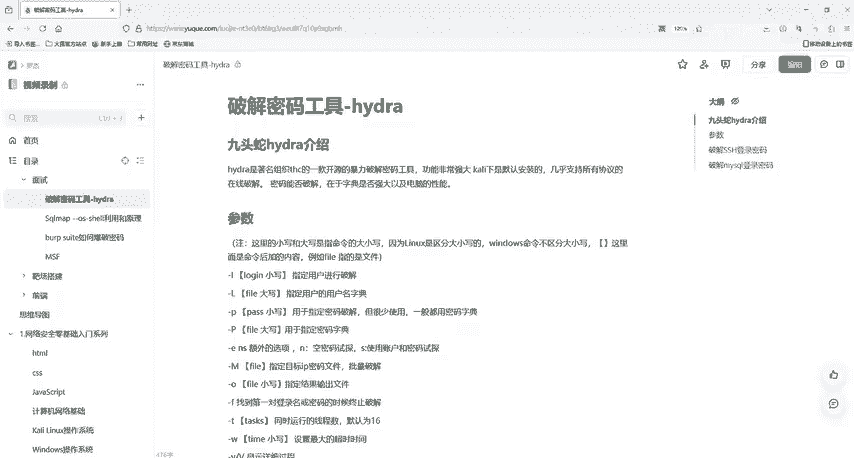

# 2024最新版网络安全秋招面试短期突击面试题【100道】我会出手带你一周上岸！（网络安全、渗透测试、web安全、安全运营、内网安全、等保测评、CTF等） - P29：3hydra爆破mysql用户名密码 - CTF入门教学 - BV1bcsTeXEwR

hello大家好，我是嘎嘎老师。那么上节课我们知道了如何去爆破SSH服务。其实呢SSH呃我们这个去爆破任何的一个协议，它的一整个底层逻辑都是一样的。首先我们需要确定目标。

就是我们爆破的服务器的IP或者域名是什么？那么我们本节课要给大家去爆破的是my circle，它的一个密码账号。所以呢我们需要知道mys它这一个服务器，它这个IP或者是域名是什么。然后我们需要。

去准备去准备钥匙，也就是密码字典。我们要有尽可能多的一个密码。可能他这个数据库它的一个密码是什么？然后呢，我们需要选择工具。因为我们就是用h去帮助我们去呃做一个嗨启，就是。去试要式的这一个过程。

然后我们需要去选择开始去尝试用用户名啊、密码端口密码字典啊，然后它的端口去尝试，能不能匹配得上。最后呢我们就需要自动化去尝试了，也就是通过我们的这一整个过程。

它去给我们去做一个字典与我们的用户名的一个匹配，看一下哪个可以成功登录mysqcle。数据库。好，那么我们这里还可以设置多线程的去做一个尝试。因为这样的话我就不会浪费太多的一个时间。但是这个要注意啊。

就是线程数不能设置太大。然后呢，我们就要找到我们找到正确的钥匙后呢，我们就。停止就去停止尝试，停止去开这个锁。

那么我们本节课还是需要用到我们的虚拟机以及卡里系统，这两个软件都已经放到评论区了。有需要的小伙伴评论私信我就可以了。好，这里我们要记住哦，还是要提醒一下大家，就是我们需要有权限去就是有权限。

然后再去尝试。我们要有授权书，不能用来非法入侵别人的数据库。而且呢如果我们真的是数据库的管理员。最好设置一个强大的密码，不被猜到的密码，这样才让才能让别人不容易猜到你的这一个。我们的数据库的一个密码了。

这里呢再来给大家回顾一下我们hdja它的一个参数啊，杠小也要是一个指定的一个用户名，然后杠大也要，也就是用户名的一个字典。杠小P它是一个密码，指定的密码。然后杠大P我们是一个密码的一个字典。

然后杠ENS，它是使用是额外的一个选项，它是用密码或者是我们的这个和密嗯账号去试探，大家这里也可以用hja杠。H去看一下它有还有哪些更多的一些参数啊。

OK那么我们本节课就给大家去操作一下我们hija如何去爆破my circle登录的一个密码，还是打开我们的这个卡ly系统啊，然后输入用户名密码去登录。好的，那么我们还是去做一个爆破本地的一个数据库啊。

来，我们现在已经登录到了我们卡里这里面，然后我们要用去管理员的一个权限啊。O。来到这里后呢，我们第一步，其实我们去呃看一下他这个服务它到底有没有这个服务。这个是我们的一个前期准备的一个工作。

我们需要知道服务器的1个IP地址，对不对？好，那么我们这个my circle服务，它到底有没有开启呢？因为我们现在去爆破自己的本地的一个数据库，对不对？所所以我们来看一下啊。哎。对。好。

你看runningmy circle这个服务它是running的一个状态，也就是开启的一个状态，对不对？那么既然是开启的话，我们就可以去做一个爆破了。那如果同学们没有开启的话。

那么就用我们这个start去做一个开启的一个。开启我们数据库这个服务。好，既然开启了后，我们是不是要知道他的1个IP呀？因为我们要爆破本地嘛，你可以写这个1192。168点自己的这个本机。

也可以写127。0。0。1或者是local host都是可以的啊。好，来，我们现在要去做一个爆破了啊，hija。然后杠L。那么我这里的我这里的话，他这一个用户名是什么呢？我的一个用户名是。Root。

然后杠大P。好，还是使用我上一节课做的一个字典啊。这个字典先给大家看一下啊，cat。我做的一个字典是12345，然后root me哈里，然后ad me123678910的。

大家也可以做一下自己觉得正确的一个密码给它加进去，做成你们自己的一个密码字典。接下来我们就要去进行一个操作了。ja。什么呢？因为我们是卡里面自带的一个工具啊，所以自己就不需要去安装了。

就直接使用就可以了。好，杠L。然后我们我知道它的一个用户名是root啊，然后我们杠大P，因为我已经做好一个字典，对不对？然后pass word我这个字典。

我们在杠ENS这是干嘛去尝试做它的一个密码和一个用户名去尝试匹配，对不对？好，我要看它的一个过程杠。小V大V，然后local host my circle。loc是不是我们本地，对不对？

然后我们是一个我因为我要爆破我自己嘛，所以就是我自己啊，或者你写127。0。0。1也可以啊。然后my这个服务去爆破my circle的一个用户名和密码，对不对？然后回车好，回车后。

你看这个就是他一整个尝试的一个过程啊，登录名是root好，这个root对不对？然后root这对不对？这root123456对不对？root me对不对？好，做完了这些尝试后呢。

他就把我们这一个端口和我们服务，然后它的一个主机登录名和密码都已经给我们显示出来了。这个高亮的地方啊。

那么这个就是我们hd转去爆破本地的一个mycicle啊。那有些同学可能会去尝试爆破别人的一个mycyclcle。可能会出现这样的一个问题啊。

就是hos hosts is not a known to就是不允许去连接我们这个mysl服务啊。那么其实不允许主机连接到mysq服务器，也就是本地账号可以连接登录。但是你远程登录它是行不通的啊。

那这个是为什么呢？其实也就是因为。my circle它不允许远程登录。如果你要它远程登录的话，你就。就是别人的那一个计算机系统，就mys这个系统，它必须是呃它的这一个old me这个mys数据库。

它的一个。数据库中的user这个表，它的一个字段把它设置为百分号。并且那个用户名是root的这一个用户名，把它设置它这个host这个字段设置为百分号，这样的话才能行得通。

所以它都是有条件的啊。OK那么我们这个hija破解my circle登录的一个用户名和密码就讲这么多。我们的资料已经放到评论区了，给大家准备好了，有需要的小伙伴评论私信我就可以了。那么我们下一节课再见。

