# 2024最新版网络安全秋招面试短期突击面试题【100道】我会出手带你一周上岸！（网络安全、渗透测试、web安全、安全运营、内网安全、等保测评、CTF等） - P2：面试题-Linux的ssh服务 - CTF入门教学 - BV1bcsTeXEwR

本节课呢讲的是面试题中linux的SSH服务。SSH呢我分为4种，一个是基础类型啊，一个是安全配置类型以及实践操作类型和故障排除类型。我将这几个类型呢全部都打包，整理在语句文档上了。

有需要同学的话可以在评区留言或者私信我，记得一键三年哟。好，我们先看第一个类型，基础知识类的啊。好。SSH到底是什么呢？它它默认的一个监梯那个呢端口是什么呢？还有它所要的一些版本又是什么呢？好。

我们一个个来。SSH呢它其实就是一个网络协议，用于在不安全的一个网络中为网络服务提供一个安全传输的一个过程啊，它通过一个加密，然后保证咱们这个数据传输了一个安全性。

就相当于呢你在家中要进啊一件非常非常重要的一个文件到办公室，对不对？但是你担心呢在这个路上可能会有什么小偷啊或者不法分子啊，然后截取你这个信件，并且查看，还能够去篡改里面的内容。为了解决这个问题呢？

我要选择一个合理合适的一个方式来发送咱们这个信件，是不是？那像普通的一些简单一个信件呢，我们就是把这个信件放在一个透明的箱子里面，或者说塑料袋里面，然后寄出。

是不是任何路上任何一个人都能够查看咱们这个信件内容。但你想想，既然这封信非常非常重要，我就不可能把它公开。对不对？让所有人都看到信件里面的所有内容，所以呢我找一个坚固的锁盒子，然后将这个信件封锁起来。

并且寄出，然后这个锁盒子呢是有两把钥匙。第一把钥匙呢是在你的手上，另一把钥匙呢是在收件人的手上。只有这两把钥匙同时去开启咱们这个锁才能够去查看咱们这个信件里面的内容，对不对。就相当于啊使用SSH。

然后去加密通道。然后然后只有咱们这个发送方和接收方才能够去解密，并且查看里面的内容，是不是？所以呢SSH它主要的特性呢，其实就是说啊。加密通道是不是要要加密咱们这个传输过程，传输环境。

是不是以及认证机制，对吧？认证机制的话，只有咱们这个发送方和接收方才能够知道，对不对？安全隧道呢，就是说这个通道一定是非常安全的，是不是我们不能够在不安全的一些公开的一些网络啊。

比如说互联网那些进行数据传输，是不是很有可能会被人截取。OK那么第二个问题，SSH它的一个服务默认一个监听端口是什么呢？哎，默认的监听端口呢是22？22呢，你看到22的话，你就知道了是SSH服务。

那么像其他的话也会有啊也会有一些对应的端口。比如说啊咱们这个数据库啊，3306啊，是不是比如说咱们这个协议HTPSHTPS协议，他们啊对应的不同一个端口，比如说80啊。

445啊、443这些都是所对应的端口。那你如果说你要去唉，你要去设置一个端口，你如果设置这些特殊的设置2280，那么你的端口很有可能被占用啊，所以我们要设置一些不被人占用的，对不对？避免这些情况。

那么SSH有哪些版本呢？它主要是两个版本，一个是啊杠一和杠2，杠2的话更安全一些。现在的话基本上都是用它啊，用杠2OK然后我们看下一个类型。安全配置类如何安全的配置SSH服务，如何去生成咱们这个密钥队。

是不是？还有怎么去将咱们这个公钥上传到远程服务器的SSH认证中OK。第一个问题呢就是要配置SSH服务，是不是我们要配置的话，是要去限制SSH登录你个IP地址，只允许特定的IP地址。

因为它呢是比较的不安全性的，是不是？所以的话我们只有特定那个人才能够去允许访问。那么第二呢就是要修改默认端口，减少那些未授权访问的一个尝试啊，还有呢使用强密啊，强密码。什么叫强密码呢？

就是说哎必须是字啊数字呀、字母呀以及特殊字符组成的啊，组成的12位以上的。那么禁止root用户登录是什么意思呢？就是root用户，它本身是一个最高权限，是一个管理员权限，是不是我不可能人人都是管理员。

是不是？所以的话我们要禁止root又登录啊，以及创建普通用户，并且开通咱们这个sho do，然后执行特殊权利。那因为哎创建普通用户的话，我就能够同等的用同等的一个权限，然后去访问，对不对？

还有sho do是什么意思呢？哎，ho do它是不是提全，是不是要保证它确保我这个命令能够正常运行。所以我就会使用sho do去提全。就相当于我是一个root用户啦。

OK那么还有呢还要为了去保证安全的话，我可以是基于密钥的一个身份认证，还有定期去更新咱们这个系统和SSH服务，以方便去修补安全漏洞。好，那么第二个问题呢，就是如何去生成咱们这个SSH密钥队呢？

OK通过SSH杠K啊，然后这个命令就能够去生成啊，生成咱们这个密钥对。密钥呢它包括私钥和咱们这个公钥啊。私钥是什么呢？给你们打个比方啊，私钥呢就相当于是你家的啊，你家锁，你家你家门口吧，你家门。

然后你的门呢是一个什么呢？指纹锁，只有你的指纹才能够去开启，别人的话都是不能够去开启，是不是指纹只有我拥有，我不能给借给别人，是不是不能给任何一个人，他去访问，对吧？那么公钥是什么呢？

公钥就相当于是你家锁，你可以将这个锁展示给任何一个人告诉他们，这是就是我家的锁。但是你不会把这个钥匙给他们，因为只有你才会有钥匙，对不对？别人只能够通过这个锁来加密信息，只有你有对应的钥匙进行解密。

对吧？特殊权利。OK那么如何在公钥上去上传远程服务的1个SSH认证呢？哎，我们可以使用咱们copy IDD啊这个命令，然后将公钥上传到远程一个服务器啊，好吧。具体一个命令呢，我已经告诉大家了啊。

这个就是啊就是那么就是你的一个。用户名哦，那么哎remo是什么呢？它就是远程服务器的IP地址或者是域名啊。好。那么第四个啊第四类的实战操作类的，如何去通过SSH去连接到远程服务器啊。

如果说它连接比较缓慢，如何进行加速呢？如何使用咱们这个SSH进行端口转发呢？好，我们一个来。首先呢要使用咱们这个SSH命令格式呢，哎就是这个格式。如果是你是第一次连接的话。

可能会哎确定你这个远程主机一个真实性OK。那我们来玩一玩，好吧。那如果说你要去玩的话，我要确保你真的有SSH啊，这个是需要我们自己去下载的啊。如果说我们要连接，是不是？那我们就使用这个啊SSH。

然后加上我的一个。

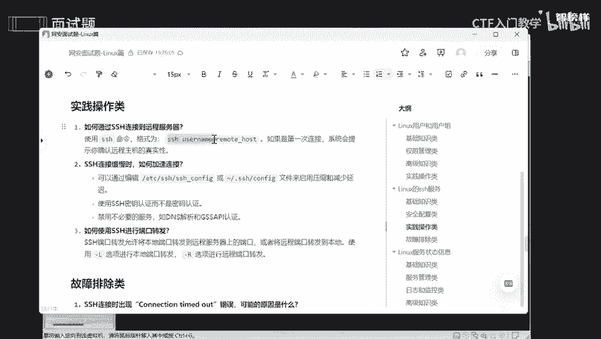

啊，我的是。

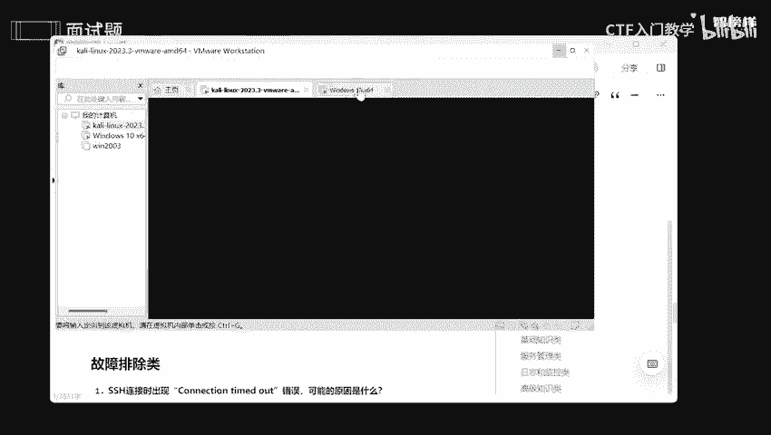

啊，其实这个啊，我们看一下它的一个。中心啊。我的账户是什么账户呢？看一下它一个and meet啊，我的是and me。好，来到andmed。

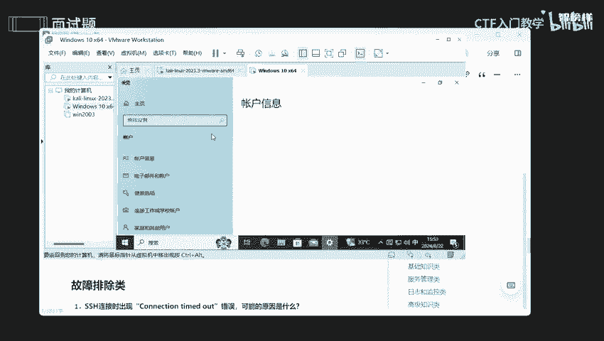

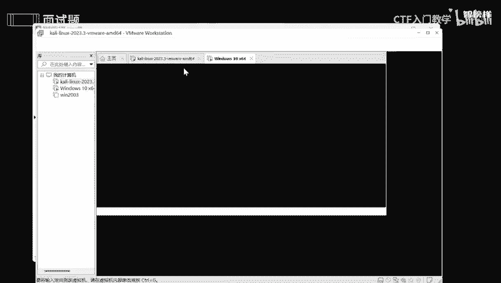

哎under me，然后at。艾特什么呢？艾特我的1个IP地址啊。

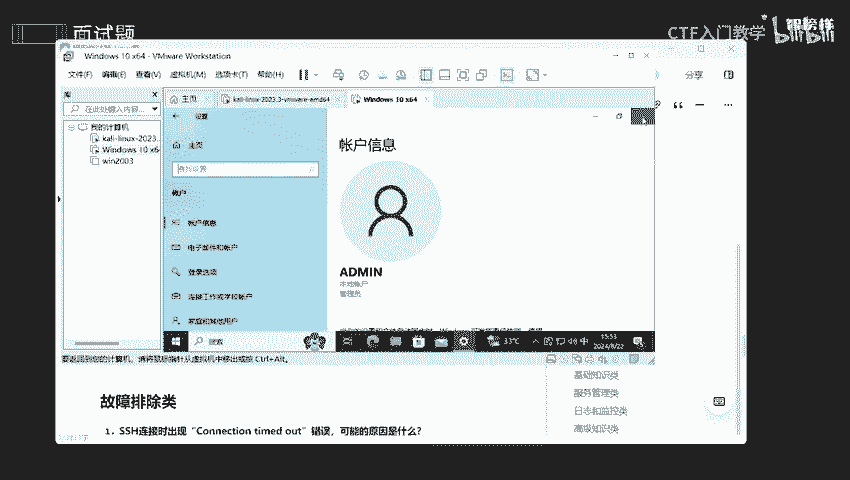

啊，温加R输CMB，然后进入我的小黑窗哎IP config。好。将它 copy一下。ctrol C一下，然后来到这边crl shift加V。

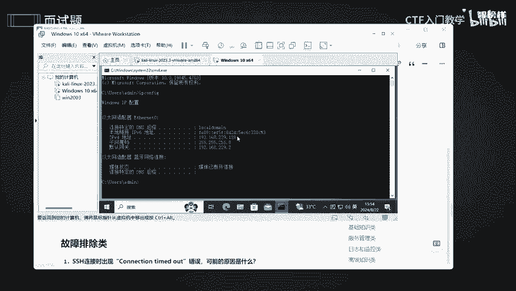

好。连接它这边说什么呢？ad me的一个password passwordword大家应该都知道吧，密码是不是我的密码是唉，输入一下。好，可以看到我已经登录好了，我已经登录好，我可以干什么呢？

我可以看一下我的IP地址是不是对的呀。哎，可以看到我的IP地址，是不是我已经哎远程服务了，看到是不是这个是不是和我刚刚配置的一模一样呢？以及我还可以干什么呢？我还可以去查看啊。

比如说我想去查看它当前一个哎目录，可以看到它当前一个目录全部都出来了。如果说我们要去远程的话，我一定要确保啊确保我是有咱们这个SSH的。

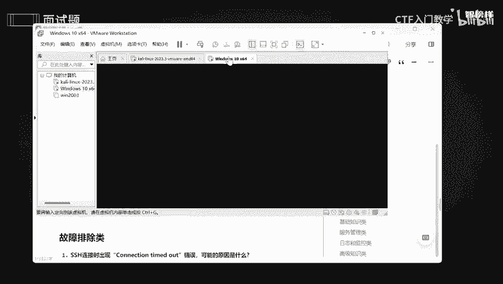

啊，我的主机是有SSH的。我们看一下是不是有SSH并且开通了，所以我才能够去连，你们也是一样的，也是要啊连接的话，一定要开启咱们这个SSH服务，好吧。

如果不知道怎么去下载的话，告诉你们啊。哎，新开通一个。首先呢。

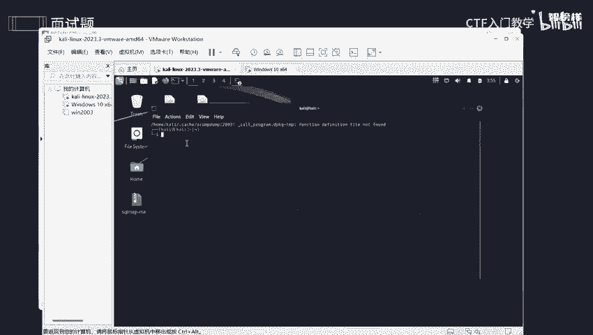

，你可以先切换成root用户，我是习惯性切换root用户了。OK切换到ro用户呢，然后我们去啊安装好咱们这个服务器。あケ子。你错了。Oen up。好，安装这个安装这个你们自己去安取，我现在已经安了。

如果说你去出现一些问题的话，我建议大家可以先更新一下，出现啊安装包无法下载这个问题的话，你们可以啊update一下update是一个更新啊，更新咱们这个源啊，更新咱们这个系统包，好吧。

okK最后可以去开启啊，开启咱们这个服务。开启服务的话是LSEL。TM。嗯。你是哪个，我看一看啊。T。好，ok然后star。SSH这样子就可以开通了。我们还可以去查看一下它当前一个状态。哎，状态好像。

变一下啊。没有。好，这就是他当前一个状态，可以看到我的状态是不是已经开始运行了？好。啊，但是我这里是呃disable，diable呢就是说我开机不自启，它果每次开机的话，都是需要自己去自动启动一下。

好吧，自己去启动一下，它才能够去开启的okK。好，来到。如果说你太慢了，你觉得这个东西太慢的话，我们可以编辑啊。这个是什么呢？是咱们这个SSH1个配置文件，我们可以去这里去定义啊去配置。

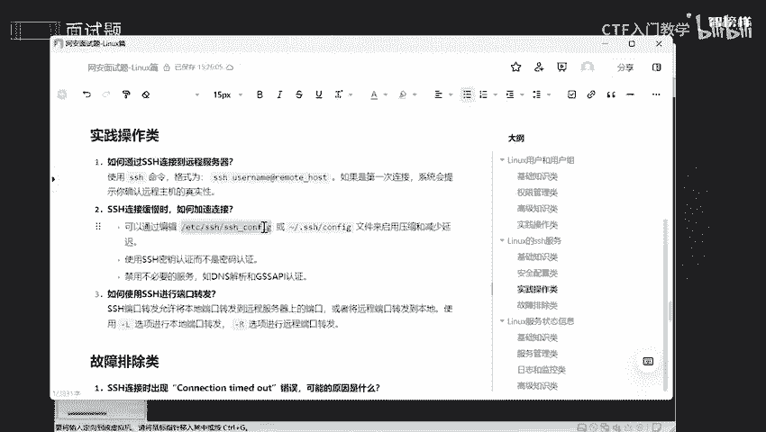

给你们稍微看一下，好吧。VM然后。可以看到有这么这么多，你们自己去定义啊，我就不一一多说。

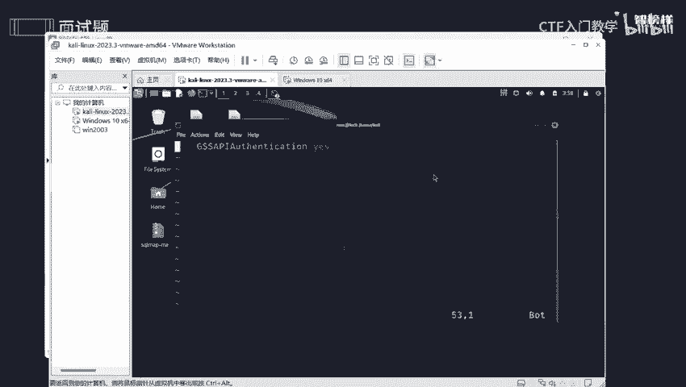

哎，我退出一下。O。这两个都是可以的啊，一般来说配成一个就好了。如果说你不成功的话，你把这个也配置一下。好。那如何去使用咱们这个SSH进行端口转发呢？一般来说啊。

我们允许啊允许本地端口转发到远程服务器上一个端口，或者是说将远地啊远程一个端口转发到本地啊。具体一个参数呢，我已经告诉大家了，杠L和杠R，好吧。啊，再看最后一个故障排除类。

如果SSH连接时候出现了什么呢？啊，connection time time out是什么意思呢？那它是什么意思呢？它其实就是一个超时啊，连接超时。有可能是你的网速问题。

也有可能是你这个服务压根就没有开启啊。还有的话就是你的防御系统太高了，我的防火墙已经阻止了这一次连接啊。还有就是说你错误了，你的1个IP地址啊完全填错了。比如说我只想连接我的win1。

但没想到我连接我正实主机的，会导致这些问题啊。那如果说SSH服务突然停止一个工作的话，我该怎么去哎检查呢去排呀？ok大家首先第一步呢要检查咱们这个服务正是否是正式在运行中啊。

那这个哎我刚刚已经给大家解示了，运行中的话，它是一个running的一个感觉啊，running。状态OK那么第二步呢是要查看我的日志啊，日志呢里面有什么我任何一个开启啊啊，我做了什么一些杂七杂八的。

只要是我在这里面做一些活动，它都会记录下来啊，记录下来就相当于我一个什么监视，它监视的我一举一动啊。那我通过你的一举移动，我就能够去排查一些错误的一信息，知道你哪一步错了，是不是？

那么第三步呢就是说要确定网络是否是啊，有没有连接故障呀，是不是网速的问题啊啊，网卡的一些问题啊，对吧？那么第四步呢就是说要检查一下防火墙，就这个规则是否是阻碍了啊，阻止了咱们这这一次的连接，好吧。O。

那今天的话我就讲到这里啊，我已经将这些面试题呢，包括一些答案啊，整理已经放在语句文档上了。有需要的同学的话可以在评论区留言或者私信我啊。OK那今天内容就到此为止了。

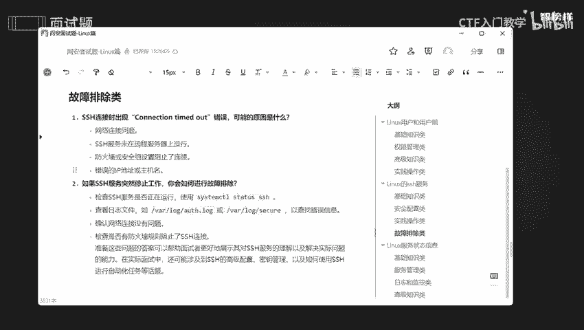