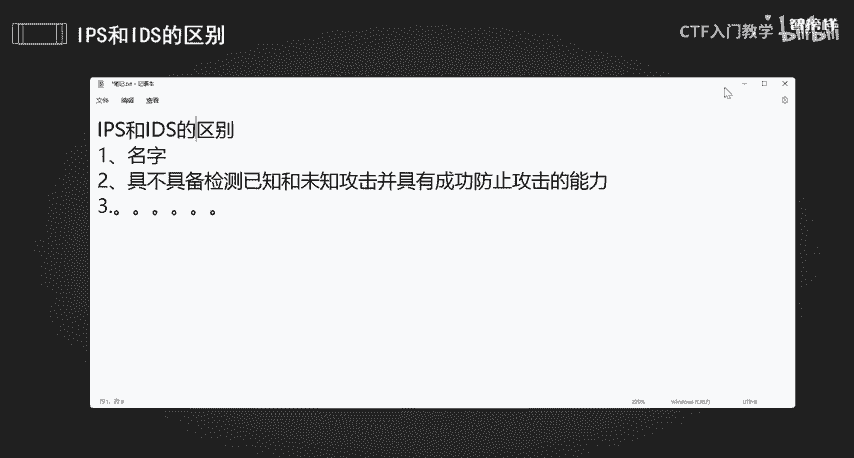
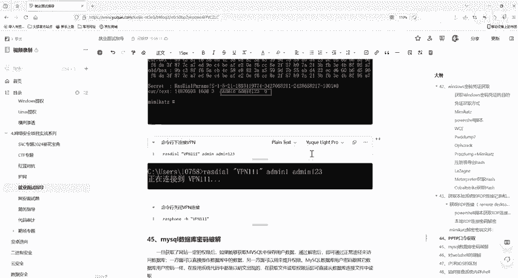

# 2024最新版网络安全秋招面试短期突击面试题【100道】我会出手带你一周上岸！（网络安全、渗透测试、web安全、安全运营、内网安全、等保测评、CTF等） - P30：IPS和IDS的区别 - CTF入门教学 - BV1bcsTeXEwR

hello，大家好，我是大盖老师。本节课给大家分享的面试题是我们这个IPS和ID它的一个区别。那么这一个东西在我们互网当中是经常会问到的一个问题啊，这两个设备有什么区别啊。

首先呢第一个就是我们要说的1个IPS。它叫做一个入侵防御系统。这个我们一定要记住啊，入侵防御系统。那么IPS系统呢它是我们电脑网络安全的一个设备啊，它是对防病毒软件和防火墙的一个补充。

是一步能够监视网络或者网络设备的网络资料传输行为的计算机网络安全设备，能够及时中断调整或者隔离一些不正常一或是有伤害性的网络资料传输的行为。

那么其实呢它就像是网络事件里的保安专门用来保护你的电脑和网络不受坏人的攻击，它可以去监控网络流量，检查是否有可疑的行为，或者是恶意软件尝试进入你的系统。那么如果有威胁的话，那么IPS就会采取行动。

阻止这一攻击。那比如说我们的风。锁攻击者的IP地址啊，或者是切直接切断可疑的连接。那我们想象一下，如果是你的家，你的家如果是一个网络系统IPS就像是安装在你家门的高级安全摄摄像头和报警系统。

他不仅能够识别出那些可疑的人，就比如说是小偷或者是入侵者，而且一旦发现这些人呢，就会尝试闯入，他就会立即报警，甚至还会自动锁门，确保你家安全无忧。在网络事件里呢。

IPS就是那个帮你看的高级科技的一个保安啊。对于初学者这个初始者来说啊，它是位于防火墙和网络设备之间的设备，它是属于一种设备啊，入侵防御系统。如果他检测的到路攻击啊。

那么IPS就会在这种攻击扩散到网络的其他地方之前阻止这一个恶意的通讯。因此呢IPS它具有这里啊要注意啊，检测已知和未知攻击，并具有成功阻止攻击的一个能力啊，再说一下啊，它具有检测已知和未知的攻击。

并且具有成功防止攻击的一个能力。这是它的一个重点。这就是他的一个能力啊。那么。这个就是我们所说的1个IPS入侵防御系统。那么IDS是什么呢？IDS它叫做入侵检测系统，它们俩有什么区别？一个是名字的不同。

对不对？1个IPS是我们的入侵防御，这个实施检测，对不对？它能做到一个防御吗？通过名字我们就知道它不能做一个防御，对不对？它只能检测。IDS系统的核心价值在于通过全网信息的分析，了解信息系统的安全状况。

近来指导信息系统安全建设目标以及安全策略的建立和调整。而入侵防御系统也就是我们所说的1个IPS它的核心价值呢在于安全策略的实施，对黑客。行为的一个阻止，这个只是安全策略的确定和调整，对不对？

那么IPS它可以对黑客行为进行一些阻止。那么IDS系统需要部署在网络内部监控范围，可以覆盖整个子网，包括来自外部的数据以及内部终端之间传输的数据。所以不管你是外部的还是内部的。

它都可以进行一个监监控入侵防御系统。我们的这一个入侵防御系统啊，它就必须部署在我们的这一个网络的边界啊，用来抵制外部的一个入侵。对内部攻击行为无能为力。好，他们还有个区别，就是我们ID它是部署在内部的。

因为它要去监控我们整个子网，对不对？它是用来去进行一个监控的IIPS啊，它是要去抵制黑客抵御黑客的一个攻击。所以呢它就必须要在我们网络的一个边界啊，用来抵制外部的一个入侵。

那么这个是这个我们说的是1个IPS啊。那么IDS它的一个局限性啊是不能反击反击网络攻击。因为IDS传感器它是基于数据包嗅探技术，只能眼睁睁的看着网络信息流过。

IDS只是存在于你的网络之外起到报警的一个作用，而不是在你网络前面起到一个防御的作用。这个也是它们之间的一个区别啊。IDS不具备检测已知和未知攻击，并具备成功防止攻击的能力。

这个能力是我们IPS才才是具备这个能力的这就是两个东西，最主要的一个区别。一个是入侵防御系统，一个叫做入侵检测系统啊。对我们来整理一下他们俩的一个区别，一个是名字，对不对？名字有很大的区别，一个是入侵。

一个是检测，对不对？好，那么最重要的一个区别就是具不具备。什么。检测。嗯已知。인。Yes。那个。嗯。No。鹅未知公鸡他。病具有。成功干嘛防止。攻击的能力。对不对？这个是它最重要的一点啊，他们的一个区别。

那当然呢它还有一些更多的，我这里就不列了啊。那么其实用大白话来谈一谈啊，其实他们都算作是网络安全的一个保镖，但是呢他们的工作方式是不同的，对不对？就拿我们的这个IPS，我们其实前面已经举例了。

他是一个积极的一个保镖，不仅会监控，还可以发现可疑的人，并且立刻采取行动，对不对？他然后呢直接报警，或者是把可疑的人赶走。那么他呢他只是说每天盯着摄像头哦，看到有可疑的人在你的家周围徘徊。

他只是把他们记录下来，然后就发出一个警告说，嘿，注意有人来了啊，这个人看起来有点不对劲。但是呢他这个保镖只能告诉你有可疑的情况，他不能直接去采取行动阻止这些人，对不对？这就这个就是他们最主要的一个区别。

OK那么我们这个IPS和IDS的区别，这一个面试题就给大家介绍到这里啊。我们所有面试题的一个资料都已经给大家准备好了，有需要的小伙伴评论区私信我就可以了。我们下一节课再见啊。

你看我们这里给大家做的都非常的一个完善。