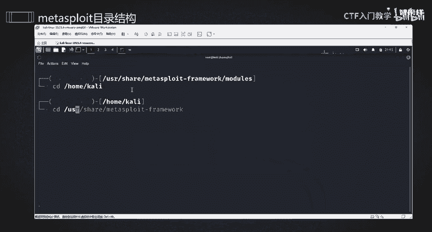
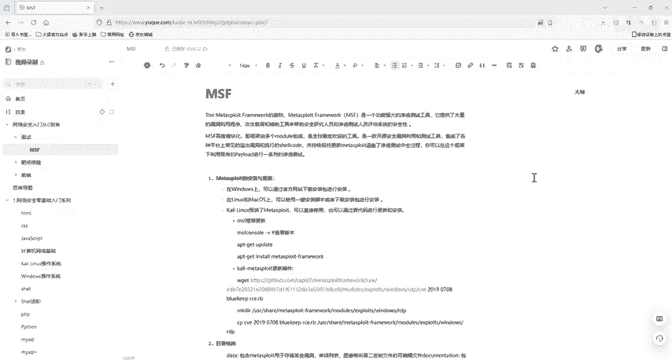

# 2024最新版网络安全秋招面试短期突击面试题【100道】我会出手带你一周上岸！（网络安全、渗透测试、web安全、安全运营、内网安全、等保测评、CTF等） - P31：1msf框架介绍 - CTF入门教学 - BV1bcsTeXEwR

hello，大家好，我是嘎嘎老师。那么今天我们就来讲渗透测试框架的第一个meta sleep，它是一个排名第二的安全工具。它能在我们渗透测试的过程中，帮助我们自动化的进行攻击服务端口。

或者是增程木马程序。后门木马权限提升，然后权限维持等一些复杂的事情。我们在攻击系统服务脚本，比如是s把的永恒之南漏洞，我们不需要对漏洞有过深的研究，也不需要我们自己去写POC脚本。

也就是漏洞检测应用脚本，我们可以直接使用渗透测试框架meta state，帮我们自动的进行攻击，它方便了我们这个渗透测试的一个入门。mate sleep简单来说，它的一个基本流程是非常简单的。

但是呢它里面有拥有的东西是特别复杂的。即使是mate sleep魔鬼测试训练零的作者莲花莲的创始人朱葛建伟，他也说过自己是不能完全掌握这个mate sleep的。在我们看来确实如此。

因为它里面的内容是特别多。那我们今天就来学习mate sleep。首先呢我们需要了解 meta sleep的一个。框架的一个介绍，它是什么呢？mateta sleep是MSF的一个。这个简称这是MSF。

它是高度模块化，这个框架由多个模块组成的，是最受欢迎的深度测试工具。MSF它是一款开源的安全利用测试和测试工具。它集成了我们常见的系统服务漏洞和流行的需 code。并且能持续保持更新。

现在的MSF已经更新到了6。6的一个版本。MSF覆盖的渗透测试中的全过程，你可以在这个框架下利用现有的pay漏或者是歇 code的进行一系列的渗透测试。我们就不需要关注漏洞的一个本质。

就不需要再去调试了，那么真的不需要吗？其实是需要的。我们如果去自己调试MSF就会发现这个。17010会发现这个漏洞是怎样形成的，那么自己去调试，也能从中学到很多东西。当然，我们现阶段作为一个入门。

我们就不需要花那么多的时间或者是功夫去做这个事情了。那么我们需要哪些环境呢？我们需要虚拟机，还有一个咖里系统，虚拟机需要安装一个咖里系统。那我们所有相关的软件和一些资料都已经放到评论区了。

有需要的小伙伴评论私信我就可以了。OK我们来看一下它的一个目录结构。mateta sleep它是在卡ly里面是自带的卡ly系统卡lylinux里面是自带的，它的一个目录结构。

它是安装在19年的卡ly新通常是我们这个第二个这一个路径。USR下面的hell的mate sleep一个框架。那么这里面我们来看一下这个框架文件内容有哪些。好的，我们在这里输入他的一个密码，然后回车。

好，回车后啊来，你们把这个清空。薅羊后回到我们刚开始的一个。之前大家应该都是在卡里home下home卡里下。Yeah。好，来。那么我们进到刚刚的那一个路径下，也就是USR下的share的这一个。

我们来看一下它有哪些目录。

那么在这个目录里面，这些就是他的一些文件。我们快速看一下这些文件是干什么的。好了，在了解那个之前呢，我们先来看一下我们这个 meta sleep它是如何更新的啊。来MSF console。

然后杠V可以查看它的一个版本。然后更新的话，我们是FT gate update，然后是我们的去下载它的一个框架啊。那么我们在更新之前呢，我们需要更新我们的APTge源。

那么这个源如果是使用卡里自带的de半源的话，可能就访问比较缓慢。大家可以去百度自行搜索一下如何去更换我们这个APTgate源。可以更换成清华或者阿里云的，或者是。中科大的都是可以的啊。

我们是进行update，然后去更新我们这个源。下载我们这个对MSF进行一个更新。好，那么有些同学他不想去更新整个框架，那么他就可以去更新一些插件啊。我们这个插件如何更新，都已经放在这里了。

有需要的小伙伴自己可以试着去练习一下。OK现在来看到我们MSF它这个目录它的一个结构啊。我们刚可以看到，其实我们L看一下，它就有一个date目录。date目录它是。好，我们这个d目录啊。

它是包含了MSF用于存储某些漏洞的二进制文件和可编译的编辑的一些文件啊。然后我们这个康。document这个action，它这个文件是包含框架的可用文件。好，然后我们的lilib它是库，对不对？

它就存放我们mate sleep这个库文件的。好，然后我们这一个。有一个这个啊这个它是存放一些插件的。因为我们有时候再去安装软件的时候，它这个就代表着插件的意思，对不对？

我们前面也给大家介绍了如何去快速更新它的一个插件。然后这个scripts，这个是存放一些met它的一个脚本的。好，然后啊我们有个tos tos是存放一些呃命令行使用的一些程序。

然后我们还有个modsmod这个比较重要，它是存放我们mate它的一个模块模块文件的。我们这个moddes它是包含了MSF的所有的一个模块。那对我们我们对渗度测试自动化利用。

通常是对mods里面保存的模块文件进行一个调用。那么接下来我们就看一下moddes目录里面有哪些东西。好我们CD。Mos。我们用tab键补全可以啊，然后LS看一下啊。来。

这个就是我们model目录下的存放的一些目录和一些文件啊。OK我们依次来看一下这一个目录啊，来这一个目录它是首先模块，我们的辅助模块，辅助模块是辅助渗透的，也就是对渗透测试进行一个前期的信息收集。

然后进行漏洞的扫描和探测，包括了一些端口扫描啊，然然后我们的呃密码爆破啊，还有一些嗯利用的这些漏洞利用的模块。我们这一个这一个它是E叉P嘛，E叉P是我们一个漏洞利用的一个模块。

它包含了一些主流漏洞的利用脚本。好，我们这个来看我们下一个payloadsloads它是我们攻击载合，也就攻击成功的一些执行的可执行的代码，比如反弹 share的一些代码。

然后我们的postpost它是后阶段我们可以漏洞利用成功获取meta。puter之后呢，向目标发送的一些功能性的指令，向我们提全呀。这种好，然后来看我们这个incosincos它是编辑器模块。

它包含了一些各种的编码工具啊，对我们的payload的进行一个编码加密，然后以便绕过。入侵检测和过滤的系统。然后来我们看一下它这个这个它是我们的躲避模块，是用来生成免纱的一些纰漏的。好。

我们这个no这个是用于IDS或者IPS会检测数据包中它的不规则数据。在某些情况下呢，就比如针对溢出攻击啊，某些特殊的滑行字符串这种。OK那么我们就接下来看一下它的 meta sleep。

它的一个体系结构啊，它的核心，这是这个co。我们通过这个interfaces也就是我们这个MSF control这一个接口啊。调用我们的 meta sleep的一个核心文件。

这个核心文件是中基于MSFmod进行一个调动。调用O那么我们本节课就给大家介绍了MSF这一个框架。然后它的一些目录和我们最重要的一个mod目录。那么我们下一节课就带着大家一起进入我们的MSF。好。

我们所有的资料都已经放到评论区了，有需要的小伙伴评论私信我就可以了。那么我们下一节课再见。

