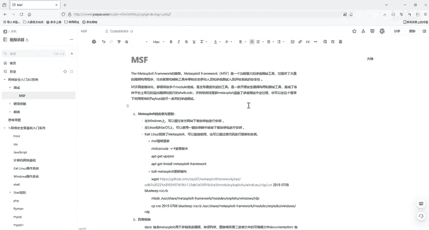

# 2024最新版网络安全秋招面试短期突击面试题【100道】我会出手带你一周上岸！（网络安全、渗透测试、web安全、安全运营、内网安全、等保测评、CTF等） - P32：2进入msf - CTF入门教学 - BV1bcsTeXEwR

hello，大家好，我是嘎嘎老师，那么又见面了。今天呢我们就带着大家一起进入我们的MSSF看一下。我们还是需要这两个软件啊，一个是虚拟机，还有一个是卡里，虚拟机，也就是虚拟的一台电脑。

然后我们MSF它是在我们卡里上是自带的。okK我们首先来看一下怎么进入MSF console。首先呢我们需要对数据数据库进行一个初始化。当然呢，这里你不做也是没有问题的。我们有时候不需要保存。

把数据保存到数据库里面，这也是没有问题的。那么数据初那个初始化很简单啊。MSF我们的DB。inINI就可以了啊。这个就是一个进行一个初始化的一个操作。我们用这个MSF console，然后进行一个启动。

你可以看一下它这个有没有去连接到我们的数据库啊，看是否成功连接，就用DB下限 status去看。然后work work space是看当前的一个工作区。

然后我们这个杠help可以看一下它的一些帮助文帮助命令啊这种。那么我们这个work space这个是查看工作区的，如果是de，也就是它的一个默认工作区，我们就可以创建其他工作区。

是使用workerspace杠I，然后去I去创建其他工作区并且切换其他工作区啊，这里大家可以不做。因为后续的话对我们渗透测试及后后渗透都是没有任何的影响的。OK那么我们。

接下来看一下它的一个内网内网主机发现，这里m他 sleep，它满足我们渗透测试的一个全过程。我们在第一阶段讲这个渗透测试首先要做什么？那么面试官首先会问你的就是怎么进行一个信息收集。

那么MSF它作为一个全能的信息。室能测试一个框架，那么信息收集也就是缺不了的。首先呢，信息收集的一个不老的神器是n map。那么我们这里mate里面也是自带的啊，但是呢我们使用它必须加个DB下划线。

然后一个。的map。它的一个使用方法和我们在信息收集里面讲Nm的方法是完全一样的。只是说它扫描之后呢，会存储到我们的这一个数据库当中啊。OK那么我们进行一个简单的1个MDBNapp看一下它。

来O我们滴滴。下划线Nm来看一下回车。来，这里有个参数啊，我们的杠H是这里啊，看这个和我们的NI map是一样的，这里我们就不多讲了。好，我们杠H，你可以看到这里有很多这个参数啊。

都是和我们N map它是一样的那N map它这个所有的功能，它在它这里也是支持的呃，分别端口服务啊和一些版本探测，包括我们的SYN啊。半开还半开扫描，还有我们TCP扫描，这个都是我们支支持的啊。

那么TCP这个扫描它就杠小S大S，然后我们的一个TCP扫描就直接直接是我们杠ST啊。当然了我们还可以通过一个命令啊。用我们的这一个ggscript，然后去看一下它有没有常见的一个服务漏洞。Gun。

 gun script。去检查他常见的一个服务漏洞啊。好，这里我就。好的，那么。这里啊我们都有啊。好，在我们新收集里面，可以不利用N map。因为这一个我们。实际上是调用了nm的一个工具进行一个扫描。

我们刚刚在介绍MSF的时候已经说过了，对MSF操作主要是依靠它下面的mod这个模块辅助模块。我们肯定知道辅助模块里面有一些漏洞扫描入口令扫描端口扫描。那我们是不是可以利用模块进行一个扫描呢？

我们这里看一下如何去利用模块进行扫描，使用us。我们想U。然后我们想用什么呢？好，我们使用柚子啊，柚子我们的I这个辅助模块，然后s呢。The。短口。来十外灯。对。好，然后啊我们。可以去。😔。

它是不会在我们服务器上留下痕迹的，是一个非聘扫描，也就是只发CTCP的第一次握手包。好，那么我们这个bank啊 bank这是回来。那如果说你不知道的话，也非常简单。我们用search。

搜起 cur skin。😔，端口，也就是端口扫描，端口进行扫描，它会把这些我们用到的models都给我们列出来啊。但那我们回到刚刚那个user use这个半开扫描。好，我们回到柚子那个半开扫描。

也就是我们这一个啊。然后我们可以用我们需要对指定的IP就是目标进行扫描。那么我们这个叫做设置啊，我们来看一下怎么想看一下这个模块需要我们设置什么，我们秀。Options。Yeah。然后回车。

Show options。来，我们看一下我们需要配置这个pose。我们需要配这个pos啊，他指定的是1到1万。这个叫做目标地址。那么我们需要设置一个目标地址，后面现程延迟，这是现程延迟啊。

还有我们这个一个最大的一个端口数啊。OK我们看一下自己这个IP地址，我这个是。好，我们设置一下sat。sat我们的目标地址hosts。然后，然后我刚刚是。这一个。开车。然后我们run。

run他就会进行一个扫描，因为时间比较长，我们这里就不做一个扫描了。好，当然呢你还可以设置一个线程啊。好，那么设置线程，也就是sit。然后我们这个。Yeah。然后设置2020线程。你看这个就设置了。

然后你再run就可以了。这里我们再run就可以了。好，这个比较慢啊。那如果说你要去呃扫描一些C段的话，那么对一些端口进行扫描，其实也就是我们这样子的。好。0-24。嗯，就这样子的，然后再进行设置现程。

或者是我们的进行一个run就可以了。那么我们可以用这个 share options进行一个查看啊，我们确定的一些主机目标机器啊、延迟啊或者是线程啊，然后run就可以对一个目标的机器进行一个扫描。

那么如果说你要使用别的一些我们的模块，你就可以 bank，然后去use use一些。比如说什么样的一个模块，都是可以的啊。好，我们这一整个流程大家是需要过一遍的。如果大家都听好了后。

可以进行一个手动的操作，这个就是渗诺测试的一个流程。那么我们本节课就介绍了MSSF的一个信息收集，然后利用它的一些C段扫描啊，或者是说它的一个设定默认的一个I扫描啊，然后去做一个信息收集。

我们的资料给大家准备好了，都已经放到评论区了。有需要的小伙伴评论私信我就可以了。那么我们下一节课再见。

