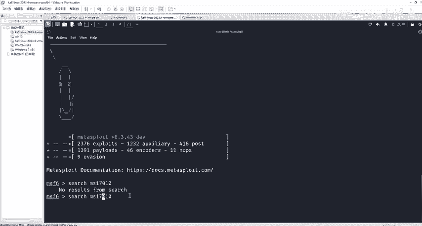
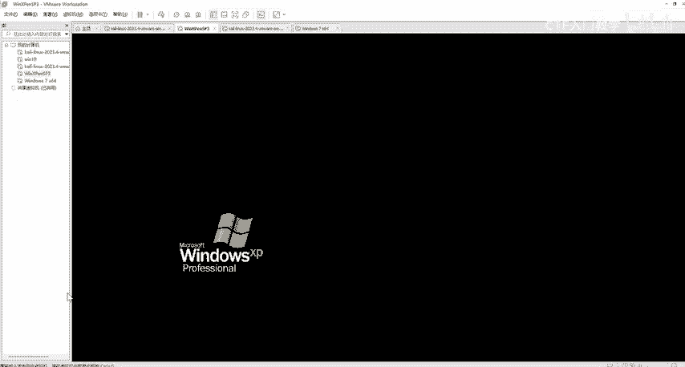
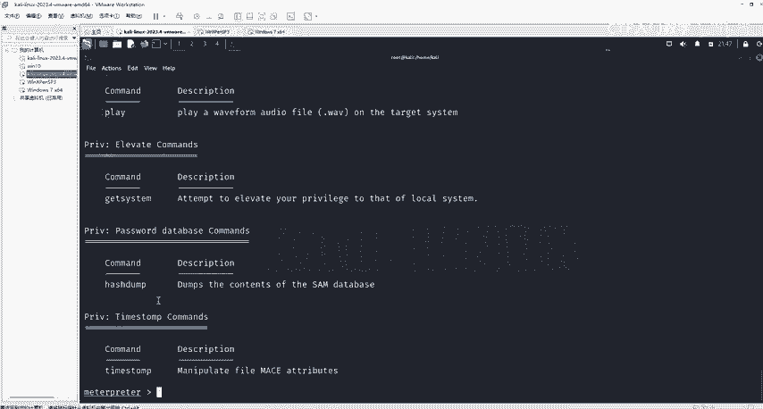
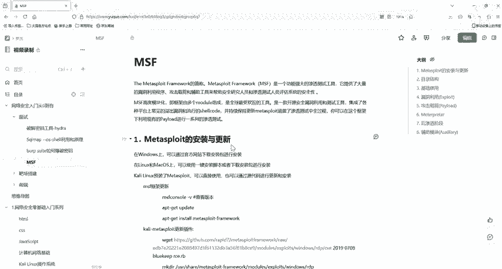

# 2024最新版网络安全秋招面试短期突击面试题【100道】我会出手带你一周上岸！（网络安全、渗透测试、web安全、安全运营、内网安全、等保测评、CTF等） - P33：3msf利用流程拿下对方电脑 - CTF入门教学 - BV1bcsTeXEwR

hello，大家好，我是开卡老师。那么之前呢我们学习了MSF它的一个渗透流程。那么今天我们就来看一下MSF它如何拿下对方的电脑。好，我们需要哪些软件呢？我们需要虚拟机和卡ly系统。

因为我们的MSF它是在卡ly上是自带的。这两个软件我都已经放到评论区了，有需要的小伙伴评论私信我就可以了。那么接下来我们会做一个非常简单，也就是一个常用的一个模块。然后。

用我们的MS170101个永恒之南漏洞。用它作为一个例子，它是一个非常典型的例子啊，包含了我们整个MSF的一个攻击流程。那么我们接下来就去看一下它吧。OK我们需要一个机器啊，一台电脑。

然后进入我们的MSF我这里就用卡里啊。因为卡里上我们的MSF它是自带的，对不对？OK然后啊稍等一下。啊，首先第一步我们需要进入MSF，怎么进入呢？就我们的MSF console。我回车，这里稍等一下。

好，你看他就在进入啊。好，进入之后呢，我们等一下就会出现MSF。是。好的，看我现在就已经进入到MSF了。然后啊。Yeah。我们来设置一下。设置我们刚刚所说的MS17010。好，没有找到。好，我们这个是。

嗯。17-010下划线010。

好，来，我们看到这里有3个啊。四个啊两个辅助模块，然后两个攻击模块。那辅助模块是用来干什么的的呢？它是用来检测我们这个目标机器，它是否有我们这个。永恒这南路懂吗？那我们的攻击很显然。

这个攻击模块就是去攻击了。那首先我们就用检测啊辅助模块来检测一下我们到底有没有这一个漏洞。OK我们就使用这一个辅助模块去检测一下。好，复制一下。然后我们右柚子这一个模块啊。然后回车。好，use后呢。

我们就sha optionstions，也可以直接options啊，看一下它需要设置哪一些。选项。ok。你看我们这里端口已经给我们指定了1个445的1个端口。那么我们需要指定什么呢？

我们需要指定一个目标的一个地址。然后县城县城这个是一线城。好，那么如果说啊你有pass word和这个呃user user name和我们的这个pass word的话，也可以指定。

那么我们这里就指定一下目标机器的一个地址啊。好，来怎么指定啊sat。目标机器。好，我们用这一个啊。Yes。叉P这一个机器。

好的，稍等啊。好，我们IIPfi看一下他的1个IP地址，它是192。168点110。25啊。那么我们就去设置啊。设置他这一个目标的一个。机器的IP地址。192。168。110。25。好，然后回车好。

设置完了后呢。我们就可以run了。让去检测一下他到底有没有那个永恒之南漏洞啊。好，你看。这1个IP445端口的主机似乎有存在什么MS17010这个漏洞，对不对？那就说明他有这一个永恒之蓝漏洞。

那他既然有这个漏洞，我们是不是就可以去利用利用是使用哪个模块，是不是我们上面这一个这个模块，对不对？好，我们用这一个11。好的，我们用刚刚那一个模块啊去攻击一下啊，use哪一个X。no。Windows。

windows的什么？没死。是啥来着？好，可以把它复制一下啊。粘贴好，然后回车，我们使用这个模块。好，然后啊我们就设置成功了。然后我们就看一下他需要设置哪一些选项。그。好，你看啊。好。

这里有一个mod options，这个是一个模块的设置啊。好，模块的设置，我们这个。这下面就有一个payload的一个设置，还有一个目标。这里设置为是一个自动啊。那我们我们的这个。pay option。

 payload options，它就包括了我们这一个。这个L。host host，也就是我们local host，也就是我们本地的1个IP地址。然后这一个。这个是我们的本地的一个端口。

44这一个端口啊，是用来接收我们靶机反弹回来的Sll。那么靶机里面的地址该如何配置呢？也就是在我们这个modode。Otions里面去配置，也就是这个rowho啊。

OK那么我们接下来就来配置一下这个靶西的地址，而也是用我们set这一个命令啊。sat我们的肉hos。然后我们刚刚的那1个IP是多少？192。168。110。25，对不对？好，回车好，回车了后啊。

我们就可以。去使用run呢。好，那么这个就是我们的一个。OK那么我们这里啊就拿到了这一个。这里已经来到了这个me printer这里啊。那么mate这个mate printer这里啊。

我们是一个后渗透的一个模块。我们在这里输入问号，然后回车。好，输问号回车后呢，你就可以看到这里有很多的这种。来，首先我们来看一下这里啊，这个是我们的一个核心。核心指宁。background等等。

然后往下去看啊，它就是我们的一个系统的一个文件指令。系统文件指令也就是去查看文件啊，cat CD然后切换目录，对不对？我们DIR，然后去列出我们这些文件。好，移动文件查看靶机文件。

下载文件、编辑文件、上传文件等等。嗯。好，那么我们这里有个呃neting comments，这个啊这个是网络的一个命令，也就是设置代理查看IP查看我们开放的端口配置路由等等。

然后这下面有个stem comment，这个是系统命令可以去清除后台数据的。然后配置环境变量，然后是否或者是关闭进程等等，或者是关机甚至重启机器，都是对靶机进行一个操作。好。

这个是一个用户接口的一个命令。这里主要是对我们鼠标键盘进行一个监控，目标机器的实时监控，或者是屏幕的截图啊，或者是关闭鼠标啊、键盘等等IO设备。然后我们这个这一个commen，这一个是我们摄像头设备。

我们可以打开摄像头的麦克风啊，打开摄像头输出流啊，或者是控制摄像头拍照啊，甚至是录一段视频都是可以的。那么接下来这个啊。这也就是一些提升权限提升命令gatet system和密码数据命令。

我们这个哈西dump。好，然后okK我们。

我们来看一下这个PPT啊，来我们在搜索就是永恒之蓝漏洞时候啊，我们在使用这一个探测的模块辅助模块的时候，好，我们这个设置这个。IP的时候可以设置它的一个呃2，比如说我110，然后点0，然后。杠24。

那么我这样设的话，这里的24指的是子网源码啊，所在所在的这个掩码252525。25。25。0，也就是探测我们192。168。1101到255这里面。那么我们这里就要需要去设置线程的s我们这个县程。

这里的线程的话可能要稍微的稍微高一点，不然它扫描的话比较慢，通常是10到20。但是你如果设置太高的话，可能就会误报。这个就是我们对一个全网段进行一个扫描啊，在扫描之后呢，我们发现啊哪一台机器有漏洞的话。

我们就可以调用攻击模块进行一个攻击啊。那有同学说啊MSF这个我们这个MS17010这么简单，现在还有吗？是有的啊，大家如果在渗做渗透的时候，你在外面，比如说我们的公网的机器，它肯定是没有这个漏洞的。

然后我们这个服务器云服务器姿态防御啊。其实我们这个云服务器它是没有这个漏洞的那即使自己搭建的话，也是没有这个漏洞。因为如果是有的话，很早就被别人打穿了。那它主要存在哪里呢？它是存在内网机器里面。

大家的内网机器。如果都觉得有IDS就不做防护，那么我们就可以利用这个模块去进行一个攻击呀。特别是一些公司的机器，不是个人电脑，那些老型机器基本上如果没有修复的话，都有这一个漏洞。好的。

那么我们本节课的内容就讲到这里，我们所有的资料都已经放到评论区了，有需要的小伙伴评论私信我就可以了。那么我们下一节课再见。

